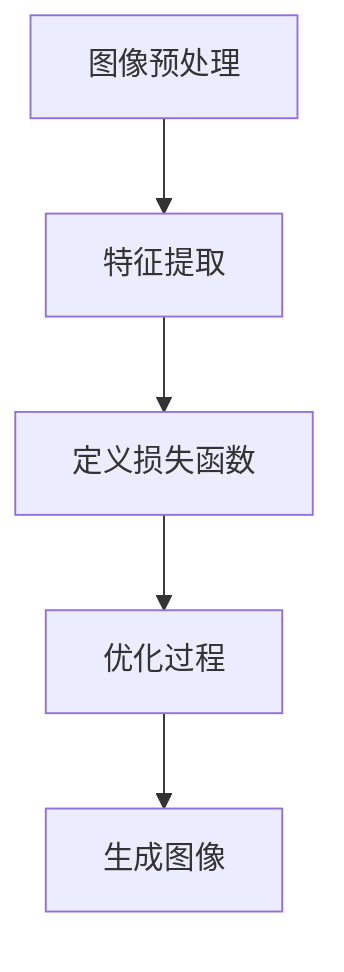

# Style Transfer原理与代码实例讲解

## 1.背景介绍

风格迁移（Style Transfer）是一种计算机视觉技术，旨在将一幅图像的内容与另一幅图像的风格相结合，生成一幅新的图像。该技术最早由Gatys等人在2015年提出，并迅速在学术界和工业界引起了广泛关注。风格迁移的应用范围广泛，包括艺术创作、图像增强、视频处理等。

风格迁移的核心思想是利用卷积神经网络（Convolutional Neural Networks, CNNs）提取图像的内容特征和风格特征，然后通过优化算法将这两种特征融合在一起。本文将详细介绍风格迁移的核心概念、算法原理、数学模型、代码实例、实际应用场景、工具和资源推荐，并探讨其未来发展趋势与挑战。

## 2.核心概念与联系

### 2.1 内容特征与风格特征

在风格迁移中，内容特征和风格特征是两个关键概念。内容特征主要描述图像中的物体和结构信息，而风格特征则描述图像的纹理、颜色和整体视觉效果。

### 2.2 卷积神经网络（CNN）

卷积神经网络是风格迁移的基础工具。CNN通过卷积层、池化层和全连接层提取图像的多层次特征。不同层次的特征可以用来表示图像的内容和风格。

### 2.3 损失函数

风格迁移的目标是最小化内容损失和风格损失的加权和。内容损失衡量生成图像与内容图像在内容特征上的差异，而风格损失衡量生成图像与风格图像在风格特征上的差异。

## 3.核心算法原理具体操作步骤

### 3.1 图像预处理

首先，对内容图像和风格图像进行预处理，包括调整图像大小、归一化等。

### 3.2 特征提取

使用预训练的卷积神经网络（如VGG19）提取内容图像和风格图像的特征。通常选择网络的中间层作为特征提取层。

### 3.3 损失函数定义

定义内容损失和风格损失。内容损失通常使用均方误差（MSE）计算生成图像与内容图像在特征层上的差异。风格损失则通过Gram矩阵计算生成图像与风格图像在特征层上的差异。

### 3.4 优化过程

使用梯度下降法优化生成图像，使其内容特征接近内容图像，风格特征接近风格图像。优化过程迭代进行，直到损失函数收敛。



## 4.数学模型和公式详细讲解举例说明

### 4.1 内容损失

内容损失衡量生成图像与内容图像在特征层上的差异，通常使用均方误差（MSE）计算：

$$
L_{content} = \frac{1}{2} \sum_{i,j} (F_{ij}^l - P_{ij}^l)^2
$$

其中，$F_{ij}^l$ 和 $P_{ij}^l$ 分别表示生成图像和内容图像在第 $l$ 层的特征图。

### 4.2 风格损失

风格损失通过Gram矩阵计算生成图像与风格图像在特征层上的差异：

$$
G_{ij}^l = \sum_k F_{ik}^l F_{jk}^l
$$

风格损失定义为：

$$
L_{style} = \sum_l w_l \frac{1}{4N_l^2M_l^2} \sum_{i,j} (G_{ij}^l - A_{ij}^l)^2
$$

其中，$G_{ij}^l$ 和 $A_{ij}^l$ 分别表示生成图像和风格图像在第 $l$ 层的Gram矩阵，$w_l$ 是第 $l$ 层的权重。

### 4.3 总损失

总损失是内容损失和风格损失的加权和：

$$
L_{total} = \alpha L_{content} + \beta L_{style}
$$

其中，$\alpha$ 和 $\beta$ 分别是内容损失和风格损失的权重。

## 5.项目实践：代码实例和详细解释说明

### 5.1 环境准备

首先，确保安装了必要的Python库，如TensorFlow、Keras、NumPy和Matplotlib。

```python
import tensorflow as tf
from tensorflow.keras.applications import VGG19
from tensorflow.keras.models import Model
from tensorflow.keras.preprocessing.image import load_img, img_to_array
import numpy as np
import matplotlib.pyplot as plt
```

### 5.2 图像预处理

加载并预处理内容图像和风格图像。

```python
def preprocess_image(image_path, target_size=(224, 224)):
    img = load_img(image_path, target_size=target_size)
    img = img_to_array(img)
    img = np.expand_dims(img, axis=0)
    img = tf.keras.applications.vgg19.preprocess_input(img)
    return img

content_image = preprocess_image('path_to_content_image.jpg')
style_image = preprocess_image('path_to_style_image.jpg')
```

### 5.3 特征提取

使用VGG19模型提取内容特征和风格特征。

```python
def get_model():
    vgg = VGG19(include_top=False, weights='imagenet')
    content_layers = ['block5_conv2']
    style_layers = ['block1_conv1', 'block2_conv1', 'block3_conv1', 'block4_conv1', 'block5_conv1']
    outputs = [vgg.get_layer(name).output for name in (content_layers + style_layers)]
    model = Model([vgg.input], outputs)
    return model

model = get_model()
```

### 5.4 损失函数定义

定义内容损失和风格损失。

```python
def content_loss(content, generated):
    return tf.reduce_mean(tf.square(content - generated))

def gram_matrix(tensor):
    channels = int(tensor.shape[-1])
    a = tf.reshape(tensor, [-1, channels])
    n = tf.shape(a)[0]
    gram = tf.matmul(a, a, transpose_a=True)
    return gram / tf.cast(n, tf.float32)

def style_loss(style, generated):
    S = gram_matrix(style)
    G = gram_matrix(generated)
    return tf.reduce_mean(tf.square(S - G))
```

### 5.5 优化过程

使用梯度下降法优化生成图像。

```python
generated_image = tf.Variable(content_image, dtype=tf.float32)

optimizer = tf.optimizers.Adam(learning_rate=0.02)

@tf.function
def train_step(generated_image):
    with tf.GradientTape() as tape:
        outputs = model(generated_image)
        content_output = outputs[:1]
        style_output = outputs[1:]
        
        c_loss = content_loss(content_output[0], model(content_image)[0])
        s_loss = tf.add_n([style_loss(style, gen) for style, gen in zip(model(style_image)[1:], style_output)])
        total_loss = 1e4 * c_loss + s_loss
    
    grad = tape.gradient(total_loss, generated_image)
    optimizer.apply_gradients([(grad, generated_image)])
    return total_loss

epochs = 1000
for epoch in range(epochs):
    loss = train_step(generated_image)
    if epoch % 100 == 0:
        print(f'Epoch {epoch}, Loss: {loss.numpy()}')
```

### 5.6 结果展示

展示生成图像。

```python
def deprocess_image(img):
    img = img.reshape((224, 224, 3))
    img[:, :, 0] += 103.939
    img[:, :, 1] += 116.779
    img[:, :, 2] += 123.68
    img = img[:, :, ::-1]
    img = np.clip(img, 0, 255).astype('uint8')
    return img

plt.imshow(deprocess_image(generated_image.numpy()))
plt.show()
```

## 6.实际应用场景

风格迁移技术在多个领域有广泛应用：

### 6.1 艺术创作

风格迁移可以将普通照片转换为具有艺术风格的图像，广泛应用于数字艺术创作。

### 6.2 图像增强

风格迁移可以用于图像增强，如将低分辨率图像转换为高分辨率图像，或将黑白图像转换为彩色图像。

### 6.3 视频处理

风格迁移可以应用于视频处理，将视频帧逐帧转换为具有特定风格的视频。

## 7.工具和资源推荐

### 7.1 开源库

- TensorFlow: 一个广泛使用的深度学习框架，支持风格迁移的实现。
- PyTorch: 另一个流行的深度学习框架，提供灵活的风格迁移实现。

### 7.2 在线资源

- GitHub: 上有许多开源的风格迁移项目，可以参考和学习。
- 论文: Gatys等人的原始论文《A Neural Algorithm of Artistic Style》是理解风格迁移的基础。

## 8.总结：未来发展趋势与挑战

风格迁移技术在过去几年取得了显著进展，但仍面临一些挑战和发展方向：

### 8.1 计算效率

风格迁移的计算复杂度较高，如何提高计算效率是一个重要研究方向。

### 8.2 实时应用

实现实时风格迁移是一个具有挑战性的任务，特别是在移动设备上。

### 8.3 多风格融合

如何在一幅图像中融合多种风格是一个有趣的研究方向。

## 9.附录：常见问题与解答

### 9.1 风格迁移的效果不理想，怎么办？

可以尝试调整内容损失和风格损失的权重，或选择不同的特征提取层。

### 9.2 如何提高风格迁移的计算效率？

可以使用更高效的优化算法，或在GPU上进行计算。

### 9.3 风格迁移可以应用于视频吗？

可以，但需要逐帧处理视频，并确保帧之间的风格一致性。

---

作者：禅与计算机程序设计艺术 / Zen and the Art of Computer Programming