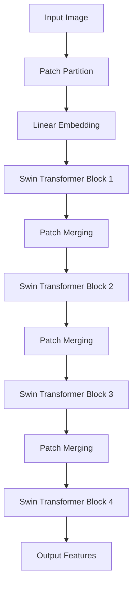

# Swin Transformer原理与代码实例讲解

## 1. 背景介绍
### 1.1 Transformer的发展历程
### 1.2 Swin Transformer的提出背景
### 1.3 Swin Transformer的主要特点

## 2. 核心概念与联系
### 2.1 Transformer基本结构回顾
#### 2.1.1 Encoder
#### 2.1.2 Decoder
#### 2.1.3 Multi-Head Attention
### 2.2 Swin Transformer的核心创新
#### 2.2.1 层次化的Transformer块
#### 2.2.2 移位窗口机制
#### 2.2.3 相对位置编码
### 2.3 Swin Transformer与其他视觉Transformer的比较

## 3. 核心算法原理具体操作步骤
### 3.1 Swin Transformer整体架构
### 3.2 Patch Partition和Linear Embedding
### 3.3 Swin Transformer Block
#### 3.3.1 窗口多头自注意力
#### 3.3.2 移位窗口多头自注意力 
#### 3.3.3 相对位置编码
#### 3.3.4 Patch Merging
### 3.4 Swin Transformer的层次化设计

## 4. 数学模型和公式详细讲解举例说明
### 4.1 自注意力机制的数学表示
### 4.2 移位窗口注意力的数学推导
### 4.3 相对位置编码的数学表达
### 4.4 Patch Merging的数学解释

## 5. 项目实践：代码实例和详细解释说明
### 5.1 环境配置与数据准备
### 5.2 模型构建
#### 5.2.1 Patch Embedding层
#### 5.2.2 Swin Transformer Block层
#### 5.2.3 Patch Merging层
#### 5.2.4 模型整体搭建
### 5.3 模型训练与测试
#### 5.3.1 定义损失函数和优化器
#### 5.3.2 训练循环
#### 5.3.3 模型评估
### 5.4 实验结果分析与可视化

## 6. 实际应用场景
### 6.1 图像分类
### 6.2 目标检测
### 6.3 语义分割
### 6.4 其他视觉任务中的应用

## 7. 工具和资源推荐
### 7.1 官方实现代码库
### 7.2 第三方优秀实现
### 7.3 预训练模型下载
### 7.4 数据集资源

## 8. 总结：未来发展趋势与挑战
### 8.1 Swin Transformer的优势总结
### 8.2 当前存在的局限性
### 8.3 未来研究方向展望

## 9. 附录：常见问题与解答
### 9.1 如何选择合适的窗口大小？ 
### 9.2 Swin Transformer在小样本场景下的表现如何？
### 9.3 Swin Transformer能否用于自然语言处理任务？
### 9.4 在资源受限的设备上如何高效部署Swin Transformer？

Swin Transformer是微软亚洲研究院在2021年提出的一种用于计算机视觉任务的Transformer模型。它通过引入分层的Transformer结构和移位窗口机制，在保持高效计算的同时，极大地提升了视觉任务的性能表现。

在传统的Transformer模型中，自注意力机制需要计算所有token之间的关系，计算复杂度随着输入尺寸的增加而急剧上升。为了解决这一问题，Swin Transformer采用了分层的设计思路。它首先将输入图像划分为多个不重叠的窗口，然后在每个窗口内部计算自注意力。这种局部注意力的设计大大降低了计算量。同时，为了建立不同窗口之间的信息交互，Swin Transformer引入了移位窗口机制。通过交替地进行窗口内注意力和跨窗口注意力计算，有效地捕捉了全局的上下文信息。

下面是Swin Transformer的核心架构示意图：



在模型的底层，输入图像被划分为固定大小的patches，然后通过线性映射得到patch embeddings。接下来，这些embeddings被输入到一系列的Swin Transformer Block中进行特征提取。每个Block内部包含了多头自注意力和移位窗口注意力机制，以建模局部和全局的上下文信息。在Block之间，通过Patch Merging操作对特征图进行降采样，逐步扩大感受野。

在自注意力计算时，Swin Transformer采用了相对位置编码来引入位置信息。与绝对位置编码不同，相对位置编码考虑了patches之间的相对位置关系，更适合于分层的计算范式。假设$x_i$和$x_j$表示两个patches的特征，它们的相对位置编码可以表示为：

$$
\text{RelativePosEmb}(x_i, x_j) = \text{Embedding}(\text{relative_position}(x_i, x_j))
$$

其中，$\text{relative_position}(x_i, x_j)$表示patches $i$和$j$之间的相对位置索引。

在实践中，我们可以使用PyTorch来实现Swin Transformer。以下是一个简化版的代码示例：

```python
import torch
import torch.nn as nn

class PatchEmbedding(nn.Module):
    def __init__(self, patch_size=4, embed_dim=96):
        super().__init__()
        self.proj = nn.Conv2d(3, embed_dim, kernel_size=patch_size, stride=patch_size)
        self.norm = nn.LayerNorm(embed_dim)

    def forward(self, x):
        x = self.proj(x)
        x = x.flatten(2).transpose(1, 2)
        x = self.norm(x)
        return x

class SwinTransformerBlock(nn.Module):
    def __init__(self, dim, num_heads, window_size=7, shift_size=0):
        super().__init__()
        self.attn = WindowAttention(dim, num_heads, window_size, shift_size)
        self.mlp = nn.Sequential(
            nn.Linear(dim, dim * 4),
            nn.GELU(),
            nn.Linear(dim * 4, dim)
        )
        self.norm1 = nn.LayerNorm(dim)
        self.norm2 = nn.LayerNorm(dim)

    def forward(self, x):
        shortcut = x
        x = self.norm1(x)
        x = self.attn(x)
        x = shortcut + x
        
        shortcut = x
        x = self.norm2(x)
        x = self.mlp(x)
        x = shortcut + x
        return x

class PatchMerging(nn.Module):
    def __init__(self, dim):
        super().__init__()
        self.norm = nn.LayerNorm(4 * dim)
        self.reduction = nn.Linear(4 * dim, 2 * dim, bias=False)

    def forward(self, x):
        B, L, C = x.shape
        x = x.view(B, L // 4, 4, C).transpose(1, 2).reshape(B, 4, L // 4, C)
        x = self.norm(x)
        x = self.reduction(x)
        return x.view(B, -1, 2 * C)

class SwinTransformer(nn.Module):
    def __init__(self, patch_size=4, embed_dim=96, window_size=7, depths=[2, 2, 6, 2], num_heads=[3, 6, 12, 24]):
        super().__init__()
        self.patch_embed = PatchEmbedding(patch_size, embed_dim)
        
        self.layers = nn.ModuleList()
        for i in range(len(depths)):
            dim = embed_dim * 2 ** i
            self.layers.append(nn.ModuleList([
                SwinTransformerBlock(dim, num_heads[i], window_size, shift_size=0 if j % 2 == 0 else window_size // 2)
                for j in range(depths[i])
            ]))
            if i < len(depths) - 1:
                self.layers.append(PatchMerging(dim))
                
    def forward(self, x):
        x = self.patch_embed(x)
        for layer in self.layers:
            x = layer(x)
        return x
```

在上述代码中，我们定义了`PatchEmbedding`、`SwinTransformerBlock`和`PatchMerging`三个核心模块，并将它们组合成完整的`SwinTransformer`模型。通过调整`depths`和`num_heads`等参数，可以灵活地构建不同规模的Swin Transformer。

Swin Transformer在多个视觉任务上取得了出色的性能，如图像分类、目标检测和语义分割等。以ImageNet数据集上的图像分类任务为例，Swin Transformer在相同计算复杂度下，相比于其他视觉Transformer模型，如ViT和DeiT，取得了更高的准确率。此外，将Swin Transformer作为骨干网络应用于目标检测和语义分割等下游任务时，也显著超越了基于CNN的主流方法。

尽管Swin Transformer已经展现出了巨大的潜力，但仍然存在一些局限性和挑战。例如，相比于CNN，Transformer模型通常需要更大的内存占用和更长的训练时间。如何在保持性能的同时进一步提高模型的效率，是一个值得探索的研究方向。此外，如何将Swin Transformer拓展到更多的视觉任务中，如视频理解、3D点云处理等，也是未来工作的重点。

总的来说，Swin Transformer为视觉Transformer的发展带来了新的突破。它巧妙地结合了分层结构和移位窗口机制，在提高模型性能的同时，也兼顾了计算效率。相信通过进一步的研究和改进，Swin Transformer有望在更广泛的视觉应用中发挥重要作用。

作者：禅与计算机程序设计艺术 / Zen and the Art of Computer Programming