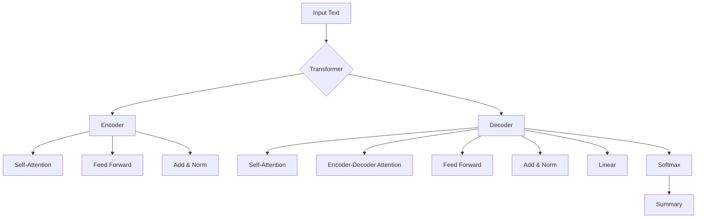

# Transformer大模型实战 文本摘要任务

## 1. 背景介绍
### 1.1 文本摘要的重要性
在信息爆炸的时代,自动文本摘要技术变得越来越重要。它可以帮助人们快速获取文本的核心内容,节省大量阅读时间。文本摘要在搜索引擎、新闻聚合、文献管理等领域都有广泛应用。

### 1.2 Transformer模型的优势
近年来,以Transformer为代表的大规模预训练语言模型取得了巨大成功。Transformer具有并行计算能力强、长程依赖建模能力强等优点,在多种NLP任务上都取得了SOTA的效果。将Transformer应用于文本摘要任务,有望进一步提升摘要的质量。

## 2. 核心概念与联系
### 2.1 Transformer的核心结构
- Encoder-Decoder框架:Transformer采用经典的Encoder-Decoder框架,Encoder负责对输入文本进行编码,Decoder负责根据编码信息生成摘要。
- Self-Attention:自注意力机制是Transformer的核心,通过计算序列内部的注意力分布,可以高效地捕捉长距离依赖关系。
- Multi-Head Attention:多头注意力机制将Self-Attention拓展为多个子空间,增强了模型的表达能力。
- Feed Forward Network:前馈神经网络用于对Self-Attention的输出进行非线性变换,增加模型的容量。
- Positional Encoding:位置编码用于引入序列的位置信息,使Transformer能够建模序列的顺序特征。

### 2.2 文本摘要的分类
- 抽取式摘要:从原文中抽取关键句子组成摘要,保留原文的表达。
- 生成式摘要:根据对原文的理解,生成新的句子作为摘要,可能引入新的表达。
- 单文档摘要:对单篇文章进行摘要。
- 多文档摘要:对多篇文章进行摘要,需要考虑信息的冗余和互补。

### 2.3 评估指标
- ROUGE:基于n-gram匹配计算预测摘要和参考摘要的重叠度,是最常用的摘要评估指标。
- BLEU:基于精确匹配计算预测摘要和参考摘要的相似度,主要用于机器翻译任务。
- BERTScore:基于预训练语言模型计算预测摘要和参考摘要的语义相似度。



## 3. 核心算法原理具体操作步骤
### 3.1 预训练阶段
1. 构建大规模无监督语料库,进行数据清洗和预处理。
2. 采用自回归语言建模或者BERT的掩码语言建模进行预训练。
3. 使用Adam优化器,以交叉熵损失函数为目标进行训练,得到通用的语言表示模型。

### 3.2 微调阶段
1. 构建文本摘要数据集,每个样本包括(文章,摘要)对。
2. 在Encoder端输入文章,在Decoder端输入摘要,计算条件语言模型的损失函数。
3. 以ROUGE指标为优化目标,对预训练模型进行微调,得到定制化的摘要模型。

### 3.3 推理阶段
1. 将待摘要的文章输入到微调后的模型中。
2. 采用Beam Search进行解码,生成若干候选摘要。
3. 对候选摘要进行去重和排序,输出最终的摘要结果。

## 4. 数学模型和公式详细讲解举例说明
### 4.1 Scaled Dot-Product Attention
$$Attention(Q,K,V) = softmax(\frac{QK^T}{\sqrt{d_k}})V$$
其中,$Q$是查询矩阵,$K$是键矩阵,$V$是值矩阵,$d_k$是键向量的维度。

该公式先计算$Q$和$K$的点积相似度,然后除以$\sqrt{d_k}$进行缩放,再经过softmax归一化得到注意力分布,最后用注意力分布对$V$进行加权求和。缩放因子$\sqrt{d_k}$可以防止点积过大,导致softmax函数梯度消失。

举例:假设$Q$、$K$、$V$的维度都是$(3,4)$,则:
$$QK^T=\begin{bmatrix}
1 & 2 & 3\\\\
4 & 5 & 6\\\\
7 & 8 & 9
\end{bmatrix}\begin{bmatrix}
1 & 4 & 7\\\\
2 & 5 & 8\\\\
3 & 6 & 9
\end{bmatrix}=\begin{bmatrix}
14 & 32 & 50\\\\
32 & 77 & 122\\\\
50 & 122 & 194
\end{bmatrix}$$

假设$d_k=4$,则:
$$\frac{QK^T}{\sqrt{d_k}}=\begin{bmatrix}
7 & 16 & 25\\\\
16 & 38.5 & 61\\\\
25 & 61 & 97
\end{bmatrix}$$

再经过softmax归一化和与$V$相乘,得到最终的注意力输出。

### 4.2 Multi-Head Attention
$$MultiHead(Q,K,V) = Concat(head_1,...,head_h)W^O$$
$$head_i = Attention(QW_i^Q,KW_i^K,VW_i^V)$$
其中,$W_i^Q \in \mathbb{R}^{d_model \times d_k}, W_i^K \in \mathbb{R}^{d_model \times d_k}, W_i^V \in \mathbb{R}^{d_model \times d_v}, W^O \in \mathbb{R}^{hd_v \times d_model}$。

多头注意力将输入$Q$、$K$、$V$通过线性变换投影到$h$个子空间,在每个子空间分别计算注意力,然后拼接所有头的输出,最后再经过一个线性变换得到最终的多头注意力输出。这种机制可以让模型在不同的子空间内学习到不同的注意力分布,增强模型的表达能力。

## 5. 项目实践：代码实例和详细解释说明
下面是使用PyTorch实现Transformer用于文本摘要任务的简化代码:

```python
import torch
import torch.nn as nn

class Transformer(nn.Module):
    def __init__(self, d_model, nhead, num_layers):
        super().__init__()
        self.encoder = nn.TransformerEncoder(
            nn.TransformerEncoderLayer(d_model, nhead), 
            num_layers
        )
        self.decoder = nn.TransformerDecoder(
            nn.TransformerDecoderLayer(d_model, nhead), 
            num_layers
        )
        self.fc = nn.Linear(d_model, vocab_size)
        
    def forward(self, src, tgt, src_mask=None, tgt_mask=None):
        memory = self.encoder(src, src_mask)
        output = self.decoder(tgt, memory, tgt_mask, None)
        return self.fc(output)

def train(model, data, optimizer, criterion, epochs):
    for epoch in range(epochs):
        for src, tgt in data:
            src_mask, tgt_mask = create_mask(src), create_mask(tgt)
            output = model(src, tgt, src_mask, tgt_mask)
            loss = criterion(output.view(-1, vocab_size), tgt.view(-1))
            optimizer.zero_grad()
            loss.backward()
            optimizer.step()
        print(f"Epoch: {epoch}, Loss: {loss.item():.4f}")
        
def inference(model, src, max_len):
    src_mask = create_mask(src)
    memory = model.encoder(src, src_mask)
    tgt = torch.zeros((1, 1), dtype=torch.long)
    for i in range(max_len):
        tgt_mask = create_mask(tgt)
        output = model.decoder(tgt, memory, tgt_mask, None)
        output = model.fc(output)
        prob = output.argmax(-1)[:,-1:]
        tgt = torch.cat([tgt, prob], dim=-1)
        if prob == eos_idx:
            break
    return tgt.squeeze()
```

代码解释:
1. 定义了Transformer模型的结构,包括Encoder、Decoder和最后的全连接层。
2. 在前向传播时,先用Encoder对源文本进行编码,得到memory表示,然后用Decoder根据memory和目标摘要进行解码。
3. 在训练时,使用了交叉熵损失函数和Adam优化器,并且在每个epoch结束后打印损失值。
4. 在推理时,先用Encoder对源文本进行编码,然后用Decoder进行自回归地逐词生成摘要,直到生成结束符或达到最大长度为止。

需要注意的是,这只是一个简化版的实现,实际应用中还需要考虑更多细节,如位置编码、学习率调度、Beam Search等。

## 6. 实际应用场景
文本摘要技术在很多场景下都有重要应用,例如:
- 搜索引擎:对网页内容进行摘要,生成精炼的摘要片段,方便用户快速了解网页的主要内容。
- 新闻聚合:对多个新闻源的内容进行摘要,自动生成新闻摘要,帮助用户快速获取事件的要点。
- 论文阅读:对科技文献进行摘要,提取论文的研究背景、方法、结果和结论等关键信息,加速文献综述过程。
- 会议记录:对会议讨论内容进行摘要,生成会议纪要,方便后续查阅和传达会议精神。
- 财经分析:对财经新闻、公司公告等进行摘要,提取关键事件和数据,助力投资决策。
- 客服对话:对用户询问和客服回复进行摘要,梳理问题的关键点,优化客服流程。

总之,文本摘要可以显著提升信息获取和处理的效率,在信息爆炸的时代具有广阔的应用前景。

## 7. 工具和资源推荐
- 数据集:
    - CNN/Daily Mail:常用的新闻文本摘要数据集。
    - Gigaword:规模较大的新闻文本摘要数据集。
    - LCSTS:中文短文本摘要数据集。
- 开源工具包:
    - transformers (https://github.com/huggingface/transformers):🤗 Transformers提供了多种SOTA语言模型的实现,可以方便地进行文本摘要任务。
    - TextRank (https://github.com/summanlp/textrank):基于图排序的经典抽取式文本摘要算法。
    - FastAbstractiveSum (https://github.com/ChenRocks/fast_abs_rl):基于强化学习优化的抽象式文本摘要模型。
    - BART (https://github.com/pytorch/fairseq/tree/master/examples/bart):基于Transformer的预训练seq2seq模型,在文本摘要任务上表现优异。
- 评测工具:
    - pyrouge (https://github.com/bheinzerling/pyrouge):Python版本的ROUGE评测工具。
    - files2rouge (https://github.com/pltrdy/files2rouge):基于Perl的ROUGE评测工具,可以直接对文件进行评测。

## 8. 总结：未来发展趋势与挑战
近年来,文本摘要技术取得了长足的进步,Transformer等大规模语言模型的引入极大地提升了摘要的流畅度和信息捕捉能力。展望未来,文本摘要技术还有以下几个发展趋势和挑战:
- 更大规模的预训练模型:随着计算资源的增长,预训练模型的参数量还将进一步增大,有望学习到更加广泛和深刻的语言知识,为下游摘要任务提供更强大的支持。
- 跨语言摘要:利用多语言预训练模型,实现一个模型适配多种语言的摘要任务,打破语言壁垒。
- 个性化摘要:根据用户的兴趣和需求,生成个性化的摘要结果,提供更加精准的信息服务。
- 摘要的可解释性:让模型生成的摘要不仅内容正确,而且具备可解释性,使人们更加信任和理解摘要系统的工作原理。
- 摘要的公平性:关注摘要模型可能带来的偏见问题,如性别歧视、种族歧视等,努力创建公平和负责任的摘要系统。

总的来说,文本摘要技术正在从追求"量"的阶段走向