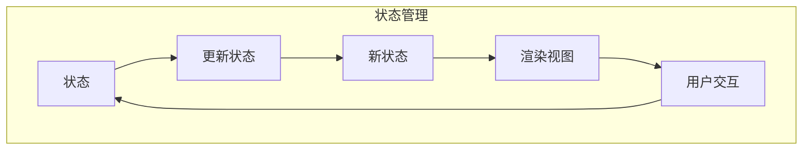
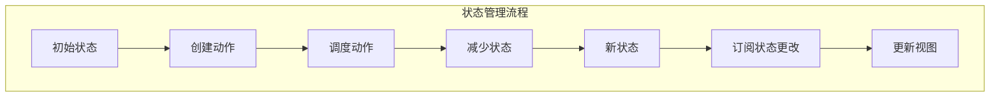

# 【AI大数据计算原理与代码实例讲解】状态管理

## 1.背景介绍

在现代软件开发中,状态管理是一个至关重要的概念。随着应用程序变得越来越复杂,有效管理应用程序的状态变得至关重要。状态管理涉及跟踪和维护应用程序在给定时间点的状态或条件。良好的状态管理有助于确保应用程序的一致性、可预测性和可维护性。

在传统的前端开发中,状态管理主要依赖于组件内部的状态和通过层层传递的props。然而,随着应用程序规模的增长,这种方法变得越来越困难,因为状态的来源和更新位置变得分散和不透明。这可能导致代码重复、不一致的状态更新和意外的副作用。

为了解决这些挑战,出现了专门的状态管理库和模式,如Redux、MobX和React Context API。这些库提供了集中式的状态管理解决方案,使得跨组件共享和更新状态变得更加容易。它们还引入了不可变状态的概念,这有助于简化状态更新的逻辑并促进更好的可预测性。

在大型AI和大数据应用程序中,有效的状态管理尤为重要。这些应用程序通常涉及大量数据、复杂的计算和多个并发进程。适当的状态管理有助于确保数据的一致性、计算的准确性和进程之间的协调。

### Mermaid流程图:



## 2.核心概念与联系

状态管理涉及几个关键概念:

1. **状态(State)**: 状态是应用程序在给定时间点的条件或数据的表示。它可以是UI元素的可见性、表单字段的值或应用程序的配置设置等。

2. **不可变状态(Immutable State)**: 不可变状态是指状态对象在更新时不会直接被修改,而是创建一个新的状态对象。这种方法简化了状态更新的逻辑,并促进了更好的可预测性和性能。

3. **单一事实来源(Single Source of Truth)**: 这是一种设计模式,其中应用程序的整个状态存储在单一位置,通常是一个集中式的存储区。这有助于确保状态的一致性,并简化了状态的访问和更新。

4. **纯函数(Pure Functions)**: 纯函数是指对于相同的输入总是返回相同的输出,并且不产生任何可观察到的副作用。在状态管理中,纯函数用于计算新状态,这有助于确保状态更新的可预测性和可测试性。

5. **Redux三大原则**:
   - 单一数据源(Single Source of Truth):应用程序的整个状态存储在单个存储区(如对象树)中。
   - 状态是只读的(State is Read-Only):唯一改变状态的方法是发出一个动作(Action)对象。
   - 使用纯函数进行状态修改(Changes are made with Pure Functions):通过将先前的对象树和动作对象传递给纯函数来计算新的对象树。

这些概念共同构成了状态管理的核心基础,并指导了状态管理库和模式的设计和实现。

## 3.核心算法原理具体操作步骤

状态管理库通常遵循类似的工作流程,其中涉及以下关键步骤:

1. **定义初始状态(Define Initial State)**: 应用程序的初始状态通常在单一位置定义,例如Redux中的`createStore`函数或React Context API中的`useState`钩子。

2. **创建动作(Create Actions)**: 动作是描述应该如何更新状态的简单对象。它们通常由用户交互(如单击按钮或提交表单)或其他事件(如API响应)触发。

3. **调度动作(Dispatch Actions)**: 一旦创建了动作,就需要将其分派到状态管理系统中。这通常是通过调用类似`store.dispatch(action)`的函数来完成的。

4. **减少状态(Reduce State)**: 状态管理系统接收分派的动作,并通过纯函数(称为reducer)计算新的状态。reducer函数接收当前状态和动作作为输入,并返回新的状态对象。

5. **订阅状态更改(Subscribe to State Changes)**: 组件或其他感兴趣的部分可以订阅状态更改,以便在状态发生变化时得到通知。

6. **更新视图(Update View)**: 一旦状态发生变化,订阅了状态更改的组件将重新渲染以反映新的状态。

这个过程在大多数状态管理库和模式中是通用的,尽管实现细节可能有所不同。例如,Redux使用纯reducer函数和不可变状态,而MobX使用可观察对象和反应式编程。

### Mermaid流程图:



## 4.数学模型和公式详细讲解举例说明

在状态管理中,数学模型和公式通常用于描述和分析状态转换的行为。以Redux为例,我们可以使用一些数学概念来形式化状态管理的过程。

让我们定义以下符号:

- $S$: 表示状态的集合
- $s_0 \in S$: 初始状态
- $A$: 表示动作的集合
- $f: S \times A \rightarrow S$: 状态转换函数(reducer)

在Redux中,状态转换过程可以表示为:

$$s' = f(s, a)$$

其中$s$是当前状态,$a \in A$是触发的动作,$s'$是由reducer函数$f$计算出的新状态。

我们可以将整个状态管理过程建模为一个有限状态机(FSM),其中:

- 状态集$S$表示应用程序可能处于的所有状态
- 动作集$A$表示可能触发的所有动作
- 状态转换函数$f$定义了在给定当前状态和动作的情况下,应用程序将转换到哪个新状态

通过建模为FSM,我们可以分析和推理状态管理系统的行为,例如:

- 可达性分析:给定初始状态$s_0$,确定可以到达哪些状态
- 活性分析:确定系统是否可能陷入死锁或活锁状态
- 模型检查:验证系统是否满足特定的属性或不变量

例如,我们可以使用线性时态逻辑(LTL)来表达一些期望的属性,如:

- $\square(s \in S_{\text{valid}})$: 系统始终处于有效状态
- $\diamond(s \in S_{\text{goal}})$: 系统最终将达到目标状态

通过将状态管理系统形式化为数学模型,我们可以获得对系统行为的更深入的理解,并应用各种形式化验证和分析技术来确保系统的正确性和可靠性。

## 5.项目实践:代码实例和详细解释说明

为了更好地理解状态管理的实际应用,让我们通过一个简单的示例来演示如何使用Redux管理React应用程序的状态。

在这个示例中,我们将构建一个简单的计数器应用程序,它允许用户增加、减少和重置计数器的值。

### 设置Redux

首先,我们需要安装Redux及其React绑定:

```bash
npm install redux react-redux
```

接下来,我们创建一个`store.js`文件来设置Redux存储:

```javascript
import { createStore } from 'redux';

// 定义初始状态
const initialState = {
  count: 0
};

// 定义reducer函数
function counterReducer(state = initialState, action) {
  switch (action.type) {
    case 'INCREMENT':
      return { ...state, count: state.count + 1 };
    case 'DECREMENT':
      return { ...state, count: state.count - 1 };
    case 'RESET':
      return { ...state, count: 0 };
    default:
      return state;
  }
}

// 创建Redux存储
const store = createStore(counterReducer);

export default store;
```

在这个文件中,我们定义了初始状态`initialState`和reducer函数`counterReducer`。reducer函数根据不同的动作类型(`INCREMENT`、`DECREMENT`或`RESET`)更新状态。最后,我们使用`createStore`函数创建了Redux存储。

### 连接React组件

接下来,我们创建一个`Counter.js`文件,它包含计数器的React组件:

```javascript
import React from 'react';
import { useSelector, useDispatch } from 'react-redux';

function Counter() {
  const count = useSelector(state => state.count);
  const dispatch = useDispatch();

  const increment = () => {
    dispatch({ type: 'INCREMENT' });
  };

  const decrement = () => {
    dispatch({ type: 'DECREMENT' });
  };

  const reset = () => {
    dispatch({ type: 'RESET' });
  };

  return (
    <div>
      <h1>Counter</h1>
      <p>Count: {count}</p>
      <button onClick={increment}>Increment</button>
      <button onClick={decrement}>Decrement</button>
      <button onClick={reset}>Reset</button>
    </div>
  );
}

export default Counter;
```

在这个组件中,我们使用`useSelector`钩子从Redux存储中获取当前计数值。我们还使用`useDispatch`钩子获取一个`dispatch`函数,用于分派动作。

当用户单击相应的按钮时,我们调用`dispatch`函数并传递相应的动作对象(`{ type: 'INCREMENT' }`、`{ type: 'DECREMENT' }`或`{ type: 'RESET' }`)。Redux存储将接收这些动作,并通过reducer函数计算新的状态。

最后,我们在`App.js`文件中渲染`Counter`组件并提供Redux存储:

```javascript
import React from 'react';
import { Provider } from 'react-redux';
import store from './store';
import Counter from './Counter';

function App() {
  return (
    <Provider store={store}>
      <Counter />
    </Provider>
  );
}

export default App;
```

通过这个示例,我们可以看到如何使用Redux管理应用程序的状态。Redux提供了一种结构化和可预测的方式来更新状态,并确保状态的一致性和可维护性。

## 6.实际应用场景

状态管理在各种类型的应用程序中都有广泛的应用,包括:

1. **单页应用(SPA)**: 在单页应用程序中,整个应用程序是在客户端渲染的,因此需要有效地管理应用程序的状态。状态管理库如Redux和MobX在这种情况下非常有用。

2. **服务器渲染应用程序**: 即使在服务器渲染的应用程序中,也需要在服务器和客户端之间共享和同步状态。状态管理库可以帮助管理这种情况下的状态。

3. **移动应用程序**: 在移动应用程序开发中,状态管理也是一个关键问题。React Native等框架可以与状态管理库(如Redux)集成,以提供一致的状态管理体验。

4. **大型企业应用程序**: 在复杂的企业应用程序中,有效的状态管理对于确保数据一致性和应用程序的可维护性至关重要。状态管理库和模式可以帮助管理这种复杂性。

5. **实时数据应用程序**: 在处理实时数据流的应用程序中,状态管理库可以帮助有效地管理和更新应用程序的状态,以反映最新的数据。

6. **AI和大数据应用程序**: 在AI和大数据应用程序中,状态管理对于管理大量数据、复杂计算和并发进程至关重要。状态管理库和模式可以提供一种结构化和可扩展的方式来管理这种复杂性。

总的来说,无论应用程序的类型和规模如何,有效的状态管理都是确保应用程序一致性、可预测性和可维护性的关键。

## 7.工具和资源推荐

在实现状态管理时,有许多有用的工具和资源可以帮助您:

1. **Redux**:  Redux是最流行的状态管理库之一,它提供了一种可预测的状态容器,使用不可变状态和纯函数来管理应用程序的状态。Redux有一个庞大的生态系统,包括中间件、开发工具和其他辅助库。

2. **MobX**: MobX是另一个流行的状态管理解决方案,它采用了反应式编程的方法。Mob