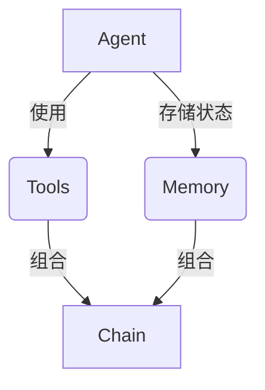

# 【LangChain编程：从入门到实践】方案优势

## 1.背景介绍

在当今数据时代,人工智能(AI)和自然语言处理(NLP)技术已经渗透到各个领域,为企业带来了巨大的机遇和挑战。传统的软件开发方式已经难以满足日益复杂的业务需求,因此需要一种新的编程范式来应对这些挑战。LangChain是一个强大的Python库,旨在简化AI和NLP系统的构建过程,使开发人员能够更轻松地集成各种语言模型、数据源和其他组件。

## 2.核心概念与联系

LangChain的核心概念包括Agent、Tool、Memory和Chain。这些概念相互关联,共同构建了一个灵活且可扩展的框架。

1. **Agent**:代表一个智能代理,负责执行特定任务。它可以利用各种工具(Tools)来完成复杂的任务。

2. **Tool**:表示可以被Agent使用的工具,如搜索引擎、数据库查询、API调用等。每个Tool都有一个名称、描述、输入和输出规范。

3. **Memory**:用于存储Agent在执行任务过程中的中间状态和上下文信息,从而支持长期记忆和上下文感知。

4. **Chain**:将多个Agent、Tool和Memory组合在一起,形成一个可重用的流程链。Chain可以嵌套和组合,构建出复杂的应用程序。

这些核心概念通过良好的设计,使LangChain具有高度的模块化、可扩展性和可组合性,从而简化了AI和NLP系统的开发过程。



## 3.核心算法原理具体操作步骤

LangChain的核心算法原理基于一种称为"代理-工具范例"(Agent-Tool Paradigm)的思想。其具体操作步骤如下:

1. **定义Agent**:首先,需要定义一个Agent,指定其目标任务和可用的工具集合。Agent可以是一个简单的函数,也可以是一个复杂的语言模型。

2. **初始化工具集合**:接下来,需要初始化一组工具(Tools),这些工具可以是搜索引擎API、数据库查询、文件读写操作等。每个工具都需要定义输入和输出规范。

3. **设置Memory**:为了支持长期记忆和上下文感知,需要设置一个Memory对象,用于存储Agent在执行任务过程中的中间状态和上下文信息。

4. **执行任务**:Agent开始执行任务,它会根据当前状态和上下文信息,选择合适的工具来完成子任务。每次执行工具后,Agent会将结果存储到Memory中,并根据新的状态继续执行下一步操作。

5. **输出结果**:当Agent完成整个任务后,它会输出最终结果。

这种"代理-工具范例"的优势在于,它将复杂的任务分解为多个可重用的模块(Agent、Tool和Memory),从而提高了系统的可维护性和可扩展性。开发人员可以专注于定义和优化每个模块,而不必关注整个系统的实现细节。

## 4.数学模型和公式详细讲解举例说明

在LangChain中,一些核心组件的实现涉及到了数学模型和公式。以下是一些重要模型和公式的详细讲解:

1. **语言模型(Language Model)**: 语言模型是自然语言处理的基础,它能够预测下一个单词或字符的概率。常用的语言模型包括N-gram模型、神经网络模型(如LSTM、Transformer)等。其中,Transformer模型的核心公式是Self-Attention机制,用于捕捉输入序列中的长距离依赖关系。Self-Attention的计算公式如下:

$$\mathrm{Attention}(Q, K, V) = \mathrm{softmax}(\frac{QK^T}{\sqrt{d_k}})V$$

其中,$Q$表示查询向量(Query),$K$表示键向量(Key),$V$表示值向量(Value),$d_k$是缩放因子。

2. **语义相似度(Semantic Similarity)**: 在LangChain中,语义相似度用于衡量两个文本之间的相似程度。常用的语义相似度计算方法包括余弦相似度、欧几里得距离等。假设有两个向量$\vec{a}$和$\vec{b}$,它们的余弦相似度公式如下:

$$\mathrm{sim}(\vec{a}, \vec{b}) = \frac{\vec{a} \cdot \vec{b}}{\|\vec{a}\| \|\vec{b}\|}$$

3. **聚类算法(Clustering Algorithms)**: 聚类算法在LangChain中用于将相似的文本或数据点分组,以便进行后续的处理或分析。常用的聚类算法包括K-Means、层次聚类等。K-Means算法的目标是最小化所有数据点到其所属簇中心的平方距离之和,其目标函数如下:

$$J = \sum_{i=1}^{k} \sum_{x \in C_i} \|x - \mu_i\|^2$$

其中,$k$是簇的数量,$C_i$是第$i$个簇,$\mu_i$是第$i$个簇的均值向量。

这些数学模型和公式为LangChain提供了强大的理论基础,使其能够高效地处理自然语言数据,并为各种任务提供准确的结果。

## 5.项目实践:代码实例和详细解释说明

为了帮助读者更好地理解LangChain的使用方式,我们将通过一个实际项目来演示如何使用LangChain构建一个问答系统。

### 5.1 项目概述

在这个项目中,我们将构建一个基于LangChain的问答系统,它可以从一组文档中查找相关信息,并根据用户的问题生成自然语言回答。

### 5.2 安装依赖

首先,我们需要安装LangChain及其依赖项:

```bash
pip install langchain openai
```

### 5.3 加载文档

我们将使用LangChain提供的`TextLoader`工具加载一组文本文档。这些文档将作为我们问答系统的知识库。

```python
from langchain.document_loaders import TextLoader

loader = TextLoader('docs/doc1.txt', 'docs/doc2.txt', 'docs/doc3.txt')
documents = loader.load()
```

### 5.4 创建向量存储

为了提高问答系统的检索效率,我们将使用向量存储(Vector Store)来存储文档的向量表示。在这个例子中,我们使用内存中的简单向量存储。

```python
from langchain.vectorstores import FAISS

vector_store = FAISS.from_documents(documents, embedding)
```

### 5.5 定义检索器

我们将使用`VectorDBQA`类作为问答系统的检索器,它可以从向量存储中查找与用户问题最相关的文档片段。

```python
from langchain.chains import VectorDBQA

qa = VectorDBQA.from_chain_type(llm=OpenAI(), chain_type="stuff", vectorstore=vector_store)
```

### 5.6 问答交互

现在,我们可以与问答系统进行交互了。用户可以输入自然语言问题,系统将从知识库中检索相关信息,并生成自然语言回答。

```python
query = "What is the capital of France?"
result = qa.run(query)
print(result)
```

上述代码将输出类似于以下内容的回答:

```
The capital of France is Paris. Paris is the capital and most populous city of France, with an estimated population of 2,175,601 residents as of 2018. It is located in the north-central part of the country, on the River Seine.
```

通过这个示例,我们可以看到LangChain提供了一种简单而强大的方式来构建问答系统。代码清晰易读,每个组件都有明确的职责,使得整个系统易于维护和扩展。

## 6.实际应用场景

LangChain的应用场景非常广泛,包括但不限于以下几个领域:

1. **知识管理系统**: 利用LangChain,我们可以构建智能知识管理系统,帮助用户从海量文档中快速查找所需信息。这种系统可以应用于企业内部知识库、客户支持中心等场景。

2. **自动化任务流程**: LangChain可以用于自动化各种任务流程,如数据处理、报告生成、客户服务等。通过将多个Agent和Tool组合成Chain,我们可以轻松地构建复杂的自动化流程。

3. **聊天机器人**: LangChain为构建智能聊天机器人提供了强大的支持。我们可以利用其内置的语言模型和自然语言处理功能,开发具有上下文理解能力的对话系统。

4. **科研助手**: 在科研领域,LangChain可以用于文献检索、实验数据分析、论文写作等任务。研究人员可以利用LangChain快速构建自动化工具,提高工作效率。

5. **教育辅助**: LangChain可以用于开发智能教学辅助系统,为学生提供个性化的学习资源和练习题目。同时,它也可以帮助教师自动化一些繁琐的工作,如批改作业、生成测试题目等。

6. **个人助理**: LangChain可以作为个人助理,帮助用户完成各种日常任务,如日程安排、信息查询、文档编辑等。通过与其他工具(如电子邮件、日历等)集成,LangChain可以提供无缝的个人助理体验。

总的来说,LangChain为各种AI和NLP应用提供了一个强大而灵活的框架,极大地简化了系统的开发和部署过程。

## 7.工具和资源推荐

为了帮助读者更好地学习和使用LangChain,我们推荐以下一些有用的工具和资源:

1. **LangChain官方文档**: LangChain的官方文档(https://python.langchain.com/en/latest/index.html)提供了详细的API参考、教程和示例代码,是学习LangChain的重要资源。

2. **LangChain示例库**: LangChain官方提供了一个示例库(https://github.com/hwchase17/langchain-examples),包含了各种应用场景的代码示例,可以帮助读者快速上手。

3. **LangChain课程**: Anthropic公司提供了一个免费的LangChain课程(https://www.anthropic.com/learn/langchain),通过视频和实践练习,全面介绍了LangChain的核心概念和使用方法。

4. **LangChain社区**: LangChain拥有一个活跃的开源社区,读者可以在GitHub上提出问题、参与讨论或贡献代码(https://github.com/hwchase17/langchain)。

5. **AI助手工具**:一些基于LangChain构建的AI助手工具,如ChatGPT、Anthropic等,可以为读者提供实践和探索的平台。

6. **相关书籍和文章**:关于LangChain、自然语言处理和人工智能的书籍和文章,可以帮助读者深入了解相关理论和技术。

通过利用这些工具和资源,读者可以更好地掌握LangChain的使用方法,并将其应用于实际项目中。

## 8.总结:未来发展趋势与挑战

LangChain作为一个新兴的编程框架,正在引领AI和NLP系统开发的新范式。它的未来发展趋势和面临的挑战包括:

1. **更强大的语言模型集成**:随着大型语言模型(如GPT-4、PaLM等)的不断进步,LangChain将继续集成这些先进的模型,提供更准确、更智能的自然语言处理能力。

2. **更丰富的工具和数据源支持**: LangChain将继续扩展其工具和数据源的支持范围,包括各种API、数据库、文件格式等,使开发人员能够更轻松地集成各种数据源。

3. **更好的可解释性和可控性**:未来,LangChain需要提供更好的可解释性和可控性机制,让开发人员能够更好地理解和控制AI系统的决策过程,从而提高系统的透明度和可靠性。

4. **更强大的多模态支持**:除了文本数据,LangChain也将逐步支持图像、视频、音频等多模态数据的处理,为更广泛的应用场景提供支持。

5. **更好的隐私和安全保护**:随着AI系统的不断发展,隐私和安全问题将变得越来越重要。LangChain需要采取有效的措施来保护用户数据的隐私,并防止系统被滥用于非法或有害的目的。

6. **更