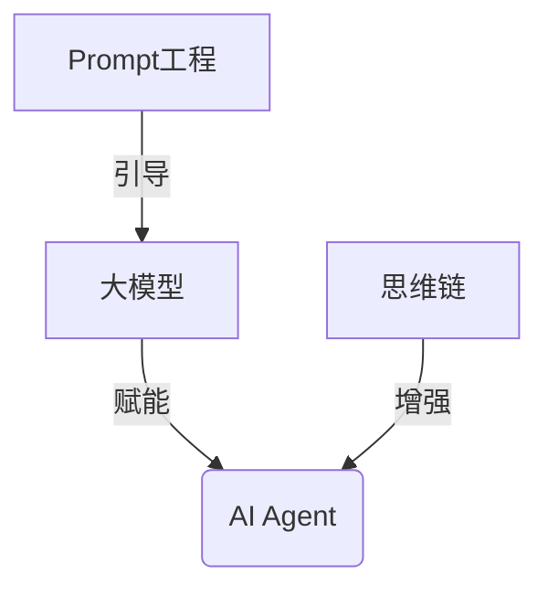

# 【大模型应用开发 动手做AI Agent】Gartner的8项重要预测

## 1. 背景介绍
### 1.1 大模型的兴起
近年来,随着深度学习技术的飞速发展,特别是Transformer等新型神经网络架构的出现,以GPT-3、PaLM、Chinchilla等为代表的大规模预训练语言模型(Large Language Models,LLMs)开始崭露头角。这些大模型在自然语言处理(NLP)领域取得了非凡的成就,展现出接近甚至超越人类的语言理解和生成能力。

### 1.2 AI Agent的应用前景
大模型的强大能力为构建智能AI Agent开辟了广阔的前景。AI Agent作为人工智能系统与外部环境交互的"大脑"和"执行者",承担着分析、决策、执行等重要职责。传统的AI Agent主要依赖于预定义的规则和知识库,难以应对复杂多变的现实世界。而大模型为AI Agent注入了强大的语言理解、知识学习、逻辑推理等能力,使其更加灵活智能。

### 1.3 Gartner预测的意义
作为全球著名的信息技术研究和顾问公司,Gartner对行业发展趋势有着敏锐的洞察力。他们针对大模型和AI Agent的一系列预测,为业界指明了技术演进的方向,对于从业者规划布局、抢占先机具有重要参考价值。本文将重点解读Gartner的8项预测,探讨大模型赋能下AI Agent的发展路径。

## 2. 核心概念与联系
### 2.1 大模型(Large Language Models) 
大模型是指参数量达到数十亿、数百亿甚至更多的超大规模深度学习模型,一般采用Transformer等先进的神经网络架构,在海量文本数据上进行预训练,具备强大的语言理解和生成能力。代表性的大模型包括GPT系列、BERT系列、PaLM、Chinchilla等。

### 2.2 AI Agent
AI Agent是一种能够感知环境、做出决策并采取行动的智能体,通常由感知、决策、执行等模块组成。传统的AI Agent主要基于预定义的规则和知识,而大模型赋予AI Agent更强的语言理解、知识学习、推理决策等能力,使其更加灵活智能。

### 2.3 Prompt工程(Prompt Engineering)
Prompt工程是指如何设计优质的Prompt(提示语)来引导大模型生成所需的输出,是应用大模型构建AI Agent的关键技术之一。优质的Prompt需要对任务有清晰定义,提供必要的背景知识,并给出恰当的指令和示例,引导模型朝着正确的方向生成结果。

### 2.4 思维链(Chain-of-Thought,CoT)
思维链是一种利用大模型进行逻辑推理的技术,通过设计合理的Prompt引导模型逐步进行分析推理,得出最终结论。思维链增强了大模型的推理决策能力,是构建高级AI Agent的重要手段。

### 2.5 概念之间的关系


## 3. 核心算法原理具体操作步骤
### 3.1 大模型的预训练
1. 准备大规模高质量的文本语料,进行必要的清洗和预处理
2. 选择合适的Tokenizer对语料进行切分,转换为模型可以处理的Token序列
3. 构建以Transformer为主的神经网络模型架构
4. 使用自监督学习,设计合适的预训练任务,如语言建模、掩码语言建模等  
5. 在超大规模计算资源(如成千上万的GPU)支持下,进行大模型的参数训练
6. 评估模型性能,进行必要的调优,直至满足要求

### 3.2 基于Prompt的微调
1. 根据具体任务设计Prompt模板,定义任务目标和输入输出格式
2. 准备少量的标注数据,填充到Prompt模板中形成训练样本
3. 使用预训练好的大模型在训练样本上进行微调,更新模型参数
4. 评估微调后模型在具体任务上的表现,必要时迭代优化Prompt
5. 将微调后的模型部署应用到实际任务中

### 3.3 思维链推理
1. 将复杂任务拆解为一系列步骤,每个步骤对应一个子问题
2. 设计Prompt引导模型逐步进行推理,每一步的输出作为下一步的输入
3. 综合各个步骤的推理结果,得出最终的结论或决策
4. 评估思维链的推理质量,分析可能存在的逻辑漏洞,迭代优化Prompt

## 4. 数学模型和公式详细讲解举例说明
### 4.1 Transformer的注意力机制
Transformer是大模型的核心组件,其注意力机制可以建模任意长度序列之间的依赖关系。对于输入序列$X=(x_1,\dots,x_n)$,注意力机制的计算过程如下:

1. 计算Query、Key、Value矩阵:
$$
\begin{aligned}
Q &= XW^Q \\
K &= XW^K \\
V &= XW^V
\end{aligned}
$$
其中$W^Q, W^K, W^V$是可学习的参数矩阵。

2. 计算注意力权重:
$$
A = \text{softmax}(\frac{QK^T}{\sqrt{d}})
$$
其中$d$是Query和Key向量的维度,作为缩放因子。

3. 计算注意力输出:
$$
\text{Attention}(Q,K,V) = AV
$$
将注意力权重与Value矩阵相乘,得到注意力聚合后的输出表示。

多头注意力机制进一步增强了模型的表达能力,可以捕捉不同子空间的语义信息:
$$
\begin{aligned}
\text{MultiHead}(Q,K,V) &= \text{Concat}(\text{head}_1,\dots,\text{head}_h)W^O \\
\text{head}_i &= \text{Attention}(QW_i^Q, KW_i^K, VW_i^V)
\end{aligned}
$$
其中$W_i^Q, W_i^K, W_i^V, W^O$是各个注意力头的参数矩阵。

### 4.2 语言模型的概率建模
大模型本质上是一个强大的语言模型,通过建模文本序列的概率分布来实现语言理解和生成。给定一个长度为$n$的文本序列$X=(x_1,\dots,x_n)$,语言模型的目标是估计其概率:
$$
P(X) = \prod_{i=1}^n P(x_i|x_1,\dots,x_{i-1})
$$
即将序列概率分解为一系列条件概率的乘积。大模型通过神经网络来参数化这些条件概率分布:
$$
P(x_i|x_1,\dots,x_{i-1}) = \text{softmax}(f_\theta(x_1,\dots,x_{i-1}))
$$
其中$f_\theta$表示以$\theta$为参数的神经网络。大模型的预训练过程就是在最大化训练文本的对数似然的同时学习网络参数$\theta$:
$$
\theta^* = \arg\max_\theta \sum_{X\in\mathcal{D}} \log P(X;\theta)
$$
其中$\mathcal{D}$表示训练语料集合。

## 5. 项目实践：代码实例和详细解释说明
下面以使用GPT-3的API接口实现一个简单的AI聊天机器人为例,展示如何应用大模型构建AI Agent。

```python
import openai

# 设置API密钥
openai.api_key = "your_api_key"

# 设计Prompt
prompt = f"""
你是一个智能助理,请用中文与我对话。
Human: 你好,今天天气怎么样?
Assistant: 你好!很高兴为你服务。我是一个AI助理,没有实际感知天气的能力。不过我可以帮你查询天气预报信息,你想了解哪个城市的天气呢?
Human: 北京今天的天气如何?
Assistant:"""

# 调用GPT-3的API生成回复
response = openai.Completion.create(
    engine="text-davinci-003",
    prompt=prompt,
    max_tokens=100,
    temperature=0.7,
    n=1,
    stop=["Human:", "Assistant:"]
)

# 提取并打印生成的回复
reply = response.choices[0].text.strip()
print(reply)
```

代码解释:
1. 首先设置OpenAI的API密钥,用于调用GPT-3的API接口。
2. 设计Prompt,定义AI助理的角色设定,并提供一些Human-Assistant的对话示例作为Few-shot learning的样本,引导模型生成符合预期的回复。
3. 调用GPT-3的Completion接口,将Prompt传入,并设置一些生成参数,如最大生成长度(max_tokens)、采样温度(temperature)等。
4. 从API返回的response中提取生成的回复文本,去除首尾空白字符后打印出来。

运行该代码,可以与AI助理进行简单的天气查询对话,体验大模型在构建对话AI Agent中的应用。

## 6. 实际应用场景
### 6.1 智能客服
利用大模型构建智能客服系统,可以自动回答用户的常见问题,提供个性化的服务建议,大幅提升客服效率和用户体验。

### 6.2 虚拟助手
基于大模型打造个人虚拟助手,可以帮助用户处理日程安排、邮件收发、信息检索等日常事务,充当智能秘书的角色。

### 6.3 智能教育
应用大模型开发智能教育助手,可以为学生提供个性化的学习指导、答疑解惑、知识点梳理等服务,促进因材施教。

### 6.4 金融投资顾问
利用大模型的知识学习和逻辑推理能力,开发智能投资顾问系统,可以为用户提供个性化的投资组合建议、风险评估、市场分析等服务。

### 6.5 医疗诊断助手
基于大模型构建医疗诊断辅助系统,协助医生进行病情分析、诊断推理、治疗方案推荐等,提升医疗服务效率和质量。

## 7. 工具和资源推荐
### 7.1 OpenAI API
OpenAI提供了功能强大的大模型API接口,如GPT-3、Codex等,可以方便地调用这些模型进行应用开发。

官网:https://openai.com/api/

### 7.2 Hugging Face Transformers
Hugging Face的Transformers库集成了大量主流的预训练大模型,提供了便捷的微调和推理API,是应用大模型的利器。

Github:https://github.com/huggingface/transformers

### 7.3 LangChain
LangChain是一个基于大语言模型构建AI应用的开发框架,提供了Prompt模板、思维链等一系列工具,可以帮助开发者更高效地应用大模型。

官网:https://docs.langchain.com/docs/

### 7.4 DeepSpeed Chat
DeepSpeed Chat是一个支持基于大模型构建对话AI应用的开源库,提供了对话管理、多轮交互等功能,并且可以与主流大模型无缝集成。

Github:https://github.com/microsoft/DeepSpeedExamples/tree/master/applications/DeepSpeed-Chat

### 7.5 FastChat
FastChat是一个开源的聊天机器人开发框架,支持多种主流大模型,提供了灵活的对话流程配置和定制能力,是构建聊天机器人的利器。

Github:https://github.com/lm-sys/FastChat

## 8. 总结：未来发展趋势与挑战
### 8.1 大模型的持续进化
随着计算能力的不断提升和训练数据的持续积累,大模型的规模和性能还将进一步提高。未来可能出现参数量达到万亿级别的超大模型,以及在更广泛领域具备专家级别能力的领域大模型。

### 8.2 多模态大模型的崛起
当前大模型主要聚焦于文本领域,未来多模态大模型有望成为主流,实现语音、视觉、文本等多种模态的统一建模,带来更加全面和自然的人机交互体验。

### 8.3 人机协同与人工智能安全
如何实现大模型与人的有效协同,发挥人机各自的优势,是一大挑战。同时,大模型可能产