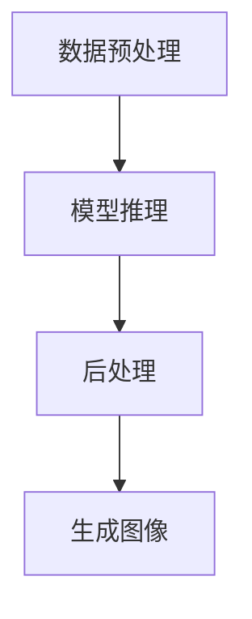

# 【大模型应用开发 动手做AI Agent】OpenAI API的图片生成示例

## 1.背景介绍

在人工智能领域，生成模型（Generative Models）已经成为一个重要的研究方向。生成模型不仅可以生成文本，还可以生成图像、音频等多种形式的数据。OpenAI的API提供了强大的生成能力，特别是在图像生成方面。本文将详细介绍如何使用OpenAI API进行图片生成，并通过实际代码示例帮助读者理解和应用这一技术。

## 2.核心概念与联系

### 2.1 生成模型

生成模型是指能够生成新数据的模型。与判别模型不同，生成模型不仅能够对数据进行分类，还能够生成与训练数据相似的新数据。常见的生成模型包括生成对抗网络（GANs）、变分自编码器（VAEs）等。

### 2.2 OpenAI API

OpenAI API是一个强大的工具，提供了多种生成模型的接口。通过这些接口，开发者可以轻松地生成文本、图像等数据。OpenAI API的图像生成功能基于DALL-E模型，这是一种能够生成高质量图像的生成模型。

### 2.3 DALL-E模型

DALL-E是OpenAI开发的一种生成模型，能够根据文本描述生成图像。DALL-E模型基于GPT-3架构，通过大规模的训练数据学习文本与图像之间的关系，从而能够生成符合文本描述的图像。

## 3.核心算法原理具体操作步骤

### 3.1 数据预处理

在进行图像生成之前，需要对输入的文本数据进行预处理。预处理的目的是将文本数据转换为模型可以理解的格式。具体步骤包括：

1. **文本清洗**：去除无关字符和噪音。
2. **分词**：将文本分割成单词或子词。
3. **编码**：将分词后的文本转换为模型可以处理的数值形式。

### 3.2 模型推理

模型推理是指使用预训练的生成模型进行图像生成。具体步骤包括：

1. **加载模型**：从OpenAI API加载预训练的DALL-E模型。
2. **输入数据**：将预处理后的文本数据输入模型。
3. **生成图像**：模型根据输入的文本数据生成图像。

### 3.3 后处理

生成的图像可能需要进行后处理，以提高图像质量或满足特定需求。后处理的步骤包括：

1. **图像增强**：使用图像处理技术提高图像的清晰度和质量。
2. **格式转换**：将图像转换为所需的格式，如JPEG、PNG等。

以下是上述步骤的Mermaid流程图：



## 4.数学模型和公式详细讲解举例说明

### 4.1 生成模型的数学基础

生成模型的核心在于概率分布的学习。假设我们有一个数据集 $X$，生成模型的目标是学习数据的概率分布 $P(X)$。在图像生成中，我们希望生成的图像 $Y$ 满足条件概率 $P(Y|X)$，其中 $X$ 是输入的文本描述。

### 4.2 DALL-E模型的数学原理

DALL-E模型基于变分自编码器（VAE）和自回归模型的结合。其核心思想是通过最大化似然估计来学习数据的概率分布。具体来说，DALL-E模型通过以下公式进行训练：

$$
\log P(Y|X) = \sum_{t=1}^{T} \log P(y_t|y_{<t}, X)
$$

其中，$y_t$ 表示生成图像的第 $t$ 个像素，$y_{<t}$ 表示生成图像的前 $t-1$ 个像素，$X$ 表示输入的文本描述。

### 4.3 示例说明

假设我们有一个文本描述 "一只蓝色的猫"，DALL-E模型会将其转换为数值形式，并通过最大化似然估计生成符合描述的图像。具体步骤如下：

1. **文本编码**：将 "一只蓝色的猫" 转换为数值向量 $X$。
2. **模型推理**：通过最大化似然估计生成图像 $Y$。
3. **图像解码**：将生成的数值向量 $Y$ 转换为图像。

## 5.项目实践：代码实例和详细解释说明

### 5.1 环境配置

在开始项目实践之前，需要配置开发环境。以下是所需的环境和工具：

- Python 3.7+
- OpenAI API
- 图像处理库（如PIL）

### 5.2 安装依赖

首先，安装所需的Python库：

```bash
pip install openai pillow
```

### 5.3 代码实例

以下是一个使用OpenAI API进行图像生成的代码示例：

```python
import openai
from PIL import Image
import requests
from io import BytesIO

# 设置OpenAI API密钥
openai.api_key = 'your-api-key'

# 输入文本描述
prompt = "a blue cat"

# 调用OpenAI API生成图像
response = openai.Image.create(
    prompt=prompt,
    n=1,
    size="512x512"
)

# 获取生成的图像URL
image_url = response['data'][0]['url']

# 下载并显示图像
response = requests.get(image_url)
img = Image.open(BytesIO(response.content))
img.show()
```

### 5.4 代码解释

1. **设置API密钥**：使用 `openai.api_key` 设置OpenAI API的密钥。
2. **输入文本描述**：定义要生成图像的文本描述。
3. **调用API**：使用 `openai.Image.create` 调用OpenAI API生成图像。
4. **获取图像URL**：从API响应中获取生成的图像URL。
5. **下载并显示图像**：使用 `requests` 库下载图像，并使用 `PIL` 库显示图像。

## 6.实际应用场景

### 6.1 创意设计

生成模型在创意设计领域有广泛的应用。例如，设计师可以使用生成模型快速生成各种创意图像，作为设计灵感的来源。

### 6.2 游戏开发

在游戏开发中，生成模型可以用于生成游戏场景、角色等图像资源，从而提高开发效率。

### 6.3 教育与培训

生成模型还可以用于教育与培训。例如，教师可以使用生成模型生成教学图像，帮助学生更好地理解知识。

## 7.工具和资源推荐

### 7.1 开发工具

- **Jupyter Notebook**：用于编写和运行Python代码的交互式环境。
- **PyCharm**：功能强大的Python集成开发环境（IDE）。

### 7.2 在线资源

- **OpenAI API文档**：详细介绍了OpenAI API的使用方法和示例代码。
- **Kaggle**：提供了大量的公开数据集和竞赛，适合进行生成模型的训练和测试。

## 8.总结：未来发展趋势与挑战

生成模型在图像生成领域展现了巨大的潜力，但也面临一些挑战。未来的发展趋势包括：

1. **模型优化**：提高生成模型的效率和质量。
2. **多模态生成**：结合文本、图像、音频等多种数据形式进行生成。
3. **应用扩展**：探索生成模型在更多领域的应用，如医疗、金融等。

同时，生成模型也面临一些挑战，如数据隐私、伦理问题等。如何在保证数据安全和伦理合规的前提下，充分发挥生成模型的潜力，是未来需要解决的重要问题。

## 9.附录：常见问题与解答

### 9.1 如何获取OpenAI API密钥？

可以在OpenAI官网注册账号，并在API管理页面获取API密钥。

### 9.2 如何提高生成图像的质量？

可以通过调整生成模型的参数，如生成图像的分辨率、生成次数等，提高图像的质量。

### 9.3 生成模型的训练数据有哪些要求？

生成模型的训练数据需要具有多样性和代表性，以确保生成的图像质量和多样性。

### 9.4 如何处理生成图像中的噪音？

可以使用图像处理技术，如去噪算法、图像增强等，处理生成图像中的噪音。

### 9.5 生成模型的应用有哪些限制？

生成模型的应用可能受到数据隐私、伦理问题等限制。在应用生成模型时，需要遵守相关法律法规和伦理准则。

---

作者：禅与计算机程序设计艺术 / Zen and the Art of Computer Programming