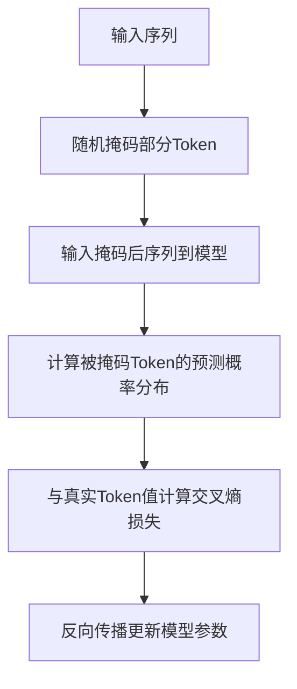
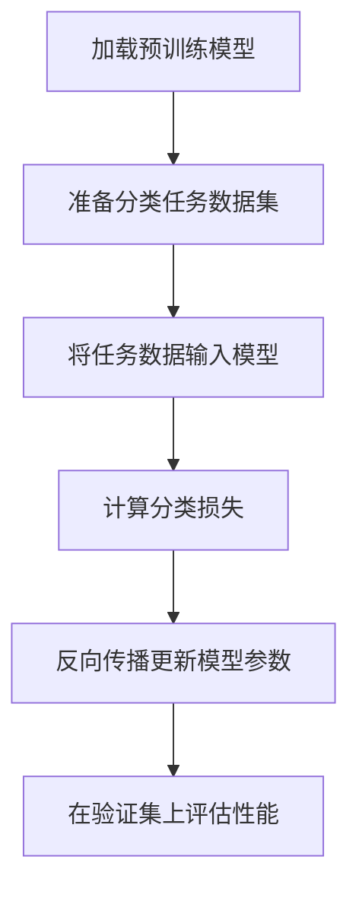

# 【大模型应用开发 动手做AI Agent】创建大模型实例

## 1.背景介绍

### 1.1 人工智能的发展历程

人工智能(Artificial Intelligence, AI)是当代科技发展的热点领域之一,其发展历程可以追溯到20世纪50年代。在过去几十年里,人工智能经历了几次重大突破,从早期的专家系统、机器学习,到近年来的深度学习和大模型等,AI技术不断推陈出新,应用范围也在持续扩大。

### 1.2 大模型的崛起

近年来,大规模的人工智能模型(Large AI Models)开始崛起,在自然语言处理、计算机视觉、推理决策等多个领域展现出卓越的能力。这些大模型通过在海量数据上进行预训练,掌握了丰富的知识和技能,可以通过微调转移到各种下游任务中,大大提高了人工智能系统的性能和泛化能力。

### 1.3 大模型的应用前景

大模型不仅在学术研究中获得关注,更重要的是其在工业界的广泛应用前景。大模型可以赋能各行业的智能化升级,如智能客服、内容创作、决策辅助等,有望彻底改变人类的工作和生活方式。因此,掌握大模型应用开发的能力,将是未来AI人才的必备技能之一。

## 2.核心概念与联系

### 2.1 大模型的定义

所谓大模型,是指具有超大规模参数(通常超过10亿个参数)、在海量数据上进行预训练的人工智能模型。这些模型通过自监督学习等技术,从原始数据中自动获取知识,形成通用的表示能力。

### 2.2 预训练与微调

大模型的训练过程分为两个阶段:预训练(Pretraining)和微调(Finetuning)。

预训练阶段是在通用的大规模语料库(如网络文本、维基百科等)上进行自监督学习,获取通用的语义表示能力。常用的预训练目标包括掩码语言模型(Masked Language Modeling)、下一句预测(Next Sentence Prediction)等。

微调阶段是将预训练模型在特定的下游任务数据上进行进一步训练,使模型适应具体的应用场景。通过微调,大模型可以快速转移到新的任务上,显著提高性能。

### 2.3 提示学习

提示学习(Prompt Learning)是大模型应用开发的一种新范式。不同于传统的监督微调方法,提示学习通过设计特定的文本提示,指导大模型生成所需的输出,避免了对大模型进行全量微调的需求。提示学习简化了大模型的应用开发流程,同时也扩展了大模型的应用场景。

### 2.4 大模型与传统模型的区别

相比于传统的小规模模型,大模型具有以下显著特点:

1. 参数规模巨大,通常超过10亿个参数
2. 通过自监督学习在海量数据上预训练
3. 具备更强的泛化能力和迁移学习能力
4. 可支持多模态(文本、图像、视频等)输入输出
5. 训练和推理成本更高,需要强大的算力支持

## 3.核心算法原理具体操作步骤

### 3.1 自监督预训练

大模型预训练的核心是自监督学习(Self-Supervised Learning)算法。常见的自监督预训练目标包括:

1. **掩码语言模型(Masked Language Modeling, MLM)**: 随机掩码部分输入Token,模型需要预测被掩码的Token。
2. **下一句预测(Next Sentence Prediction, NSP)**: 判断两个句子是否为连续的句子对。
3. **替换Token检测(Replaced Token Detection, RTD)**: 检测输入序列中是否存在被替换的Token。

以掩码语言模型为例,具体操作步骤如下:



上述自监督训练目标能够驱使模型学习到语义和上下文的潜在表示,形成通用的语言理解能力。

### 3.2 监督微调

对于特定的下游任务(如文本分类、机器翻译等),需要在大模型的预训练基础上进行进一步的监督微调。常见的监督微调方法包括:

1. **全模型微调(Full Model Finetuning)**: 在目标任务数据上,对整个大模型的所有参数进行端到端的微调。
2. **前馈适配(Prefix Tuning)**: 仅微调大模型顶层的前馈神经网络参数,冻结其余参数。
3. **LoRA(Low-Rank Adaptation)**: 在大模型各层之间插入可训练的低秩矩阵,实现高效参数微调。

以全模型微调为例,对于文本分类任务,操作步骤如下:



通过监督微调,大模型可以快速适应新的下游任务,显著提高任务性能。

## 4.数学模型和公式详细讲解举例说明

### 4.1 Transformer模型

Transformer是大模型的核心网络架构之一,其中自注意力机制(Self-Attention)是关键组件。给定输入序列$X = (x_1, x_2, \ldots, x_n)$,自注意力计算过程如下:

$$\begin{aligned}
    Q &= X \cdot W_Q \\
    K &= X \cdot W_K \\
    V &= X \cdot W_V \\
    \text{Attention}(Q, K, V) &= \text{softmax}\left(\frac{Q \cdot K^T}{\sqrt{d_k}}\right) \cdot V
\end{aligned}$$

其中$Q$、$K$、$V$分别为查询(Query)、键(Key)和值(Value)向量,通过注意力机制捕获输入序列中元素之间的长程依赖关系。

### 4.2 交叉熵损失函数

在监督微调过程中,常用的损失函数是交叉熵损失(Cross Entropy Loss)。假设模型输出的预测概率分布为$\hat{y}$,真实标签的One-Hot编码为$y$,交叉熵损失定义为:

$$\mathcal{L}(\hat{y}, y) = -\sum_{i=1}^{C} y_i \log \hat{y}_i$$

其中$C$为类别数量。该损失函数衡量了模型预测与真实标签之间的差异程度,模型训练的目标是最小化损失函数值。

### 4.3 示例:文本分类

以文本分类为例,给定一个输入文本序列$X = (x_1, x_2, \ldots, x_n)$,通过Transformer编码器获得其上下文表示$H = (h_1, h_2, \ldots, h_n)$。接着将$H$的首个向量$h_1$输入到分类头(Classification Head)中,计算各类别的概率分布:

$$\hat{y} = \text{softmax}(W_c \cdot h_1 + b_c)$$

其中$W_c$和$b_c$为可训练参数。在训练过程中,将预测概率$\hat{y}$与真实标签$y$计算交叉熵损失,并通过反向传播算法更新模型参数。

## 5.项目实践:代码实例和详细解释说明

以下是使用Hugging Face的Transformers库,在GLUE数据集上微调BERT大模型进行文本分类的Python代码示例:

```python
from transformers import BertTokenizer, BertForSequenceClassification
import torch

# 加载预训练模型和分词器
model_name = "bert-base-uncased"
tokenizer = BertTokenizer.from_pretrained(model_name)
model = BertForSequenceClassification.from_pretrained(model_name)

# 准备数据
texts = ["This movie is great!", "I don't like this book."]
encodings = tokenizer(texts, truncation=True, padding=True, return_tensors="pt")

# 前向传播
outputs = model(**encodings)
logits = outputs.logits

# 计算损失和准确率
labels = torch.tensor([1, 0])  # 示例标签
loss = outputs.loss(labels)
preds = torch.argmax(logits, dim=-1)
accuracy = (preds == labels).float().mean()

# 打印结果
print(f"Loss: {loss.item()}")
print(f"Accuracy: {accuracy.item()}")
```

上述代码首先加载BERT预训练模型和分词器,然后对输入文本进行编码。接着将编码后的输入传递给BERT模型,获得分类任务的Logits输出。根据示例标签,计算交叉熵损失和准确率。

需要注意的是,上述代码仅为简单示例,在实际应用中还需要准备完整的数据集、设置训练超参数、进行模型评估等步骤。

## 6.实际应用场景

大模型在自然语言处理领域有着广泛的应用前景,包括但不限于:

1. **文本生成**: 利用大模型生成高质量的文本内容,如新闻、小说、诗歌、对话等。
2. **机器翻译**: 将大模型应用于神经机器翻译系统,提高翻译质量。
3. **问答系统**: 基于大模型构建智能问答系统,回答用户提出的各类问题。
4. **文本摘要**: 使用大模型对长文本进行自动摘要,提取关键信息。
5. **情感分析**: 利用大模型对文本进行情感分析,了解用户情绪态度。
6. **智能写作辅助**: 大模型可以为作家、学者等提供写作建议和自动续写功能。

除自然语言处理外,大模型还可应用于计算机视觉、推理决策、多模态等领域,在工业界有着巨大的应用潜力和商业价值。

## 7.工具和资源推荐

### 7.1 开源框架

- **Hugging Face Transformers**: 提供了各种大模型(BERT、GPT、ViT等)的预训练权重,并支持在PyTorch和TensorFlow等框架上进行微调。
- **AllenNLP**: 由AI2开发的开源NLP研究框架,支持大模型的加载和微调。
- **FairSeq**: Meta AI Research开源的序列建模工具箱,支持大规模分布式训练。

### 7.2 预训练模型

- **BERT**: 谷歌开源的基于Transformer的预训练语言模型。
- **GPT**: OpenAI开发的生成式预训练Transformer模型。
- **T5**: 由Google开源的统一的文本到文本的转换模型。
- **CLIP**: OpenAI开源的跨模态视觉语言预训练模型。

### 7.3 数据集

- **GLUE**: 通用语言理解评测基准,包含9项自然语言任务数据集。
- **SuperGLUE**: GLUE的延续版本,更加注重任务的困难和多样性。
- **SQuAD**: 斯坦福问答数据集,用于阅读理解和问答任务。
- **ImageNet**: 计算机视觉领域的权威数据集,包含1400万张图像。

### 7.4 在线演示

- **ChatGPT**: OpenAI开发的基于GPT大模型的对话式AI助手。
- **DALL-E**: OpenAI开发的基于大模型的文本到图像生成系统。
- **PaLM**: Google开发的通用大模型,可用于多种任务。
- **Claude**: Anthropic开发的对话式AI助手,基于大模型。

## 8.总结:未来发展趋势与挑战

### 8.1 发展趋势

1. **模型规模持续增长**: 未来大模型的参数规模将进一步增长,以获取更强的表示能力。
2. **多模态融合**: 大模型将支持多种模态(文本、图像、视频等)的融合,实现跨模态的理解和生成。
3. **任务统一**: 通过提示学习等技术,大模型将朝着任务无差异的通用智能系统发展。
4. **模型高效化**: 研究人员将致力于提高大模型的计算效率,降低推理成本。
5. **模型可解释性**: 提高大模型的可解释性,使其决策过程更加透明和可信赖。

### 8.2 挑战与难题

1. **训练数据质量**: 大