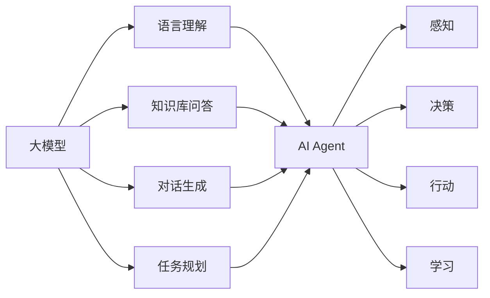

# 【大模型应用开发 动手做AI Agent】创建线程

## 1. 背景介绍

### 1.1 大模型的兴起与发展

近年来,随着深度学习技术的不断进步,大规模语言模型(Large Language Models, LLMs)得到了飞速发展。从GPT-3到ChatGPT,再到最新的GPT-4,大模型展现出了惊人的自然语言理解和生成能力,引发了学术界和工业界的广泛关注。大模型的出现,为人工智能领域带来了新的突破,为构建更加智能化的应用系统提供了新的可能。

### 1.2 AI Agent的概念与应用

AI Agent是一种基于人工智能技术,能够自主执行任务、与环境交互的智能体。它可以感知周围的环境,根据自身的知识和经验做出决策,并采取相应的行动来完成特定的任务。AI Agent在智能客服、智能助手、自动驾驶等领域有广泛的应用前景。

### 1.3 大模型赋能AI Agent的意义

大模型强大的语言理解和生成能力,为构建更加智能化的AI Agent提供了新的契机。通过将大模型与AI Agent相结合,我们可以创建出具备更强语言交互能力、更广泛知识覆盖、更出色任务完成效果的智能体系统。这将极大地提升AI Agent的应用价值,为各行各业带来变革性的影响。

## 2. 核心概念与联系

### 2.1 大模型的核心概念

- Transformer架构:大模型的核心架构,基于自注意力机制,实现了并行化计算和长距离依赖建模。
- 预训练与微调:大模型通过在大规模语料上进行无监督预训练,学习通用语言知识,再通过少量标注数据微调适应下游任务。
- 零样本/少样本学习:大模型可以在没有或很少训练样本的情况下,仅根据任务描述就可以进行推理和任务完成。
- 提示工程:通过设计合适的提示(Prompt),引导大模型生成符合特定需求的内容。

### 2.2 AI Agent的核心概念 

- 感知:Agent通过传感器感知周围环境的状态。
- 决策:Agent根据当前状态,结合自身知识和经验,选择最优的行动策略。
- 行动:Agent执行选定的行动,对环境产生影响。
- 学习:Agent根据行动的效果,不断优化自身的决策模型。

### 2.3 大模型与AI Agent的融合

将大模型应用于AI Agent的开发,可以从以下几个方面入手:

- 语言理解:利用大模型强大的语言理解能力,增强Agent对用户意图的准确把握。
- 知识库问答:将大模型学习到的海量知识进行结构化存储,供Agent进行问答和推理。  
- 对话生成:运用大模型的语言生成能力,让Agent能够进行自然流畅的多轮对话交互。
- 任务规划:通过大模型对任务的理解和分解,指导Agent制定和执行计划。

下图展示了大模型与AI Agent融合的总体架构:



## 3. 核心算法原理具体操作步骤

### 3.1 大模型的训练流程

1. 语料准备:收集大规模高质量的无标签文本数据。
2. 数据预处理:对语料进行清洗、分词、编码等预处理操作。
3. 模型构建:搭建Transformer等大模型的网络结构。
4. 预训练:在无标签语料上进行自监督学习,优化语言建模目标。
5. 微调:用下游任务的少量标注数据对模型进行微调。
6. 推理应用:将训练好的模型用于实际的任务推理和生成。

### 3.2 提示工程的设计方法

1. 任务分析:明确任务的输入输出要求,分析需要哪些先验知识。
2. 提示模板设计:总结任务的关键元素,设计统一的提示模板。
3. 答案格式定义:规范模型输出的格式,方便后处理。
4. 思维链构建:将复杂任务分解为多个步骤,形成思维链指引模型推理。
5. 反例引入:加入一些反例,引导模型向正确方向调整。
6. 迭代优化:根据实际效果对提示进行迭代改进。

### 3.3 基于大模型的知识库问答

1. 知识抽取:利用大模型从非结构化文本中抽取结构化知识。
2. 知识存储:将抽取的知识组织为图谱或数据库等形式。
3. 问句理解:利用大模型对用户问句进行语义理解和解析。
4. 知识匹配:根据问句表示在知识库中检索相关知识。
5. 答案生成:利用大模型根据匹配的知识生成自然语言答案。
6. 答案排序:对生成的候选答案进行打分排序,选出最优答案。

### 3.4 端到端对话生成

1. 历史对话编码:将历史对话轮次通过大模型进行编码。
2. 当前询问编码:对当前用户询问进行编码。
3. 解码生成回复:在历史对话和当前询问的编码基础上解码生成回复。
4. 迭代生成:根据用户反馈,进行多轮对话交互。

## 4. 数学模型和公式详细讲解举例说明

### 4.1 Transformer的核心原理

Transformer的核心是自注意力机制(Self-Attention),通过计算序列中不同位置之间的关联度,实现了并行计算和长距离依赖建模。

给定输入序列 $X=(x_1,\cdots,x_n)$,自注意力的计算过程如下:

1. 计算查询矩阵 $Q$、键矩阵 $K$、值矩阵 $V$:

$$
\begin{aligned}
Q &= XW^Q \\
K &= XW^K \\
V &= XW^V
\end{aligned}
$$

其中 $W^Q, W^K, W^V$ 是可学习的参数矩阵。

2. 计算注意力分数:

$$
\text{Attention}(Q,K,V) = \text{softmax}(\frac{QK^T}{\sqrt{d_k}})V
$$

其中 $d_k$ 是 $K$ 的维度,用于缩放点积结果。

3. 计算多头注意力:

$$
\begin{aligned}
\text{MultiHead}(Q,K,V) &= \text{Concat}(\text{head}_1,\cdots,\text{head}_h)W^O \\
\text{head}_i &= \text{Attention}(QW_i^Q, KW_i^K, VW_i^V)
\end{aligned}
$$

其中 $W_i^Q, W_i^K, W_i^V, W^O$ 是可学习的参数矩阵, $h$ 是注意力头的数量。

4. 残差连接和Layer Normalization:

$$
\begin{aligned}
Z &= \text{LayerNorm}(X + \text{MultiHead}(Q,K,V)) \\
\text{Output} &= \text{LayerNorm}(Z + \text{FeedForward}(Z))
\end{aligned}
$$

其中FeedForward是两层的全连接前馈网络。

通过堆叠多个Transformer块,就构成了Transformer的整体架构。

### 4.2 语言模型的目标函数

大模型的预训练本质上是一个语言建模的过程,通过最大化下一个词的条件概率来学习语言的统计规律。

给定语料序列 $w_1,\cdots,w_T$,语言模型的目标是最小化负对数似然:

$$
\mathcal{L}(\theta) = -\sum_{t=1}^T \log P(w_t|w_{<t};\theta)
$$

其中 $\theta$ 是模型参数, $w_{<t}$ 表示 $t$ 时刻之前的词。

将Transformer用于语言建模时,输入序列通过Embedding层和Positional Encoding层,然后依次通过若干个Transformer块,最后使用线性层将输出转化为词表上的概率分布:

$$
P(w_t|w_{<t}) = \text{softmax}(\text{Linear}(\text{Transformer}(w_{<t})))
$$

优化上述目标函数,即可得到预训练的语言模型。在实际应用中,我们还可以引入Masked Language Modeling等预训练任务,让模型学到更加丰富的语言知识。

## 5. 项目实践：代码实例和详细解释说明

下面我们通过一个简单的例子,演示如何使用Hugging Face的Transformers库来微调GPT-2模型,实现一个基于提示的文本生成应用。

```python
from transformers import GPT2LMHeadModel, GPT2Tokenizer

# 加载预训练的GPT-2模型和tokenizer
model = GPT2LMHeadModel.from_pretrained('gpt2')
tokenizer = GPT2Tokenizer.from_pretrained('gpt2')

# 设置生成参数
max_length = 100
num_return_sequences = 3
temperature = 0.7

# 定义提示模板
prompt = "The benefits of AI are"

# 对提示进行编码
input_ids = tokenizer.encode(prompt, return_tensors='pt')

# 生成文本
output = model.generate(
    input_ids, 
    max_length=max_length,
    num_return_sequences=num_return_sequences, 
    temperature=temperature
)

# 解码并打印生成的文本
for i in range(num_return_sequences):
    generated_text = tokenizer.decode(output[i], skip_special_tokens=True)
    print(f"Generated text {i+1}: {generated_text}")
```

在上面的代码中,我们首先加载了预训练的GPT-2模型和对应的tokenizer。然后设置了一些生成参数,如最大长度、生成序列数、温度等。接着定义了一个提示模板,并将其编码为模型可接受的输入格式。最后调用`generate`方法生成文本,并解码打印出来。

通过修改提示模板和生成参数,我们可以控制生成文本的内容和风格。这为构建更加灵活智能的AI Agent提供了基础。在实际应用中,我们还可以在特定领域的数据上对模型进行微调,使其生成更加专业和可控的内容。

## 6. 实际应用场景

基于大模型的AI Agent可以应用于多个场景,例如:

### 6.1 智能客服

- 利用大模型构建知识库,实现全领域的问答和解决方案生成。
- 通过多轮对话交互,引导用户表达需求,提供个性化服务。
- 结合情感分析,给出更加贴心和人性化的回复。

### 6.2 智能助手

- 通过语音交互,实现日程管理、信息查询等个人助理功能。  
- 根据用户画像和偏好,主动提供个性化的内容推荐。
- 运用大模型的知识,为用户提供各领域的专业建议和指导。

### 6.3 内容创作

- 辅助撰写文案、文章、剧本等各类内容。
- 根据关键词或主题,自动生成文章框架和初稿。  
- 提供写作过程中的实时建议和优化方案。

### 6.4 教育培训

- 构建智能教学助手,为学生提供个性化的学习指导。
- 自动生成试题和答案解析,减轻教师备课压力。
- 开展智能化的学习效果评估和反馈。

### 6.5 医疗健康

- 辅助医生进行病情分析和诊断。  
- 为患者提供医疗咨询和健康指导。
- 分析医学文献和病例,总结经验,提升医疗服务水平。

## 7. 工具和资源推荐

### 7.1 开源大模型
- BERT: Google提出的预训练语言模型,适用于多种NLP任务。
- GPT系列: OpenAI开发的生成式预训练模型,在文本生成领域表现出色。
- T5: Google提出的文本到文本的预训练模型,可用于各类NLP任务。
- XLNet: 采用排列语言建模的预训练模型,在多个基准测试中取得领先。

### 7.2 开发框架和库
- Transformers: Hugging Face开发的统一NLP库,支持多种主流模型。
- Fairseq: Facebook开源的序列建模工具包。
- Megatron-LM: NVIDIA开