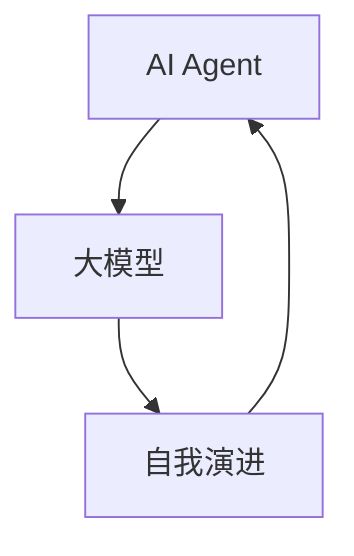

# 【大模型应用开发 动手做AI Agent】自我演进的AI

## 1.背景介绍

在人工智能领域，AI Agent（智能代理）已经成为一个热门话题。随着大模型（如GPT-3、BERT等）的出现，AI Agent的能力得到了显著提升。大模型不仅能够处理复杂的自然语言任务，还能通过自我学习和自我演进不断提高自身性能。这篇文章将深入探讨如何开发一个自我演进的AI Agent，帮助读者理解其核心概念、算法原理、数学模型、实际应用场景以及未来的发展趋势。

## 2.核心概念与联系

### 2.1 AI Agent

AI Agent是一个能够感知环境、做出决策并执行动作的智能系统。它通常由感知模块、决策模块和执行模块组成。

### 2.2 大模型

大模型是指具有大量参数和复杂结构的深度学习模型，如GPT-3、BERT等。这些模型通过大规模数据训练，能够处理复杂的自然语言任务。

### 2.3 自我演进

自我演进是指AI Agent通过自我学习和自我优化，不断提高自身性能的过程。这通常涉及强化学习、元学习等技术。

### 2.4 核心联系

AI Agent、大模型和自我演进之间的联系可以通过以下Mermaid流程图表示：



## 3.核心算法原理具体操作步骤

### 3.1 强化学习

强化学习是自我演进的核心算法之一。它通过奖励机制引导AI Agent学习最优策略。

#### 3.1.1 Q-Learning

Q-Learning是一种常见的强化学习算法。其核心思想是通过更新Q值函数来学习最优策略。

#### 3.1.2 操作步骤

1. 初始化Q值函数
2. 在环境中执行动作，观察奖励和新状态
3. 更新Q值函数
4. 重复步骤2和3，直到收敛

### 3.2 元学习

元学习是另一种自我演进的技术。它通过学习如何学习，提高AI Agent的学习效率。

#### 3.2.1 MAML（Model-Agnostic Meta-Learning）

MAML是一种常见的元学习算法。其核心思想是通过优化初始参数，使得模型能够快速适应新任务。

#### 3.2.2 操作步骤

1. 初始化模型参数
2. 在多个任务上进行训练，计算损失
3. 优化初始参数
4. 重复步骤2和3，直到收敛

## 4.数学模型和公式详细讲解举例说明

### 4.1 强化学习中的Q-Learning

Q-Learning的核心公式为：

$$
Q(s, a) \leftarrow Q(s, a) + \alpha [r + \gamma \max_{a'} Q(s', a') - Q(s, a)]
$$

其中，$s$表示当前状态，$a$表示当前动作，$r$表示奖励，$\alpha$表示学习率，$\gamma$表示折扣因子。

### 4.2 元学习中的MAML

MAML的核心公式为：

$$
\theta \leftarrow \theta - \beta \nabla_{\theta} \sum_{T_i \sim p(T)} \mathcal{L}_{T_i}(f_{\theta - \alpha \nabla_{\theta} \mathcal{L}_{T_i}(f_{\theta})})
$$

其中，$\theta$表示模型参数，$\beta$表示元学习率，$\alpha$表示任务学习率，$\mathcal{L}$表示损失函数。

## 5.项目实践：代码实例和详细解释说明

### 5.1 强化学习代码实例

以下是一个简单的Q-Learning代码实例：

```python
import numpy as np

# 初始化Q值函数
Q = np.zeros((state_size, action_size))

# 超参数
alpha = 0.1
gamma = 0.99
epsilon = 0.1

for episode in range(num_episodes):
    state = env.reset()
    done = False
    
    while not done:
        if np.random.rand() < epsilon:
            action = np.random.choice(action_size)
        else:
            action = np.argmax(Q[state])
        
        next_state, reward, done, _ = env.step(action)
        
        Q[state, action] = Q[state, action] + alpha * (reward + gamma * np.max(Q[next_state]) - Q[state, action])
        
        state = next_state
```

### 5.2 元学习代码实例

以下是一个简单的MAML代码实例：

```python
import torch
import torch.nn as nn
import torch.optim as optim

class MAMLModel(nn.Module):
    def __init__(self):
        super(MAMLModel, self).__init__()
        self.fc = nn.Linear(input_size, output_size)
    
    def forward(self, x):
        return self.fc(x)

model = MAMLModel()
optimizer = optim.Adam(model.parameters(), lr=meta_lr)

for task in tasks:
    # 任务内训练
    task_optimizer = optim.SGD(model.parameters(), lr=task_lr)
    for step in range(task_steps):
        loss = compute_loss(model, task)
        task_optimizer.zero_grad()
        loss.backward()
        task_optimizer.step()
    
    # 元优化
    meta_loss = compute_meta_loss(model, tasks)
    optimizer.zero_grad()
    meta_loss.backward()
    optimizer.step()
```

## 6.实际应用场景

### 6.1 自然语言处理

大模型在自然语言处理（NLP）领域有广泛应用，如文本生成、机器翻译、情感分析等。

### 6.2 自动驾驶

AI Agent在自动驾驶中扮演重要角色，通过感知环境、决策和执行动作，实现自动驾驶功能。

### 6.3 游戏AI

自我演进的AI Agent在游戏中表现出色，如AlphaGo通过自我学习击败了人类顶尖棋手。

## 7.工具和资源推荐

### 7.1 开发工具

- TensorFlow
- PyTorch
- OpenAI Gym

### 7.2 学习资源

- 《深度学习》 by Ian Goodfellow
- 《强化学习：原理与实践》 by Richard S. Sutton
- OpenAI博客

## 8.总结：未来发展趋势与挑战

### 8.1 未来发展趋势

自我演进的AI Agent将在更多领域得到应用，如医疗诊断、金融分析等。随着大模型的不断发展，AI Agent的能力将进一步提升。

### 8.2 挑战

- 数据隐私和安全
- 计算资源需求
- 伦理和法律问题

## 9.附录：常见问题与解答

### 9.1 如何选择合适的大模型？

选择大模型时，应考虑任务需求、计算资源和数据量。对于复杂任务，可以选择GPT-3等大规模模型；对于资源有限的情况，可以选择BERT等较小模型。

### 9.2 如何提高AI Agent的自我演进能力？

可以通过强化学习和元学习等技术，提高AI Agent的自我演进能力。此外，增加训练数据和优化模型结构也是有效的方法。

### 9.3 自我演进的AI Agent是否存在风险？

自我演进的AI Agent在带来便利的同时，也存在一定风险，如数据隐私泄露、决策失误等。因此，在开发和应用过程中，应加强风险管理和伦理审查。

---

作者：禅与计算机程序设计艺术 / Zen and the Art of Computer Programming