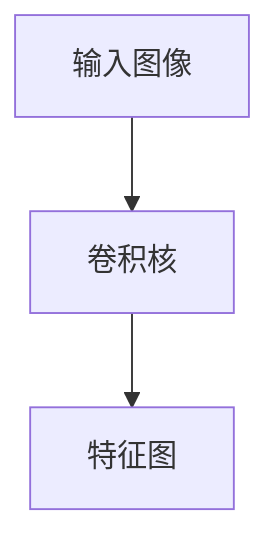
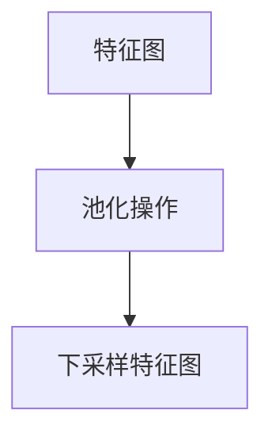

# 一切皆是映射：卷积神经网络(CNNs)在图像处理中的应用

## 1.背景介绍

卷积神经网络（Convolutional Neural Networks，简称CNNs）是深度学习领域中最为重要的模型之一，尤其在图像处理领域取得了显著的成果。自从AlexNet在2012年ImageNet竞赛中取得突破性成绩以来，CNNs迅速成为计算机视觉任务的主流方法。本文将深入探讨CNNs的核心概念、算法原理、数学模型、实际应用以及未来发展趋势。

## 2.核心概念与联系

### 2.1 卷积操作

卷积操作是CNNs的核心，它通过一个小的滤波器（或称卷积核）在输入图像上滑动，提取局部特征。卷积操作的数学表达式为：

$$
(f * g)(t) = \int_{-\infty}^{\infty} f(\tau)g(t - \tau)d\tau
$$

在离散情况下，卷积操作可以表示为：

$$
(f * g)[n] = \sum_{m=-\infty}^{\infty} f[m]g[n - m]
$$

### 2.2 激活函数

激活函数引入非线性，使得神经网络能够拟合复杂的函数。常用的激活函数包括ReLU（Rectified Linear Unit）、Sigmoid和Tanh。

### 2.3 池化层

池化层用于下采样，减少特征图的尺寸，从而降低计算复杂度和防止过拟合。常见的池化操作有最大池化（Max Pooling）和平均池化（Average Pooling）。

### 2.4 全连接层

全连接层将前一层的所有神经元与当前层的每一个神经元相连，通常用于分类任务的最后几层。

### 2.5 损失函数

损失函数用于衡量模型预测值与真实值之间的差距，常用的损失函数有交叉熵损失（Cross-Entropy Loss）和均方误差（Mean Squared Error）。

## 3.核心算法原理具体操作步骤

### 3.1 数据预处理

数据预处理是CNNs训练的第一步，包括图像归一化、数据增强等操作。归一化将图像像素值缩放到[0, 1]或[-1, 1]范围内，数据增强则通过旋转、翻转、裁剪等操作增加数据多样性。

### 3.2 卷积层操作

卷积层通过卷积核在输入图像上滑动，计算卷积操作的结果。每个卷积核提取不同的特征，如边缘、纹理等。



### 3.3 激活函数应用

在卷积操作后，激活函数被应用于特征图的每一个元素，引入非线性。

### 3.4 池化层操作

池化层对特征图进行下采样，减少特征图的尺寸。



### 3.5 全连接层操作

全连接层将前一层的所有神经元与当前层的每一个神经元相连，通常用于分类任务的最后几层。

### 3.6 反向传播与优化

反向传播算法用于计算损失函数相对于每个参数的梯度，并通过优化算法（如SGD、Adam）更新参数。

## 4.数学模型和公式详细讲解举例说明

### 4.1 卷积操作的数学模型

假设输入图像为 $I$，卷积核为 $K$，则卷积操作的输出 $O$ 可以表示为：

$$
O(i, j) = \sum_{m}\sum_{n} I(i+m, j+n)K(m, n)
$$

### 4.2 激活函数的数学模型

以ReLU为例，其数学表达式为：

$$
f(x) = \max(0, x)
$$

### 4.3 池化操作的数学模型

以最大池化为例，其数学表达式为：

$$
O(i, j) = \max_{m, n} I(i+m, j+n)
$$

### 4.4 反向传播算法

反向传播算法通过链式法则计算损失函数相对于每个参数的梯度。假设损失函数为 $L$，参数为 $\theta$，则梯度计算为：

$$
\frac{\partial L}{\partial \theta} = \frac{\partial L}{\partial O} \cdot \frac{\partial O}{\partial \theta}
$$

## 5.项目实践：代码实例和详细解释说明

### 5.1 数据预处理

```python
import tensorflow as tf
from tensorflow.keras.preprocessing.image import ImageDataGenerator

datagen = ImageDataGenerator(
    rescale=1.0/255.0,
    rotation_range=20,
    width_shift_range=0.2,
    height_shift_range=0.2,
    horizontal_flip=True
)

train_generator = datagen.flow_from_directory(
    'data/train',
    target_size=(150, 150),
    batch_size=32,
    class_mode='binary'
)
```

### 5.2 构建卷积神经网络

```python
from tensorflow.keras.models import Sequential
from tensorflow.keras.layers import Conv2D, MaxPooling2D, Flatten, Dense

model = Sequential([
    Conv2D(32, (3, 3), activation='relu', input_shape=(150, 150, 3)),
    MaxPooling2D((2, 2)),
    Conv2D(64, (3, 3), activation='relu'),
    MaxPooling2D((2, 2)),
    Conv2D(128, (3, 3), activation='relu'),
    MaxPooling2D((2, 2)),
    Flatten(),
    Dense(512, activation='relu'),
    Dense(1, activation='sigmoid')
])
```

### 5.3 编译和训练模型

```python
model.compile(optimizer='adam', loss='binary_crossentropy', metrics=['accuracy'])

history = model.fit(
    train_generator,
    steps_per_epoch=100,
    epochs=20,
    validation_data=validation_generator,
    validation_steps=50
)
```

### 5.4 模型评估

```python
loss, accuracy = model.evaluate(test_generator, steps=50)
print(f'Test accuracy: {accuracy:.2f}')
```

## 6.实际应用场景

### 6.1 图像分类

CNNs在图像分类任务中表现出色，常用于人脸识别、物体检测等领域。

### 6.2 图像分割

图像分割任务将图像划分为多个区域，CNNs通过U-Net等架构在医学图像分割中取得了显著成果。

### 6.3 图像生成

生成对抗网络（GANs）结合CNNs用于图像生成，能够生成高质量的图像，如DeepFake技术。

### 6.4 图像超分辨率

CNNs用于图像超分辨率任务，通过学习低分辨率图像到高分辨率图像的映射，提高图像质量。

## 7.工具和资源推荐

### 7.1 深度学习框架

- TensorFlow
- PyTorch
- Keras

### 7.2 数据集

- ImageNet
- CIFAR-10
- MNIST

### 7.3 在线课程和书籍

- 《深度学习》 by Ian Goodfellow, Yoshua Bengio, Aaron Courville
- Coursera上的深度学习课程

## 8.总结：未来发展趋势与挑战

### 8.1 未来发展趋势

- 更深层次的网络架构：如ResNet、DenseNet等。
- 自监督学习：减少对标注数据的依赖。
- 多模态学习：结合图像、文本、音频等多种数据源。

### 8.2 挑战

- 计算资源需求高：训练深度模型需要大量计算资源。
- 数据隐私问题：数据收集和使用过程中涉及隐私问题。
- 模型解释性：深度模型的黑箱特性使得其解释性较差。

## 9.附录：常见问题与解答

### 9.1 为什么我的模型训练效果不好？

可能原因包括数据不足、模型过拟合或欠拟合、学习率设置不当等。

### 9.2 如何选择合适的卷积核大小？

通常选择3x3或5x5的卷积核，较小的卷积核能够提取更细致的特征。

### 9.3 如何防止过拟合？

可以通过数据增强、正则化（如L2正则化、Dropout）等方法防止过拟合。

### 9.4 为什么使用ReLU激活函数？

ReLU激活函数计算简单，能够有效缓解梯度消失问题。

### 9.5 如何加速模型训练？

可以通过使用GPU、分布式训练、混合精度训练等方法加速模型训练。

---

作者：禅与计算机程序设计艺术 / Zen and the Art of Computer Programming