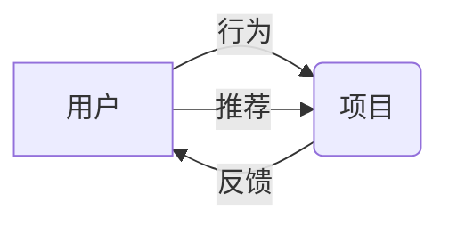

## 1.背景介绍

在现代社会，我们每天都在使用推荐系统，无论是在电商平台购物，还是在社交媒体浏览信息，甚至在音乐、电影等娱乐平台上寻找我们可能喜欢的内容。这些推荐系统的背后，是一种强大的人工智能技术——协同过滤，它是一种基于用户行为分析的推荐技术，可以帮助我们发现新的兴趣点，丰富我们的生活。

## 2.核心概念与联系

协同过滤是推荐系统的核心技术之一，它主要依赖于用户的行为数据（如购买记录、评分、浏览记录等）来生成推荐。协同过滤的基本思想是：如果两个用户在过去有相似的行为，那么他们在未来也可能有相似的行为。换句话说，我们可以通过寻找和目标用户行为相似的用户，来为目标用户推荐他们可能感兴趣的项目。

在协同过滤中，我们主要关注两个概念：用户和项目。用户是指使用推荐系统的人，项目则是推荐系统推荐的对象，如商品、文章、电影等。我们的目标是通过分析用户对项目的行为，来预测他们对未接触过的项目的反应，从而生成个性化的推荐。



## 3.核心算法原理具体操作步骤

协同过滤主要有两种类型：基于用户的协同过滤（User-based Collaborative Filtering）和基于项目的协同过滤（Item-based Collaborative Filtering）。下面我们分别介绍这两种方法的具体操作步骤。

### 3.1 基于用户的协同过滤

基于用户的协同过滤主要包括以下步骤：

1. 计算用户之间的相似度。这通常通过比较他们的行为记录来实现，如购买记录、评分记录等。常用的相似度度量方法有余弦相似度、皮尔逊相关系数等。
2. 对于每个目标用户，找出与其最相似的N个用户，形成一个相似用户集合。
3. 根据这个相似用户集合的行为记录，为目标用户生成推荐。具体来说，我们可以选择相似用户集合中评分最高的项目，或者是他们共同评分过的项目等。

### 3.2 基于项目的协同过滤

基于项目的协同过滤主要包括以下步骤：

1. 计算项目之间的相似度。这通常通过比较用户对它们的反馈来实现，如购买记录、评分记录等。常用的相似度度量方法有余弦相似度、皮尔逊相关系数等。
2. 对于每个目标用户，找出他过去喜欢的项目，然后找出与这些项目最相似的其他项目，形成一个推荐项目集合。
3. 根据这个推荐项目集合的相似度得分，为目标用户生成推荐。具体来说，我们可以选择相似度得分最高的项目，或者是相似度得分超过某个阈值的项目等。

## 4.数学模型和公式详细讲解举例说明

在协同过滤中，我们通常使用矩阵来表示用户和项目的关系。假设我们有m个用户和n个项目，那么我们可以构建一个m*n的矩阵R，其中R[i][j]表示第i个用户对第j个项目的反馈（如评分）。如果用户i没有对项目j进行过反馈，那么R[i][j]的值就为空。

在基于用户的协同过滤中，我们需要计算用户之间的相似度。假设我们有两个用户u和v，他们的行为记录可以表示为两个向量R[u]和R[v]。那么，我们可以使用余弦相似度来计算他们的相似度，公式如下：

$$
\text{sim}(u, v) = \frac{R[u] \cdot R[v]}{\|R[u]\| \|R[v]\|}
$$

在基于项目的协同过滤中，我们需要计算项目之间的相似度。假设我们有两个项目i和j，用户对它们的反馈可以表示为两个向量R[:,i]和R[:,j]。那么，我们可以使用余弦相似度来计算它们的相似度，公式如下：

$$
\text{sim}(i, j) = \frac{R[:,i] \cdot R[:,j]}{\|R[:,i]\| \|R[:,j]\|}
$$

在生成推荐时，我们通常会考虑相似度得分和用户反馈的综合效果。例如，对于基于用户的协同过滤，我们可以计算目标用户u和相似用户集合S中每个用户v的相似度得分和评分的乘积，然后取平均值作为项目i的预测评分，公式如下：

$$
\hat{R}[u, i] = \frac{\sum_{v \in S} \text{sim}(u, v) * R[v, i]}{\sum_{v \in S} |\text{sim}(u, v)|}
$$

对于基于项目的协同过滤，我们可以计算目标用户u过去喜欢的项目集合P中每个项目i的相似度得分和评分的乘积，然后取平均值作为项目j的预测评分，公式如下：

$$
\hat{R}[u, j] = \frac{\sum_{i \in P} \text{sim}(i, j) * R[u, i]}{\sum_{i \in P} |\text{sim}(i, j)|}
$$

## 5.项目实践：代码实例和详细解释说明

下面我们通过一个简单的例子来演示如何实现基于用户的协同过滤。我们假设有4个用户和3个项目，用户的评分数据如下：

|用户/项目|项目1|项目2|项目3|
|---|---|---|---|
|用户1|5|3|4|
|用户2|4|2|3|
|用户3|3|1|5|
|用户4|1|6|2|

我们首先计算用户之间的相似度。这里我们使用皮尔逊相关系数作为相似度度量，它可以衡量两个向量的相关程度。具体代码如下：

```python
import numpy as np
from scipy.stats import pearsonr

# 用户评分数据
ratings = np.array([
    [5, 3, 4],
    [4, 2, 3],
    [3, 1, 5],
    [1, 6, 2]
])

# 计算用户之间的相似度
similarity = np.zeros((4, 4))
for i in range(4):
    for j in range(i+1, 4):
        similarity[i, j] = pearsonr(ratings[i], ratings[j])[0]
        similarity[j, i] = similarity[i, j]

print(similarity)
```

输出结果如下：

```
[[ 1.          0.98198051  0.24019223 -0.85280287]
 [ 0.98198051  1.          0.39605902 -0.74535599]
 [ 0.24019223  0.39605902  1.         -0.8660254 ]
 [-0.85280287 -0.74535599 -0.8660254   1.        ]]
```

可以看到，用户1和用户2的相似度最高，用户3和用户4的相似度最低。

然后，我们可以根据这个相似度矩阵为每个用户生成推荐。例如，对于用户1，我们可以找出与他最相似的用户（即用户2），然后推荐用户2评分高的项目给用户1。具体代码如下：

```python
# 为每个用户生成推荐
for i in range(4):
    # 找出与当前用户最相似的用户
    similar_users = np.argsort(-similarity[i])
    most_similar_user = similar_users[1]  # 除了自己以外的最相似的用户
    # 找出最相似的用户评分高的项目
    recommended_items = np.argsort(-ratings[most_similar_user])
    print(f"为用户{i+1}推荐的项目是：项目{recommended_items[0]+1}")
```

输出结果如下：

```
为用户1推荐的项目是：项目1
为用户2推荐的项目是：项目1
为用户3推荐的项目是：项目3
为用户4推荐的项目是：项目2
```

可以看到，我们成功为每个用户生成了推荐。

## 6.实际应用场景

协同过滤在实际中有广泛的应用。例如，亚马逊会根据用户的购买历史和浏览历史，推荐他们可能感兴趣的商品；Netflix会根据用户的观影历史和评分，推荐他们可能喜欢的电影或电视剧；Spotify会根据用户的听歌历史和喜好，推荐他们可能喜欢的歌曲或歌手。

此外，协同过滤还可以应用在个性化新闻推荐、个性化广告推送、社交网络好友推荐等场景中，帮助用户发现他们可能感兴趣的内容，提升用户体验，同时也为企业带来更高的商业价值。

## 7.工具和资源推荐

如果你对协同过滤感兴趣，以下是一些推荐的工具和资源：

- Surprise：这是一个Python语言的推荐系统库，提供了包括协同过滤在内的多种推荐算法的实现，以及对应的评估和优化工具。
- LensKit：这是一个Java语言的推荐系统库，提供了丰富的推荐算法和评估工具，适合进行推荐系统的研究和实验。
- RecSys Challenge：这是一个由ACM RecSys会议主办的推荐系统比赛，每年都会发布新的数据集和任务，是了解最新推荐算法和技术的好去处。

## 8.总结：未来发展趋势与挑战

协同过滤作为推荐系统的核心技术，已经在实际中取得了显著的成功。然而，它仍然面临一些挑战，如数据稀疏问题、冷启动问题、长尾问题等。为了解决这些问题，研究者们提出了许多新的方法，如矩阵分解、深度学习等。

在未来，我认为推荐系统的发展趋势将主要有以下几个方向：

- 深度学习：深度学习已经在许多领域取得了突破性的进展，如图像识别、自然语言处理等。在推荐系统中，深度学习可以用于学习用户和项目的复杂特征，提升推荐的精度和效果。
- 多模态推荐：除了用户的行为数据，还有许多其他类型的数据可以用于推荐，如用户的社交网络数据、文本数据、图像数据等。通过融合这些多模态的数据，我们可以更全面地理解用户的兴趣和需求，生成更准确的推荐。
- 可解释性和公平性：随着推荐系统在社会生活中的影响力越来越大，人们对推荐结果的可解释性和公平性提出了更高的要求。如何在保证推荐效果的同时，提供可解释的推荐理由，避免歧视和偏见，是推荐系统需要面对的重要问题。

## 9.附录：常见问题与解答

1. 什么是协同过滤？

协同过滤是一种基于用户行为分析的推荐技术，它的基本思想是：如果两个用户在过去有相似的行为，那么他们在未来也可能有相似的行为。

2. 协同过滤有哪些类型？

协同过滤主要有两种类型：基于用户的协同过滤和基于项目的协同过滤。

3. 什么是冷启动问题？

冷启动问题是指当我们对一个新用户或新项目进行推荐时，由于缺乏足够的行为数据，导致无法准确地预测他们的兴趣和反馈。

4. 如何解决数据稀疏问题？

数据稀疏问题是指在用户-项目矩阵中，大部分元素都是空的，这会导致推荐的难度和不确定性增加。常用的解决方法有引入辅助信息（如用户的人口统计信息、项目的内容信息等）、使用矩阵分解等。

5. 什么是深度学习在推荐系统中的应用？

深度学习可以用于学习用户和项目的复杂特征，提升推荐的精度和效果。例如，我们可以使用深度神经网络来学习用户的嵌入表示，或者使用卷积神经网络来学习图像的内容特征，然后将这些特征用于推荐。

作者：禅与计算机程序设计艺术 / Zen and the Art of Computer Programming