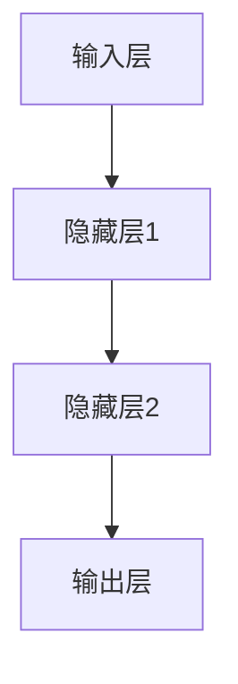
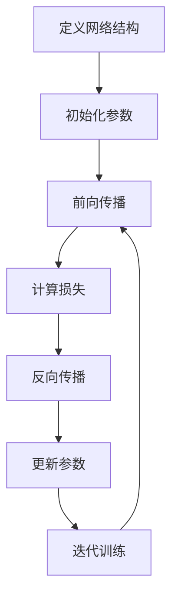

# 一切皆是映射：构建第一个深度学习模型

## 1.背景介绍

在过去几十年中，机器学习和人工智能领域取得了长足的进步。其中,深度学习作为一种强大的机器学习技术,在计算机视觉、自然语言处理、语音识别等诸多领域展现出卓越的性能,成为人工智能的核心驱动力量。深度学习的本质是通过对数据特征的自动学习,从而构建出精准的数学映射模型。本文将带你一步步构建第一个深度学习模型,揭开深度学习的神秘面纱。

## 2.核心概念与联系

### 2.1 什么是深度学习?

深度学习(Deep Learning)是机器学习的一种技术,它模仿人脑神经网络的结构和功能,通过对大量数据的学习,自动获取数据的特征表示,并基于这些特征表示对复杂问题进行预测和决策。深度学习的核心思想是通过构建由多层非线性变换单元组成的网络模型,对输入数据进行特征提取和变换,最终实现端到端的映射学习。

### 2.2 神经网络

神经网络(Neural Network)是深度学习模型的基础架构。它由多层神经元组成,每个神经元对输入数据进行加权求和和非线性变换操作,并将结果传递给下一层神经元。通过反复迭代这一过程,神经网络可以学习到输入数据的复杂特征表示,并将其映射到期望的输出。



### 2.3 映射函数

在深度学习中,我们将神经网络视为一个复杂的映射函数 $f$,它将输入数据 $x$ 映射到期望的输出 $y$,即 $y = f(x)$。通过训练过程,神经网络会不断调整内部参数,使得映射函数 $f$ 能够最小化预测误差,从而获得最优的映射关系。

## 3.核心算法原理具体操作步骤

构建深度学习模型的核心步骤包括:

1. **定义网络结构**:根据问题的复杂程度和数据特征,设计神经网络的层数、每层神经元数量、激活函数等。
2. **初始化参数**:对网络中的可训练参数(权重和偏置)进行随机初始化。
3. **前向传播**:将输入数据通过网络进行前向传播,计算每一层的输出。
4. **计算损失**:比较网络输出与期望输出的差异,计算损失函数值。
5. **反向传播**:根据损失函数值,计算每个参数的梯度,并通过优化算法(如梯度下降)更新参数。
6. **迭代训练**:重复执行步骤3-5,直到模型收敛或达到预期性能。



## 4.数学模型和公式详细讲解举例说明

### 4.1 神经元计算

神经元是深度学习模型的基本计算单元。给定一个神经元,其输入为 $x_1, x_2, \dots, x_n$,对应的权重为 $w_1, w_2, \dots, w_n$,偏置为 $b$,则该神经元的输出 $y$ 可以表示为:

$$y = \phi\left(\sum_{i=1}^{n}w_ix_i + b\right)$$

其中 $\phi$ 为激活函数,常用的激活函数包括Sigmoid函数、ReLU函数等。

### 4.2 损失函数

为了评估模型的预测性能,我们需要定义一个损失函数(Loss Function)。损失函数用于衡量模型输出与真实标签之间的差异,常用的损失函数有均方误差(Mean Squared Error, MSE)、交叉熵损失(Cross-Entropy Loss)等。

对于回归问题,均方误差损失函数可表示为:

$$\text{MSE} = \frac{1}{N}\sum_{i=1}^{N}(y_i - \hat{y}_i)^2$$

其中 $y_i$ 为真实标签, $\hat{y}_i$ 为模型预测输出, $N$ 为样本数量。

对于分类问题,交叉熵损失函数可表示为:

$$\text{CE} = -\frac{1}{N}\sum_{i=1}^{N}\sum_{j=1}^{M}y_{ij}\log(\hat{y}_{ij})$$

其中 $y_{ij}$ 为样本 $i$ 属于类别 $j$ 的真实标签(0或1), $\hat{y}_{ij}$ 为模型预测样本 $i$ 属于类别 $j$ 的概率, $M$ 为类别数量。

### 4.3 优化算法

为了最小化损失函数,我们需要通过优化算法来更新网络参数。最常用的优化算法是梯度下降(Gradient Descent),它根据损失函数对参数的梯度来更新参数:

$$w_{t+1} = w_t - \eta\frac{\partial L}{\partial w_t}$$

其中 $w_t$ 为当前参数值, $\eta$ 为学习率, $\frac{\partial L}{\partial w_t}$ 为损失函数关于参数的梯度。梯度可以通过反向传播算法高效计算。

## 5.项目实践:代码实例和详细解释说明

让我们通过一个简单的例子,使用Python和PyTorch构建第一个深度学习模型。我们将构建一个用于手写数字识别的神经网络模型。

```python
import torch
import torch.nn as nn
import torchvision
import torchvision.transforms as transforms

# 加载MNIST数据集
train_dataset = torchvision.datasets.MNIST(root='./data', train=True, transform=transforms.ToTensor(), download=True)
test_dataset = torchvision.datasets.MNIST(root='./data', train=False, transform=transforms.ToTensor())

# 定义神经网络模型
class Net(nn.Module):
    def __init__(self):
        super(Net, self).__init__()
        self.fc1 = nn.Linear(28 * 28, 512)
        self.fc2 = nn.Linear(512, 256)
        self.fc3 = nn.Linear(256, 10)

    def forward(self, x):
        x = x.view(-1, 28 * 28)
        x = torch.relu(self.fc1(x))
        x = torch.relu(self.fc2(x))
        x = self.fc3(x)
        return x

# 实例化模型
model = Net()

# 定义损失函数和优化器
criterion = nn.CrossEntropyLoss()
optimizer = torch.optim.SGD(model.parameters(), lr=0.01)

# 训练模型
num_epochs = 10
for epoch in range(num_epochs):
    running_loss = 0.0
    for i, data in enumerate(train_dataset, 0):
        inputs, labels = data
        optimizer.zero_grad()
        outputs = model(inputs)
        loss = criterion(outputs, labels)
        loss.backward()
        optimizer.step()
        running_loss += loss.item()
    print(f'Epoch {epoch+1}, Loss: {running_loss / len(train_dataset)}')

# 测试模型
correct = 0
total = 0
with torch.no_grad():
    for data in test_dataset:
        images, labels = data
        outputs = model(images)
        _, predicted = torch.max(outputs.data, 1)
        total += labels.size(0)
        correct += (predicted == labels).sum().item()

print(f'Accuracy: {100 * correct / total}%')
```

在这个示例中,我们首先加载MNIST手写数字数据集。然后,我们定义了一个简单的全连接神经网络模型,包含三个线性层。在训练过程中,我们使用交叉熵损失函数和随机梯度下降优化器,对模型进行了10个epoch的训练。最后,我们在测试集上评估了模型的准确率。

通过这个实例,你可以了解到构建深度学习模型的基本流程,包括定义模型结构、加载数据、计算损失、更新参数等步骤。

## 6.实际应用场景

深度学习在许多领域都有广泛的应用,包括:

1. **计算机视觉**:图像分类、目标检测、语义分割等。
2. **自然语言处理**:机器翻译、文本生成、情感分析等。
3. **语音识别**:语音转文本、语音合成等。
4. **推荐系统**:个性化推荐、内容推荐等。
5. **医疗健康**:医学图像分析、疾病诊断等。
6. **金融**:风险管理、欺诈检测等。
7. **游戏**:人工智能代理、游戏策略等。

随着数据量的不断增加和计算能力的提高,深度学习在更多领域将展现出巨大的潜力。

## 7.工具和资源推荐

如果你想进一步学习和实践深度学习,以下是一些推荐的工具和资源:

1. **PyTorch**:一个流行的深度学习框架,提供了强大的GPU加速和动态计算图功能。
2. **TensorFlow**:另一个广泛使用的深度学习框架,具有良好的可扩展性和部署能力。
3. **Keras**:基于TensorFlow的高级深度学习库,提供了简洁的API和快速原型开发能力。
4. **Fast.ai**:一个专注于实践应用的深度学习课程和库,适合初学者快速入门。
5. **深度学习书籍**:《深度学习》(Ian Goodfellow等著)、《模式识别与机器学习》(Christopher Bishop著)等经典著作。
6. **在线课程**:Coursera、edX、Udacity等平台提供了丰富的深度学习课程。
7. **GitHub**:包含了大量优秀的深度学习项目和资源。

通过持续学习和实践,你可以不断提升自己的深度学习技能,并将其应用于各种实际问题中。

## 8.总结:未来发展趋势与挑战

深度学习在过去几年取得了令人瞩目的成就,但仍然面临着一些挑战和发展方向:

1. **可解释性**:当前的深度学习模型往往被视为"黑箱",缺乏可解释性,这在一些关键领域(如医疗、金融等)可能会成为障碍。
2. **数据效率**:深度学习模型通常需要大量的标注数据进行训练,而获取高质量的标注数据往往成本高昂。提高数据效率是一个重要的研究方向。
3. **鲁棒性**:深度学习模型容易受到对抗性攻击的影响,提高模型的鲁棒性也是一个挑战。
4. **少样本学习**:如何在少量数据的情况下快速学习,是深度学习需要解决的一个关键问题。
5. **模型压缩**:大型深度学习模型往往需要巨大的计算资源和存储空间,模型压缩和高效部署是未来的发展趋势之一。
6. **自监督学习**:如何利用大量未标注数据进行自监督学习,是一个前景广阔的研究方向。

总的来说,深度学习仍然处于快速发展的阶段,未来必将在理论、算法和应用等多个方面取得突破性进展,为人工智能的发展注入新的动力。

## 9.附录:常见问题与解答

1. **什么是深度学习?**

深度学习是一种机器学习技术,它通过构建由多层非线性变换单元组成的网络模型,对输入数据进行特征提取和变换,实现端到端的映射学习。

2. **深度学习和传统机器学习有什么区别?**

传统机器学习算法通常需要手动设计特征,而深度学习可以自动从原始数据中学习特征表示。此外,深度学习模型通常具有更强的表达能力和泛化能力。

3. **什么是神经网络?**

神经网络是深度学习模型的基础架构,它由多层神经元组成,每个神经元对输入数据进行加权求和和非线性变换操作,并将结果传递给下一层神经元。

4. **如何选择合适的网络结构?**

选择合适的网络结构需要考虑多个因素,如问题的复杂程度、数据的特征、计算资源等。通常可以从简单的结构开始,逐步增加网络的深度和宽度,直到达到满意的性能。

5. **什么是过拟合和欠拟合?**

过拟合是指模型过于复杂,导致在训练