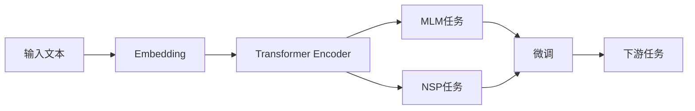

# 从零开始大模型开发与微调：预训练模型BERT

## 1. 背景介绍

近年来，随着深度学习技术的快速发展，大规模预训练语言模型(Pre-trained Language Models, PLMs)在自然语言处理(Natural Language Processing, NLP)领域取得了显著的成果。其中，BERT(Bidirectional Encoder Representations from Transformers)作为一种革命性的预训练模型，以其强大的语言理解和生成能力，在各类NLP任务上取得了State-of-the-Art(SOTA)的表现，引领了预训练语言模型的新浪潮。

本文将从零开始，深入探讨BERT模型的核心原理、训练方法和实践应用，带领读者一步步掌握大模型开发与微调的关键技术。我们将详细讲解BERT的网络结构、预训练任务、微调策略等核心概念，并通过代码实例和数学推导，帮助读者全面理解BERT的内在机制。此外，我们还将介绍BERT在实际应用场景中的最佳实践，以及相关的工具和资源推荐，为读者提供全方位的学习指南。

### 1.1 预训练语言模型的发展历程

#### 1.1.1 早期的词嵌入模型
- Word2Vec
- GloVe

#### 1.1.2 基于RNN的语言模型 
- ELMo

#### 1.1.3 Transformer时代的预训练模型
- GPT系列
- BERT及其变体

### 1.2 BERT的优势与影响力

#### 1.2.1 双向语言理解能力
- 融合左右侧上下文信息

#### 1.2.2 强大的特征提取能力
- 多层Transformer编码器

#### 1.2.3 广泛的下游任务适用性  
- 微调范式的普适性

### 1.3 BERT的应用领域与挑战

#### 1.3.1 自然语言理解任务
- 文本分类
- 命名实体识别
- 问答系统

#### 1.3.2 自然语言生成任务
- 机器翻译
- 文本摘要
- 对话生成

#### 1.3.3 面临的挑战与机遇
- 计算资源需求大
- 模型解释性不足
- 鲁棒性有待提高

## 2. 核心概念与联系

### 2.1 Transformer架构

#### 2.1.1 自注意力机制(Self-Attention)
- 捕捉长距离依赖关系
- 并行计算效率高

#### 2.1.2 多头注意力(Multi-Head Attention)
- 引入多样性
- 增强特征表示能力

#### 2.1.3 前馈神经网络(Feed-Forward Network)
- 非线性变换
- 提高模型容量

### 2.2 预训练任务

#### 2.2.1 Masked Language Model(MLM)
- 随机遮挡词语
- 预测被遮挡词语

#### 2.2.2 Next Sentence Prediction(NSP)  
- 判断句子连贯性
- 学习句间关系

### 2.3 微调策略

#### 2.3.1 特定任务的输出层设计
- 文本分类任务
- 序列标注任务
- 阅读理解任务

#### 2.3.2 微调的训练技巧
- 学习率调整
- 梯度累积
- 早停法

### 2.4 BERT与其他预训练模型的联系

#### 2.4.1 GPT系列模型
- 单向语言模型
- 生成式预训练范式

#### 2.4.2 RoBERTa
- 动态遮挡策略
- 移除NSP任务

#### 2.4.3 ALBERT
- 参数共享
- 句间连贯性损失



## 3. 核心算法原理具体操作步骤

### 3.1 BERT的网络结构

#### 3.1.1 输入表示
- Token Embedding
- Segment Embedding
- Position Embedding

#### 3.1.2 Transformer编码器
- 多层堆叠
- 残差连接与Layer Normalization

#### 3.1.3 输出层设计
- MLM任务的输出
- NSP任务的输出

### 3.2 预训练阶段

#### 3.2.1 数据准备
- 大规模无监督语料
- WordPiece分词

#### 3.2.2 MLM任务的训练
- 动态遮挡
- 负采样策略

#### 3.2.3 NSP任务的训练
- 正负样本构建
- 二分类损失函数

### 3.3 微调阶段

#### 3.3.1 任务特定的输入处理
- 文本分类任务的输入
- 序列标注任务的输入
- 阅读理解任务的输入

#### 3.3.2 微调的训练过程
- 冻结部分参数
- 调整学习率
- 设置早停条件

### 3.4 推理与预测

#### 3.4.1 模型部署
- 模型量化
- 模型剪枝
- 模型蒸馏

#### 3.4.2 推理加速技术
- 矩阵乘法优化
- 注意力机制优化
- 模型并行

## 4. 数学模型和公式详细讲解举例说明

### 4.1 自注意力机制

#### 4.1.1 查询、键、值(Query, Key, Value)
- 线性变换
$Q = XW^Q, K = XW^K, V = XW^V$

#### 4.1.2 注意力权重计算
- Scaled Dot-Product Attention
$Attention(Q,K,V) = softmax(\frac{QK^T}{\sqrt{d_k}})V$

#### 4.1.3 多头注意力
- 并行计算多个注意力头
$MultiHead(Q,K,V) = Concat(head_1,...,head_h)W^O$

### 4.2 前馈神经网络

#### 4.2.1 非线性变换
- 两层全连接网络
$FFN(x) = max(0, xW_1 + b_1)W_2 + b_2$

#### 4.2.2 残差连接与Layer Normalization
- 残差连接
$x = LayerNorm(x + Sublayer(x))$

### 4.3 预训练损失函数

#### 4.3.1 MLM损失
- 交叉熵损失
$L_{MLM} = -\sum_{i=1}^{n}log P(w_i|w_{<i},w_{>i})$

#### 4.3.2 NSP损失  
- 二元交叉熵损失
$L_{NSP} = -ylog\hat{y} - (1-y)log(1-\hat{y})$

### 4.4 微调损失函数

#### 4.4.1 文本分类任务
- 交叉熵损失
$L = -\sum_{i=1}^{n}y_ilog\hat{y}_i$

#### 4.4.2 序列标注任务
- 条件随机场(CRF)损失
$L = -\sum_{i=1}^{n}log P(y_i|x_i)$

#### 4.4.3 阅读理解任务
- 起始位置和结束位置的交叉熵损失
$L = -log P(y_{start}|x) - log P(y_{end}|x)$

## 5. 项目实践：代码实例和详细解释说明

### 5.1 预训练阶段

#### 5.1.1 数据准备
```python
# 读取语料数据
with open('corpus.txt', 'r', encoding='utf-8') as f:
    corpus = f.readlines()

# WordPiece分词
tokenizer = BertTokenizer.from_pretrained('bert-base-uncased')
tokenized_corpus = [tokenizer.tokenize(line) for line in corpus]
```

#### 5.1.2 MLM任务
```python
# 随机遮挡词语
def random_mask(tokens, mask_prob):
    masked_tokens = []
    for token in tokens:
        if random.random() < mask_prob:
            masked_tokens.append('[MASK]')
        else:
            masked_tokens.append(token)
    return masked_tokens

# MLM任务的数据生成
def create_mlm_examples(tokenized_corpus, max_seq_length, mask_prob):
    examples = []
    for tokens in tokenized_corpus:
        masked_tokens = random_mask(tokens, mask_prob)
        input_ids = tokenizer.convert_tokens_to_ids(masked_tokens)
        input_mask = [1] * len(input_ids)
        segment_ids = [0] * len(input_ids)
        while len(input_ids) < max_seq_length:
            input_ids.append(0)
            input_mask.append(0)
            segment_ids.append(0)
        examples.append((input_ids, input_mask, segment_ids))
    return examples
```

#### 5.1.3 NSP任务
```python
# NSP任务的数据生成
def create_nsp_examples(tokenized_corpus, max_seq_length):
    examples = []
    for i in range(len(tokenized_corpus) - 1):
        tokens_a = tokenized_corpus[i]
        tokens_b = tokenized_corpus[i+1]
        
        tokens_a = tokens_a[:max_seq_length//2]
        tokens_b = tokens_b[:max_seq_length//2]
        
        input_ids = tokenizer.convert_tokens_to_ids(['[CLS]'] + tokens_a + ['[SEP]'] + tokens_b + ['[SEP]'])
        segment_ids = [0] * (len(tokens_a) + 2) + [1] * (len(tokens_b) + 1)
        input_mask = [1] * len(input_ids)
        
        while len(input_ids) < max_seq_length:
            input_ids.append(0)
            input_mask.append(0)
            segment_ids.append(0)
        
        is_next = 1
        examples.append((input_ids, input_mask, segment_ids, is_next))
        
        # 负样本
        random_index = random.randint(0, len(tokenized_corpus)-1)
        tokens_b = tokenized_corpus[random_index]
        tokens_b = tokens_b[:max_seq_length//2]
        
        input_ids = tokenizer.convert_tokens_to_ids(['[CLS]'] + tokens_a + ['[SEP]'] + tokens_b + ['[SEP]'])
        segment_ids = [0] * (len(tokens_a) + 2) + [1] * (len(tokens_b) + 1)
        input_mask = [1] * len(input_ids)
        
        while len(input_ids) < max_seq_length:
            input_ids.append(0)
            input_mask.append(0)
            segment_ids.append(0)
        
        is_next = 0
        examples.append((input_ids, input_mask, segment_ids, is_next))
    
    return examples
```

### 5.2 微调阶段

#### 5.2.1 文本分类任务
```python
# 加载预训练模型
model = BertForSequenceClassification.from_pretrained('bert-base-uncased', num_labels=num_labels)

# 准备数据集
train_dataset = TextClassificationDataset(train_texts, train_labels, tokenizer, max_seq_length)
train_dataloader = DataLoader(train_dataset, batch_size=batch_size, shuffle=True)

# 定义优化器和损失函数
optimizer = AdamW(model.parameters(), lr=learning_rate)
criterion = CrossEntropyLoss()

# 训练模型
for epoch in range(num_epochs):
    model.train()
    for batch in train_dataloader:
        input_ids, attention_mask, labels = batch
        outputs = model(input_ids, attention_mask=attention_mask, labels=labels)
        loss = outputs.loss
        loss.backward()
        optimizer.step()
        optimizer.zero_grad()
```

#### 5.2.2 序列标注任务
```python
# 加载预训练模型
model = BertForTokenClassification.from_pretrained('bert-base-uncased', num_labels=num_labels)

# 准备数据集
train_dataset = TokenClassificationDataset(train_texts, train_labels, tokenizer, max_seq_length)
train_dataloader = DataLoader(train_dataset, batch_size=batch_size, shuffle=True)

# 定义优化器和损失函数
optimizer = AdamW(model.parameters(), lr=learning_rate)
criterion = CrossEntropyLoss()

# 训练模型
for epoch in range(num_epochs):
    model.train()
    for batch in train_dataloader:
        input_ids, attention_mask, labels = batch
        outputs = model(input_ids, attention_mask=attention_mask, labels=labels)
        loss = outputs.loss
        loss.backward()
        optimizer.step()
        optimizer.zero_grad()
```

#### 5.2.3 阅读理解任务
```python
# 加载预训练模型
model = BertForQuestionAnswering.from_pretrained('bert-base-uncased')

# 准备数据集
train_dataset = QuestionAnsweringDataset(train_contexts, train_questions, train_answers, tokenizer, max_seq_length)
train_dataloader = DataLoader(train_dataset, batch_size=batch_size, shuffle=True)

# 定义优化器和损失函数
optimizer = AdamW(model.parameters(), lr=learning_rate)
criterion = CrossEntropyLoss()

# 训练模型
for epoch in range(num_epochs):
    model.train()
    for batch in train_dataloader:
        input_ids, attention_mask, start_positions, end_positions = batch
        outputs = model(input_ids, attention_mask=attention_mask, start_positions=start_positions, end_