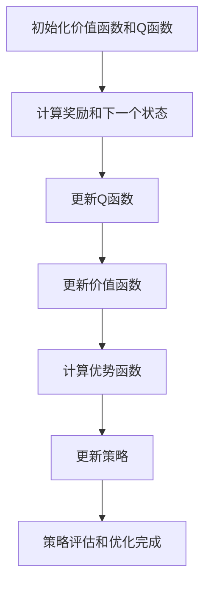

# 优势学习 (Advantage Learning) 原理与代码实例讲解

## 1.背景介绍

在机器学习和人工智能领域，强化学习（Reinforcement Learning, RL）是一种重要的学习范式。它通过与环境的交互来学习策略，以最大化累积奖励。优势学习（Advantage Learning, AL）是强化学习中的一种重要方法，它通过引入优势函数（Advantage Function）来改进策略评估和策略优化的过程。本文将深入探讨优势学习的原理、算法、数学模型，并通过代码实例展示其实际应用。

## 2.核心概念与联系

### 2.1 强化学习基础

强化学习的基本框架包括以下几个核心概念：

- **状态（State, S）**：环境的描述。
- **动作（Action, A）**：智能体在某一状态下可以采取的行为。
- **奖励（Reward, R）**：智能体采取某一动作后环境反馈的信号。
- **策略（Policy, π）**：智能体在各个状态下选择动作的规则。
- **价值函数（Value Function, V）**：在某一状态下，智能体未来累积奖励的期望值。
- **Q函数（Q-Function, Q）**：在某一状态采取某一动作后，智能体未来累积奖励的期望值。

### 2.2 优势函数

优势函数（Advantage Function, A）是Q函数和价值函数的差值，用于衡量某一动作相对于其他动作的优劣程度。其定义如下：

$$
A(s, a) = Q(s, a) - V(s)
$$

其中，$s$ 表示状态，$a$ 表示动作，$Q(s, a)$ 表示在状态 $s$ 采取动作 $a$ 后的Q值，$V(s)$ 表示状态 $s$ 的价值。

### 2.3 优势学习的基本思想

优势学习的基本思想是通过优势函数来改进策略评估和策略优化。相比于直接使用Q函数，优势函数可以更好地捕捉动作之间的相对优劣，从而提高策略的学习效率。

## 3.核心算法原理具体操作步骤

### 3.1 策略评估

在策略评估阶段，我们需要估计当前策略下的价值函数和Q函数。具体步骤如下：

1. 初始化价值函数 $V(s)$ 和Q函数 $Q(s, a)$。
2. 对于每一个状态 $s$ 和动作 $a$，计算奖励 $R(s, a)$ 和下一个状态 $s'$。
3. 更新Q函数：
   $$
   Q(s, a) \leftarrow R(s, a) + \gamma \sum_{s'} P(s'|s, a) V(s')
   $$
4. 更新价值函数：
   $$
   V(s) \leftarrow \max_a Q(s, a)
   $$

### 3.2 策略优化

在策略优化阶段，我们通过优势函数来改进策略。具体步骤如下：

1. 计算优势函数：
   $$
   A(s, a) = Q(s, a) - V(s)
   $$
2. 更新策略：
   $$
   \pi(s) \leftarrow \arg\max_a A(s, a)
   $$

### 3.3 算法流程图



## 4.数学模型和公式详细讲解举例说明

### 4.1 马尔可夫决策过程

强化学习通常建模为马尔可夫决策过程（Markov Decision Process, MDP），其定义为一个五元组 $(S, A, P, R, \gamma)$，其中：

- $S$ 是状态空间。
- $A$ 是动作空间。
- $P(s'|s, a)$ 是状态转移概率。
- $R(s, a)$ 是奖励函数。
- $\gamma$ 是折扣因子。

### 4.2 贝尔曼方程

价值函数和Q函数满足贝尔曼方程：

$$
V(s) = \max_a Q(s, a)
$$

$$
Q(s, a) = R(s, a) + \gamma \sum_{s'} P(s'|s, a) V(s')
$$

### 4.3 优势函数

优势函数的定义为：

$$
A(s, a) = Q(s, a) - V(s)
$$

通过优势函数，我们可以更好地评估动作的相对优劣，从而改进策略。

### 4.4 举例说明

假设我们有一个简单的MDP，其中状态空间 $S = \{s_1, s_2\}$，动作空间 $A = \{a_1, a_2\}$，奖励函数 $R(s, a)$ 和状态转移概率 $P(s'|s, a)$ 如下表所示：

| 状态 | 动作 | 奖励 | 下一个状态 |
|------|------|------|------------|
| $s_1$ | $a_1$ | 1 | $s_2$ |
| $s_1$ | $a_2$ | 0 | $s_1$ |
| $s_2$ | $a_1$ | 2 | $s_1$ |
| $s_2$ | $a_2$ | 1 | $s_2$ |

假设折扣因子 $\gamma = 0.9$，我们可以通过迭代计算Q函数和价值函数，最终得到优势函数和最优策略。

## 5.项目实践：代码实例和详细解释说明

### 5.1 环境设置

首先，我们需要安装必要的Python库：

```bash
pip install numpy gym
```

### 5.2 代码实例

以下是一个简单的优势学习代码实例：

```python
import numpy as np
import gym

# 创建环境
env = gym.make('FrozenLake-v0')

# 初始化参数
num_states = env.observation_space.n
num_actions = env.action_space.n
Q = np.zeros((num_states, num_actions))
V = np.zeros(num_states)
gamma = 0.9
alpha = 0.1
num_episodes = 1000

# 策略评估和优化
for episode in range(num_episodes):
    state = env.reset()
    done = False
    while not done:
        action = np.argmax(Q[state, :] + np.random.randn(1, num_actions) * (1. / (episode + 1)))
        next_state, reward, done, _ = env.step(action)
        Q[state, action] = Q[state, action] + alpha * (reward + gamma * np.max(Q[next_state, :]) - Q[state, action])
        V[state] = np.max(Q[state, :])
        state = next_state

# 计算优势函数
A = Q - V[:, None]

# 输出结果
print("Q函数：")
print(Q)
print("价值函数：")
print(V)
print("优势函数：")
print(A)
```

### 5.3 详细解释

1. **环境创建**：使用Gym库创建FrozenLake环境。
2. **参数初始化**：初始化Q函数、价值函数、折扣因子、学习率和训练轮数。
3. **策略评估和优化**：通过Q学习算法迭代更新Q函数和价值函数。
4. **计算优势函数**：根据Q函数和价值函数计算优势函数。
5. **输出结果**：打印Q函数、价值函数和优势函数。

## 6.实际应用场景

### 6.1 游戏AI

优势学习在游戏AI中有广泛应用。例如，在棋类游戏中，优势函数可以帮助AI更好地评估不同棋步的优劣，从而制定更优策略。

### 6.2 机器人控制

在机器人控制中，优势学习可以用于优化机器人的动作策略，使其在复杂环境中完成任务。

### 6.3 金融交易

在金融交易中，优势学习可以用于优化交易策略，最大化投资回报。

## 7.工具和资源推荐

### 7.1 开源库

- **Gym**：一个用于开发和比较强化学习算法的工具包。
- **TensorFlow**：一个开源的机器学习框架，支持强化学习。
- **PyTorch**：另一个流行的开源机器学习框架，广泛用于强化学习研究。

### 7.2 在线资源

- **OpenAI**：提供了大量关于强化学习的研究论文和教程。
- **DeepMind**：谷歌旗下的AI研究机构，发布了许多关于强化学习的开创性研究。

## 8.总结：未来发展趋势与挑战

优势学习作为强化学习中的一种重要方法，具有广泛的应用前景。未来的发展趋势包括：

- **更高效的算法**：研究更高效的优势学习算法，提高学习速度和性能。
- **多智能体系统**：在多智能体系统中应用优势学习，解决协作和竞争问题。
- **实际应用**：将优势学习应用于更多实际场景，如自动驾驶、智能制造等。

然而，优势学习也面临一些挑战：

- **高维状态空间**：在高维状态空间中，优势函数的计算和存储是一个难题。
- **样本效率**：如何提高样本效率，减少训练数据的需求，是一个重要问题。

## 9.附录：常见问题与解答

### 9.1 什么是优势函数？

优势函数是Q函数和价值函数的差值，用于衡量某一动作相对于其他动作的优劣程度。

### 9.2 优势学习与Q学习的区别是什么？

优势学习通过引入优势函数来改进策略评估和策略优化，而Q学习直接使用Q函数进行策略评估和优化。

### 9.3 如何选择折扣因子和学习率？

折扣因子和学习率的选择需要根据具体问题进行调试。一般来说，折扣因子 $\gamma$ 取值在0.9左右，学习率 $\alpha$ 取值在0.1左右。

### 9.4 优势学习可以应用于哪些领域？

优势学习可以应用于游戏AI、机器人控制、金融交易等领域。

### 9.5 如何提高优势学习的效率？

可以通过并行计算、经验回放、优先级采样等方法提高优势学习的效率。

---

作者：禅与计算机程序设计艺术 / Zen and the Art of Computer Programming