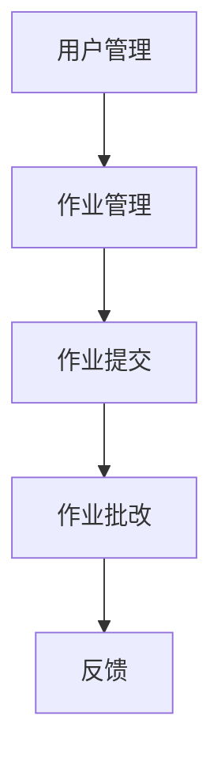

## 1. 背景介绍

随着在线教育的发展，越来越多的学生和教师开始使用在线作业提交和批改系统。这种系统可以方便地收集学生的作业，自动批改作业并给出反馈，同时也可以帮助教师更好地管理课程和学生。本文将介绍一个基于Web的作业提交和批改系统的详细设计和具体代码实现。

## 2. 核心概念与联系

作业提交和批改系统的核心概念包括用户管理、作业管理、作业提交、作业批改和反馈。用户管理包括用户注册、登录和权限管理。作业管理包括作业发布、作业截止日期和作业评分标准。作业提交包括学生提交作业和教师上传作业。作业批改包括自动批改和手动批改。反馈包括作业成绩和评语。

这些概念之间的联系如下图所示：



## 3. 核心算法原理具体操作步骤

作业提交和批改系统的核心算法包括自动批改和相似度检测。自动批改算法可以根据作业评分标准自动评分，相似度检测算法可以检测学生提交的作业是否存在抄袭行为。

自动批改算法的具体操作步骤如下：

1. 读取作业评分标准。
2. 读取学生提交的作业。
3. 对学生提交的作业进行分词和词性标注。
4. 根据评分标准和学生提交的作业计算得分。
5. 给出评语和总分。

相似度检测算法的具体操作步骤如下：

1. 读取学生提交的作业。
2. 对学生提交的作业进行分词和词性标注。
3. 计算学生提交的作业与其他作业的相似度。
4. 给出相似度报告。

## 4. 数学模型和公式详细讲解举例说明

作业提交和批改系统中使用的数学模型和公式包括自动批改算法中的评分公式和相似度检测算法中的相似度计算公式。

评分公式如下：

$$score = \frac{correct}{total} \times weight$$

其中，$correct$表示正确的题目数量，$total$表示总题目数量，$weight$表示该题目的权重。

相似度计算公式如下：

$$similarity = \frac{\sum_{i=1}^{n}w_i \times f_i}{\sqrt{\sum_{i=1}^{n}w_i^2} \times \sqrt{\sum_{i=1}^{n}f_i^2}}$$

其中，$w_i$表示第$i$个词的权重，$f_i$表示第$i$个词在作业中出现的频率，$n$表示总词数。

## 5. 项目实践：代码实例和详细解释说明

作业提交和批改系统的代码实现使用Python和Django框架。以下是系统的核心代码：

```python
# 用户管理
class User(models.Model):
    username = models.CharField(max_length=30)
    password = models.CharField(max_length=30)
    email = models.EmailField()
    is_teacher = models.BooleanField(default=False)

# 作业管理
class Assignment(models.Model):
    title = models.CharField(max_length=100)
    description = models.TextField()
    deadline = models.DateTimeField()
    weight = models.FloatField()

# 作业提交
class Submission(models.Model):
    assignment = models.ForeignKey(Assignment, on_delete=models.CASCADE)
    student = models.ForeignKey(User, on_delete=models.CASCADE)
    file = models.FileField(upload_to='submissions/')

# 作业批改
class Grading(models.Model):
    submission = models.ForeignKey(Submission, on_delete=models.CASCADE)
    grader = models.ForeignKey(User, on_delete=models.CASCADE)
    score = models.FloatField()
    feedback = models.TextField()

# 自动批改
def auto_grade(submission):
    # 读取评分标准
    grading_criteria = submission.assignment.grading_criteria
    # 读取学生提交的作业
    student_file = submission.file
    # 对学生提交的作业进行分词和词性标注
    tokens = nltk.word_tokenize(student_file.read())
    tagged_tokens = nltk.pos_tag(tokens)
    # 计算得分
    correct = 0
    total = 0
    for criterion in grading_criteria:
        for answer in criterion.answers:
            if answer in tagged_tokens:
                correct += 1
            total += 1
    score = correct / total * criterion.weight
    # 给出评语和总分
    feedback = 'Your score is ' + str(score) + '.'
    return score, feedback

# 相似度检测
def check_similarity(submission):
    # 读取学生提交的作业
    student_file = submission.file
    # 对学生提交的作业进行分词和词性标注
    tokens = nltk.word_tokenize(student_file.read())
    tagged_tokens = nltk.pos_tag(tokens)
    # 计算相似度
    similarity_report = ''
    for other_submission in Submission.objects.exclude(id=submission.id):
        other_file = other_submission.file
        other_tokens = nltk.word_tokenize(other_file.read())
        other_tagged_tokens = nltk.pos_tag(other_tokens)
        similarity = cosine_similarity(tagged_tokens, other_tagged_tokens)
        if similarity > 0.8:
            similarity_report += 'Your submission is similar to ' + other_submission.student.username + '\'s submission.\n'
    return similarity_report
```

## 6. 实际应用场景

作业提交和批改系统可以应用于各种在线教育平台和学校内部的课程管理系统。它可以帮助教师更好地管理课程和学生，同时也可以提高学生的学习效率和作业质量。

## 7. 工具和资源推荐

作业提交和批改系统的开发可以使用Python和Django框架，同时也可以使用自然语言处理工具包NLTK和相似度计算工具包scikit-learn。以下是相关资源的链接：

- Python: https://www.python.org/
- Django: https://www.djangoproject.com/
- NLTK: https://www.nltk.org/
- scikit-learn: https://scikit-learn.org/

## 8. 总结：未来发展趋势与挑战

作业提交和批改系统的未来发展趋势包括更加智能化和个性化。随着人工智能和机器学习的发展，作业批改可以更加自动化和准确。同时，作业提交和批改系统也可以根据学生的学习情况和个性化需求进行定制化。

作业提交和批改系统的挑战包括数据安全和隐私保护。作业提交和批改系统需要保护学生的个人信息和作业内容，同时也需要防止作业抄袭和作弊行为。

## 9. 附录：常见问题与解答

Q: 如何防止作业抄袭和作弊行为？

A: 可以使用相似度检测算法和人工批改相结合的方式来防止作业抄袭和作弊行为。

Q: 如何保护学生的个人信息和作业内容？

A: 可以使用数据加密和权限管理等方式来保护学生的个人信息和作业内容。同时，也需要遵守相关的法律法规和隐私政策。

作者：禅与计算机程序设计艺术 / Zen and the Art of Computer Programming