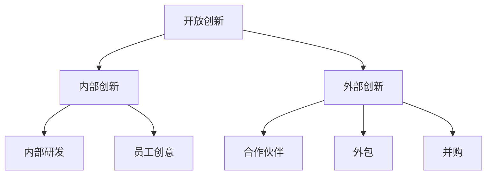
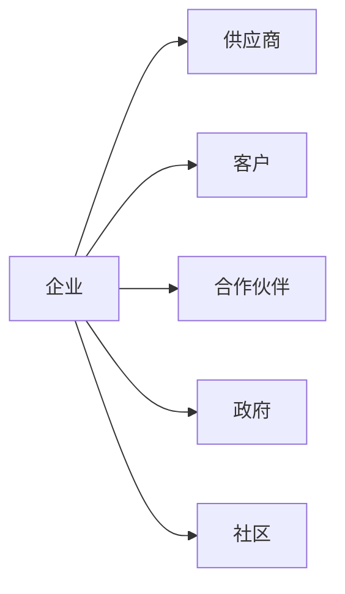
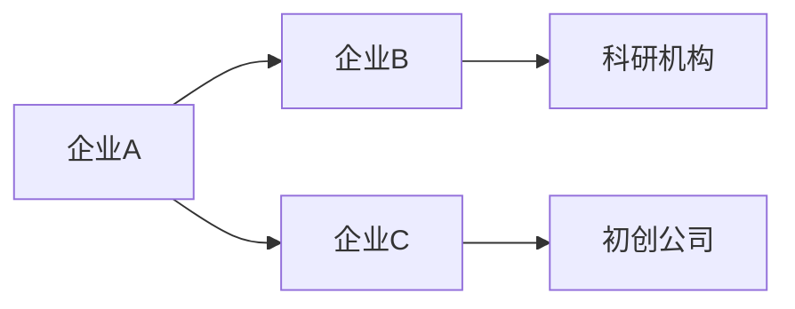
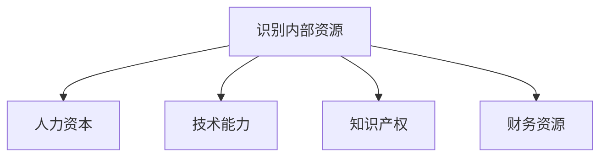
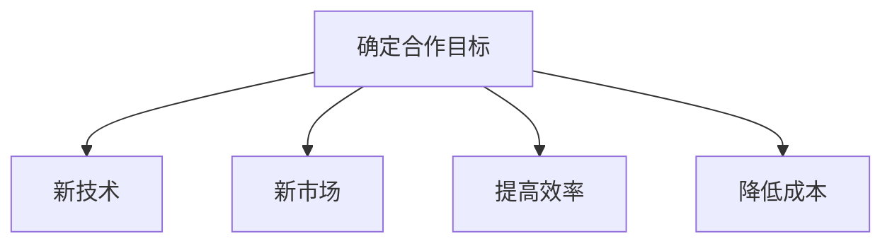
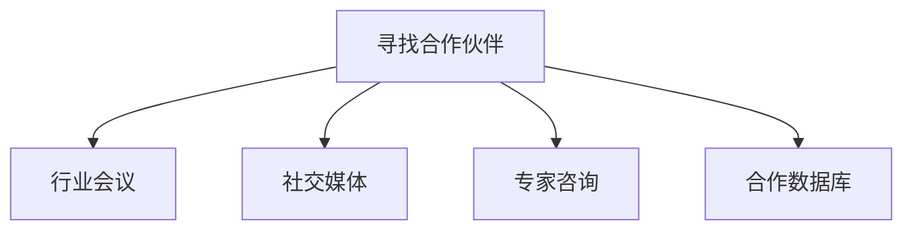
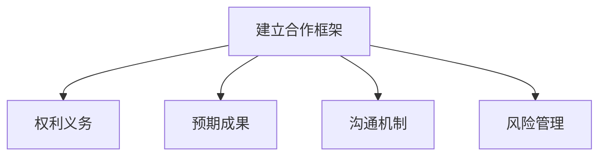
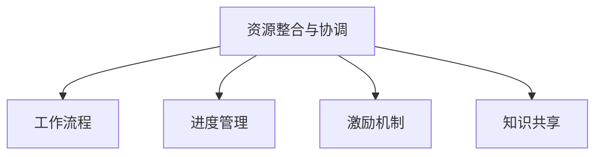

# 协调内部和外部资源，推动公司在科技领域的对外合作与交流

## 1.背景介绍

### 1.1 科技创新的重要性

在当今快节奏的商业环境中,科技创新已经成为推动企业发展的核心动力。通过将创新思维融入产品、服务和运营流程,公司可以保持竞争优势,满足不断变化的客户需求。然而,创新并非一蹴而就,它需要持续的投入和努力。

### 1.2 内部资源的局限性

尽管拥有内部研发团队是推进创新的关键,但单靠内部资源往往难以跟上科技发展的步伐。企业内部资源通常受到预算、人才和专业知识的限制,这可能会阻碍创新进程。

### 1.3 外部合作的必要性

为了克服内部资源的局限,与外部机构建立合作关系变得至关重要。通过与科研机构、初创公司、行业专家等合作,企业可以获得新的见解、技术和专业知识,从而推动创新。

## 2.核心概念与联系

### 2.1 开放创新

开放创新(Open Innovation)是一种将内部和外部创新过程相结合的理念。它鼓励企业利用内外部资源,积极参与知识和技术的交流,实现创新价值的最大化。



### 2.2 生态系统思维

生态系统思维(Ecosystem Thinking)强调企业应该将自身视为一个更大生态系统的一部分。通过与其他参与者建立互利共赢的关系,企业可以获得新的机遇和资源,推动创新发展。



### 2.3 协作网络

协作网络(Collaborative Networks)是指企业与外部组织建立的合作关系网络。通过这种网络,参与者可以共享资源、知识和技能,实现互利共赢。



## 3.核心算法原理具体操作步骤

### 3.1 识别内部资源

第一步是全面评估公司内部的资源,包括人力资本、技术能力、知识产权等。这有助于确定内部优势和不足,为后续的外部合作奠定基础。



### 3.2 确定合作目标

根据公司的战略目标和内部资源情况,明确需要通过外部合作来实现的具体目标。这可能包括获取新技术、进入新市场、提高效率等。



### 3.3 寻找合作伙伴

利用各种渠道寻找潜在的合作伙伴,包括参加行业会议、利用社交媒体、咨询专家等。评估潜在伙伴的实力、资源和文化契合度,选择最佳合作对象。



### 3.4 建立合作框架

与合作伙伴共同制定合作框架,明确各方的权利、义务和预期成果。建立有效的沟通机制和风险管理措施,确保合作顺利进行。



### 3.5 资源整合与协调

将内外部资源有效整合,协调各方的工作流程和进度。建立适当的激励机制,促进知识共享和创新文化的发展。



### 3.6 持续评估与优化

定期评估合作进展和成果,识别问题并采取改进措施。保持开放态度,积极吸收外部反馈,不断优化合作模式。


## 4.数学模型和公式详细讲解举例说明

在评估和优化合作过程中,我们可以借助一些数学模型和公式,帮助我们更好地量化和分析合作效果。

### 4.1 合作价值评估模型

合作价值评估模型(Collaborative Value Assessment Model)旨在量化合作带来的价值。它考虑了多个因素,包括成本节约、收入增长、风险降低等。

$$
\text{合作价值} = \sum_{i=1}^{n} w_i \times x_i
$$

其中:
- $n$ 是考虑因素的总数
- $w_i$ 是第 $i$ 个因素的权重
- $x_i$ 是第 $i$ 个因素的得分

例如,假设我们考虑三个因素:成本节约($x_1$)、收入增长($x_2$)和风险降低($x_3$),权重分别为 $0.4$、$0.3$ 和 $0.3$。如果得分分别为 $80$、$70$ 和 $90$,则合作价值为:

$$
\text{合作价值} = 0.4 \times 80 + 0.3 \times 70 + 0.3 \times 90 = 80
$$

### 4.2 资源配置优化模型

资源配置优化模型(Resource Allocation Optimization Model)旨在最佳分配有限的资源,以实现最大化的合作效益。

$$
\max \sum_{i=1}^{n} r_i \times x_i \\
\text{s.t.} \sum_{i=1}^{n} c_i \times x_i \leq B \\
x_i \in \{0, 1\}
$$

其中:
- $n$ 是可选合作项目的总数
- $r_i$ 是第 $i$ 个项目的预期收益
- $c_i$ 是第 $i$ 个项目的成本
- $B$ 是可用的总预算
- $x_i$ 是一个二元变量,表示是否选择第 $i$ 个项目

例如,假设有三个合作项目,预期收益分别为 $100$、$80$ 和 $120$,成本分别为 $50$、$40$ 和 $70$,总预算为 $100$。我们可以构建如下模型:

$$
\max 100x_1 + 80x_2 + 120x_3 \\
\text{s.t.} 50x_1 + 40x_2 + 70x_3 \leq 100 \\
x_1, x_2, x_3 \in \{0, 1\}
$$

求解后,我们可以得到最优解 $x_1 = 1$, $x_2 = 1$, $x_3 = 0$,即选择前两个项目可以获得最大收益 $180$。

## 5.项目实践:代码实例和详细解释说明  

为了更好地理解如何实现上述算法和模型,我们将提供一些代码示例。这些示例使用Python编写,并利用了一些流行的数据科学和优化库,如NumPy、Pandas和Pulp。

### 5.1 合作价值评估

```python
import numpy as np

# 定义因素权重
weights = np.array([0.4, 0.3, 0.3])

# 定义因素得分
scores = np.array([80, 70, 90])

# 计算合作价值
collaboration_value = np.dot(weights, scores)

print(f"合作价值: {collaboration_value}")
```

上述代码使用NumPy库计算合作价值。首先,我们定义了因素权重和得分,然后使用NumPy的`dot`函数计算加权和,即合作价值。

输出:
```
合作价值: 80.0
```

### 5.2 资源配置优化

```python
import pulp

# 创建问题实例
prob = pulp.LpProblem("资源配置优化", pulp.LpMaximize)

# 定义决策变量
x1 = pulp.LpVariable("x1", cat="Binary")
x2 = pulp.LpVariable("x2", cat="Binary")
x3 = pulp.LpVariable("x3", cat="Binary")

# 定义目标函数
prob += 100 * x1 + 80 * x2 + 120 * x3

# 定义约束条件
prob += 50 * x1 + 40 * x2 + 70 * x3 <= 100

# 求解问题
prob.solve()

# 输出结果
print(f"最优解: x1 = {int(x1.value())}, x2 = {int(x2.value())}, x3 = {int(x3.value())}")
print(f"最大收益: {prob.objective.value()}")
```

上述代码使用Pulp库求解资源配置优化问题。首先,我们创建一个最大化问题实例,并定义三个二元决策变量。然后,我们构建目标函数和约束条件,并使用`solve`方法求解问题。最后,我们输出最优解和最大收益。

输出:
```
最优解: x1 = 1, x2 = 1, x3 = 0
最大收益: 180.0
```

通过这些代码示例,您可以更好地理解如何实现合作价值评估和资源配置优化模型。当然,在实际应用中,您可能需要根据具体情况进行调整和扩展。

## 6.实际应用场景

协调内部和外部资源,推动公司在科技领域的对外合作与交流,在现实中有着广泛的应用场景。以下是一些典型的例子:

### 6.1 技术许可和转让

许多公司通过与科研机构或其他公司合作,获取新的技术许可或转让。例如,制药公司可能与大学实验室合作,获取新药物的专利许可;汽车公司可能从初创公司购买自动驾驶技术。

### 6.2 联合研发项目

企业可以与外部伙伴建立联合研发项目,共同开发新产品或服务。这种合作模式可以分担风险,整合各方的资源和专长。例如,多家科技公司可能联手开发新一代人工智能系统。

### 6.3 战略联盟

企业还可以与其他公司建立战略联盟,共同进入新市场或开拓新业务领域。这种合作形式可以发挥各方的优势,实现互补。例如,一家云计算公司可能与一家电信公司合作,提供综合的云服务解决方案。

### 6.4 开源社区参与

越来越多的公司参与开源社区,与其他开发者合作开发和维护开源软件。这种合作模式可以促进知识共享,加速创新步伐。例如,谷歌、Facebook等公司都在积极参与和贡献开源项目。

### 6.5 产业生态系统建设

一些领先公司正在努力构建产业生态系统,与上下游企业、初创公司和其他利益相关方建立合作关系。这种生态系统可以促进资源共享和价值创造。例如,苹果公司与众多应用开发商合作,共同丰富iOS生态系统。

## 7.工具和资源推荐

为了有效协调内外部资源,推动对外合作与交流,企业可以利用一些有用的工具和资源。

### 7.1 协作平台

协作平台(如Slack、Microsoft Teams等)可以促进内外部团队之间的实时沟通和协作。这些平台通常提供文件共享、视频会议、任务管理等功能,有助于提高工作效率。

### 7.2 项目管理工具

项目管理工具(如Trello、Asana等)可以帮助企业更好地规划和跟踪合作项目的进度。这些工具通常提供任务分配、进度可视化、文档管理等功能,有助于确保项目按时完成。