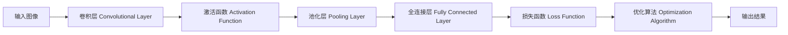

# 卷积神经网络(CNN)：图像识别的强大工具

## 1. 背景介绍

### 1.1 人工智能与深度学习的发展

人工智能(Artificial Intelligence, AI)是计算机科学的一个重要分支,其目标是让机器能够执行通常需要人类智能才能完成的任务。近年来,随着计算机硬件性能的提升和大数据时代的到来,人工智能技术取得了长足的进步。而深度学习(Deep Learning)作为人工智能的一个子领域,更是受到了广泛的关注和研究。

### 1.2 计算机视觉与图像识别

计算机视觉(Computer Vision)是人工智能的一个重要应用方向,其目的是让计算机能够"看懂"图像和视频中的内容,从而对其进行分析和处理。图像识别(Image Recognition)是计算机视觉的核心任务之一,旨在让计算机能够自动识别图像中包含的物体、场景、人脸等信息。

### 1.3 卷积神经网络的崛起

在众多的图像识别算法中,卷积神经网络(Convolutional Neural Network, CNN)脱颖而出,成为了该领域的主流技术。CNN通过模拟人类视觉系统的层次化结构,能够自动学习图像中的局部特征,并逐层组合这些特征,最终实现对整个图像的理解和分类。

## 2. 核心概念与联系

### 2.1 人工神经网络

卷积神经网络是一种特殊类型的人工神经网络(Artificial Neural Network, ANN)。ANN是一种模仿生物神经网络(如人脑)结构和功能的计算模型,由大量的人工神经元相互连接而成。每个神经元可以接收来自其他神经元的输入信号,并根据这些信号计算输出值。

### 2.2 卷积运算

卷积(Convolution)是CNN的核心操作之一。卷积运算通过使用卷积核(也称为过滤器)在输入图像上滑动,对图像的局部区域进行特征提取。卷积核通常是一个小的二维矩阵(如3x3或5x5),其中包含了一组可学习的参数。卷积的过程可以被看作是卷积核在图像上进行"扫描",以发现图像中的局部模式。

### 2.3 池化操作

池化(Pooling)是CNN中常用的另一种操作,其目的是降低特征图的空间维度,从而减少网络的参数量和计算复杂度。常见的池化操作包括最大池化(Max Pooling)和平均池化(Average Pooling)。最大池化会选取局部区域内的最大值作为该区域的代表,而平均池化则计算局部区域内所有元素的平均值。

### 2.4 激活函数

在CNN中,每个卷积层或全连接层之后通常会应用一个非线性激活函数(Activation Function),以引入非线性特性。常用的激活函数包括ReLU(Rectified Linear Unit)、Sigmoid和Tanh等。ReLU是目前最流行的激活函数之一,其公式为f(x)=max(0,x),即将所有负值都设为0。

### 2.5 损失函数与优化算法

为了训练CNN模型,需要定义一个损失函数(Loss Function)来衡量模型预测结果与真实标签之间的差异。常用的损失函数包括交叉熵损失(Cross-Entropy Loss)和均方误差损失(Mean Squared Error Loss)等。在训练过程中,优化算法(如随机梯度下降,SGD)会不断调整模型的参数,以最小化损失函数的值。

### 核心概念之间的联系

下面是一个简单的Mermaid流程图,展示了CNN中这些核心概念之间的联系:



## 3. 核心算法原理具体操作步骤

### 3.1 卷积层的前向传播

1. 输入图像与卷积核进行卷积运算,生成特征图。
2. 对特征图应用激活函数,引入非线性特性。
3. 对激活后的特征图进行池化操作,降低空间维度。
4. 将池化后的特征图作为下一层的输入。

### 3.2 全连接层的前向传播

1. 将卷积和池化后的特征图展平为一维向量。
2. 将展平后的向量输入到全连接层,进行线性变换。
3. 对全连接层的输出应用激活函数。

### 3.3 损失函数计算

1. 将全连接层的输出与真实标签进行比较。
2. 根据选定的损失函数(如交叉熵损失)计算损失值。

### 3.4 反向传播与参数更新

1. 计算损失函数关于输出的梯度。
2. 利用反向传播算法,将梯度逐层传递到前面的层。
3. 根据梯度和优化算法(如SGD)更新各层的参数。

## 4. 数学模型和公式详细讲解举例说明

### 4.1 卷积运算

假设我们有一个2D输入图像 $I$ 和一个卷积核 $K$,卷积运算可以表示为:

$$(I * K)(i,j) = \sum_m \sum_n I(i+m,j+n) K(m,n)$$

其中, $*$ 表示卷积操作, $i,j$ 表示输出特征图中的位置索引, $m,n$ 表示卷积核中的位置索引。

例如,假设我们有以下3x3的输入图像和2x2的卷积核:

$$I = \begin{bmatrix}
1 & 2 & 3 \\
4 & 5 & 6 \\
7 & 8 & 9
\end{bmatrix}, \quad
K = \begin{bmatrix}
1 & 0 \\
0 & 1
\end{bmatrix}$$

那么,卷积运算的结果为:

$$(I * K)(0,0) = 1 \times 1 + 2 \times 0 + 4 \times 0 + 5 \times 1 = 6$$
$$(I * K)(0,1) = 2 \times 1 + 3 \times 0 + 5 \times 0 + 6 \times 1 = 8$$
$$(I * K)(1,0) = 4 \times 1 + 5 \times 0 + 7 \times 0 + 8 \times 1 = 12$$
$$(I * K)(1,1) = 5 \times 1 + 6 \times 0 + 8 \times 0 + 9 \times 1 = 14$$

因此,卷积后的输出特征图为:

$$\begin{bmatrix}
6 & 8 \\
12 & 14
\end{bmatrix}$$

### 4.2 池化操作

假设我们有一个4x4的输入特征图 $F$,对其应用2x2的最大池化操作:

$$F = \begin{bmatrix}
1 & 2 & 3 & 4 \\
5 & 6 & 7 & 8 \\
9 & 10 & 11 & 12 \\
13 & 14 & 15 & 16
\end{bmatrix}$$

最大池化操作会选取每个2x2区域内的最大值,因此输出特征图为:

$$\begin{bmatrix}
6 & 8 \\
14 & 16
\end{bmatrix}$$

### 4.3 交叉熵损失函数

假设我们有 $N$ 个样本,每个样本属于 $K$ 个类别之一。对于第 $i$ 个样本,模型的预测输出为 $\hat{y}_i = (\hat{y}_{i1}, \hat{y}_{i2}, \ldots, \hat{y}_{iK})$,真实标签为 $y_i = (y_{i1}, y_{i2}, \ldots, y_{iK})$,其中 $y_{ij} = 1$ 表示第 $i$ 个样本属于第 $j$ 个类别,否则为0。

交叉熵损失函数定义为:

$$L = -\frac{1}{N} \sum_{i=1}^N \sum_{j=1}^K y_{ij} \log(\hat{y}_{ij})$$

例如,假设我们有两个样本,模型的预测输出和真实标签分别为:

$$\hat{y}_1 = (0.2, 0.7, 0.1), \quad y_1 = (0, 1, 0)$$
$$\hat{y}_2 = (0.8, 0.1, 0.1), \quad y_2 = (1, 0, 0)$$

那么,交叉熵损失为:

$$L = -\frac{1}{2} [(0 \times \log(0.2) + 1 \times \log(0.7) + 0 \times \log(0.1)) + (1 \times \log(0.8) + 0 \times \log(0.1) + 0 \times \log(0.1))]$$
$$= 0.357$$

## 5. 项目实践：代码实例和详细解释说明

下面是一个使用Python和Keras库实现简单CNN的代码示例:

```python
from keras.models import Sequential
from keras.layers import Conv2D, MaxPooling2D, Flatten, Dense

# 创建CNN模型
model = Sequential()

# 添加卷积层和池化层
model.add(Conv2D(32, (3, 3), activation='relu', input_shape=(28, 28, 1)))
model.add(MaxPooling2D((2, 2)))
model.add(Conv2D(64, (3, 3), activation='relu'))
model.add(MaxPooling2D((2, 2)))
model.add(Conv2D(64, (3, 3), activation='relu'))

# 添加全连接层
model.add(Flatten())
model.add(Dense(64, activation='relu'))
model.add(Dense(10, activation='softmax'))

# 编译模型
model.compile(optimizer='adam',
              loss='categorical_crossentropy',
              metrics=['accuracy'])

# 训练模型
model.fit(train_images, train_labels, epochs=5, batch_size=64)

# 评估模型
test_loss, test_acc = model.evaluate(test_images, test_labels)
print('Test accuracy:', test_acc)
```

代码解释:

1. 导入所需的Keras模块。
2. 使用Sequential()创建一个顺序模型。
3. 添加第一个卷积层,使用32个3x3的卷积核,激活函数为ReLU。输入形状为(28,28,1),表示28x28的灰度图像。
4. 添加一个2x2的最大池化层。
5. 添加第二个卷积层,使用64个3x3的卷积核,激活函数为ReLU。
6. 再次添加一个2x2的最大池化层。
7. 添加第三个卷积层,使用64个3x3的卷积核,激活函数为ReLU。
8. 将卷积层的输出展平为一维向量。
9. 添加一个全连接层,使用64个神经元,激活函数为ReLU。
10. 添加输出层,使用10个神经元(对应10个类别),激活函数为Softmax。
11. 编译模型,指定优化器为Adam,损失函数为分类交叉熵,评估指标为准确率。
12. 使用fit()函数训练模型,设置训练轮数为5,每批次样本数为64。
13. 使用evaluate()函数在测试集上评估模型性能,输出测试准确率。

## 6. 实际应用场景

### 6.1 图像分类

CNN在图像分类任务中表现出色。通过训练CNN模型,可以自动识别图像中的物体、场景、人脸等内容。常见的应用包括:

- 手写数字识别
- 交通标志识别
- 人脸识别与验证
- 医学图像诊断(如肿瘤检测)

### 6.2 目标检测

目标检测旨在定位图像中的多个目标,并给出其类别和位置信息。基于CNN的目标检测算法(如Faster R-CNN,YOLO等)已广泛应用于:

- 自动驾驶中的行人和车辆检测
- 安防监控中的可疑目标识别
- 工业质检中的缺陷检测

### 6.3 图像分割

图像分割将图像划分为多个语义区域,每个像素都被分配到一个特定的类别。基于CNN的图像分割算法(如FCN,U-Net等)在以下领域发挥着重要作用:

- 无人驾驶中的道路和障碍物分割
- 医学影像中的器官和组织分割
- 卫星图像中的土地利用分类

## 7. 工具和资源推荐

### 7.1 深度学习框架

- TensorFlow: 由Google开发的开源机器学