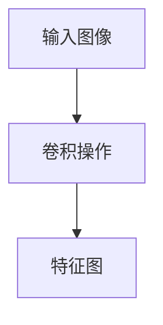
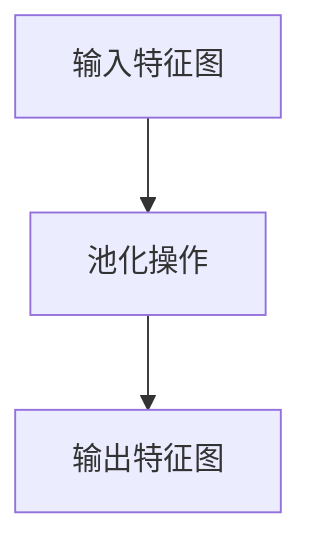
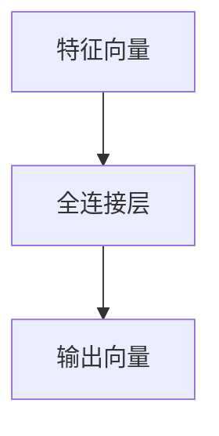
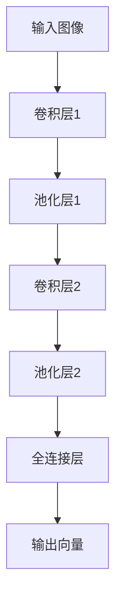

## 1. 背景介绍

卷积神经网络（Convolutional Neural Network，CNN）是一种深度学习算法，广泛应用于图像识别、语音识别、自然语言处理等领域。CNN的出现，极大地推动了计算机视觉领域的发展，使得计算机可以像人类一样识别和理解图像。

## 2. 核心概念与联系

CNN的核心概念是卷积层、池化层和全连接层。卷积层通过卷积操作提取图像的特征，池化层通过降采样操作减少特征图的大小，全连接层通过神经元之间的连接实现分类。

CNN的输入是一张图像，输出是该图像所属的类别。CNN通过多个卷积层和池化层提取图像的特征，最后通过全连接层实现分类。

## 3. 核心算法原理具体操作步骤

### 3.1 卷积层

卷积层是CNN的核心层之一，它通过卷积操作提取图像的特征。卷积操作可以看作是一种滤波器的操作，它将一个滤波器与输入图像进行卷积操作，得到一个特征图。

卷积操作的数学公式如下：

$$
y_{i,j}=\sum_{m=0}^{k-1}\sum_{n=0}^{k-1}x_{i+m,j+n}h_{m,n}
$$

其中，$x$是输入图像，$h$是滤波器，$y$是特征图，$k$是滤波器的大小。

卷积操作的过程如下图所示：



### 3.2 池化层

池化层是CNN的另一个核心层，它通过降采样操作减少特征图的大小。池化操作可以看作是一种缩小图像的操作，它将一个池化窗口内的像素值取平均或取最大值，得到一个新的特征图。

池化操作的数学公式如下：

$$
y_{i,j}=\max_{m=0}^{k-1}\max_{n=0}^{k-1}x_{i+m,j+n}
$$

其中，$x$是输入特征图，$y$是输出特征图，$k$是池化窗口的大小。

池化操作的过程如下图所示：



### 3.3 全连接层

全连接层是CNN的最后一层，它通过神经元之间的连接实现分类。全连接层将特征图展开成一个向量，然后通过多个神经元的连接实现分类。

全连接层的数学公式如下：

$$
y_i=\sum_{j=1}^{n}w_{i,j}x_j+b_i
$$

其中，$x$是特征向量，$w$是权重矩阵，$b$是偏置向量，$y$是输出向量，$n$是特征向量的维度。

全连接层的过程如下图所示：



## 4. 数学模型和公式详细讲解举例说明

以图像分类为例，假设我们有一个大小为$28\times28$的灰度图像，我们希望将其分类为10个类别中的一个。我们可以使用一个简单的CNN模型来实现这个任务。

该模型包含两个卷积层和两个池化层，最后是一个全连接层。每个卷积层都有16个滤波器，每个滤波器的大小为$3\times3$。每个池化层的池化窗口大小为$2\times2$。全连接层有128个神经元。

该模型的数学模型如下：



卷积层1的数学模型如下：

$$
y_{i,j}^{(1)}=\sigma\left(\sum_{m=0}^{2}\sum_{n=0}^{2}x_{i+m,j+n}w_{m,n}^{(1)}+b^{(1)}\right)
$$

其中，$x$是输入图像，$w$是滤波器，$b$是偏置，$\sigma$是激活函数。

池化层1的数学模型如下：

$$
y_{i,j}^{(2)}=\max_{m=0}^{1}\max_{n=0}^{1}x_{2i+m,2j+n}^{(1)}
$$

其中，$x$是输入特征图，$y$是输出特征图。

卷积层2和池化层2的数学模型与卷积层1和池化层1类似。

全连接层的数学模型如下：

$$
y_i=\sigma\left(\sum_{j=1}^{n}w_{i,j}x_j+b_i\right)
$$

其中，$x$是特征向量，$w$是权重矩阵，$b$是偏置向量，$y$是输出向量，$n$是特征向量的维度。

## 5. 项目实践：代码实例和详细解释说明

下面是一个使用Keras实现的简单的CNN模型，用于对MNIST手写数字数据集进行分类。

```python
from keras.models import Sequential
from keras.layers import Conv2D, MaxPooling2D, Flatten, Dense

model = Sequential()
model.add(Conv2D(32, (3, 3), activation='relu', input_shape=(28, 28, 1)))
model.add(MaxPooling2D((2, 2)))
model.add(Conv2D(64, (3, 3), activation='relu'))
model.add(MaxPooling2D((2, 2)))
model.add(Conv2D(64, (3, 3), activation='relu'))
model.add(Flatten())
model.add(Dense(64, activation='relu'))
model.add(Dense(10, activation='softmax'))

model.compile(optimizer='rmsprop',
              loss='categorical_crossentropy',
              metrics=['accuracy'])

model.fit(train_images, train_labels, epochs=5, batch_size=64)
test_loss, test_acc = model.evaluate(test_images, test_labels)
print('Test accuracy:', test_acc)
```

该模型包含三个卷积层和两个池化层，最后是两个全连接层。每个卷积层都有32或64个滤波器，每个滤波器的大小为$3\times3$。每个池化层的池化窗口大小为$2\times2$。全连接层有64或10个神经元。

## 6. 实际应用场景

CNN广泛应用于图像识别、语音识别、自然语言处理等领域。例如，CNN可以用于人脸识别、车牌识别、手写数字识别、物体识别等任务。

## 7. 工具和资源推荐

- Keras：一个高级神经网络API，支持多种深度学习算法，包括CNN。
- TensorFlow：一个开源的机器学习框架，支持多种深度学习算法，包括CNN。
- PyTorch：一个开源的机器学习框架，支持多种深度学习算法，包括CNN。
- MNIST手写数字数据集：一个常用的图像分类数据集，用于测试CNN模型的性能。

## 8. 总结：未来发展趋势与挑战

CNN作为一种深度学习算法，已经在图像识别、语音识别、自然语言处理等领域取得了很大的成功。未来，CNN将继续发挥重要作用，特别是在自动驾驶、智能家居、医疗健康等领域。

然而，CNN也面临着一些挑战。例如，CNN需要大量的训练数据和计算资源，这对于一些应用场景来说是不可行的。此外，CNN也容易受到对抗性攻击，这可能会导致模型的失效。

## 9. 附录：常见问题与解答

Q: CNN适用于哪些应用场景？

A: CNN适用于图像识别、语音识别、自然语言处理等领域。

Q: 如何实现一个简单的CNN模型？

A: 可以使用Keras、TensorFlow、PyTorch等深度学习框架来实现一个简单的CNN模型。

Q: CNN面临哪些挑战？

A: CNN需要大量的训练数据和计算资源，容易受到对抗性攻击等挑战。