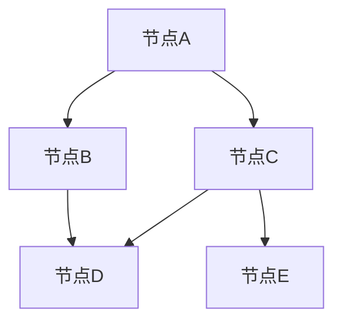

# 图算法在推荐系统中的应用：协同过滤、基于内容的推荐

## 1.背景介绍

推荐系统在现代互联网应用中扮演着至关重要的角色。无论是电商平台、社交媒体还是流媒体服务，推荐系统都在帮助用户发现他们可能感兴趣的内容或商品。传统的推荐系统主要依赖于协同过滤和基于内容的推荐。然而，随着数据规模的扩大和用户需求的多样化，传统方法逐渐暴露出一些局限性。图算法作为一种强大的工具，能够有效地处理复杂的关系和大规模数据，逐渐成为推荐系统中的重要组成部分。

## 2.核心概念与联系

### 2.1 协同过滤

协同过滤（Collaborative Filtering）是一种基于用户行为数据的推荐方法。它主要分为两类：基于用户的协同过滤和基于物品的协同过滤。基于用户的协同过滤通过寻找与目标用户行为相似的其他用户来进行推荐，而基于物品的协同过滤则通过寻找与目标物品相似的其他物品来进行推荐。

### 2.2 基于内容的推荐

基于内容的推荐（Content-Based Recommendation）是通过分析物品的内容特征来进行推荐的方法。它主要依赖于物品的属性和用户的历史行为，通过计算用户与物品之间的相似度来进行推荐。

### 2.3 图算法

图算法是一种处理图结构数据的算法。图由节点和边组成，节点代表实体，边代表实体之间的关系。图算法在推荐系统中的应用主要包括图嵌入、随机游走和图神经网络等。

### 2.4 核心联系

协同过滤和基于内容的推荐都可以通过图算法来增强。图算法能够有效地捕捉用户与物品之间的复杂关系，提高推荐的准确性和多样性。

## 3.核心算法原理具体操作步骤

### 3.1 图嵌入

图嵌入（Graph Embedding）是将图中的节点映射到低维向量空间的方法。常见的图嵌入算法包括DeepWalk、Node2Vec和LINE等。图嵌入能够捕捉节点之间的结构信息，为推荐系统提供丰富的特征表示。

#### 3.1.1 DeepWalk

DeepWalk通过随机游走生成节点序列，然后使用Skip-Gram模型进行训练，最终得到节点的向量表示。



#### 3.1.2 Node2Vec

Node2Vec在DeepWalk的基础上引入了参数化的随机游走策略，能够在DFS和BFS之间进行平衡，捕捉不同类型的节点关系。

### 3.2 随机游走

随机游走（Random Walk）是一种在图中随机选择节点进行游走的方法。通过多次随机游走，可以生成节点序列，用于训练图嵌入模型。

### 3.3 图神经网络

图神经网络（Graph Neural Network, GNN）是一种能够直接在图结构上进行操作的神经网络。GNN通过消息传递机制，将节点的特征信息传递给邻居节点，从而捕捉图中的局部和全局信息。

## 4.数学模型和公式详细讲解举例说明

### 4.1 协同过滤的数学模型

#### 4.1.1 基于用户的协同过滤

基于用户的协同过滤通过计算用户之间的相似度来进行推荐。常用的相似度度量包括余弦相似度和皮尔逊相关系数。

$$
\text{余弦相似度} = \frac{\sum_{i=1}^{n} u_{i} v_{i}}{\sqrt{\sum_{i=1}^{n} u_{i}^2} \sqrt{\sum_{i=1}^{n} v_{i}^2}}
$$

#### 4.1.2 基于物品的协同过滤

基于物品的协同过滤通过计算物品之间的相似度来进行推荐。常用的相似度度量包括余弦相似度和Jaccard相似度。

$$
\text{Jaccard相似度} = \frac{|A \cap B|}{|A \cup B|}
$$

### 4.2 基于内容的推荐的数学模型

基于内容的推荐通过计算用户与物品之间的相似度来进行推荐。常用的相似度度量包括TF-IDF和余弦相似度。

$$
\text{TF-IDF} = \text{TF} \times \text{IDF}
$$

### 4.3 图嵌入的数学模型

#### 4.3.1 DeepWalk

DeepWalk通过随机游走生成节点序列，然后使用Skip-Gram模型进行训练。Skip-Gram模型的目标是最大化节点在上下文中的共现概率。

$$
\text{Skip-Gram目标函数} = \sum_{u \in V} \sum_{v \in N(u)} \log P(v|u)
$$

#### 4.3.2 Node2Vec

Node2Vec在DeepWalk的基础上引入了参数化的随机游走策略。通过调整参数$p$和$q$，Node2Vec能够在DFS和BFS之间进行平衡。

$$
P(c_i|v) = \frac{\exp(\text{sim}(c_i, v))}{\sum_{j \in N(v)} \exp(\text{sim}(c_j, v))}
$$

### 4.4 图神经网络的数学模型

图神经网络通过消息传递机制，将节点的特征信息传递给邻居节点。每一层的节点表示通过聚合邻居节点的特征来更新。

$$
h_v^{(k)} = \sigma \left( W^{(k)} \cdot \text{AGG} \left( \{ h_u^{(k-1)} : u \in N(v) \} \right) \right)
$$

## 5.项目实践：代码实例和详细解释说明

### 5.1 基于用户的协同过滤

```python
import numpy as np
from sklearn.metrics.pairwise import cosine_similarity

# 用户-物品评分矩阵
ratings = np.array([
    [5, 3, 0, 1],
    [4, 0, 0, 1],
    [1, 1, 0, 5],
    [1, 0, 0, 4],
    [0, 1, 5, 4],
])

# 计算用户相似度矩阵
user_similarity = cosine_similarity(ratings)

# 预测评分
def predict(ratings, similarity):
    mean_user_rating = ratings.mean(axis=1)
    ratings_diff = (ratings - mean_user_rating[:, np.newaxis])
    pred = mean_user_rating[:, np.newaxis] + similarity.dot(ratings_diff) / np.array([np.abs(similarity).sum(axis=1)]).T
    return pred

user_prediction = predict(ratings, user_similarity)
print(user_prediction)
```

### 5.2 基于内容的推荐

```python
from sklearn.feature_extraction.text import TfidfVectorizer
from sklearn.metrics.pairwise import linear_kernel

# 物品描述
documents = [
    "The movie is great",
    "The movie is not good",
    "The movie is fantastic",
    "The movie is terrible",
]

# 计算TF-IDF矩阵
tfidf = TfidfVectorizer().fit_transform(documents)

# 计算物品相似度矩阵
cosine_similarities = linear_kernel(tfidf, tfidf)

# 推荐函数
def recommend(item_index, cosine_similarities):
    similar_indices = cosine_similarities[item_index].argsort()[:-5:-1]
    return similar_indices

# 推荐与第一个物品相似的物品
print(recommend(0, cosine_similarities))
```

### 5.3 图嵌入

```python
import networkx as nx
from node2vec import Node2Vec

# 创建图
G = nx.karate_club_graph()

# 训练Node2Vec模型
node2vec = Node2Vec(G, dimensions=64, walk_length=30, num_walks=200, workers=4)
model = node2vec.fit(window=10, min_count=1, batch_words=4)

# 获取节点的向量表示
vector = model.wv['0']
print(vector)
```

### 5.4 图神经网络

```python
import torch
import torch.nn.functional as F
from torch_geometric.nn import GCNConv
from torch_geometric.datasets import Planetoid

# 加载数据集
dataset = Planetoid(root='/tmp/Cora', name='Cora')

class GCN(torch.nn.Module):
    def __init__(self):
        super(GCN, self).__init__()
        self.conv1 = GCNConv(dataset.num_node_features, 16)
        self.conv2 = GCNConv(16, dataset.num_classes)

    def forward(self, data):
        x, edge_index = data.x, data.edge_index
        x = self.conv1(x, edge_index)
        x = F.relu(x)
        x = F.dropout(x, training=self.training)
        x = self.conv2(x, edge_index)
        return F.log_softmax(x, dim=1)

# 训练模型
model = GCN()
data = dataset[0]
optimizer = torch.optim.Adam(model.parameters(), lr=0.01, weight_decay=5e-4)

model.train()
for epoch in range(200):
    optimizer.zero_grad()
    out = model(data)
    loss = F.nll_loss(out[data.train_mask], data.y[data.train_mask])
    loss.backward()
    optimizer.step()

# 测试模型
model.eval()
_, pred = model(data).max(dim=1)
correct = int(pred[data.test_mask].eq(data.y[data.test_mask]).sum().item())
accuracy = correct / int(data.test_mask.sum())
print('Accuracy: {:.4f}'.format(accuracy))
```

## 6.实际应用场景

### 6.1 电商平台

在电商平台中，推荐系统可以帮助用户发现他们可能感兴趣的商品。通过图算法，可以更好地捕捉用户与商品之间的复杂关系，提高推荐的准确性和多样性。

### 6.2 社交媒体

在社交媒体中，推荐系统可以帮助用户发现他们可能感兴趣的内容或用户。通过图算法，可以更好地捕捉用户之间的社交关系，提高推荐的相关性和用户体验。

### 6.3 流媒体服务

在流媒体服务中，推荐系统可以帮助用户发现他们可能感兴趣的电影、音乐或视频。通过图算法，可以更好地捕捉用户的兴趣偏好，提高推荐的个性化和满意度。

## 7.工具和资源推荐

### 7.1 图算法库

- NetworkX: 一个用于创建、操作和研究复杂网络的Python库。
- Node2Vec: 一个用于图嵌入的Python库。
- PyTorch Geometric: 一个用于图神经网络的深度学习库。

### 7.2 数据集

- MovieLens: 一个常用的电影推荐数据集。
- Cora: 一个常用的图神经网络数据集。
- Amazon Product Data: 一个常用的电商推荐数据集。

### 7.3 研究论文

- DeepWalk: Online Learning of Social Representations
- Node2Vec: Scalable Feature Learning for Networks
- Semi-Supervised Classification with Graph Convolutional Networks

## 8.总结：未来发展趋势与挑战

图算法在推荐系统中的应用前景广阔，但也面临一些挑战。未来的发展趋势包括：

### 8.1 更高效的图算法

随着数据规模的不断扩大，如何设计更高效的图算法是一个重要的研究方向。高效的图算法能够处理大规模数据，提高推荐系统的性能和可扩展性。

### 8.2 更智能的图神经网络

图神经网络在推荐系统中的应用还处于初级阶段。未来的研究将致力于设计更智能的图神经网络，能够更好地捕捉图中的复杂关系，提高推荐的准确性和多样性。

### 8.3 隐私保护与安全

在推荐系统中，用户数据的隐私保护和安全是一个重要的问题。未来的研究将致力于设计隐私保护和安全的图算法，确保用户数据的安全性和隐私性。

## 9.附录：常见问题与解答

### 9.1 图算法在推荐系统中的优势是什么？

图算法能够有效地捕捉用户与物品之间的复杂关系，提高推荐的准确性和多样性。

### 9.2 如何选择合适的图算法？

选择合适的图算法需要根据具体的应用场景和数据特点。常见的图算法包括图嵌入、随机游走和图神经网络等。

### 9.3 图算法在推荐系统中的应用有哪些挑战？

图算法在推荐系统中的应用面临数据规模、计算效率和隐私保护等挑战。未来的研究将致力于设计更高效、更智能和更安全的图算法。

---

作者：禅与计算机程序设计艺术 / Zen and the Art of Computer Programming