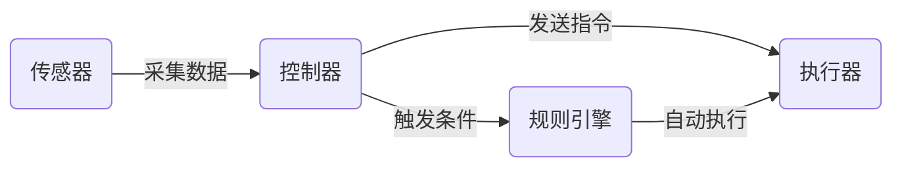

# 基于Java的智能家居设计：用Java实现住宅安全系统的逻辑核心

## 1.背景介绍

随着科技的飞速发展,智能家居已经逐渐走进我们的生活。智能家居系统通过物联网技术,将家中的各种设备连接在一起,实现远程控制、自动化等功能,为人们带来更加舒适、安全、便捷的生活体验。而在智能家居系统中,住宅安全系统是非常重要的一个组成部分。

住宅安全系统主要包括门窗磁感应器、烟雾报警器、可视门铃、智能门锁等设备,通过这些设备的协同工作,可以实时监测住宅的安全状态,一旦发生非法入侵、火灾等紧急情况,系统会第一时间发出警报,通知用户和相关部门,保障住宅和居住者的安全。

本文将探讨如何使用Java语言来实现一个住宅安全系统的逻辑核心。我们会详细介绍系统的架构设计、核心算法、数据模型等内容,并提供完整的代码示例。通过本文的学习,读者可以掌握智能家居安全系统的基本原理,并学会如何使用Java语言来实现类似的系统。

## 2.核心概念与联系

在设计住宅安全系统时,我们需要了解一些核心概念:

1. 传感器(Sensor):用于采集环境数据的设备,如门磁传感器、烟雾传感器等。
2. 控制器(Controller):用于控制各种设备的核心组件,接收传感器数据,发出控制指令。
3. 执行器(Actuator):根据控制器指令执行相应动作的设备,如智能门锁、警报器等。
4. 通信协议:传感器、控制器、执行器之间进行数据交互所遵循的规则,常见的有ZigBee、Wi-Fi、Bluetooth等。
5. 规则引擎:根据预设条件自动触发相应动作的组件,是实现自动化的关键。

这些概念之间的联系如下:



传感器采集环境数据发送给控制器,控制器根据数据和预设规则向执行器发送控制指令;当传感器数据触发某个条件时,规则引擎自动执行预定的动作。

## 3.核心算法原理具体操作步骤

住宅安全系统的核心是基于规则的自动化控制算法,其基本原理可描述为:

1. 接收传感器数据
2. 根据数据判断是否触发预设条件
3. 如果触发,则执行相应的动作
4. 重复以上过程

用伪代码表示如下:

```
while(true):
    sensorData = receiveSensorData()
    for rule in rules:
        if match(rule.condition, sensorData):
            executeAction(rule.action)
```

具体实现时,我们可以将规则定义为一个个的Java对象:

```java
class Rule {
    private Condition condition;
    private Action action;
    
    public boolean match(SensorData data) {
        return condition.match(data);
    }
    
    public void execute() {
        action.execute();
    }
}
```

其中`Condition`和`Action`也是Java对象,分别实现了`match`和`execute`方法。这样,我们就可以灵活地定义各种规则,并在运行时动态地加载和触发这些规则。

## 4.数学模型和公式详细讲解举例说明

在住宅安全系统中,我们可以使用一些数学模型来描述传感器数据和控制策略。例如,我们可以将传感器数据表示为一个时间序列:

$$X = {x_1, x_2, ..., x_n}$$

其中$x_i$表示第$i$个时刻的传感器读数。

我们可以用移动平均法来对传感器数据进行平滑处理,减少噪声干扰:

$$\bar{x}_i = \frac{1}{k} \sum_{j=i-k+1}^{i} x_j$$

其中$\bar{x}_i$表示第$i$个时刻的平滑后的传感器读数,$k$为平滑窗口的大小。

在判断是否触发报警时,我们可以设定一个阈值$\theta$,当传感器读数超过这个阈值时就触发报警:

$$f(x) = \begin{cases} 1, & x > \theta \\ 0, & x \leq \theta \end{cases}$$

其中$f(x)$表示报警函数,当$f(x)=1$时触发报警。

举个例子,假设我们的烟雾传感器每分钟采集一次数据,数据范围是0到100,我们设定阈值为50。如果某一分钟的读数为80,高于阈值,就会触发火警。为了避免误报,我们可以取最近5分钟读数的平均值,只有平均值超过阈值才触发报警。

## 5.项目实践：代码实例和详细解释说明

下面我们用Java代码实现一个简单的规则引擎:

```java
interface Condition {
    boolean match(SensorData data);
}

interface Action {
    void execute();
}

class SensorData {
    private Map<String, Object> values;
    
    public Object getValue(String key) {
        return values.get(key);
    }
}

class Rule {
    private Condition condition;
    private Action action;
    
    public boolean match(SensorData data) {
        return condition.match(data);
    }
    
    public void execute() {
        action.execute();
    }
}

class RuleEngine {
    private List<Rule> rules = new ArrayList<>();
    
    public void addRule(Rule rule) {
        rules.add(rule);
    }
    
    public void process(SensorData data) {
        for (Rule rule : rules) {
            if (rule.match(data)) {
                rule.execute();
            }
        }
    }
}
```

我们定义了`Condition`和`Action`两个接口,分别表示规则的条件和动作。`SensorData`类表示传感器数据,内部用一个Map存储各种数据。`Rule`类表示一个规则,包含一个`Condition`和一个`Action`。`RuleEngine`类是规则引擎,内部维护了一个规则列表,提供了添加规则和处理数据的方法。

下面是一个使用示例:

```java
// 定义一个条件: 温度>38度
Condition highTemp = data -> (int)data.getValue("temperature") > 38;

// 定义一个动作: 发送警报到手机
Action sendAlert = () -> System.out.println("Temperature too high, sending alert to phone!");

// 创建一个规则
Rule rule = new Rule(highTemp, sendAlert);

// 创建规则引擎,添加规则
RuleEngine engine = new RuleEngine();
engine.addRule(rule);

// 模拟传感器数据
SensorData data1 = new SensorData();
data1.putValue("temperature", 37);

SensorData data2 = new SensorData();
data2.putValue("temperature", 39);

// 处理数据
engine.process(data1); // 不会触发报警
engine.process(data2); // 会触发报警
```

这个例子中,我们定义了一个条件(温度>38度)和一个动作(发送警报),然后创建了一个规则,添加到规则引擎中。我们模拟了两个传感器数据,第一个不会触发报警,第二个会触发报警。

实际项目中,我们可以定义更多的条件和动作,并支持动态加载规则,以实现更加灵活、可定制的智能家居安全系统。

## 6.实际应用场景

智能家居安全系统在实际生活中有非常广泛的应用,下面列举几个典型场景:

1. 入侵检测:通过门窗磁传感器、红外传感器等,实时监测门窗状态和室内动静,一旦发现非法入侵,立即触发警报,并通知用户和安防中心。

2. 火灾预警:通过烟雾传感器、温度传感器等,实时监测室内火灾隐患,一旦发现异常情况,立即触发警报,通知用户疏散,并自动打开防火门、切断电源等。

3. 老人看护:通过红外传感器、摄像头等,实时监测独居老人的活动情况,如果发现老人长时间没有活动,或者摔倒等异常情况,立即通知家属或者看护人员。

4. 环境监测:通过温湿度传感器、空气质量传感器等,实时监测室内环境质量,如果发现异常,如温度过高、湿度过大、空气污染等,自动调节空调、加湿器、空气净化器等设备,保持室内环境舒适健康。

5. 远程控制:用户可以通过手机APP远程查看家中情况,控制各种设备,如开关灯、调节空调温度、开关窗帘等,即使不在家也能随时掌控家中状态。

总之,智能家居安全系统通过各种传感器和控制器的协同工作,提供全方位、实时的家居安全防护和环境管理,给用户带来更加安全、舒适、便捷的居住体验。

## 7.工具和资源推荐

对于Java开发者,想要开发智能家居安全系统,这里推荐一些有用的工具和资源:

1. OpenHAB:一个开源的智能家居自动化平台,支持多种协议和设备,提供了丰富的插件和界面,可以快速搭建智能家居系统。

2. Eclipse SmartHome:另一个开源的智能家居框架,提供了标准化的API和编程模型,方便开发者集成各种设备和服务。

3. Home Assistant:一个开源的家庭自动化平台,支持上千种设备和服务,提供了友好的Web界面和移动APP,用户可以轻松配置和管理智能家居。

4. MQTT:一种轻量级的发布/订阅式消息传输协议,广泛用于物联网和智能家居领域,方便各种设备之间的通信和数据交换。

5. Z-Wave和ZigBee:两种无线通信协议,专为家庭自动化设计,支持多种传感器和控制器,功耗低,组网灵活。

6. Java IoT Libraries:一些Java库,如Pi4J、Kura等,提供了访问GPIO、I2C、SPI等接口的API,方便使用Java开发IoT和智能家居应用。

除了以上工具,还有很多在线资源,如论坛、博客、视频教程等,可以帮助开发者学习和掌握智能家居开发技术。开发者也可以参与一些开源项目,与其他开发者交流经验,共同推动智能家居技术的发展。

## 8.总结：未来发展趋势与挑战

智能家居安全系统是物联网时代的重要应用之一,随着技术的不断发展,其功能和形态也在不断演进。未来,智能家居安全系统可能呈现以下发展趋势:

1. 人工智能化:引入机器学习、深度学习等人工智能技术,使系统能够自主学习用户行为模式,提供更加个性化、智能化的服务。

2. 大数据化:采集和分析海量的传感器数据,挖掘用户行为规律和安全隐患,提供更加精准的预警和防护。

3. 云端化:将数据和服务迁移到云端,实现跨平台、跨设备的无缝连接和控制,提供更加便捷、可靠的服务。

4. 生态化:打通不同厂商、不同协议的设备和服务,形成开放、互联的智能家居生态,为用户提供一站式的解决方案。

5. 人性化:更加注重用户体验,提供自然语音交互、情感感知等功能,让智能家居变得更加友好、贴心。

当然,智能家居安全系统的发展也面临着一些挑战:

1. 安全与隐私:如何保护用户隐私数据,防止黑客入侵和攻击,是智能家居必须解决的问题。

2. 标准与兼容:如何制定统一的行业标准,实现不同品牌、不同协议设备的互联互通,是推动智能家居普及的关键。

3. 成本与性能:如何降低传感器、控制器等硬件成本,提高电池续航能力,是智能家居走向大众化的必要条件。

4. 易用与可靠:如何简化安装、配置和操作流程,提高系统稳定性和可靠性,让普通用户也能轻松上手和使用。

5. 场景与服务:如何针对不同用户、不同场景,提供个性化、多样化的智能服务,是智能家居的核心价值所在。

总之,智能家居安全系统