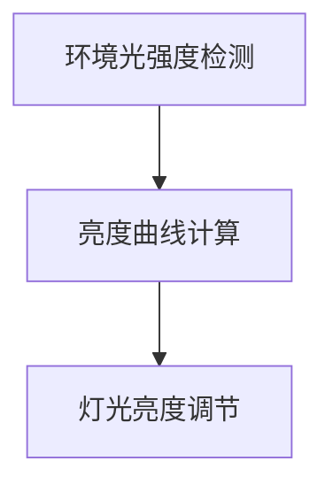
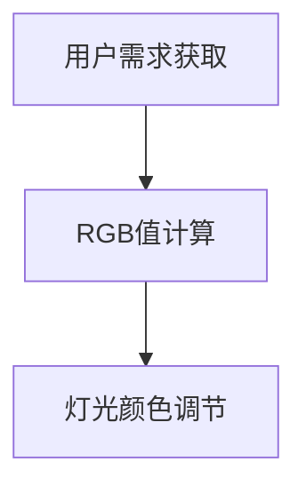

# 基于Java的智能家居设计：设计基于Java的智能照明系统的策略与挑战

## 1.背景介绍

随着物联网（IoT）技术的迅猛发展，智能家居系统逐渐成为现代生活的一部分。智能照明系统作为智能家居的重要组成部分，不仅能够提高生活的便利性，还能节约能源，提升居住环境的舒适度。Java作为一种广泛使用的编程语言，具有跨平台性、稳定性和丰富的库支持，是开发智能家居系统的理想选择。

在本文中，我们将深入探讨基于Java的智能照明系统的设计策略与挑战。我们将从核心概念、算法原理、数学模型、项目实践、实际应用场景、工具和资源推荐等多个方面进行详细讲解，帮助读者全面了解和掌握这一领域的技术。

## 2.核心概念与联系

### 2.1 智能照明系统概述

智能照明系统通过传感器、控制器和执行器的协同工作，实现对照明设备的智能控制。其主要功能包括自动调节亮度、颜色、开关状态等，以适应不同的环境和用户需求。

### 2.2 Java在智能照明系统中的角色

Java在智能照明系统中主要用于开发控制逻辑、通信协议和用户界面。其跨平台特性使得系统可以在不同的硬件平台上运行，而丰富的库支持则简化了开发过程。

### 2.3 物联网与智能照明的联系

物联网技术使得智能照明系统能够通过网络与其他设备进行通信，实现远程控制和数据共享。通过物联网，智能照明系统可以与智能家居中的其他设备协同工作，提供更智能化的服务。

## 3.核心算法原理具体操作步骤

### 3.1 自动调光算法

自动调光算法是智能照明系统的核心算法之一。其基本原理是通过传感器检测环境光强度，并根据预设的亮度曲线自动调节灯光亮度。

#### 3.1.1 环境光强度检测

传感器实时检测环境光强度，并将数据传输给控制器。

#### 3.1.2 亮度曲线计算

根据预设的亮度曲线和当前环境光强度，计算出合适的灯光亮度。

#### 3.1.3 灯光亮度调节

控制器根据计算结果，调节灯光亮度。



### 3.2 颜色调节算法

颜色调节算法用于根据用户需求或预设场景，自动调节灯光颜色。其基本原理是通过RGB值的计算和调节，实现灯光颜色的变化。

#### 3.2.1 用户需求获取

通过用户界面或预设场景，获取用户对灯光颜色的需求。

#### 3.2.2 RGB值计算

根据用户需求，计算出合适的RGB值。

#### 3.2.3 灯光颜色调节

控制器根据计算结果，调节灯光颜色。



## 4.数学模型和公式详细讲解举例说明

### 4.1 自动调光数学模型

自动调光数学模型用于描述环境光强度与灯光亮度之间的关系。常用的模型包括线性模型和非线性模型。

#### 4.1.1 线性模型

线性模型假设环境光强度与灯光亮度成线性关系，其数学表达式为：

$$
L = k \cdot E + b
$$

其中，$L$ 为灯光亮度，$E$ 为环境光强度，$k$ 和 $b$ 为模型参数。

#### 4.1.2 非线性模型

非线性模型假设环境光强度与灯光亮度成非线性关系，其数学表达式为：

$$
L = a \cdot E^2 + b \cdot E + c
$$

其中，$a$、$b$ 和 $c$ 为模型参数。

### 4.2 颜色调节数学模型

颜色调节数学模型用于描述RGB值与灯光颜色之间的关系。常用的模型包括线性插值模型和非线性插值模型。

#### 4.2.1 线性插值模型

线性插值模型假设RGB值与灯光颜色成线性关系，其数学表达式为：

$$
C = \alpha \cdot R + \beta \cdot G + \gamma \cdot B
$$

其中，$C$ 为灯光颜色，$R$、$G$ 和 $B$ 为RGB值，$\alpha$、$\beta$ 和 $\gamma$ 为模型参数。

#### 4.2.2 非线性插值模型

非线性插值模型假设RGB值与灯光颜色成非线性关系，其数学表达式为：

$$
C = a \cdot R^2 + b \cdot G^2 + c \cdot B^2 + d \cdot R \cdot G + e \cdot G \cdot B + f \cdot B \cdot R
$$

其中，$a$、$b$、$c$、$d$、$e$ 和 $f$ 为模型参数。

## 5.项目实践：代码实例和详细解释说明

### 5.1 环境光强度检测代码实例

以下是一个使用Java实现环境光强度检测的代码实例：

```java
import java.util.Random;

public class LightSensor {
    private Random random;

    public LightSensor() {
        random = new Random();
    }

    public int getLightIntensity() {
        // 模拟环境光强度检测
        return random.nextInt(100);
    }

    public static void main(String[] args) {
        LightSensor sensor = new LightSensor();
        System.out.println("当前环境光强度: " + sensor.getLightIntensity());
    }
}
```

### 5.2 自动调光代码实例

以下是一个使用Java实现自动调光的代码实例：

```java
public class AutoDimmer {
    private LightSensor sensor;
    private int k;
    private int b;

    public AutoDimmer(LightSensor sensor, int k, int b) {
        this.sensor = sensor;
        this.k = k;
        this.b = b;
    }

    public int calculateBrightness() {
        int lightIntensity = sensor.getLightIntensity();
        return k * lightIntensity + b;
    }

    public static void main(String[] args) {
        LightSensor sensor = new LightSensor();
        AutoDimmer dimmer = new AutoDimmer(sensor, 2, 10);
        System.out.println("当前灯光亮度: " + dimmer.calculateBrightness());
    }
}
```

### 5.3 颜色调节代码实例

以下是一个使用Java实现颜色调节的代码实例：

```java
public class ColorAdjuster {
    private int red;
    private int green;
    private int blue;

    public ColorAdjuster(int red, int green, int blue) {
        this.red = red;
        this.green = green;
        this.blue = blue;
    }

    public String adjustColor() {
        return String.format("#%02x%02x%02x", red, green, blue);
    }

    public static void main(String[] args) {
        ColorAdjuster adjuster = new ColorAdjuster(255, 100, 50);
        System.out.println("当前灯光颜色: " + adjuster.adjustColor());
    }
}
```

## 6.实际应用场景

### 6.1 家庭照明

智能照明系统可以根据家庭成员的作息时间和活动情况，自动调节灯光亮度和颜色，提供舒适的照明环境。例如，晚上自动调暗灯光，早晨自动调亮灯光。

### 6.2 办公室照明

在办公室环境中，智能照明系统可以根据自然光强度和员工的工作状态，自动调节灯光亮度，提供适宜的工作环境，提高工作效率。

### 6.3 商业照明

在商业场所，智能照明系统可以根据营业时间和顾客流量，自动调节灯光亮度和颜色，营造良好的购物氛围，提升顾客体验。

## 7.工具和资源推荐

### 7.1 开发工具

- **Eclipse**：一款流行的Java集成开发环境（IDE），支持丰富的插件和扩展。
- **IntelliJ IDEA**：一款功能强大的Java IDE，提供智能代码补全、重构等高级功能。

### 7.2 库和框架

- **Spring Framework**：一个广泛使用的Java企业级应用开发框架，提供丰富的功能和扩展。
- **Apache Commons**：一个包含许多实用工具类的Java库，简化了开发过程。

### 7.3 学习资源

- **《Java编程思想》**：一本经典的Java编程书籍，适合初学者和进阶者阅读。
- **Coursera上的Java课程**：提供系统的Java编程学习资源，适合自学者。

## 8.总结：未来发展趋势与挑战

### 8.1 未来发展趋势

随着物联网技术的不断发展，智能照明系统将会更加智能化和个性化。未来的智能照明系统将能够根据用户的行为和偏好，自动调整照明方案，提供更加舒适和高效的照明服务。

### 8.2 挑战

尽管智能照明系统具有广阔的应用前景，但在实际应用中仍面临一些挑战。例如，如何提高系统的稳定性和可靠性，如何保障用户数据的安全和隐私，如何降低系统的成本等。这些问题需要在未来的研究和实践中不断探索和解决。

## 9.附录：常见问题与解答

### 9.1 如何选择合适的传感器？

选择传感器时，需要考虑传感器的精度、响应速度、稳定性和成本等因素。常用的传感器包括光电传感器、红外传感器等。

### 9.2 如何提高系统的稳定性？

提高系统稳定性的方法包括优化代码、使用可靠的硬件设备、进行充分的测试和调试等。

### 9.3 如何保障用户数据的安全和隐私？

保障用户数据安全和隐私的方法包括使用加密技术、设置访问控制、定期进行安全审计等。

### 9.4 如何降低系统的成本？

降低系统成本的方法包括选择性价比高的硬件设备、优化系统设计、批量采购等。

---

作者：禅与计算机程序设计艺术 / Zen and the Art of Computer Programming