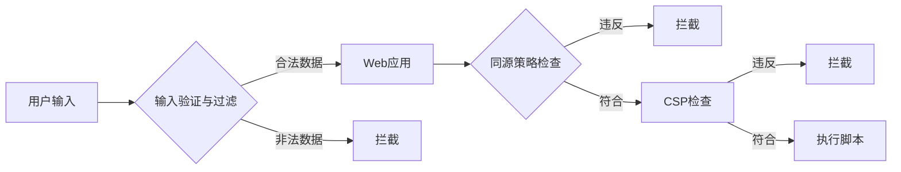

# 基于XSS系统攻防系统的研究

## 1.背景介绍
### 1.1 XSS攻击的定义与危害
跨站脚本攻击(Cross Site Scripting)，简称XSS，是一种常见的Web安全漏洞。攻击者利用网站未对用户提交数据进行有效过滤，在网页中注入恶意脚本，当其他用户浏览这些网页时，就会执行这些恶意脚本，从而达到窃取用户信息、利用用户身份进行操作等目的。

XSS攻击可以造成诸多危害，如盗取用户cookies、劫持用户会话、篡改网页内容、进行钓鱼攻击、传播恶意软件等。这不仅损害了用户利益，也影响了网站的声誉和安全性。

### 1.2 XSS攻击的分类
XSS攻击主要分为三类：

1. 反射型XSS：攻击者诱导用户点击一个嵌入恶意脚本的链接，服务器接收到请求后，将恶意脚本返回给浏览器执行。
2. 存储型XSS：攻击者将恶意脚本提交到服务器(如发布评论)，服务器存储后，其他用户浏览页面时触发执行。
3. DOM型XSS：攻击者通过修改页面的DOM节点形成XSS，而非服务端的数据。

### 1.3 XSS攻防系统的必要性
鉴于XSS攻击的隐蔽性和危害性，构建一个有效的XSS攻防系统至关重要。它能够在开发阶段发现并修复XSS漏洞，在运行阶段实时检测和拦截XSS攻击，从而最大限度地保障Web应用的安全。

## 2.核心概念与联系
### 2.1 同源策略
同源策略是浏览器安全的基石。它规定JavaScript等脚本只能访问与其来源同域名、同协议、同端口的数据。而XSS攻击往往发生在违反同源策略时。

### 2.2 CSP
内容安全策略(Content Security Policy)，是一种HTTP响应头，用于指定浏览器能够加载执行的资源。通过设置严格的CSP，可以减少XSS攻击的风险。

### 2.3 输入验证与过滤
XSS的根源在于用户输入的不可信数据没有被妥善处理。因此，对用户输入进行严格的验证与过滤是防御XSS的关键。

### 2.4 Mermaid流程图
下面是XSS攻防系统的核心概念与联系Mermaid流程图：



## 3.核心算法原理与具体操作步骤
### 3.1 输入验证与过滤算法
对用户输入数据进行验证和过滤是防御XSS的第一道关卡。具体步骤如下：

1. 将用户输入数据进行编码，如HTML编码、URL编码等。
2. 使用白名单方式，只允许特定的字符和格式，过滤掉其他可能导致XSS的字符。
3. 对于富文本的输入，使用成熟的过滤库如AntiSamy、OWASP Java HTML Sanitizer等。
4. 过滤后的数据再进行解码，传递给后续流程。

### 3.2 CSP设置算法
合理配置CSP可以减少XSS攻击的可能性。具体步骤如下：

1. 设置`default-src`为`'none'`，默认禁止加载任何资源。
2. 根据需要放开特定资源的加载权限，如`script-src`、`style-src`等。
3. 对于允许加载的资源，尽量使用白名单形式，明确指定域名。
4. 谨慎使用`unsafe-inline`和`unsafe-eval`，它们可能带来风险。
5. 开启`block-all-mixed-content`，禁止加载HTTP资源。

### 3.3 XSS攻击检测算法
在运行时对潜在的XSS攻击进行检测和拦截。具体步骤如下：

1. 结合特征库和机器学习，对请求参数和响应内容进行实时检测。
2. 对疑似攻击请求进行阻断，并记录攻击日志。
3. 对检测到的攻击，可采取沙箱执行、虚拟补丁等方式进行防御。
4. 持续更新特征库，提升检测的准确性和时效性。

## 4.数学模型和公式详细讲解举例说明
在XSS攻防中，常用到一些数学模型和公式，如信息熵、文本相似度等。

### 4.1 信息熵模型
信息熵可以衡量一段文本的随机程度。XSS攻击常包含一些特殊字符，信息熵较高。我们可以计算输入数据的信息熵，辅助判断是否为潜在的XSS攻击。

设输入文本为$X$，其中各字符出现的概率为$p(x_i)$，则信息熵$H(X)$的计算公式为：

$$
H(X) = -\sum_{i=1}^{n} p(x_i) \log p(x_i)
$$

举例说明：假设输入文本为`<script>alert('xss')</script>`，其信息熵约为2.8，高于正常文本，可能是一次XSS攻击。

### 4.2 文本相似度模型
在XSS检测中，可以使用文本相似度算法，将输入数据与已知的XSS攻击样本进行比对，判断相似程度。常用的相似度计算方法有：

1. 编辑距离：$dist(X,Y)$表示将文本$X$转换为文本$Y$所需的最少编辑操作次数。
2. 余弦相似度：$\cos(\theta) = \frac{X \cdot Y}{||X|| \cdot ||Y||}$，$X$和$Y$是文本的向量表示。
3. Jaccard相似度：$J(X,Y) = \frac{|X \cap Y|}{|X \cup Y|}$，$X$和$Y$是文本的token集合。

举例说明：输入文本为`<script>alert('xss')</script>`，与XSS攻击样本的余弦相似度为0.8，高于阈值，判定为XSS攻击。

## 5.项目实践：代码实例和详细解释说明
下面是一个简单的XSS过滤函数的Python实现：

```python
import html

def xss_filter(input_str):
    # HTML编码
    input_str = html.escape(input_str)
    
    # 过滤特殊字符
    filter_list = ['<', '>', '"', "'", '/', '\\', 'script', 'alert']
    for char in filter_list:
        input_str = input_str.replace(char, '')
        
    # 解码
    input_str = html.unescape(input_str)
    
    return input_str
```

代码解释：

1. 使用`html.escape()`对输入字符串进行HTML编码，将特殊字符转换为安全的字符实体。
2. 定义一个过滤列表`filter_list`，包含了常见的XSS攻击字符和关键词。
3. 遍历过滤列表，将匹配到的字符替换为空字符串，实现过滤效果。
4. 使用`html.unescape()`对过滤后的字符串进行解码。
5. 返回过滤后的安全字符串。

使用示例：

```python
input_str = "<script>alert('xss')</script>"
print(xss_filter(input_str))  # 输出：alert xss
```

## 6.实际应用场景
XSS攻防系统在各类Web应用中都有广泛应用，如：

1. 社交网络：用户可以发布包含文本、图片、链接等内容，需防范XSS。
2. 博客论坛：用户可以发表评论、文章，需过滤XSS。
3. 电商平台：购买评价、商品详情等允许用户输入，需防范XSS。
4. 在线教育：学生提交作业、讨论答疑，需过滤XSS。
5. 邮件系统：富文本格式的邮件可能隐藏XSS攻击。

总之，只要有用户生成内容(User Generated Content)的Web应用，都需要重视XSS防御。

## 7.工具和资源推荐
以下是一些实用的XSS攻防工具和资源：

1. OWASP XSS过滤器：https://www.owasp.org/index.php/XSS_(Cross_Site_Scripting)_Prevention_Cheat_Sheet
2. AntiSamy：https://www.owasp.org/index.php/Category:OWASP_AntiSamy_Project
3. DOMPurify：https://github.com/cure53/DOMPurify
4. XSS Auditor：https://www.chromium.org/developers/design-documents/xss-auditor
5. BeEF：https://beefproject.com/
6. XSS挑战平台：https://xss-game.appspot.com/

## 8.总结：未来发展趋势与挑战
随着Web技术的发展，XSS攻击也在不断演进。未来XSS攻防领域可能呈现以下趋势：

1. AI技术的应用：利用机器学习等技术，智能化地检测和防御XSS。
2. 浏览器安全增强：浏览器原生支持更多XSS防御特性。
3. 安全开发生命周期：在开发过程中就重视XSS防御，提升代码安全性。
4. 威胁情报共享：通过分享XSS攻击情报，协同防御。

同时，XSS攻防也面临一些挑战：

1. 复杂的Web应用场景：单页应用、富文本编辑器等增加了XSS防御难度。
2. 绕过防御的新型XSS：如变形的XSS payload，可能绕过传统防御。
3. 用户脚本的安全管理：如何在允许用户自定义脚本的同时防范XSS。
4. 防御的性能开销：在不影响用户体验的前提下，如何优化XSS防御策略。

## 9.附录：常见问题与解答
### Q1: XSS攻击会带来哪些危害？
A1: XSS攻击可以窃取用户隐私数据(如cookie)，冒充用户身份执行操作，诱导用户访问恶意网站，传播恶意软件等。

### Q2: XSS攻击与CSRF攻击的区别？ 
A2: XSS是向被攻击者的浏览器中注入恶意脚本；而CSRF是伪造用户的请求来执行非法操作。CSRF攻击常常依赖XSS来获取用户身份。

### Q3: 如何在前端防御XSS攻击？
A3: 前端可以采取以下措施防御XSS：
1. 过滤用户输入，禁止可能导致XSS的字符；
2. 在呈现用户生成内容时，进行安全转义；
3. 使用CSP限制页面可以加载的资源；
4. 使用HttpOnly的Cookie，减少XSS窃取Cookie的可能；
5. 部署Web应用防火墙等专业防御设备。

### Q4: 为什么说富文本编辑器的XSS防御难度大？
A4: 富文本编辑器允许用户输入和编辑带格式的内容(如HTML)，而这些格式标签可能成为XSS攻击的载体。在过滤的同时，还要保证正常的编辑功能，因此防御难度大。

### Q5: XSS攻击能否完全防御？
A5: 理论上，只要Web应用严格遵循XSS防御的最佳实践，就可以最大限度地防御XSS攻击。但在实际中，由于Web应用的复杂性、开发者的安全意识、防御措施的遗漏等，很难做到100%的防御，因此仍需要在攻防两端共同努力。

作者：禅与计算机程序设计艺术 / Zen and the Art of Computer Programming