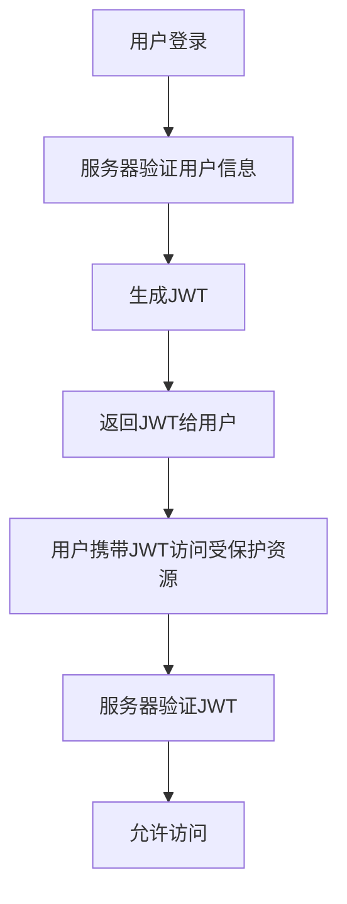
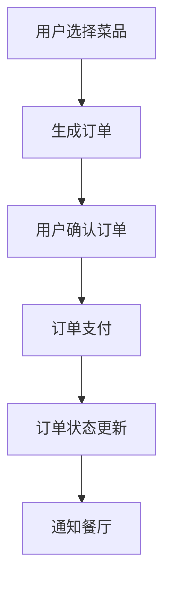

# 基于web的订餐系统的设计与实现

## 1.背景介绍

随着互联网技术的迅猛发展，基于Web的应用系统在各行各业中得到了广泛应用。订餐系统作为餐饮行业的重要组成部分，极大地提升了用户的订餐体验和餐厅的运营效率。本文将详细探讨基于Web的订餐系统的设计与实现，旨在为读者提供一个全面的技术指南。

## 2.核心概念与联系

在设计和实现基于Web的订餐系统时，需要理解以下核心概念：

### 2.1 用户角色

订餐系统涉及多个用户角色，包括普通用户、餐厅管理员和系统管理员。每个角色具有不同的权限和功能。

### 2.2 系统架构

系统架构通常采用三层架构，包括表示层、业务逻辑层和数据访问层。每一层都有其特定的职责和功能。

### 2.3 数据库设计

数据库是系统的核心，设计合理的数据库结构对于系统的性能和可扩展性至关重要。常见的数据库表包括用户表、餐厅表、菜单表、订单表等。

### 2.4 安全性

安全性是系统设计的重要考虑因素，包括用户认证、数据加密和防止SQL注入等。

## 3.核心算法原理具体操作步骤

### 3.1 用户认证算法

用户认证是确保系统安全的第一道防线。常用的用户认证算法包括基于JWT（JSON Web Token）的认证机制。

#### 3.1.1 JWT认证流程



### 3.2 订单处理算法

订单处理是订餐系统的核心功能之一。订单处理算法需要考虑订单的创建、修改、取消等操作。

#### 3.2.1 订单处理流程



## 4.数学模型和公式详细讲解举例说明

在订餐系统中，数学模型和公式主要用于推荐系统和数据分析。

### 4.1 推荐系统

推荐系统可以根据用户的历史订单数据，推荐用户可能喜欢的菜品。常用的推荐算法包括协同过滤算法。

#### 4.1.1 协同过滤算法

协同过滤算法可以分为基于用户的协同过滤和基于物品的协同过滤。其核心公式如下：

$$
\text{相似度}(u, v) = \frac{\sum_{i \in I} (r_{u,i} - \bar{r}_u)(r_{v,i} - \bar{r}_v)}{\sqrt{\sum_{i \in I} (r_{u,i} - \bar{r}_u)^2} \sqrt{\sum_{i \in I} (r_{v,i} - \bar{r}_v)^2}}
$$

其中，$r_{u,i}$ 表示用户 $u$ 对物品 $i$ 的评分，$\bar{r}_u$ 表示用户 $u$ 的平均评分。

### 4.2 数据分析

数据分析可以帮助餐厅了解用户的偏好和行为，从而优化菜单和服务。常用的分析方法包括统计分析和机器学习。

#### 4.2.1 统计分析

统计分析可以通过计算用户的平均消费金额、最受欢迎的菜品等指标，帮助餐厅做出决策。

$$
\text{平均消费金额} = \frac{\sum_{i=1}^{n} \text{消费金额}_i}{n}
$$

## 5.项目实践：代码实例和详细解释说明

### 5.1 用户认证代码实例

以下是一个基于JWT的用户认证代码实例：

```python
import jwt
import datetime

SECRET_KEY = 'your_secret_key'

def generate_jwt(user_id):
    payload = {
        'user_id': user_id,
        'exp': datetime.datetime.utcnow() + datetime.timedelta(hours=1)
    }
    token = jwt.encode(payload, SECRET_KEY, algorithm='HS256')
    return token

def verify_jwt(token):
    try:
        payload = jwt.decode(token, SECRET_KEY, algorithms=['HS256'])
        return payload['user_id']
    except jwt.ExpiredSignatureError:
        return None
    except jwt.InvalidTokenError:
        return None
```

### 5.2 订单处理代码实例

以下是一个订单处理的代码实例：

```python
class Order:
    def __init__(self, user_id, items):
        self.user_id = user_id
        self.items = items
        self.status = 'pending'
    
    def confirm_order(self):
        self.status = 'confirmed'
        # 其他订单确认逻辑

    def cancel_order(self):
        self.status = 'cancelled'
        # 其他订单取消逻辑

# 创建订单
order = Order(user_id=1, items=[{'item_id': 1, 'quantity': 2}, {'item_id': 2, 'quantity': 1}])
order.confirm_order()
```

## 6.实际应用场景

基于Web的订餐系统在实际应用中有广泛的场景，包括但不限于：

### 6.1 餐厅管理

餐厅可以通过订餐系统管理菜单、处理订单、分析用户数据，从而提高运营效率。

### 6.2 用户体验

用户可以通过订餐系统方便地浏览菜单、下单、支付和查看订单状态，提升了订餐体验。

### 6.3 数据分析

通过数据分析，餐厅可以了解用户的偏好和行为，从而优化菜单和服务，提升用户满意度。

## 7.工具和资源推荐

在设计和实现基于Web的订餐系统时，可以使用以下工具和资源：

### 7.1 开发工具

- **IDE**: PyCharm, Visual Studio Code
- **版本控制**: Git, GitHub

### 7.2 框架和库

- **Web框架**: Django, Flask
- **数据库**: MySQL, PostgreSQL
- **前端框架**: React, Vue.js

### 7.3 资源

- **文档**: 官方文档, Stack Overflow
- **教程**: Coursera, Udemy

## 8.总结：未来发展趋势与挑战

基于Web的订餐系统在未来有广阔的发展前景，但也面临一些挑战。

### 8.1 发展趋势

- **智能化**: 通过人工智能和机器学习技术，订餐系统可以实现智能推荐和自动化服务。
- **移动化**: 随着移动互联网的发展，订餐系统将更加注重移动端的用户体验。
- **个性化**: 通过数据分析，订餐系统可以提供个性化的服务和推荐，提升用户满意度。

### 8.2 挑战

- **安全性**: 随着系统功能的增加，安全性问题也变得更加复杂，需要不断提升安全防护措施。
- **性能优化**: 随着用户数量的增加，系统的性能优化将成为一个重要的挑战。
- **用户体验**: 如何在功能丰富的同时，保持简洁易用的用户界面，是一个需要持续探索的问题。

## 9.附录：常见问题与解答

### 9.1 如何处理高并发订单？

高并发订单处理可以通过以下几种方法实现：

- **负载均衡**: 使用负载均衡器将请求分发到多个服务器。
- **缓存**: 使用缓存技术减少数据库访问次数。
- **异步处理**: 使用异步处理技术提高系统响应速度。

### 9.2 如何确保数据安全？

确保数据安全可以通过以下几种方法实现：

- **数据加密**: 对敏感数据进行加密存储和传输。
- **用户认证**: 使用安全的用户认证机制，如JWT。
- **防止SQL注入**: 使用参数化查询防止SQL注入攻击。

### 9.3 如何优化系统性能？

优化系统性能可以通过以下几种方法实现：

- **数据库优化**: 通过索引、分区等技术优化数据库性能。
- **代码优化**: 通过代码重构和优化提高系统性能。
- **缓存**: 使用缓存技术减少数据库访问次数。

---

作者：禅与计算机程序设计艺术 / Zen and the Art of Computer Programming