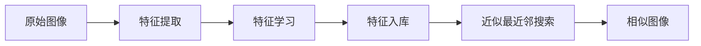

# 基于向量数据库的图像搜索技术进展

## 1.背景介绍

### 1.1 图像搜索的重要性
在互联网时代,随着数字图像数据的爆炸式增长,如何高效地检索和管理海量的图像数据成为了一个巨大的挑战。图像搜索技术应运而生,它可以帮助用户快速准确地从海量图像数据中找到所需的图像信息,在各行各业中发挥着越来越重要的作用。

### 1.2 传统图像搜索方法的局限性
传统的图像搜索方法主要基于关键词标签或者低层次视觉特征(如颜色、纹理等)进行检索,存在以下局限性:

1. 关键词标签依赖人工标注,成本高且主观性强 
2. 低层次视觉特征无法准确刻画图像语义内容
3. 难以应对海量数据规模,检索效率和精度都不高

### 1.3 基于深度学习的图像搜索
近年来,随着深度学习技术的飞速发展,出现了一系列基于深度学习的图像搜索方法。它们利用深度神经网络从大规模数据中自动学习高层次、语义化的图像特征表示,大大提升了图像搜索的精度和效率。典型的方法包括:

1. 基于卷积神经网络(CNN)的特征提取
2. 基于三元组损失、对比学习等的特征学习
3. 基于图像描述、图文匹配的跨模态检索

### 1.4 向量数据库助力图像搜索
尽管深度学习使得提取高质量图像特征成为可能,但在百亿、千亿级别的海量数据规模下,如何高效地进行相似性搜索仍是一大挑战。传统的关系型数据库无法满足超高维特征向量的快速检索需求。

向量数据库是一种专门针对高维向量数据的数据库系统,可以大幅提升图像特征的存储和检索效率。它将图像转化为语义向量存储,并利用向量索引和近似最近邻(ANN)搜索算法实现毫秒级的相似性检索。

本文将重点探讨基于向量数据库的图像搜索技术,分析其核心原理、关键算法、实践应用以及面临的机遇和挑战。

## 2.核心概念与联系

### 2.1 图像特征提取
图像特征提取是图像搜索的基础,其目标是将图像转化为一个紧致的特征向量表示,使得视觉上相似的图像在特征空间中距离更近。传统方法主要是手工设计一些视觉特征,如SIFT、SURF等。而基于深度学习的方法可以端到端地学习图像特征,更加语义化和鲁棒。常见的特征提取网络有:

- VGG
- ResNet
- EfficientNet
- Vision Transformer

### 2.2 特征学习范式
为了学习到更加有判别力的图像特征,需要合适的特征学习范式。主流的特征学习范式包括:

- 分类:将特征学习与图像分类任务相结合
- 度量学习:学习一个特征空间,使得相似图像的特征距离更近,不同图像的距离更远。代表性方法有对比学习、三元组损失等
- 跨模态学习:联合学习图像和文本的特征表示,实现图文匹配和跨模态检索

### 2.3 向量数据库
向量数据库是面向海量高维向量数据的数据库系统,针对向量数据的存储、索引和计算进行了专门优化。常见的向量数据库有:

- Faiss
- Milvus
- Vald
- Vespa

向量数据库通过对向量进行压缩、量化、聚类等操作,并使用图索引等数据结构,实现了高效的相似性搜索。

### 2.4 近似最近邻(ANN)搜索
在海量高维向量数据中,精确的最近邻搜索通常是不现实的。近似最近邻(ANN)搜索通过牺牲一定精度来换取大幅的效率提升,是向量数据库的核心算法之一。常见的ANN算法包括:

- 局部敏感哈希(LSH)
- 乘积量化(PQ)
- 图索引(HNSW、NSG等)

### 2.5 技术联系
基于向量数据库的图像搜索技术,融合了图像特征提取、特征学习、向量数据库和近似最近邻搜索等多个领域的最新进展。其核心流程可以概括为:



## 3.核心算法原理具体操作步骤

### 3.1 基于卷积神经网络的特征提取
1. 选择预训练的CNN模型,如ResNet50
2. 移除CNN的最后一层全连接层
3. 将图像输入CNN,提取倒数第二层的输出作为图像特征
4. 对特征进行L2归一化,得到单位特征向量

### 3.2 基于对比学习的特征学习
1. 构建图像的正负样本对,正样本是同一图像的不同增强版本,负样本是不同图像
2. 定义对比损失函数,使正样本的特征距离更近,负样本的距离更远
3. 端到端训练特征提取网络,优化对比损失函数
4. 使用训练好的网络提取图像特征

### 3.3 基于乘积量化的近似最近邻搜索
1. 将特征向量分割成若干子向量
2. 对每个子向量进行聚类,生成聚类中心作为码本
3. 用码本中最近的聚类中心替换每个子向量,得到量化后的特征
4. 在量化特征上建立倒排索引
5. 给定查询向量,计算其量化特征,然后在倒排索引中快速找到最近邻

## 4.数学模型和公式详细讲解举例说明

### 4.1 对比损失函数
给定一组N个图像的特征向量$\{x_i\}_{i=1}^N$,对比损失函数定义为:

$$
L = -\sum_{i=1}^N \log \frac{\exp(x_i \cdot x_{i+}/\tau)}{\exp(x_i \cdot x_{i+}/\tau) + \sum_{j=1}^{N-1} \exp(x_i \cdot x_{i-}^j/\tau)}
$$

其中$x_{i+}$是$x_i$的正样本特征,$x_{i-}^j$是负样本特征,$\tau$是温度超参数。这个损失函数鼓励正样本之间的点积相似度大于负样本。

### 4.2 乘积量化
假设$d$维特征向量$x$被均匀分割成$m$个$d/m$维的子向量$\{x^1, \dots, x^m\}$。对于每个子向量$x^i$,我们在码本$C^i=\{c_1^i, \dots, c_{k_i}^i\}$中找到最近的聚类中心$q^i(x)$对其进行量化:

$$
q^i(x) = \arg\min_{c \in C^i} \|x^i - c\|_2
$$

量化后的特征$q(x)$为各子向量量化结果的拼接:

$$
q(x) = [q^1(x), \dots, q^m(x)]
$$

在计算两个特征$x$和$y$的相似度时,我们用量化特征的非对称距离近似:

$$
D(x, y) \approx \sum_{i=1}^m \|x^i - q^i(y)\|_2^2
$$

这种非对称距离计算可以通过查表高效实现。

## 5.项目实践：代码实例和详细解释说明

下面是一个基于PyTorch和Faiss的图像搜索项目示例:

```python
import torch
import torch.nn as nn
import torchvision.models as models
import torchvision.transforms as transforms
import faiss

# 加载预训练的ResNet50模型
model = models.resnet50(pretrained=True)
model.fc = nn.Identity()  # 移除最后一层全连接
model.eval()

# 图像预处理
transform = transforms.Compose([
    transforms.Resize(256),
    transforms.CenterCrop(224),
    transforms.ToTensor(),
    transforms.Normalize(mean=[0.485, 0.456, 0.406], std=[0.229, 0.224, 0.225])
])

# 提取图像特征
def extract_feature(image):
    image = transform(image).unsqueeze(0)  # 预处理并增加批次维度
    with torch.no_grad():
        feature = model(image)
    feature = feature.squeeze().numpy()  # 移除批次维度并转为numpy数组
    feature /= np.linalg.norm(feature)  # L2归一化
    return feature

# 建立Faiss索引
index = faiss.IndexFlatL2(2048)  # 使用L2距离的精确索引

# 添加图像特征到索引库
for image in image_dataset:
    feature = extract_feature(image)
    index.add(feature.reshape(1,-1))  # 增加一个维度作为批次维度

# 执行最近邻搜索
query_feature = extract_feature(query_image)
distances, indices = index.search(query_feature.reshape(1,-1), k=10)  # 搜索top10最近邻
```

这个示例中,我们首先加载了预训练的ResNet50模型,并移除了最后一层全连接层,使其输出2048维的图像特征。然后定义了图像预处理的转换操作。

`extract_feature`函数对输入图像进行预处理,送入CNN提取特征,并对特征做L2归一化。

接下来,我们建立了一个Faiss的IndexFlatL2索引,它使用精确的L2距离进行最近邻搜索。我们遍历图像数据集,为每个图像提取特征并添加到索引库中。

最后,给定一个查询图像,我们提取其特征,然后在索引库中搜索top10最近邻图像,得到它们的距离和索引。

这个示例展示了图像搜索流程的端到端实现。在实际应用中,我们可以使用更大的数据集,更强的特征提取模型,以及基于PQ或HNSW的近似最近邻索引,以进一步提升搜索效率和精度。

## 6.实际应用场景

基于向量数据库的图像搜索技术可以应用于多种场景:

### 6.1 电商商品搜索
用户上传一张商品图片,快速搜索出视觉上相似的商品,提升购物体验。

### 6.2 图片版权保护
通过图像搜索技术,发现和识别网上的侵权盗用图片,保护原创者权益。

### 6.3 医学影像分析
对医学影像数据库进行相似性检索,帮助医生快速找到相似病例,辅助诊断和治疗。

### 6.4 智能相册管理
自动对用户的照片进行分类、标注和检索,方便用户管理和回忆美好瞬间。

### 6.5 视频内容分析
通过关键帧检索,实现视频去重、视频片段检索、视频版权保护等功能。

## 7.工具和资源推荐

### 7.1 图像特征提取工具
- PyTorch:https://pytorch.org/
- TensorFlow:https://www.tensorflow.org/
- OpenCV:https://opencv.org/

### 7.2 向量数据库
- Faiss:https://github.com/facebookresearch/faiss
- Milvus:https://milvus.io/
- Vald:https://github.com/vdaas/vald

### 7.3 数据集
- ImageNet:http://www.image-net.org/
- COCO:https://cocodataset.org/
- Flickr30k:http://shannon.cs.illinois.edu/DenotationGraph/

### 7.4 论文与教程
- Deep Learning for Content-Based Image Retrieval: A Comprehensive Study
- A Survey on Learning to Hash
- Vector Search Showdown: Milvus, Faiss, Elasticsearch, ScaNN, SPTAG

## 8.总结：未来发展趋势与挑战

基于向量数据库的图像搜索技术正在快速发展,并在学术和工业界得到广泛应用。未来的一些发展趋势包括:

1. 更强大的图像特征表示学习方法,如对比学习、知识蒸馏等
2. 更高效的向量数据库索引和查询算法,实现亿级以上向量的毫秒级检索
3. 多模态融合,联合文本、图像、视频等不同模态的特征进行跨模态检索
4. 端到端的图像搜索模型,直接从原始图像学习到