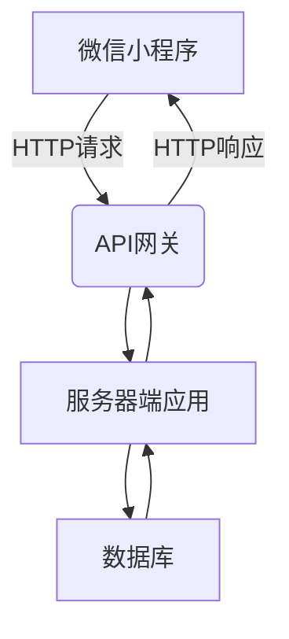

# 基于微信小程序的家政服务提供平台

## 1.背景介绍

随着城市化进程的不断推进和生活节奏的加快,人们对家政服务的需求日益增长。传统的家政服务模式存在着信息不对称、服务质量参差不齐、缺乏有效监管等问题,给消费者带来了诸多不便。因此,构建一个基于微信小程序的家政服务提供平台,能够有效解决这些问题,为用户提供更加便捷、高效、透明的家政服务体验。

## 2.核心概念与联系

### 2.1 微信小程序

微信小程序是一种无需下载安装即可使用的小型应用程序,可以在微信内被便捷地获取和传播。小程序开发可以用微信自身拥有的能力,如微信扫一扫、地理位置、微信支付等,无需申请权限即可直接调用。

### 2.2 家政服务平台

家政服务平台是一种将家政服务提供商和需求方连接起来的线上平台,用户可以根据自身需求在平台上发布服务需求,家政服务提供商则可以接受订单并提供相应的服务。平台负责对服务提供商进行审核和监管,确保服务质量。

### 2.3 系统架构

该家政服务平台基于微信小程序开发,整体架构可分为三个层次:

1. **前端层**:基于微信小程序框架开发,提供用户界面和交互功能。
2. **后端层**:包括服务器端应用程序和数据库,负责处理业务逻辑和数据存储。
3. **中间层**:作为前后端的通信媒介,处理数据传输和安全认证。



## 3.核心算法原理具体操作步骤  

### 3.1 服务匹配算法

为了更好地满足用户需求,系统需要一种高效的服务匹配算法,将用户需求与合适的服务提供商精准匹配。该算法的核心思想是基于用户需求和服务提供商的特征构建矩阵,然后使用相似度计算方法进行匹配。

1. 构建用户需求矩阵 $U$
2. 构建服务提供商特征矩阵 $S$  
3. 计算 $U$ 和 $S$ 的相似度矩阵 $R$:  
    $$R = U \cdot S^T$$
4. 对每一个用户需求,从 $R$ 中找到最大相似度值对应的服务提供商

### 3.2 评分排名算法  

为了提高服务质量和用户体验,平台需要一种科学的评分排名算法,对服务提供商进行客观评价和排名。该算法的核心是将多个评价指标综合计算得到一个总分值。

1. 确定评价指标及其权重,如服务质量 $w_1$、响应速度 $w_2$、 价格合理性 $w_3$等
2. 对每个指标评分,得到评分向量 $v = (v_1, v_2, v_3, ...)$
3. 计算加权评分 $S$:  
   $$S = \sum_{i=1}^{n}{w_i \cdot v_i}$$
4. 根据 $S$ 值对服务提供商进行排名

## 4.数学模型和公式详细讲解举例说明

### 4.1 服务匹配相似度计算

在服务匹配算法中,需要计算用户需求矩阵 $U$ 和服务提供商特征矩阵 $S$ 之间的相似度。常用的相似度计算方法有余弦相似度、欧几里得距离和Jaccard系数等。

以余弦相似度为例,对于 $U$ 中的第 $i$ 行向量 $u_i$ 和 $S$ 中的第 $j$ 列向量 $s_j$,它们的余弦相似度为:

$$\text{sim}(u_i, s_j) = \cos(\theta) = \frac{u_i \cdot s_j}{\|u_i\| \|s_j\|} = \frac{\sum_{k=1}^{n}{u_{ik}s_{jk}}}{\sqrt{\sum_{k=1}^{n}{u_{ik}^2}}\sqrt{\sum_{k=1}^{n}{s_{jk}^2}}}$$

其中 $\theta$ 为两个向量之间的夹角。相似度值越接近1,表示两个向量越相似。

### 4.2 服务质量评分模型

在评分排名算法中,我们需要建立一个合理的服务质量评分模型,将多个评价指标综合计算得到总分值。一种常见的方法是使用线性加权模型:

$$Q = w_1 \cdot q_1 + w_2 \cdot q_2 + \cdots + w_n \cdot q_n$$

其中 $Q$ 表示总分值, $q_i$ 表示第 $i$ 个评价指标的分数, $w_i$ 表示该指标的权重。权重的设置需要根据指标的重要程度进行调整。

例如,我们可以设置服务质量的权重为0.5、响应速度的权重为0.3、价格合理性的权重为0.2,则评分模型为:

$$Q = 0.5q_1 + 0.3q_2 + 0.2q_3$$

其中 $q_1$ 表示服务质量分数, $q_2$ 表示响应速度分数, $q_3$ 表示价格合理性分数。

## 5.项目实践: 代码实例和详细解释说明

### 5.1 服务匹配功能实现

以下是服务匹配算法在小程序中的实现示例(使用了简化的数据结构):

```javascript
// 用户需求数据
const userDemands = [
  { service: '家庭保洁', area: '浦东新区', budget: 200 },
  { service: '育儿服务', area: '静安区', budget: 300 }
];

// 服务提供商数据 
const providers = [
  { service: '家庭保洁', areas: ['浦东新区', '徐汇区'], priceRange: [150, 300] },
  { service: '育儿服务', areas: ['静安区', '长宁区'], priceRange: [250, 400] },
  { service: '家庭保洁', areas: ['黄浦区', '卢湾区'], priceRange: [180, 350] }
];

// 服务匹配函数
function matchService(demand) {
  const { service, area, budget } = demand;
  const matched = providers.filter(provider => {
    const serviceMatch = provider.service === service;
    const areaMatch = provider.areas.includes(area);
    const budgetMatch = provider.priceRange[0] <= budget && budget <= provider.priceRange[1];
    return serviceMatch && areaMatch && budgetMatch;
  });
  return matched;
}

// 使用示例
const demand1 = userDemands[0];
const matchedProviders1 = matchService(demand1);
console.log('匹配结果:', matchedProviders1);
```

在上面的示例中,我们首先定义了用户需求数据 `userDemands` 和服务提供商数据 `providers`。`matchService` 函数根据用户需求中的服务类型、地区和预算,过滤出符合条件的服务提供商。

该实现使用了JavaScript的数组方法 `filter` 进行数据过滤,可以根据实际需求进行优化和扩展,如引入矩阵计算等。

### 5.2 评分排名功能实现  

以下是评分排名算法在小程序中的实现示例:

```javascript
// 服务提供商评分数据
const providerScores = [
  { id: 1, quality: 4.7, responseTime: 4.2, fairPrice: 4.1 },
  { id: 2, quality: 4.5, responseTime: 4.8, fairPrice: 4.3 },
  { id: 3, quality: 4.2, responseTime: 4.1, fairPrice: 4.6 }
];

// 评分权重
const weights = {
  quality: 0.5,
  responseTime: 0.3,
  fairPrice: 0.2
};

// 评分排名函数
function rankProviders(providers) {
  return providers.sort((a, b) => {
    const scoreA = a.quality * weights.quality +
                   a.responseTime * weights.responseTime +
                   a.fairPrice * weights.fairPrice;
    const scoreB = b.quality * weights.quality +
                   b.responseTime * weights.responseTime +
                   b.fairPrice * weights.fairPrice;
    return scoreB - scoreA; // 降序排列
  });
}

// 使用示例
const rankedProviders = rankProviders(providerScores);
console.log('排名结果:', rankedProviders);
```

在上面的示例中,我们定义了服务提供商的评分数据 `providerScores` 和评分指标的权重 `weights`。`rankProviders` 函数根据权重对每个服务提供商的评分进行加权计算,然后对结果进行降序排序。

该实现使用了JavaScript的数组方法 `sort` 进行排序,并使用了箭头函数作为比较器。您可以根据实际需求调整评分指标和权重设置。

## 6.实际应用场景

基于微信小程序的家政服务提供平台可以广泛应用于以下场景:

1. **个人家庭服务**:用户可以在平台上发布家庭保洁、育儿服务、家电维修等需求,快速找到合适的服务提供商。

2. **社区服务**:小区物业可以在平台上发布公共区域保洁、绿化养护等服务需求,提高社区服务质量。

3. **企业服务**:企业可以在平台上发布办公室保洁、搬运服务等需求,提高办公环境质量和工作效率。

4. **特殊群体服务**:残疾人、老年人等特殊群体可以在平台上发布日常生活服务需求,获得更好的服务体验。

5. **临时劳务服务**:平台可以为建筑工地、活动现场等提供临时劳务服务,满足短期用工需求。

## 7.工具和资源推荐

在开发基于微信小程序的家政服务提供平台时,以下工具和资源可以为您提供帮助:

1. **微信开发者工具**: 一款官方提供的小程序开发工具,用于编写、测试和发布小程序。

2. **WeUI**: 一套同微信原生视觉体验一致的基础样式库,可以帮助开发者快速开发出界面精美、体验良好的小程序。

3. **Vant Weapp**: 一款基于 Vue 的小程序 UI 库,提供了丰富的组件和功能,可以加快开发效率。

4. **云开发**: 微信官方提供的一站式云端服务,包括云函数、云数据库等,可以简化后端开发流程。

5. **小程序社区**: 微信官方的开发者社区,可以获取最新资讯、提问求助、分享经验等。

6. **小程序开源项目**: 如 WePY、Taro 等开源框架,可以提高开发效率和代码质量。

## 8.总结: 未来发展趋势与挑战

基于微信小程序的家政服务提供平台具有广阔的发展前景,但也面临一些挑战:

1. **服务质量保障**: 如何建立有效的服务质量评价和监管机制,确保服务质量,是平台发展的关键。

2. **用户体验优化**: 持续优化用户体验,提高服务匹配精准度和交互流畅度,吸引更多用户使用。

3. **数据安全与隐私保护**: 加强数据安全和隐私保护措施,维护用户信任。

4. **服务范围拓展**: 不断扩展服务范围,覆盖更多类型的家政服务需求。

5. **智能化发展**: 利用人工智能等新技术,实现服务需求智能匹配、自动化服务流程等,提升服务效率。

6. **生态系统构建**: 与其他相关行业建立合作,构建完整的家政服务生态系统。

总的来说,基于微信小程序的家政服务提供平台前景广阔,但也需要不断创新和优化,以适应市场需求的变化和技术的发展。

## 9.附录: 常见问题与解答

1. **为什么选择基于微信小程序开发?**

   微信小程序具有无需安装、即用即走的优势,用户可以在微信内快速获取和使用。同时,小程序可以调用微信的原生能力,如地理位置、支付等,为开发提供了便利。此外,微信庞大的用户群体也为小程序带来了巨大的潜在用户基础。

2. **如何保证服务质量?**

   平台可以