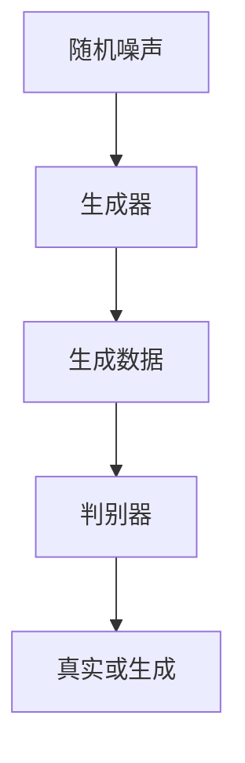

# 基于生成对抗网络的三维建模纹理风格化迁移技术

## 1.背景介绍

在计算机图形学和计算机视觉领域，三维建模和纹理风格化迁移技术一直是研究的热点。传统的三维建模方法通常需要大量的人工干预和专业知识，而纹理风格化迁移则需要复杂的算法和计算资源。近年来，生成对抗网络（GANs）的出现为这些问题提供了新的解决方案。GANs通过生成器和判别器的对抗训练，能够生成高质量的图像和三维模型，并且在纹理风格化迁移方面表现出色。

## 2.核心概念与联系

### 2.1 生成对抗网络（GANs）

生成对抗网络由生成器（Generator）和判别器（Discriminator）组成。生成器的目标是生成逼真的数据，而判别器的目标是区分真实数据和生成数据。两者通过对抗训练，最终生成器能够生成高质量的逼真数据。

### 2.2 三维建模

三维建模是指通过计算机软件创建三维物体的过程。传统的三维建模方法包括多边形建模、曲面建模和体素建模等。

### 2.3 纹理风格化迁移

纹理风格化迁移是指将一种图像的纹理风格迁移到另一种图像上。常见的方法包括基于卷积神经网络（CNN）的风格迁移算法。

### 2.4 核心联系

GANs可以用于三维建模和纹理风格化迁移，通过对抗训练生成高质量的三维模型和纹理风格化效果。

## 3.核心算法原理具体操作步骤

### 3.1 GANs的基本结构

GANs的基本结构包括生成器和判别器。生成器通过随机噪声生成数据，判别器则判断数据的真实性。



### 3.2 三维建模的GANs实现

1. **数据准备**：收集大量的三维模型数据。
2. **生成器设计**：设计生成器网络，输入为随机噪声，输出为三维模型。
3. **判别器设计**：设计判别器网络，输入为三维模型，输出为真假判断。
4. **对抗训练**：通过生成器和判别器的对抗训练，优化生成器生成高质量的三维模型。

### 3.3 纹理风格化迁移的GANs实现

1. **数据准备**：收集大量的纹理图像数据。
2. **生成器设计**：设计生成器网络，输入为原始图像和风格图像，输出为风格化图像。
3. **判别器设计**：设计判别器网络，输入为风格化图像，输出为真假判断。
4. **对抗训练**：通过生成器和判别器的对抗训练，优化生成器生成高质量的风格化图像。

## 4.数学模型和公式详细讲解举例说明

### 4.1 GANs的数学模型

GANs的目标是通过优化生成器和判别器的损失函数，使生成器生成的数据尽可能逼真。其损失函数定义如下：

$$
\min_G \max_D V(D, G) = \mathbb{E}_{x \sim p_{data}(x)}[\log D(x)] + \mathbb{E}_{z \sim p_z(z)}[\log(1 - D(G(z)))]
$$

其中，$G$ 是生成器，$D$ 是判别器，$p_{data}(x)$ 是真实数据的分布，$p_z(z)$ 是噪声的分布。

### 4.2 三维建模的数学模型

三维建模的GANs实现中，生成器的输入为随机噪声 $z$，输出为三维模型 $G(z)$。判别器的输入为三维模型 $x$，输出为真假判断 $D(x)$。

### 4.3 纹理风格化迁移的数学模型

纹理风格化迁移的GANs实现中，生成器的输入为原始图像 $I_{content}$ 和风格图像 $I_{style}$，输出为风格化图像 $G(I_{content}, I_{style})$。判别器的输入为风格化图像 $x$，输出为真假判断 $D(x)$。

## 5.项目实践：代码实例和详细解释说明

### 5.1 环境准备

首先，确保安装了必要的库，如 TensorFlow 或 PyTorch。

```python
import tensorflow as tf
from tensorflow.keras import layers
```

### 5.2 生成器的实现

```python
def build_generator():
    model = tf.keras.Sequential()
    model.add(layers.Dense(128, activation='relu', input_dim=100))
    model.add(layers.Reshape((4, 4, 8)))
    model.add(layers.Conv2DTranspose(64, kernel_size=4, strides=2, padding='same', activation='relu'))
    model.add(layers.Conv2DTranspose(32, kernel_size=4, strides=2, padding='same', activation='relu'))
    model.add(layers.Conv2D(3, kernel_size=3, padding='same', activation='tanh'))
    return model
```

### 5.3 判别器的实现

```python
def build_discriminator():
    model = tf.keras.Sequential()
    model.add(layers.Conv2D(32, kernel_size=3, strides=2, padding='same', input_shape=(32, 32, 3)))
    model.add(layers.LeakyReLU(alpha=0.2))
    model.add(layers.Conv2D(64, kernel_size=3, strides=2, padding='same'))
    model.add(layers.LeakyReLU(alpha=0.2))
    model.add(layers.Flatten())
    model.add(layers.Dense(1, activation='sigmoid'))
    return model
```

### 5.4 对抗训练

```python
def train_gan(generator, discriminator, epochs, batch_size):
    for epoch in range(epochs):
        noise = tf.random.normal([batch_size, 100])
        generated_images = generator(noise)
        real_images = get_real_images(batch_size)
        
        with tf.GradientTape() as tape:
            real_output = discriminator(real_images)
            fake_output = discriminator(generated_images)
            d_loss = discriminator_loss(real_output, fake_output)
        
        gradients = tape.gradient(d_loss, discriminator.trainable_variables)
        discriminator_optimizer.apply_gradients(zip(gradients, discriminator.trainable_variables))
        
        noise = tf.random.normal([batch_size, 100])
        with tf.GradientTape() as tape:
            generated_images = generator(noise)
            fake_output = discriminator(generated_images)
            g_loss = generator_loss(fake_output)
        
        gradients = tape.gradient(g_loss, generator.trainable_variables)
        generator_optimizer.apply_gradients(zip(gradients, generator.trainable_variables))
```

## 6.实际应用场景

### 6.1 游戏开发

在游戏开发中，三维建模和纹理风格化迁移技术可以用于生成逼真的游戏场景和角色，提高游戏的视觉效果和用户体验。

### 6.2 电影特效

在电影特效制作中，GANs可以用于生成高质量的三维模型和纹理效果，减少人工干预，提高制作效率。

### 6.3 虚拟现实

在虚拟现实应用中，GANs可以用于生成逼真的虚拟场景和角色，提高用户的沉浸感和体验。

## 7.工具和资源推荐

### 7.1 开源库

- TensorFlow
- PyTorch
- Keras

### 7.2 数据集

- ShapeNet
- COCO
- ImageNet

### 7.3 在线资源

- GitHub
- arXiv
- Kaggle

## 8.总结：未来发展趋势与挑战

### 8.1 未来发展趋势

随着计算能力的提高和算法的不断优化，基于GANs的三维建模和纹理风格化迁移技术将会越来越成熟，应用场景也会越来越广泛。

### 8.2 挑战

尽管GANs在三维建模和纹理风格化迁移方面表现出色，但仍然面临一些挑战，如训练不稳定、生成质量不高等问题。未来的研究将致力于解决这些问题，提高GANs的性能和应用效果。

## 9.附录：常见问题与解答

### 9.1 GANs的训练为什么不稳定？

GANs的训练不稳定主要是因为生成器和判别器的对抗训练过程容易导致梯度消失或爆炸。可以通过调整网络结构、优化算法和损失函数等方法来改善训练稳定性。

### 9.2 如何提高生成图像的质量？

可以通过增加生成器和判别器的网络深度、使用更好的优化算法和损失函数、增加训练数据量等方法来提高生成图像的质量。

### 9.3 GANs在三维建模中的应用有哪些限制？

GANs在三维建模中的应用主要受到计算资源和数据量的限制。需要大量的计算资源和高质量的三维模型数据来训练GANs。

作者：禅与计算机程序设计艺术 / Zen and the Art of Computer Programming