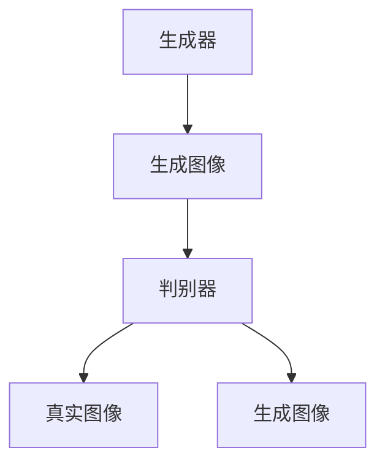

# 基于生成对抗网络的历史照片复原与风格迁移研究

## 1.背景介绍

### 1.1 历史照片的重要性

历史照片是记录人类历史的重要媒介，它们不仅保存了过去的瞬间，还为我们提供了宝贵的文化和社会信息。然而，随着时间的推移，这些照片往往会受到损坏、褪色和其他形式的劣化。如何有效地复原这些历史照片，成为了一个重要的研究课题。

### 1.2 生成对抗网络的兴起

生成对抗网络（Generative Adversarial Networks, GANs）是由Ian Goodfellow等人在2014年提出的一种深度学习模型。GANs通过两个神经网络——生成器（Generator）和判别器（Discriminator）——的对抗训练，能够生成高质量的图像。近年来，GANs在图像生成、图像修复和风格迁移等领域取得了显著的成果。

### 1.3 研究目标

本研究旨在利用生成对抗网络技术，探索历史照片的复原与风格迁移方法。通过深入研究GANs的核心算法和数学模型，结合实际项目实践，提供一套完整的解决方案，并探讨其在实际应用中的潜力和挑战。

## 2.核心概念与联系

### 2.1 生成对抗网络（GANs）

生成对抗网络由两个主要部分组成：生成器和判别器。生成器的目标是生成逼真的图像，而判别器的目标是区分真实图像和生成图像。两者通过对抗训练，不断提升各自的能力。

### 2.2 历史照片复原

历史照片复原是指通过技术手段，修复和增强受损的历史照片，使其恢复到接近原始状态的过程。这包括去噪、修复缺失部分、增强对比度等。

### 2.3 风格迁移

风格迁移是一种将一种图像的风格应用到另一种图像上的技术。通过风格迁移，可以将现代照片转换为具有历史风格的照片，或将历史照片转换为现代风格。

### 2.4 核心联系

生成对抗网络在历史照片复原和风格迁移中扮演了重要角色。通过GANs，可以实现高质量的图像生成和修复，同时也可以进行风格迁移，使得历史照片焕发新生。

## 3.核心算法原理具体操作步骤

### 3.1 生成对抗网络的基本结构

生成对抗网络由生成器和判别器组成。生成器负责生成图像，判别器负责区分真实图像和生成图像。两者通过对抗训练，不断提升各自的能力。



### 3.2 生成器的工作原理

生成器是一个神经网络，它接受一个随机噪声向量作为输入，通过一系列的卷积和反卷积操作，生成一张逼真的图像。生成器的目标是生成的图像能够欺骗判别器，使其认为是真实图像。

### 3.3 判别器的工作原理

判别器也是一个神经网络，它接受一张图像作为输入，通过一系列的卷积操作，输出一个概率值，表示该图像是真实图像的概率。判别器的目标是尽可能准确地区分真实图像和生成图像。

### 3.4 对抗训练过程

生成器和判别器通过对抗训练，不断提升各自的能力。生成器试图生成更逼真的图像，而判别器试图更准确地区分真实图像和生成图像。最终，生成器能够生成高质量的图像，判别器也能够准确地区分图像。

### 3.5 历史照片复原的具体步骤

1. 数据预处理：收集和整理历史照片数据，进行去噪、裁剪等预处理操作。
2. 模型训练：使用预处理后的数据训练生成对抗网络模型。
3. 图像生成：使用训练好的生成器生成复原后的历史照片。
4. 后处理：对生成的图像进行进一步的增强和修复。

### 3.6 风格迁移的具体步骤

1. 数据准备：收集具有不同风格的图像数据。
2. 模型训练：使用风格迁移算法训练生成对抗网络模型。
3. 风格应用：使用训练好的生成器将一种图像的风格应用到另一种图像上。
4. 后处理：对生成的图像进行进一步的调整和优化。

## 4.数学模型和公式详细讲解举例说明

### 4.1 生成对抗网络的数学模型

生成对抗网络的目标是通过对抗训练，使生成器生成的图像尽可能逼真。其数学模型可以表示为：

$$
\min_G \max_D V(D, G) = \mathbb{E}_{x \sim p_{data}(x)}[\log D(x)] + \mathbb{E}_{z \sim p_z(z)}[\log(1 - D(G(z)))]
$$

其中，$G$ 是生成器，$D$ 是判别器，$p_{data}(x)$ 是真实数据的分布，$p_z(z)$ 是噪声向量的分布。

### 4.2 生成器的损失函数

生成器的目标是生成能够欺骗判别器的图像，其损失函数可以表示为：

$$
L_G = -\mathbb{E}_{z \sim p_z(z)}[\log D(G(z))]
$$

### 4.3 判别器的损失函数

判别器的目标是尽可能准确地区分真实图像和生成图像，其损失函数可以表示为：

$$
L_D = -\mathbb{E}_{x \sim p_{data}(x)}[\log D(x)] - \mathbb{E}_{z \sim p_z(z)}[\log(1 - D(G(z)))]
$$

### 4.4 数学模型的具体应用

在历史照片复原中，生成器接受一张受损的历史照片作为输入，通过一系列的卷积和反卷积操作，生成复原后的照片。判别器接受一张照片作为输入，通过一系列的卷积操作，输出一个概率值，表示该照片是真实照片的概率。

在风格迁移中，生成器接受一张图像和一个风格向量作为输入，通过一系列的卷积和反卷积操作，生成具有目标风格的图像。判别器接受一张图像作为输入，通过一系列的卷积操作，输出一个概率值，表示该图像具有目标风格的概率。

## 5.项目实践：代码实例和详细解释说明

### 5.1 环境配置

在开始项目实践之前，需要配置好开发环境。以下是所需的主要工具和库：

- Python 3.x
- TensorFlow 或 PyTorch
- OpenCV
- NumPy

### 5.2 数据预处理

首先，需要对历史照片数据进行预处理。以下是一个简单的预处理代码示例：

```python
import cv2
import numpy as np

def preprocess_image(image_path):
    # 读取图像
    image = cv2.imread(image_path, cv2.IMREAD_GRAYSCALE)
    # 调整图像大小
    image = cv2.resize(image, (256, 256))
    # 归一化
    image = image / 255.0
    return image

# 示例
image_path = 'path_to_historical_photo.jpg'
preprocessed_image = preprocess_image(image_path)
```

### 5.3 模型定义

接下来，定义生成器和判别器模型。以下是使用TensorFlow定义的生成器和判别器模型示例：

```python
import tensorflow as tf
from tensorflow.keras import layers

def build_generator():
    model = tf.keras.Sequential()
    model.add(layers.Dense(256 * 16 * 16, use_bias=False, input_shape=(100,)))
    model.add(layers.BatchNormalization())
    model.add(layers.LeakyReLU())
    model.add(layers.Reshape((16, 16, 256)))
    model.add(layers.Conv2DTranspose(128, (5, 5), strides=(2, 2), padding='same', use_bias=False))
    model.add(layers.BatchNormalization())
    model.add(layers.LeakyReLU())
    model.add(layers.Conv2DTranspose(64, (5, 5), strides=(2, 2), padding='same', use_bias=False))
    model.add(layers.BatchNormalization())
    model.add(layers.LeakyReLU())
    model.add(layers.Conv2DTranspose(1, (5, 5), strides=(2, 2), padding='same', use_bias=False, activation='tanh'))
    return model

def build_discriminator():
    model = tf.keras.Sequential()
    model.add(layers.Conv2D(64, (5, 5), strides=(2, 2), padding='same', input_shape=[256, 256, 1]))
    model.add(layers.LeakyReLU())
    model.add(layers.Dropout(0.3))
    model.add(layers.Conv2D(128, (5, 5), strides=(2, 2), padding='same'))
    model.add(layers.LeakyReLU())
    model.add(layers.Dropout(0.3))
    model.add(layers.Flatten())
    model.add(layers.Dense(1))
    return model

# 示例
generator = build_generator()
discriminator = build_discriminator()
```

### 5.4 模型训练

定义好模型后，进行模型训练。以下是一个简单的训练代码示例：

```python
import tensorflow as tf

# 损失函数
cross_entropy = tf.keras.losses.BinaryCrossentropy(from_logits=True)

def generator_loss(fake_output):
    return cross_entropy(tf.ones_like(fake_output), fake_output)

def discriminator_loss(real_output, fake_output):
    real_loss = cross_entropy(tf.ones_like(real_output), real_output)
    fake_loss = cross_entropy(tf.zeros_like(fake_output), fake_output)
    total_loss = real_loss + fake_loss
    return total_loss

# 优化器
generator_optimizer = tf.keras.optimizers.Adam(1e-4)
discriminator_optimizer = tf.keras.optimizers.Adam(1e-4)

# 训练步骤
@tf.function
def train_step(images):
    noise = tf.random.normal([BATCH_SIZE, noise_dim])

    with tf.GradientTape() as gen_tape, tf.GradientTape() as disc_tape:
        generated_images = generator(noise, training=True)

        real_output = discriminator(images, training=True)
        fake_output = discriminator(generated_images, training=True)

        gen_loss = generator_loss(fake_output)
        disc_loss = discriminator_loss(real_output, fake_output)

    gradients_of_generator = gen_tape.gradient(gen_loss, generator.trainable_variables)
    gradients_of_discriminator = disc_tape.gradient(disc_loss, discriminator.trainable_variables)

    generator_optimizer.apply_gradients(zip(gradients_of_generator, generator.trainable_variables))
    discriminator_optimizer.apply_gradients(zip(gradients_of_discriminator, discriminator.trainable_variables))

# 训练循环
def train(dataset, epochs):
    for epoch in range(epochs):
        for image_batch in dataset:
            train_step(image_batch)

# 示例
EPOCHS = 50
BATCH_SIZE = 64
noise_dim = 100

# 假设 dataset 是一个包含预处理后图像的 tf.data.Dataset 对象
train(dataset, EPOCHS)
```

### 5.5 图像生成

训练完成后，可以使用生成器生成复原后的历史照片。以下是一个简单的图像生成代码示例：

```python
import matplotlib.pyplot as plt

def generate_and_save_images(model, epoch, test_input):
    predictions = model(test_input, training=False)

    fig = plt.figure(figsize=(4, 4))

    for i in range(predictions.shape[0]):
        plt.subplot(4, 4, i+1)
        plt.imshow(predictions[i, :, :, 0] * 127.5 + 127.5, cmap='gray')
        plt.axis('off')

    plt.savefig('image_at_epoch_{:04d}.png'.format(epoch))
    plt.show()

# 示例
seed = tf.random.normal([16, noise_dim])
generate_and_save_images(generator, EPOCHS, seed)
```

## 6.实际应用场景

### 6.1 历史照片修复

生成对抗网络可以用于修复受损的历史照片，包括去噪、修复缺失部分和增强对比度等。通过GANs，可以自动化地处理大量历史照片，提高修复效率和质量。

### 6.2 风格迁移

风格迁移技术可以将现代照片转换为具有历史风格的照片，或将历史照片转换为现代风格。这在艺术创作、电影制作和游戏开发等领域具有广泛的应用前景。

### 6.3 文化遗产保护

通过复原和风格迁移技术，可以更好地保护和展示文化遗产。复原后的历史照片可以用于博物馆展览、教育和研究等领域，帮助人们更好地了解和传承历史文化。

### 6.4 医学图像处理

生成对抗网络还可以应用于医学图像处理，如修复受损的医学图像、增强图像质量和进行风格迁移等。这有助于提高医学诊断的准确性和效率。

## 7.工具和资源推荐

### 7.1 开发工具

- **TensorFlow**：一个开源的深度学习框架，适用于构建和训练生成对抗网络。
- **PyTorch**：另一个流行的深度学习框架，具有灵活性和易用性。
- **OpenCV**：一个开源的计算机视觉库，适用于图像处理和预处理。

### 7.2 数据集

- **CelebA**：一个包含大量名人面部图像的数据集，适用于训练生成对抗网络。
- **MNIST**：一个包含手写数字图像的数据集，适用于初学者进行GANs的实验。
- **Historical Photographs**：可以从博物馆、图书馆和在线资源中获取历史照片数据集。

### 7.3 在线资源

- **GitHub**：可以在GitHub上找到许多开源的GANs项目和代码示例。
- **arXiv**：一个开放的学术论文预印本平台，可以查阅最新的GANs研究论文。
- **Coursera**：提供许多深度学习和生成对抗网络的在线课程。

## 8.总结：未来发展趋势与挑战

### 8.1 未来发展趋势

生成对抗网络在图像生成、图像修复和风格迁移等领域具有广阔的应用前景。未来，随着深度学习技术的不断发展，GANs的性能和应用范围将进一步提升。以下是一些可能的发展趋势：

- **多模态生成**：未来的GANs可能不仅限于图像生成，还可以生成视频、音频和文本等多种模态的数据。
- **自监督学习**：通过自监督学习，可以减少对标注数据的依赖，提高模型的泛化能力。
- **跨领域应用**：GANs的应用将不仅限于图像处理，还可以扩展到医学、金融、娱乐等多个领域。

### 8.2 挑战与问题

尽管生成对抗网络在许多领域取得了显著的成果，但仍然面临一些挑战和问题：

- **训练不稳定**：GANs的训练过程往往不稳定，容易出现模式崩溃和梯度消失等问题。
- **数据需求高**：GANs的训练需要大量高质量的数据，数据的获取和标注成本较高。
- **计算资源需求高**：GANs的训练过程需要大量的计算资源，对硬件设备要求较高。

## 9.附录：常见问题与解答

### 9.1 什么是生成对抗网络？

生成对抗网络（GANs）是一种深度学习模型，通过生成器和判别器的对抗训练，能够生成高质量的图像。

### 9.2 如何解决GANs训练不稳定的问题？

可以通过使用改进的损失函数、正则化技术和优化算法等方法，来提高GANs的训练稳定性。

### 9.3 GANs在历史照片复原中的应用有哪些优势？

GANs可以自动化地处理大量历史照片，提高修复效率和质量，同时能够生成高质量的复原图像。

### 9.4 风格迁移的应用场景有哪些？

风格迁移可以应用于艺术创作、电影制作、游戏开发和文化遗产保护等领域。

### 9.5 如何获取历史照片数据集？

可以从博物馆、图书馆和在线资源中获取历史照片数据集，如Google Arts & Culture、Europeana等。

---

作者：禅与计算机程序设计艺术 / Zen and the Art of Computer Programming