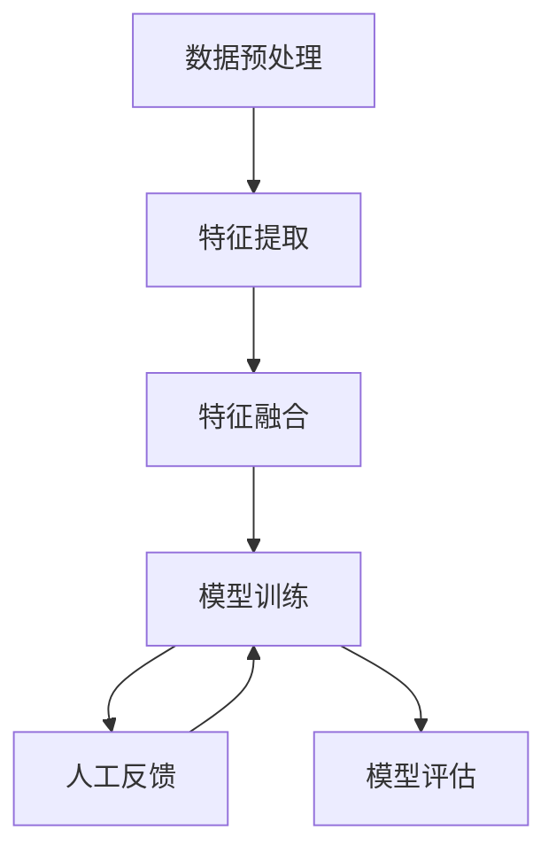

# 多模态大模型：技术原理与实战 基于人工反馈的强化学习

## 1.背景介绍

在人工智能领域，多模态大模型（Multimodal Large Models, MLMs）正逐渐成为研究和应用的热点。多模态大模型能够处理和理解多种类型的数据，如文本、图像、音频和视频等，从而实现更为复杂和智能的任务。基于人工反馈的强化学习（Reinforcement Learning with Human Feedback, RLHF）则是提升多模态大模型性能的重要方法之一。本文将深入探讨多模态大模型的技术原理与实战，特别是基于人工反馈的强化学习的应用。

## 2.核心概念与联系

### 2.1 多模态大模型

多模态大模型是指能够处理和理解多种类型数据的模型。它们通常基于深度学习技术，能够从不同模态的数据中提取特征，并进行融合和推理。常见的多模态数据包括文本、图像、音频和视频等。

### 2.2 强化学习

强化学习是一种通过与环境交互来学习策略的机器学习方法。它通过奖励和惩罚机制来优化策略，使得智能体能够在特定任务中获得最大化的累积奖励。

### 2.3 人工反馈

人工反馈是指人类对模型输出的评价和建议。这种反馈可以用于指导模型的训练，帮助模型更好地理解和处理复杂任务。

### 2.4 多模态大模型与强化学习的联系

多模态大模型与强化学习的结合可以实现更为智能和高效的任务处理。通过引入人工反馈，强化学习可以更快地收敛，并且模型的性能也会显著提升。

## 3.核心算法原理具体操作步骤

### 3.1 数据预处理

数据预处理是多模态大模型训练的第一步。不同模态的数据需要进行不同的预处理步骤，如文本的分词和向量化，图像的归一化和增强，音频的特征提取等。

### 3.2 特征提取

特征提取是指从原始数据中提取有用的信息。对于多模态数据，通常需要使用不同的神经网络结构来提取特征，如卷积神经网络（CNN）用于图像特征提取，循环神经网络（RNN）用于文本特征提取等。

### 3.3 特征融合

特征融合是将不同模态的特征进行组合和融合的过程。常见的方法包括加权平均、拼接和注意力机制等。

### 3.4 模型训练

模型训练是指通过优化算法来调整模型参数，使得模型能够在特定任务中表现良好。强化学习中的策略梯度方法、Q学习等都是常用的优化算法。

### 3.5 人工反馈的引入

人工反馈可以通过多种方式引入，如直接评价模型输出、提供示例和建议等。这些反馈可以用于调整模型的损失函数，从而指导模型的训练。

### 3.6 模型评估

模型评估是指通过一系列指标来评估模型的性能。常见的评估指标包括准确率、召回率、F1分数等。

以下是多模态大模型训练流程的Mermaid流程图：



## 4.数学模型和公式详细讲解举例说明

### 4.1 强化学习的基本公式

强化学习的核心是策略 $\pi$ 和价值函数 $V$。策略 $\pi$ 是指在状态 $s$ 下选择动作 $a$ 的概率分布，价值函数 $V$ 是指在状态 $s$ 下的期望累积奖励。

$$
\pi(a|s) = P(A_t = a | S_t = s)
$$

$$
V(s) = \mathbb{E}[R_t | S_t = s]
$$

### 4.2 Q学习

Q学习是一种无模型的强化学习算法。它通过更新Q值来学习最优策略。Q值表示在状态 $s$ 下选择动作 $a$ 的期望累积奖励。

$$
Q(s, a) = \mathbb{E}[R_t + \gamma \max_{a'} Q(S_{t+1}, a') | S_t = s, A_t = a]
$$

其中，$\gamma$ 是折扣因子，$R_t$ 是即时奖励。

### 4.3 策略梯度方法

策略梯度方法是通过优化策略 $\pi$ 来最大化累积奖励。策略梯度的更新公式为：

$$
\nabla J(\theta) = \mathbb{E}[\nabla \log \pi_\theta(a|s) Q(s, a)]
$$

其中，$J(\theta)$ 是累积奖励的期望，$\theta$ 是策略的参数。

### 4.4 人工反馈的引入

人工反馈可以通过调整损失函数来引入。假设 $L$ 是原始损失函数，$H$ 是人工反馈，则新的损失函数为：

$$
L' = L + \lambda H
$$

其中，$\lambda$ 是权重参数，用于平衡原始损失和人工反馈。

## 5.项目实践：代码实例和详细解释说明

### 5.1 数据预处理

```python
import numpy as np
import pandas as pd
from sklearn.preprocessing import StandardScaler

# 加载数据
data = pd.read_csv('data.csv')

# 文本预处理
def preprocess_text(text):
    # 分词、去停用词等
    return processed_text

data['text'] = data['text'].apply(preprocess_text)

# 图像预处理
def preprocess_image(image):
    # 归一化、增强等
    return processed_image

data['image'] = data['image'].apply(preprocess_image)

# 音频预处理
def preprocess_audio(audio):
    # 特征提取等
    return processed_audio

data['audio'] = data['audio'].apply(preprocess_audio)
```

### 5.2 特征提取

```python
from keras.models import Model
from keras.layers import Input, Dense, Conv2D, Flatten, LSTM, Embedding

# 文本特征提取
text_input = Input(shape=(max_len,))
text_embedding = Embedding(input_dim=vocab_size, output_dim=embedding_dim)(text_input)
text_lstm = LSTM(units=128)(text_embedding)

# 图像特征提取
image_input = Input(shape=(height, width, channels))
image_conv = Conv2D(filters=32, kernel_size=(3, 3), activation='relu')(image_input)
image_flatten = Flatten()(image_conv)

# 音频特征提取
audio_input = Input(shape=(audio_length,))
audio_dense = Dense(units=128, activation='relu')(audio_input)

# 特征融合
merged = concatenate([text_lstm, image_flatten, audio_dense])
output = Dense(units=num_classes, activation='softmax')(merged)

# 模型定义
model = Model(inputs=[text_input, image_input, audio_input], outputs=output)
model.compile(optimizer='adam', loss='categorical_crossentropy', metrics=['accuracy'])
```

### 5.3 模型训练

```python
# 模型训练
model.fit([text_data, image_data, audio_data], labels, epochs=10, batch_size=32)
```

### 5.4 人工反馈的引入

```python
# 假设我们有一个人工反馈函数
def human_feedback(predictions, true_labels):
    feedback = []
    for pred, true in zip(predictions, true_labels):
        if pred != true:
            feedback.append(-1)  # 负反馈
        else:
            feedback.append(1)   # 正反馈
    return np.array(feedback)

# 获取模型预测
predictions = model.predict([text_data, image_data, audio_data])

# 获取人工反馈
feedback = human_feedback(predictions, labels)

# 调整损失函数
def custom_loss(y_true, y_pred):
    base_loss = keras.losses.categorical_crossentropy(y_true, y_pred)
    feedback_loss = keras.backend.mean(feedback)
    return base_loss + lambda * feedback_loss

# 重新编译模型
model.compile(optimizer='adam', loss=custom_loss, metrics=['accuracy'])

# 重新训练模型
model.fit([text_data, image_data, audio_data], labels, epochs=10, batch_size=32)
```

## 6.实际应用场景

### 6.1 医疗诊断

多模态大模型可以用于医疗诊断，通过结合患者的病历文本、医学影像和基因数据，提供更为准确的诊断结果。

### 6.2 自动驾驶

在自动驾驶领域，多模态大模型可以结合摄像头图像、激光雷达数据和GPS信息，实现更为智能的驾驶决策。

### 6.3 智能客服

智能客服系统可以利用多模态大模型，结合用户的文本输入、语音输入和历史交互记录，提供更为智能和个性化的服务。

### 6.4 安防监控

在安防监控领域，多模态大模型可以结合视频监控、音频监控和传感器数据，实现更为智能的异常检测和预警。

## 7.工具和资源推荐

### 7.1 开源框架

- TensorFlow: 一个广泛使用的深度学习框架，支持多模态数据处理。
- PyTorch: 另一个流行的深度学习框架，具有灵活的动态计算图。
- Keras: 一个高层神经网络API，能够快速构建和训练多模态大模型。

### 7.2 数据集

- COCO: 一个常用的图像数据集，包含丰富的图像和标注信息。
- LibriSpeech: 一个大型的语音数据集，适用于语音识别和合成任务。
- SQuAD: 一个广泛使用的问答数据集，适用于自然语言处理任务。

### 7.3 工具

- Jupyter Notebook: 一个交互式的编程环境，适用于数据分析和模型训练。
- Google Colab: 一个免费的云端编程环境，支持GPU加速。
- VSCode: 一个流行的代码编辑器，具有丰富的插件和扩展。

## 8.总结：未来发展趋势与挑战

### 8.1 未来发展趋势

多模态大模型和基于人工反馈的强化学习在未来有着广阔的发展前景。随着数据量的增加和计算能力的提升，多模态大模型将能够处理更为复杂和多样化的任务。基于人工反馈的强化学习将进一步提升模型的性能，使得模型能够更好地适应实际应用场景。

### 8.2 挑战

尽管多模态大模型和基于人工反馈的强化学习有着广阔的前景，但仍然面临一些挑战。首先，多模态数据的获取和处理成本较高，需要大量的计算资源。其次，人工反馈的质量和数量对模型的性能有着重要影响，如何有效地获取和利用人工反馈是一个重要问题。最后，多模态大模型的训练和优化过程复杂，需要深入的理论研究和实践经验。

## 9.附录：常见问题与解答

### 9.1 多模态大模型的训练时间长怎么办？

多模态大模型的训练时间较长，可以通过以下方法进行优化：
- 使用更高效的硬件设备，如GPU和TPU。
- 采用分布式训练，利用多台机器进行并行计算。
- 使用预训练模型，减少训练时间。

### 9.2 如何获取高质量的人工反馈？

高质量的人工反馈可以通过以下途径获取：
- 组织专家团队，对模型输出进行评价和建议。
- 采用众包平台，收集大量用户的反馈。
- 设计用户友好的反馈界面，方便用户提供反馈。

### 9.3 多模态大模型在实际应用中如何部署？

多模态大模型的部署可以通过以下步骤进行：
- 将模型导出为可部署的格式，如ONNX或TensorFlow SavedModel。
- 使用Docker容器化模型，方便部署和管理。
- 利用云服务平台，如AWS、Google Cloud和Azure，进行模型的在线部署和服务。

作者：禅与计算机程序设计艺术 / Zen and the Art of Computer Programming