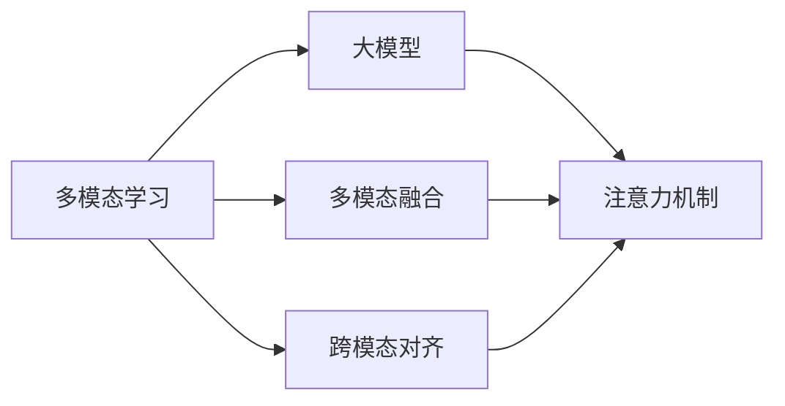

# 多模态大模型：技术原理与实战 多模态大模型的效果评估

## 1. 背景介绍
### 1.1 多模态大模型的兴起
近年来,随着人工智能技术的快速发展,多模态大模型(Multimodal Large Models)成为了学术界和工业界的研究热点。多模态大模型旨在通过融合文本、图像、语音等多种模态的信息,构建更加全面和强大的人工智能系统。这种模型能够处理和理解多种形式的数据,具有广阔的应用前景。

### 1.2 多模态大模型的重要性
多模态大模型的重要性体现在以下几个方面:

1. 更接近人类认知方式:人类感知世界信息的方式是多模态的,我们可以通过文字、图像、声音等多种渠道获取信息。多模态大模型通过融合多种模态的信息,更接近人类的认知方式,有助于构建更加智能和人性化的AI系统。

2. 提升模型性能:不同模态的信息可以相互补充和验证,融合多模态信息可以提升模型的性能。例如,在图像分类任务中,结合图像和文本描述信息可以提高分类的准确率。

3. 拓展应用场景:多模态大模型能够处理多种形式的数据,拓展了人工智能的应用场景。例如,在智能客服系统中,多模态大模型可以同时处理文本、语音、图像等多种形式的用户输入,提供更加全面和智能的服务。

### 1.3 本文的目的和结构
本文旨在全面探讨多模态大模型的技术原理和实践应用,重点关注多模态大模型的效果评估。全文将分为以下几个部分:

1. 背景介绍:介绍多模态大模型的研究背景和重要性。
2. 核心概念与联系:阐述多模态大模型涉及的核心概念,以及这些概念之间的联系。 
3. 核心算法原理和具体操作步骤:详细介绍多模态大模型的核心算法原理,并给出具体的操作步骤。
4. 数学模型和公式详细讲解举例说明:对多模态大模型涉及的数学模型和公式进行详细讲解,并给出具体的举例说明。
5. 项目实践:代码实例和详细解释说明:提供多模态大模型的代码实例,并对关键代码进行详细的解释说明。
6. 实际应用场景:探讨多模态大模型在实际应用中的场景和案例。
7. 工具和资源推荐:推荐多模态大模型相关的工具和学习资源。
8. 总结:未来发展趋势与挑战:总结全文,并展望多模态大模型未来的发展趋势和面临的挑战。
9. 附录:常见问题与解答:对多模态大模型的常见问题进行解答。

## 2. 核心概念与联系
### 2.1 多模态学习
多模态学习(Multimodal Learning)是指融合多种模态(如文本、图像、语音等)的信息,进行联合学习和推理的过程。多模态学习旨在利用不同模态数据之间的互补性和关联性,构建更加全面和准确的模型。

### 2.2 大模型
大模型(Large Models)是指参数量巨大、结构复杂的深度学习模型。这些模型通常在海量数据上进行预训练,具有强大的表示能力和泛化能力。典型的大模型包括BERT、GPT、ViT等。

### 2.3 多模态融合
多模态融合(Multimodal Fusion)是指将不同模态的特征表示进行整合,形成一个统一的多模态表示。常见的多模态融合方法包括早期融合、晚期融合和混合融合等。

### 2.4 跨模态对齐
跨模态对齐(Cross-modal Alignment)是指在多模态学习中,将不同模态的特征映射到一个共享的语义空间,使得不同模态的特征具有相似的语义表示。这种对齐可以增强模态之间的语义关联性。

### 2.5 注意力机制
注意力机制(Attention Mechanism)是一种用于聚焦关键信息的机制。在多模态大模型中,注意力机制可以用于捕捉不同模态之间的关联性,以及不同模态内部的重要特征。

### 2.6 概念之间的联系
下图展示了多模态大模型中核心概念之间的联系:

从图中可以看出,多模态学习是多模态大模型的基础,它涉及大模型、多模态融合和跨模态对齐等核心概念。而注意力机制则在大模型、多模态融合和跨模态对齐中发挥重要作用,用于捕捉关键信息和建立模态之间的关联性。

## 3. 核心算法原理具体操作步骤
### 3.1 多模态预训练
多模态预训练是指在大规模多模态数据上对模型进行预训练,以学习通用的多模态表示。常见的多模态预训练算法包括:

1. CLIP(Contrastive Language-Image Pre-training):通过对比学习,将图像和文本映射到同一个语义空间,学习它们之间的对应关系。
2. ViLBERT(Vision-and-Language BERT):将BERT模型扩展到视觉和语言领域,通过掩码语言建模和图像-文本匹配任务进行预训练。
3. LXMERT(Learning Cross-Modality Encoder Representations from Transformers):使用Transformer结构,通过掩码语言建模、图像-文本匹配和跨模态对齐任务进行预训练。

多模态预训练的具体操作步骤如下:

1. 准备大规模的多模态数据集,如图像-文本对。
2. 设计预训练任务,如掩码语言建模、图像-文本匹配等。
3. 构建多模态模型,如基于Transformer的编码器结构。
4. 在多模态数据上对模型进行预训练,优化预训练任务的损失函数。
5. 保存预训练得到的多模态表示,用于下游任务的微调。

### 3.2 多模态融合
多模态融合的目的是将不同模态的特征整合为一个统一的表示。常见的多模态融合方法包括:

1. 早期融合:直接将不同模态的原始特征拼接起来,作为模型的输入。
2. 晚期融合:对每个模态分别建模,得到各自的决策结果,再将这些决策结果进行融合。
3. 混合融合:在模型的中间层对不同模态的特征进行融合,如使用注意力机制进行加权融合。

多模态融合的具体操作步骤如下:

1. 对每个模态的数据进行特征提取,得到各自的特征表示。
2. 根据选择的融合方式,设计融合模块,如拼接、注意力机制等。
3. 将不同模态的特征输入到融合模块中,得到融合后的多模态表示。
4. 将融合后的表示输入到下游任务的模型中,进行训练和预测。

### 3.3 跨模态对齐
跨模态对齐旨在将不同模态映射到一个共享的语义空间,增强模态之间的语义关联性。常见的跨模态对齐方法包括:

1. 对偶学习:学习将不同模态映射到同一个语义空间的映射函数,使得相似的样本在语义空间中距离较近。
2. 对抗学习:通过生成器和判别器的对抗学习,将不同模态映射到同一个分布,实现跨模态对齐。
3. 正则化方法:通过正则化项鼓励不同模态的特征具有相似的统计特性,如相似的均值和方差。

跨模态对齐的具体操作步骤如下:

1. 准备成对的多模态数据,如图像-文本对。
2. 设计跨模态对齐的损失函数,如对偶损失、对抗损失或正则化损失。
3. 构建跨模态对齐模块,如映射函数、生成器和判别器等。
4. 在成对的多模态数据上训练跨模态对齐模块,优化相应的损失函数。
5. 将对齐后的多模态表示用于下游任务,如跨模态检索、跨模态生成等。

## 4. 数学模型和公式详细讲解举例说明
### 4.1 对比学习
对比学习是一种常用的跨模态对齐方法,其核心思想是最大化正样本对的相似度,同时最小化负样本对的相似度。以CLIP模型为例,其损失函数可以表示为:

$$
L = -\frac{1}{N}\sum_{i=1}^N \log \frac{\exp(\text{sim}(I_i, T_i)/\tau)}{\sum_{j=1}^N \exp(\text{sim}(I_i, T_j)/\tau)}
$$

其中,$I_i$和$T_i$分别表示第$i$个图像和文本的特征表示,$\text{sim}(\cdot,\cdot)$表示余弦相似度,$\tau$是温度超参数,$N$是批次大小。

这个损失函数鼓励匹配的图像-文本对具有高相似度,而不匹配的图像-文本对具有低相似度。通过优化这个损失函数,可以将图像和文本映射到同一个语义空间,实现跨模态对齐。

举例说明:假设有一个图像-文本对$(I_1, T_1)$,其中图像$I_1$是一只猫的图片,文本$T_1$是"一只可爱的小猫"。通过对比学习,模型将学习到图像$I_1$和文本$T_1$在语义空间中应该距离较近,而与其他不相关的图像或文本(如狗的图片或"一辆汽车"的文本)距离较远。

### 4.2 注意力机制
注意力机制是一种常用的融合方法,可以自适应地为不同模态的特征分配权重。以多头注意力为例,其公式可以表示为:

$$
\text{Attention}(Q,K,V) = \text{softmax}(\frac{QK^T}{\sqrt{d_k}})V
$$

其中,$Q$,$K$,$V$分别表示查询、键、值矩阵,$d_k$是键向量的维度。

在多模态融合中,可以将不同模态的特征作为查询、键、值矩阵,通过注意力机制计算不同模态之间的关联性,并根据关联性对特征进行加权融合。

举例说明:假设有一个图像特征矩阵$I$和一个文本特征矩阵$T$,通过将$I$作为查询矩阵,$T$作为键矩阵和值矩阵,可以计算图像特征对文本特征的注意力权重。这些权重表示了图像中的不同区域与文本中的不同词之间的关联性。根据这些权重,可以对文本特征进行加权融合,得到与图像相关的文本表示。

### 4.3 对抗学习
对抗学习是一种常用的跨模态对齐方法,其核心思想是通过生成器和判别器的博弈,将不同模态映射到同一个分布。以条件生成对抗网络(CGAN)为例,其损失函数可以表示为:

$$
\min_G \max_D \mathbb{E}_{x \sim p_{\text{data}}(x)}[\log D(x|y)] + \mathbb{E}_{z \sim p_z(z)}[\log(1-D(G(z|y)|y))]
$$

其中,$G$是生成器,$D$是判别器,$x$是真实样本,$y$是条件(如文本描述),$z$是随机噪声。

在跨模态对齐中,可以将一个模态(如文本)作为条件,另一个模态(如图像)作为生成目标。通过训练生成器生成与条件匹配的样本,并训练判别器区分真实样本和生成样本,可以将不同模态映射到同一个分布,实现跨模态对齐。

举例说明:假设要将文本描述对齐到图像空间,可以训练一个生成器,根据文本描述生成相应的图像。同时训练一个判别器,判断生成的图像是否与真实图像来自同一分布。通过生成器和判别器的对抗学习,可以将文本描述映射到图像空间,实现文本到图像的跨