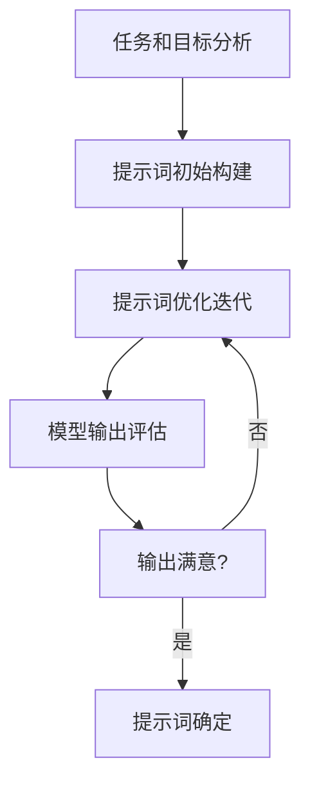

# 大语言模型原理与工程实践：提示词设计

## 1. 背景介绍

### 1.1 大语言模型的兴起

近年来,大型语言模型(Large Language Models, LLMs)在自然语言处理领域掀起了一股热潮。这些模型通过在海量文本数据上进行预训练,学习了丰富的语言知识和上下文关联能力,展现出令人惊叹的语言生成和理解能力。

代表性的大语言模型包括 GPT-3、BERT、XLNet、ALBERT 等,它们在机器翻译、问答系统、文本摘要、内容生成等任务中表现出色,推动了自然语言处理技术的飞速发展。

### 1.2 提示词在大语言模型中的作用

虽然大语言模型具有强大的语言生成能力,但要充分发挥其潜力,需要合理的输入提示(Prompt)来引导模型产生所需的输出。提示词设计是大语言模型工程实践中一个关键环节,直接影响着模型的输出质量和效果。

合理设计的提示词可以:

- 指导模型专注于特定任务和目标
- 提供必要的上下文信息和背景知识
- 控制输出风格、长度和细节程度
- 减少不相关或不合理的输出

因此,提示词设计是大语言模型工程实践中不可或缺的一个重要环节,值得深入探讨和研究。

## 2. 核心概念与联系

### 2.1 提示词设计的核心概念

1. **提示词(Prompt)**: 提供给语言模型的输入文本,用于引导模型生成所需的输出。
2. **前缀提示(Prefix Prompt)**: 在输入文本的开头添加特定的前缀,为模型提供任务指令或上下文信息。
3. **示例提示(Example Prompt)**: 提供一些输入-输出示例对,让模型学习任务模式并生成相应的输出。
4. **混合提示(Hybrid Prompt)**: 结合前缀提示和示例提示的方式,为模型提供更丰富的指导信息。
5. **提示工程(Prompt Engineering)**: 系统地设计和优化提示词,以获得更好的模型输出效果。

### 2.2 提示词设计与其他概念的联系

1. **元学习(Meta-Learning)**: 提示词设计可以被视为一种元学习形式,通过提供示例和指令来指导模型学习新任务。
2. **微调(Fine-tuning)**: 与传统的微调方法相比,提示词设计不需要修改模型参数,更加灵活和高效。
3. **控制性(Controllability)**: 合理的提示词设计可以更好地控制模型输出的风格、长度和细节程度。
4. **可解释性(Interpretability)**: 通过分析提示词与模型输出的关系,可以提高模型的可解释性。
5. **安全性(Safety)**: 提示词设计可以帮助缓解大语言模型中的潜在风险,如偏见、不当输出等。

## 3. 核心算法原理具体操作步骤

### 3.1 提示词设计的一般流程

提示词设计通常遵循以下流程:



1. **任务和目标分析**: 明确任务目标和期望的模型输出,为提示词设计奠定基础。
2. **提示词初始构建**: 根据任务需求,构建初始的提示词,包括前缀提示、示例提示或混合提示。
3. **提示词优化迭代**: 通过多轮迭代,不断优化和调整提示词,以获得更好的模型输出效果。
4. **模型输出评估**: 评估模型输出是否满足任务需求,包括准确性、相关性、多样性等方面。
5. **提示词确定**: 当模型输出满意时,确定最终的提示词设计。

### 3.2 提示词优化策略

在提示词优化迭代过程中,可以采用以下策略:

1. **示例选择**: 仔细选择高质量的输入-输出示例对,覆盖不同情况和边界条件。
2. **提示词模板化**: 将提示词模块化,方便组合和调整不同的模块。
3. **反馈循环**: 根据模型输出的质量,不断调整和改进提示词。
4. **人工干预**: 人工审查和修正模型输出,指导提示词优化方向。
5. **自动搜索**: 使用启发式搜索或强化学习等方法,自动优化提示词。

## 4. 数学模型和公式详细讲解举例说明

### 4.1 提示词嵌入

为了更好地利用大语言模型的上下文理解能力,可以将提示词嵌入到模型的输入表示中。常见的嵌入方式包括:

1. **前缀嵌入**: 将提示词作为输入序列的前缀,与输入文本拼接。
2. **控制码嵌入**: 使用特殊的控制码(Control Codes)表示提示词,嵌入到输入序列中。

假设输入序列为 $X = (x_1, x_2, \dots, x_n)$,提示词为 $P = (p_1, p_2, \dots, p_m)$,则前缀嵌入和控制码嵌入可以表示为:

$$
\begin{aligned}
\text{前缀嵌入:} &\quad \tilde{X} = (p_1, p_2, \dots, p_m, x_1, x_2, \dots, x_n) \\
\text{控制码嵌入:} &\quad \tilde{X} = (c_1, p_1, c_2, p_2, \dots, c_m, p_m, x_1, x_2, \dots, x_n)
\end{aligned}
$$

其中 $c_i$ 表示控制码,用于区分提示词和输入文本。

### 4.2 提示词优化目标

为了获得高质量的提示词,需要定义合适的优化目标函数。常见的优化目标包括:

1. **最大化输出质量**: 最大化模型输出与期望输出之间的相似度或评分,如 BLEU、ROUGE 等指标。
2. **最小化输出风险**: 最小化模型输出中潜在的风险或不当内容,如偏见、暴力、违法等。
3. **多目标优化**: 同时优化多个目标,如输出质量、多样性、可控性等。

假设输入为 $X$,期望输出为 $Y^*$,模型输出为 $Y$,风险函数为 $R(Y)$,则优化目标可以表示为:

$$
\begin{aligned}
\max_P &\quad S(Y, Y^*) \\
\min_P &\quad R(Y) \\
\max_P &\quad \alpha S(Y, Y^*) - \beta R(Y)
\end{aligned}
$$

其中 $S(\cdot)$ 表示输出质量评分函数,如 BLEU 或 ROUGE;$R(\cdot)$ 表示风险函数;$\alpha$、$\beta$ 为权重系数,用于权衡不同目标的重要性。

通过优化上述目标函数,可以获得高质量且低风险的模型输出,从而得到合适的提示词设计。

## 5. 项目实践: 代码实例和详细解释说明

以下是一个使用 Python 和 Hugging Face Transformers 库实现提示词设计的示例代码,用于文本生成任务。

```python
from transformers import AutoTokenizer, AutoModelForCausalLM

# 加载预训练模型和分词器
tokenizer = AutoTokenizer.from_pretrained("gpt2")
model = AutoModelForCausalLM.from_pretrained("gpt2")

# 定义提示词
prompt = "这是一篇关于人工智能的文章。"

# 对提示词进行编码
input_ids = tokenizer.encode(prompt, return_tensors="pt")

# 生成文本
output_ids = model.generate(
    input_ids,
    max_length=200,
    num_return_sequences=1,
    early_stopping=True,
    pad_token_id=tokenizer.eos_token_id
)

# 解码输出
output_text = tokenizer.decode(output_ids[0], skip_special_tokens=True)
print(output_text)
```

代码解释:

1. 导入必要的库和模块。
2. 加载预训练的语言模型(这里使用 GPT-2)和相应的分词器。
3. 定义提示词 `prompt`。
4. 使用分词器对提示词进行编码,得到输入张量 `input_ids`。
5. 调用模型的 `generate` 方法生成文本输出,设置生成长度、返回序列数等参数。
6. 使用分词器将输出张量解码为文本,并打印结果。

在实际应用中,您可以根据具体任务需求调整提示词的内容和形式,并探索不同的优化策略,以获得更好的模型输出效果。

## 6. 实际应用场景

提示词设计在各种自然语言处理任务中都有广泛的应用,包括但不限于:

1. **文本生成**: 使用提示词引导模型生成特定主题、风格或格式的文本,如新闻报道、小说、诗歌等。
2. **问答系统**: 通过提示词指定问题类型和上下文,获得更准确的答案。
3. **文本摘要**: 使用提示词控制摘要的长度、细节程度和关注点。
4. **机器翻译**: 提示词可以指定源语言和目标语言,并提供额外的上下文信息。
5. **情感分析**: 通过提示词指定情感类别或强度,引导模型进行情感分类或检测。
6. **数据增强**: 使用提示词生成多样化的数据样本,扩充训练数据集。
7. **知识提取**: 利用提示词从文本中提取特定类型的知识,如实体、关系、事件等。

总的来说,提示词设计为大语言模型在各种应用场景中提供了灵活的控制和指导,充分发挥了模型的潜力。

## 7. 工具和资源推荐

以下是一些与提示词设计相关的有用工具和资源:

1. **Hugging Face Transformers**: 一个流行的自然语言处理库,提供了多种预训练语言模型和相关工具。
2. **OpenAI GPT-3 Playground**: 一个在线工具,可以与 GPT-3 模型进行交互,并探索不同的提示词设计。
3. **Anthropic's Constitutional AI**: 一个提示词设计工具,可以帮助生成符合特定约束和规则的输出。
4. **PromptSource**: 一个提示词库,收集了各种任务的高质量提示词示例。
5. **PromptPerfectionist**: 一个提示词优化工具,使用强化学习自动优化提示词。
6. **PromptEductor**: 一个提示词生成工具,可以从少量示例中学习并生成新的提示词。
7. **PromptPattern**: 一个提示词模板库,包含常见任务的提示词模板。

此外,还有一些提示词设计相关的论文、教程和社区资源,可以帮助您深入了解和掌握这一领域的知识和技能。

## 8. 总结: 未来发展趋势与挑战

### 8.1 未来发展趋势

提示词设计在大语言模型的工程实践中扮演着越来越重要的角色,未来可能会出现以下发展趋势:

1. **自动化提示词设计**: 通过机器学习和搜索算法,自动生成和优化高质量的提示词。
2. **可解释性和可控性提升**: 提高提示词与模型输出之间的可解释性和可控性,增强对模型行为的理解和控制。
3. **多模态提示词**: 除了文本提示词,探索图像、视频等多模态输入作为提示词,引导模型生成更丰富的输出。
4. **提示词微调**: 在预训练模型的基础上,通过提示词微调的方式快速适应新任务,提高模型的泛化能力。
5. **提示词组合和迁移**: 研究如何有效组合和迁移不同任务的提示词,实现知识和技能的复用和迁移。

### 8.2 面临的挑战

尽管提示词设计取得了长足的进步,但仍然面临一些挑战:

1. **提示词优化效率**: 如何提高提示词优化的效率,减少人工干预和计算资源消耗。
2. **提示词鲁棒性**: 提高提示词对于噪声