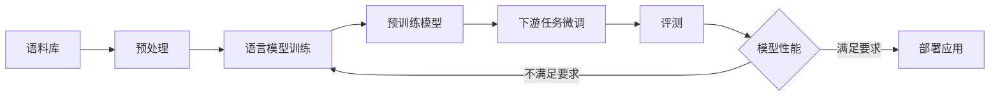

# 大语言模型原理与工程实践：评测方式和标准

## 1. 背景介绍
### 1.1 大语言模型的发展历程
#### 1.1.1 早期的语言模型
#### 1.1.2 神经网络语言模型的兴起
#### 1.1.3 Transformer模型的革命性突破

### 1.2 大语言模型的应用领域
#### 1.2.1 自然语言处理
#### 1.2.2 语音识别与合成
#### 1.2.3 机器翻译
#### 1.2.4 问答系统与对话系统

### 1.3 大语言模型评测的重要性
#### 1.3.1 评估模型性能与优化方向
#### 1.3.2 比较不同模型的优劣
#### 1.3.3 推动大语言模型技术的进步

## 2. 核心概念与联系
### 2.1 语言模型
#### 2.1.1 定义与基本原理
#### 2.1.2 统计语言模型
#### 2.1.3 神经网络语言模型

### 2.2 预训练与微调
#### 2.2.1 预训练的概念与目的
#### 2.2.2 无监督预训练方法
#### 2.2.3 有监督微调方法

### 2.3 Transformer模型
#### 2.3.1 自注意力机制
#### 2.3.2 编码器-解码器结构
#### 2.3.3 位置编码

### 2.4 评测指标
#### 2.4.1 困惑度（Perplexity）
#### 2.4.2 BLEU 得分
#### 2.4.3 ROUGE 得分
#### 2.4.4 人工评估



## 3. 核心算法原理具体操作步骤
### 3.1 预处理
#### 3.1.1 文本清洗
#### 3.1.2 分词与词性标注
#### 3.1.3 构建词汇表

### 3.2 语言模型训练
#### 3.2.1 数据准备与批处理
#### 3.2.2 模型构建
#### 3.2.3 损失函数与优化器
#### 3.2.4 训练过程

### 3.3 预训练
#### 3.3.1 掩码语言模型（Masked Language Model）
#### 3.3.2 下一句预测（Next Sentence Prediction）
#### 3.3.3 连续词袋模型（Continuous Bag-of-Words Model）
#### 3.3.4 Skip-gram 模型

### 3.4 微调
#### 3.4.1 特定任务数据准备
#### 3.4.2 模型结构调整
#### 3.4.3 微调训练过程

### 3.5 评测
#### 3.5.1 数据集划分
#### 3.5.2 评测指标计算
#### 3.5.3 交叉验证
#### 3.5.4 结果分析与可视化

## 4. 数学模型和公式详细讲解举例说明
### 4.1 语言模型的概率公式
$$P(w_1, w_2, ..., w_n) = \prod_{i=1}^{n} P(w_i | w_1, w_2, ..., w_{i-1})$$

其中，$w_i$ 表示第 $i$ 个词，$P(w_i | w_1, w_2, ..., w_{i-1})$ 表示在给定前 $i-1$ 个词的条件下，第 $i$ 个词出现的概率。

### 4.2 Transformer 模型中的自注意力机制
$$Attention(Q, K, V) = softmax(\frac{QK^T}{\sqrt{d_k}})V$$

其中，$Q$、$K$、$V$ 分别表示查询、键、值矩阵，$d_k$ 表示键向量的维度。

### 4.3 困惑度（Perplexity）的计算
$$PPL = \exp(-\frac{1}{N}\sum_{i=1}^{N}\log P(w_i | w_1, w_2, ..., w_{i-1}))$$

其中，$N$ 表示语料库中的词数，$P(w_i | w_1, w_2, ..., w_{i-1})$ 表示语言模型在给定前 $i-1$ 个词的条件下，对第 $i$ 个词的预测概率。

### 4.4 BLEU 得分的计算
$$BLEU = BP \cdot \exp(\sum_{n=1}^{N}w_n \log p_n)$$

其中，$BP$ 表示惩罚因子，$w_n$ 表示 $n$-gram 的权重，$p_n$ 表示 $n$-gram 的精确度。

## 5. 项目实践：代码实例和详细解释说明
### 5.1 预处理示例代码
```python
import re
import jieba

def preprocess_text(text):
    # 去除特殊字符
    text = re.sub(r"[^\u4e00-\u9fa5a-zA-Z0-9]", "", text)
    # 中文分词
    words = jieba.lcut(text)
    # 去除停用词
    stopwords = [...]
    words = [word for word in words if word not in stopwords]
    return words
```

### 5.2 语言模型训练示例代码
```python
import torch
import torch.nn as nn

class LanguageModel(nn.Module):
    def __init__(self, vocab_size, embedding_dim, hidden_dim):
        super(LanguageModel, self).__init__()
        self.embedding = nn.Embedding(vocab_size, embedding_dim)
        self.lstm = nn.LSTM(embedding_dim, hidden_dim, num_layers=2, batch_first=True)
        self.fc = nn.Linear(hidden_dim, vocab_size)
        
    def forward(self, x):
        x = self.embedding(x)
        output, _ = self.lstm(x)
        output = self.fc(output)
        return output
```

### 5.3 预训练示例代码
```python
from transformers import BertModel, BertTokenizer

tokenizer = BertTokenizer.from_pretrained('bert-base-chinese')
model = BertModel.from_pretrained('bert-base-chinese')

# 掩码语言模型任务
masked_input = tokenizer("这是一个[MASK]的例子。", return_tensors="pt")
masked_output = model(**masked_input)

# 下一句预测任务
sentence_a = "这是第一句话。"
sentence_b = "这是第二句话。"
encoded_pair = tokenizer(sentence_a, sentence_b, return_tensors='pt')
outputs = model(**encoded_pair)
```

### 5.4 微调示例代码
```python
from transformers import BertForSequenceClassification

model = BertForSequenceClassification.from_pretrained('bert-base-chinese', num_labels=2)

# 加载并处理数据
train_dataset = ...
eval_dataset = ...

# 微调模型
model.train()
for epoch in range(num_epochs):
    for batch in train_dataloader:
        outputs = model(**batch)
        loss = outputs.loss
        loss.backward()
        optimizer.step()
        optimizer.zero_grad()
        
# 评估模型
model.eval()
for batch in eval_dataloader:
    outputs = model(**batch)
    predictions = outputs.logits.argmax(dim=-1)
    ...
```

## 6. 实际应用场景
### 6.1 智能客服
#### 6.1.1 客户意图识别
#### 6.1.2 自动问答生成
#### 6.1.3 情感分析

### 6.2 内容生成
#### 6.2.1 新闻写作
#### 6.2.2 广告文案生成
#### 6.2.3 小说创作

### 6.3 信息检索
#### 6.3.1 文档相似度计算
#### 6.3.2 关键词提取
#### 6.3.3 文本摘要

### 6.4 语音交互
#### 6.4.1 语音识别
#### 6.4.2 语音合成
#### 6.4.3 语音对话系统

## 7. 工具和资源推荐
### 7.1 开源工具包
#### 7.1.1 Transformers（Hugging Face）
#### 7.1.2 Fairseq（Facebook）
#### 7.1.3 OpenNMT（Harvard NLP）

### 7.2 预训练模型
#### 7.2.1 BERT（Google）
#### 7.2.2 GPT-2、GPT-3（OpenAI）
#### 7.2.3 XLNet（Google/CMU）
#### 7.2.4 RoBERTa（Facebook）

### 7.3 评测数据集
#### 7.3.1 GLUE（General Language Understanding Evaluation）
#### 7.3.2 SuperGLUE
#### 7.3.3 SQuAD（Stanford Question Answering Dataset）
#### 7.3.4 RACE（Reading Comprehension from Examinations）

### 7.4 学习资源
#### 7.4.1 《深度学习》（花书）
#### 7.4.2 《自然语言处理综论》（Speech and Language Processing）
#### 7.4.3 CS224n：斯坦福大学深度学习自然语言处理课程
#### 7.4.4 fast.ai：实用深度学习课程

## 8. 总结：未来发展趋势与挑战
### 8.1 模型规模与效率的平衡
#### 8.1.1 模型压缩技术
#### 8.1.2 模型并行与数据并行
#### 8.1.3 低精度训练与推理

### 8.2 跨语言与跨模态的语言模型
#### 8.2.1 多语言预训练模型
#### 8.2.2 视觉-语言预训练模型
#### 8.2.3 语音-语言预训练模型

### 8.3 可解释性与可控性
#### 8.3.1 注意力可视化
#### 8.3.2 因果关系分析
#### 8.3.3 生成过程控制

### 8.4 安全与伦理
#### 8.4.1 隐私保护
#### 8.4.2 公平性与去偏
#### 8.4.3 可解释性与透明度

## 9. 附录：常见问题与解答
### 9.1 如何选择合适的预训练模型？
答：根据具体任务的特点和要求，选择相应的预训练模型。对于通用自然语言理解任务，可以选择 BERT、RoBERTa 等模型；对于生成任务，可以选择 GPT 系列模型；对于序列标注任务，可以选择 LSTM-CRF、BERT-CRF 等模型。同时，还要考虑模型的规模、语言、训练数据等因素。

### 9.2 微调时需要注意哪些问题？
答：微调时需要注意以下几点：
1. 根据任务的特点，选择合适的学习率和优化策略。
2. 对于小数据集，可以使用较小的批量大小和较多的训练轮数。
3. 对于不同的任务，可能需要对预训练模型的结构进行适当的修改，如添加任务特定的输出层。
4. 注意避免过拟合，可以使用早停、权重衰减等正则化技术。

### 9.3 如何处理训练数据不足的问题？
答：当训练数据不足时，可以采取以下策略：
1. 数据增强：通过同义词替换、回译、插入、删除等方式，生成新的训练样本。
2. 半监督学习：利用未标注数据进行预训练，然后在标注数据上进行微调。
3. 迁移学习：利用在相关任务上预训练的模型，进行微调或特征提取。
4. 主动学习：通过模型的预测结果，选择最有价值的样本进行人工标注，逐步扩充训练集。

### 9.4 如何进行模型的可解释性分析？
答：可以采用以下方法进行模型的可解释性分析：
1. 注意力可视化：通过可视化注意力权重，分析模型在做出预测时关注的输入部分。
2. 特征重要性分析：通过梯度、置换等方法，评估不同输入特征对模型预测结果的影响。
3. 案例研究：选取典型的正确和错误预测样本，分析模型的决策过程。
4. 规则提取：通过决策树、因果关系分析等方法，提取模型中的关键规则和模式。

作者：禅与计算机程序设计艺术 / Zen and the Art of Computer Programming