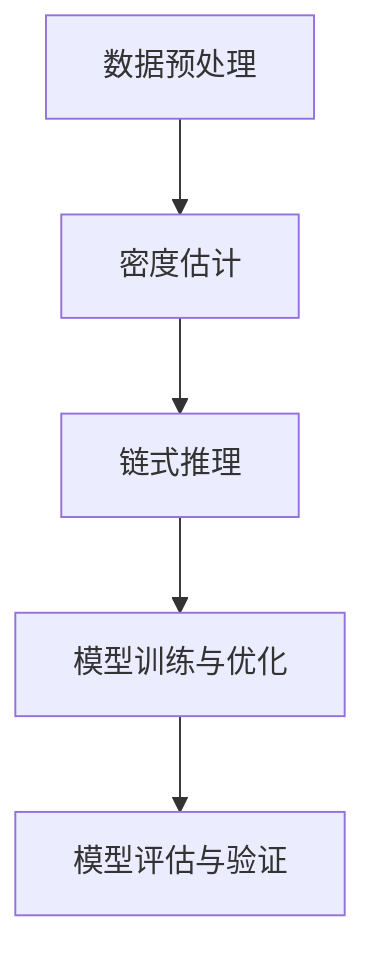

# 大语言模型应用指南：Chain-of-Density

## 1.背景介绍

在人工智能领域，特别是自然语言处理（NLP）方面，大语言模型（Large Language Models, LLMs）已经成为了研究和应用的热点。大语言模型如GPT-3、BERT等，通过大量的文本数据进行训练，能够生成高质量的自然语言文本，完成各种复杂的语言任务。然而，如何更高效地利用这些大语言模型，特别是在实际应用中，仍然是一个值得深入探讨的问题。

Chain-of-Density（密度链）是一种新兴的技术方法，旨在通过密度估计和链式推理来提升大语言模型的性能和应用效果。本文将详细介绍Chain-of-Density的核心概念、算法原理、数学模型、实际应用场景以及未来的发展趋势和挑战。

## 2.核心概念与联系

### 2.1 大语言模型

大语言模型是通过深度学习技术训练的大规模神经网络，能够理解和生成自然语言文本。它们通常基于Transformer架构，通过大量的文本数据进行预训练，然后在特定任务上进行微调。

### 2.2 密度估计

密度估计是统计学中的一个重要概念，旨在估计数据分布的概率密度函数。常见的方法包括核密度估计（Kernel Density Estimation, KDE）和高斯混合模型（Gaussian Mixture Model, GMM）。

### 2.3 链式推理

链式推理是一种通过逐步推理来解决复杂问题的方法。它通常涉及多个步骤，每个步骤都依赖于前一步的结果。这种方法在逻辑推理和问题求解中非常常见。

### 2.4 Chain-of-Density

Chain-of-Density结合了密度估计和链式推理的优点，通过估计数据的概率密度函数，并在此基础上进行逐步推理，来提升大语言模型的性能和应用效果。

## 3.核心算法原理具体操作步骤

### 3.1 数据预处理

在进行Chain-of-Density之前，首先需要对数据进行预处理。这包括数据清洗、去重、分词等步骤。

### 3.2 密度估计

使用核密度估计或高斯混合模型对数据进行密度估计，得到数据的概率密度函数。

### 3.3 链式推理

在密度估计的基础上，进行链式推理。每一步推理都基于前一步的结果，逐步逼近最终的解决方案。

### 3.4 模型训练与优化

将密度估计和链式推理的结果作为输入，训练大语言模型，并进行优化。

### 3.5 模型评估与验证

使用交叉验证等方法对模型进行评估，确保其性能和效果。



## 4.数学模型和公式详细讲解举例说明

### 4.1 核密度估计

核密度估计是一种非参数方法，用于估计数据的概率密度函数。其公式如下：

$$
\hat{f}(x) = \frac{1}{n h} \sum_{i=1}^{n} K\left(\frac{x - x_i}{h}\right)
$$

其中，$n$ 是样本数量，$h$ 是带宽参数，$K$ 是核函数。

### 4.2 高斯混合模型

高斯混合模型是一种参数方法，用于估计数据的概率密度函数。其公式如下：

$$
p(x) = \sum_{k=1}^{K} \pi_k \mathcal{N}(x | \mu_k, \Sigma_k)
$$

其中，$K$ 是高斯分布的数量，$\pi_k$ 是第 $k$ 个高斯分布的权重，$\mu_k$ 和 $\Sigma_k$ 分别是第 $k$ 个高斯分布的均值和协方差矩阵。

### 4.3 链式推理

链式推理的数学模型可以表示为一个马尔可夫链，其转移概率矩阵为 $P$，状态转移的公式如下：

$$
P(X_{t+1} = x | X_t = x_t) = P(x_t, x)
$$

通过多次迭代，可以得到最终的推理结果。

## 5.项目实践：代码实例和详细解释说明

### 5.1 数据预处理

```python
import pandas as pd
from sklearn.model_selection import train_test_split

# 读取数据
data = pd.read_csv('data.csv')

# 数据清洗
data = data.dropna()

# 分词
data['text'] = data['text'].apply(lambda x: x.split())

# 划分训练集和测试集
train_data, test_data = train_test_split(data, test_size=0.2)
```

### 5.2 密度估计

```python
from sklearn.neighbors import KernelDensity
import numpy as np

# 核密度估计
kde = KernelDensity(kernel='gaussian', bandwidth=0.5).fit(train_data['text'])
log_density = kde.score_samples(test_data['text'])
density = np.exp(log_density)
```

### 5.3 链式推理

```python
def chain_of_density(density, steps=10):
    results = []
    for i in range(steps):
        # 假设每一步的推理结果为密度的均值
        result = np.mean(density)
        results.append(result)
        # 更新密度
        density = density * result
    return results

results = chain_of_density(density)
```

### 5.4 模型训练与优化

```python
from transformers import GPT2LMHeadModel, GPT2Tokenizer, Trainer, TrainingArguments

# 加载预训练模型和分词器
model = GPT2LMHeadModel.from_pretrained('gpt2')
tokenizer = GPT2Tokenizer.from_pretrained('gpt2')

# 数据编码
train_encodings = tokenizer(train_data['text'].tolist(), truncation=True, padding=True)
test_encodings = tokenizer(test_data['text'].tolist(), truncation=True, padding=True)

# 训练参数
training_args = TrainingArguments(
    output_dir='./results',
    num_train_epochs=3,
    per_device_train_batch_size=4,
    per_device_eval_batch_size=4,
    warmup_steps=500,
    weight_decay=0.01,
    logging_dir='./logs',
)

# 训练
trainer = Trainer(
    model=model,
    args=training_args,
    train_dataset=train_encodings,
    eval_dataset=test_encodings
)

trainer.train()
```

### 5.5 模型评估与验证

```python
# 模型评估
results = trainer.evaluate()
print(results)
```

## 6.实际应用场景

### 6.1 文本生成

Chain-of-Density可以用于提升文本生成的质量和多样性。通过密度估计和链式推理，可以生成更加符合语境和逻辑的文本。

### 6.2 情感分析

在情感分析中，Chain-of-Density可以用于更准确地捕捉文本中的情感变化，提高情感分类的准确性。

### 6.3 机器翻译

在机器翻译中，Chain-of-Density可以用于提升翻译的流畅性和准确性，特别是在处理长句和复杂句子时。

### 6.4 对话系统

在对话系统中，Chain-of-Density可以用于生成更加自然和连贯的对话，提高用户体验。

## 7.工具和资源推荐

### 7.1 工具

- **Transformers**：一个用于自然语言处理的开源库，支持多种预训练模型。
- **Scikit-learn**：一个用于数据挖掘和数据分析的开源库，提供了丰富的机器学习算法。
- **Pandas**：一个用于数据操作和分析的开源库，提供了高效的数据结构和数据分析工具。

### 7.2 资源

- **论文**：阅读相关领域的最新研究论文，了解最新的研究进展和技术方法。
- **教程**：参加在线课程和教程，学习和掌握最新的技术和工具。
- **社区**：加入相关的技术社区，与其他研究者和开发者交流和分享经验。

## 8.总结：未来发展趋势与挑战

Chain-of-Density作为一种新兴的技术方法，具有广阔的应用前景。然而，在实际应用中仍然面临一些挑战，如数据质量、计算资源和模型优化等问题。未来，随着技术的不断发展和进步，Chain-of-Density有望在更多的应用场景中发挥重要作用。

## 9.附录：常见问题与解答

### 9.1 Chain-of-Density的优势是什么？

Chain-of-Density结合了密度估计和链式推理的优点，能够提升大语言模型的性能和应用效果。

### 9.2 如何选择合适的密度估计方法？

选择合适的密度估计方法取决于数据的特点和具体的应用场景。常见的方法包括核密度估计和高斯混合模型。

### 9.3 Chain-of-Density在实际应用中有哪些挑战？

Chain-of-Density在实际应用中面临数据质量、计算资源和模型优化等挑战。需要通过不断的研究和优化来解决这些问题。

### 9.4 如何评估Chain-of-Density的效果？

可以通过交叉验证等方法对Chain-of-Density进行评估，确保其性能和效果。

### 9.5 Chain-of-Density的未来发展方向是什么？

未来，Chain-of-Density有望在更多的应用场景中发挥重要作用，特别是在文本生成、情感分析、机器翻译和对话系统等领域。

---

作者：禅与计算机程序设计艺术 / Zen and the Art of Computer Programming