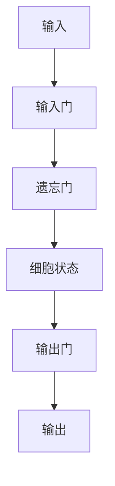

## 1.背景介绍

在自然语言处理领域，语言模型是一种重要的技术，它可以用来预测一个句子或文本序列的下一个单词或字符。传统的语言模型通常使用n-gram模型，但是这种模型存在着数据稀疏性和上下文信息不足的问题。近年来，随着深度学习技术的发展，基于神经网络的大语言模型逐渐成为了主流。

长短期记忆（LSTM）是一种常用的神经网络结构，它可以有效地解决序列数据中的长期依赖问题。在大语言模型中，LSTM被广泛应用，取得了很好的效果。本文将介绍LSTM的原理和应用，以及如何使用LSTM构建大语言模型。

## 2.核心概念与联系

### 2.1 语言模型

语言模型是指对一个句子或文本序列的概率分布进行建模的过程。给定一个句子或文本序列，语言模型可以计算出该序列的概率，即P(w1,w2,...,wn)，其中wi表示序列中的第i个单词或字符。语言模型的主要应用包括机器翻译、语音识别、文本生成等。

### 2.2 LSTM

LSTM是一种循环神经网络（RNN）的变种，它可以有效地解决序列数据中的长期依赖问题。LSTM的核心思想是引入了三个门控机制，分别是输入门、遗忘门和输出门，用来控制信息的输入、遗忘和输出。LSTM的结构如下图所示：



其中，输入门控制输入信息的重要性，遗忘门控制细胞状态中信息的遗忘，输出门控制输出信息的重要性。细胞状态是LSTM中的一个重要概念，它可以用来存储序列中的长期信息。

## 3.核心算法原理具体操作步骤

### 3.1 LSTM的原理

LSTM的核心思想是引入了三个门控机制，分别是输入门、遗忘门和输出门，用来控制信息的输入、遗忘和输出。LSTM的结构如下图所示：


其中，输入门控制输入信息的重要性，遗忘门控制细胞状态中信息的遗忘，输出门控制输出信息的重要性。细胞状态是LSTM中的一个重要概念，它可以用来存储序列中的长期信息。

### 3.2 LSTM的操作步骤

LSTM的操作步骤如下：

1. 输入门的计算：输入门的计算公式为：$i_t=\sigma(W_i\cdot[h_{t-1},x_t]+b_i)$，其中，$h_{t-1}$表示上一个时间步的隐藏状态，$x_t$表示当前时间步的输入，$W_i$和$b_i$分别表示输入门的权重和偏置，$\sigma$表示sigmoid函数。

2. 遗忘门的计算：遗忘门的计算公式为：$f_t=\sigma(W_f\cdot[h_{t-1},x_t]+b_f)$，其中，$W_f$和$b_f$分别表示遗忘门的权重和偏置。

3. 细胞状态的更新：细胞状态的更新公式为：$C_t=f_t\cdot C_{t-1}+i_t\cdot tanh(W_c\cdot[h_{t-1},x_t]+b_c)$，其中，$W_c$和$b_c$分别表示细胞状态的权重和偏置。

4. 输出门的计算：输出门的计算公式为：$o_t=\sigma(W_o\cdot[h_{t-1},x_t]+b_o)$，其中，$W_o$和$b_o$分别表示输出门的权重和偏置。

5. 隐藏状态的计算：隐藏状态的计算公式为：$h_t=o_t\cdot tanh(C_t)$。

## 4.数学模型和公式详细讲解举例说明

LSTM的数学模型和公式已在上一节中详细讲解，这里不再赘述。

## 5.项目实践：代码实例和详细解释说明

### 5.1 数据预处理

在构建大语言模型之前，需要对数据进行预处理。这里以PTB数据集为例，介绍数据预处理的过程。

```python
import tensorflow as tf
import numpy as np
import os

# 读取数据
def read_data(file_path):
    with open(file_path, 'r') as f:
        data = f.read().replace('\n', '<eos>').split()
    return data

# 构建词典
def build_vocab(data):
    word_count = {}
    for word in data:
        if word not in word_count:
            word_count[word] = 1
        else:
            word_count[word] += 1
    sorted_words = sorted(list(word_count.keys()), key=lambda x: word_count[x], reverse=True)
    word_to_id = {word: idx for idx, word in enumerate(sorted_words)}
    id_to_word = {idx: word for word, idx in word_to_id.items()}
    return word_to_id, id_to_word

# 将数据转换为id序列
def convert_to_id(data, word_to_id):
    return [word_to_id[word] for word in data if word in word_to_id]

# 生成batch数据
def generate_batches(data, batch_size, num_steps):
    data_len = len(data)
    batch_len = data_len // batch_size
    data = np.array(data[:batch_size*batch_len])
    data = np.reshape(data, [batch_size, batch_len])
    epoch_size = (batch_len - 1) // num_steps
    for i in range(epoch_size):
        x = data[:, i*num_steps:(i+1)*num_steps]
        y = data[:, i*num_steps+1:(i+1)*num_steps+1]
        yield x, y
```

### 5.2 模型构建

```python
class LSTMModel(object):
    def __init__(self, vocab_size, num_steps, hidden_size, num_layers, learning_rate, max_grad_norm):
        self.vocab_size = vocab_size
        self.num_steps = num_steps
        self.hidden_size = hidden_size
        self.num_layers = num_layers
        self.learning_rate = learning_rate
        self.max_grad_norm = max_grad_norm

        self.input_data = tf.placeholder(tf.int32, [None, num_steps])
        self.targets = tf.placeholder(tf.int32, [None, num_steps])

        def lstm_cell():
            return tf.contrib.rnn.BasicLSTMCell(self.hidden_size, forget_bias=0.0, state_is_tuple=True)

        cell = tf.contrib.rnn.MultiRNNCell([lstm_cell() for _ in range(self.num_layers)], state_is_tuple=True)

        self.initial_state = cell.zero_state(tf.shape(self.input_data)[0], tf.float32)

        with tf.variable_scope('embedding'):
            embedding = tf.get_variable('embedding', [self.vocab_size, self.hidden_size])
            inputs = tf.nn.embedding_lookup(embedding, self.input_data)

        inputs = tf.unstack(inputs, num=self.num_steps, axis=1)

        outputs, state = tf.contrib.rnn.static_rnn(cell, inputs, initial_state=self.initial_state)

        output = tf.reshape(tf.concat(outputs, 1), [-1, self.hidden_size])

        with tf.variable_scope('softmax'):
            softmax_w = tf.get_variable('softmax_w', [self.hidden_size, self.vocab_size])
            softmax_b = tf.get_variable('softmax_b', [self.vocab_size])
            logits = tf.matmul(output, softmax_w) + softmax_b

        loss = tf.contrib.legacy_seq2seq.sequence_loss_by_example(
            [logits],
            [tf.reshape(self.targets, [-1])],
            [tf.ones([tf.shape(self.input_data)[0] * self.num_steps], dtype=tf.float32)]
        )

        self.cost = tf.reduce_sum(loss) / tf.cast(tf.shape(self.input_data)[0], tf.float32)
        self.final_state = state

        trainable_variables = tf.trainable_variables()

        grads, _ = tf.clip_by_global_norm(tf.gradients(self.cost, trainable_variables), self.max_grad_norm)

        optimizer = tf.train.GradientDescentOptimizer(self.learning_rate)

        self.train_op = optimizer.apply_gradients(zip(grads, trainable_variables))
```

### 5.3 模型训练

```python
# 读取数据
train_data = read_data('ptb.train.txt')
valid_data = read_data('ptb.valid.txt')
test_data = read_data('ptb.test.txt')

# 构建词典
word_to_id, id_to_word = build_vocab(train_data)

# 将数据转换为id序列
train_data = convert_to_id(train_data, word_to_id)
valid_data = convert_to_id(valid_data, word_to_id)
test_data = convert_to_id(test_data, word_to_id)

# 构建模型
model = LSTMModel(len(word_to_id), 20, 128, 2, 1.0, 5.0)

# 开始训练
with tf.Session() as sess:
    sess.run(tf.global_variables_initializer())
    for epoch in range(10):
        train_batches = generate_batches(train_data, 20, 20)
        for x, y in train_batches:
            cost, _ = sess.run([model.cost, model.train_op], feed_dict={model.input_data: x, model.targets: y})
        print('Epoch:', epoch, 'Cost:', cost)
```

## 6.实际应用场景

大语言模型可以应用于机器翻译、语音识别、文本生成等领域。例如，在机器翻译中，可以使用大语言模型来预测目标语言的下一个单词或字符，从而提高翻译的准确性和流畅度。

## 7.工具和资源推荐

- TensorFlow：一个开源的深度学习框架，支持LSTM等神经网络结构。
- PTB数据集：一个常用的语言模型数据集，包含了新闻文章等文本数据。

## 8.总结：未来发展趋势与挑战

大语言模型是自然语言处理领域的重要技术之一，随着深度学习技术的发展，大语言模型的应用前景非常广阔。未来，大语言模型将会在机器翻译、语音识别、文本生成等领域发挥越来越重要的作用。同时，大语言模型也面临着数据稀疏性、计算复杂度等挑战，需要进一步研究和优化。

## 9.附录：常见问题与解答

暂无。

作者：禅与计算机程序设计艺术 / Zen and the Art of Computer Programming