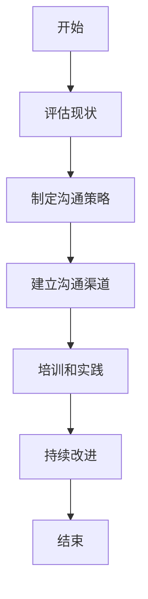
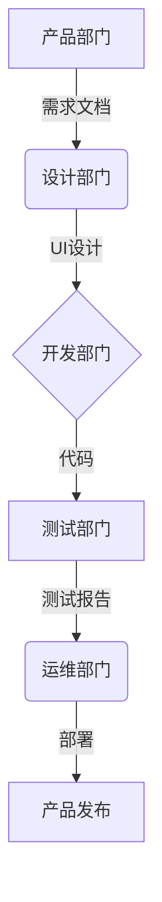

# 怎样培养跨部门沟通协调能力

## 1.背景介绍

在当今快节奏的商业环境中,有效的跨部门沟通和协调对于组织的成功至关重要。随着企业变得越来越复杂和分散,各部门之间的协作成为了必要条件。然而,由于部门目标、优先级和文化差异,跨部门沟通和协调往往充满挑战。本文将探讨培养跨部门沟通协调能力的核心概念、实践技巧和最佳实践,帮助读者提高工作效率,促进组织的整体绩效。

## 2.核心概念与联系

### 2.1 跨部门沟通的重要性

跨部门沟通对于以下几个方面至关重要:

1. **整体目标一致性**: 确保所有部门都朝着共同的组织目标努力,避免部门之间的目标冲突和资源浪费。

2. **信息共享和协作**: 促进不同部门之间的信息流动和知识共享,增强协作,提高工作效率。

3. **问题解决和创新**: 跨部门的多元视角和专业知识有助于更好地解决复杂问题,并促进创新思维。

4. **客户满意度**: 通过无缝的跨部门协作,为客户提供一致和高质量的服务体验。

### 2.2 影响跨部门沟通的因素

以下是影响跨部门沟通效果的主要因素:

1. **组织结构**: 层级森严的官僚机构结构可能阻碍沟通和决策效率。

2. **地理位置**: 分散的办公地点增加了面对面沟通的难度。

3. **文化差异**: 不同部门可能有不同的价值观、优先级和工作方式。

4. **个人因素**: 如沟通技巧、态度、信任度等个人特质影响沟通效果。

5. **技术障碍**: 缺乏适当的沟通工具和渠道会阻碍信息流动。

### 2.3 跨部门协调的核心要素

要实现有效的跨部门协调,需要注重以下几个核心要素:

1. **共同目标**: 明确的共同目标有助于团结各方,集中精力解决问题。

2. **角色责任**: 明确每个部门和个人在项目中的角色和责任。

3. **决策过程**: 制定明确的决策流程,确保及时高效地做出决策。

4. **冲突管理**: 建立有效的冲突解决机制,化解部门间的分歧。

5. **绩效评估**: 制定公平透明的绩效评估标准,促进各方的参与度。

## 3.核心算法原理具体操作步骤

培养跨部门沟通协调能力是一个循序渐进的过程,需要采取系统的方法和具体的实践步骤。以下是一种常见的算法流程:



1. **评估现状**: 首先需要评估组织当前的跨部门沟通和协调状况,包括存在的障碍、差距和需求。可以通过调查问卷、焦点小组讨论等方式收集数据。

2. **制定沟通策略**: 根据评估结果,制定全面的跨部门沟通策略,明确沟通目标、对象、内容、方式和频率等。

3. **建立沟通渠道**: 建立正式和非正式的沟通渠道,如定期会议、instantmessaging、协作平台等,确保信息流动顺畅。

4. **培训和实践**: 为员工提供有关跨部门沟通和协调的培训,包括沟通技巧、冲突管理、团队合作等。同时鼓励员工在实践中应用所学。

5. **持续改进**: 持续监控沟通效果,收集反馈,并根据需要调整策略。建立一种持续学习和改进的文化。

## 4.数学模型和公式详细讲解举例说明

在跨部门沟通协调的背景下,有一些数学模型和公式可以帮助我们量化和优化沟通效率。

### 4.1 信息熵模型

信息熵是一种衡量信息混乱程度的指标。在跨部门沟通中,我们希望最小化信息熵,确保信息传递的准确性和完整性。

信息熵的公式为:

$$H(X) = -\sum_{i=1}^{n}P(x_i)\log_2 P(x_i)$$

其中:
- $H(X)$ 表示随机变量 $X$ 的信息熵
- $n$ 是可能结果的数量
- $P(x_i)$ 是结果 $x_i$ 发生的概率

例如,假设在一个项目中,有三个部门 A、B 和 C 需要协作。如果每个部门都能完全理解来自其他部门的信息,那么信息熵将接近于 0。但如果存在沟通障碍,导致信息被曲解或丢失,那么信息熵就会增加。

通过分析和优化信息熵,我们可以评估沟通效率,并采取相应的措施来改善沟通质量,如改进沟通渠道、加强培训等。

### 4.2 社交网络分析

社交网络分析是一种研究个体之间关系模式的方法,在跨部门沟通中也可以应用。我们可以将每个部门视为一个节点,节点之间的连线表示沟通关系的强度。

一些常用的网络指标包括:

- **中心性**: 衡量一个节点在网络中的重要程度。中心性高的节点可能扮演着关键的沟通枢纽角色。

- **密度**: 衡量网络中实际连线数与最大可能连线数之比,反映了网络的紧密程度。

- **群集系数**: 衡量一个节点的邻居节点之间相互连接的程度,反映了网络中的团队合作水平。

通过社交网络分析,我们可以发现网络中的薄弱环节,如沟通孤岛、信息流动瓶颈等,并采取针对性的优化措施,如加强关键节点的沟通能力、促进弱连接部门之间的互动等。

## 5.项目实践:代码实例和详细解释说明

为了更好地理解和应用跨部门沟通协调的概念,我们将通过一个实际项目案例进行说明。假设有一个涉及多个部门的软件开发项目,包括产品、设计、开发、测试和运维等部门。

### 5.1 建立协作平台

首先,我们需要建立一个统一的协作平台,作为各部门之间沟通和协作的中心枢纽。这里我们选择使用 Jira 作为项目管理工具,并结合 Confluence 知识库和 Slack 即时通讯工具。

```python
# 安装 Jira 和 Confluence
pip install jira-python atlassian-python-api

# 连接 Jira 实例
from jira import JIRA
jira = JIRA('https://your-jira-instance.com', basic_auth=('username', 'password'))

# 创建新项目
project = jira.create_project('CrossDeptProject', 'Cross Department Project')

# 创建问题类型
issue_type = jira.create_issue_type('Task', 'A task to be completed')

# 创建新问题
issue = jira.create_issue(project=project, summary='Design UI Mockups', issue_type=issue_type)

# 分配问题给设计部门成员
jira.assign_issue(issue, 'designer@company.com')
```

通过这个协作平台,各部门可以共享项目信息、跟踪进度、讨论问题和管理任务。这有助于增强透明度、责任感和协作效率。

### 5.2 建立沟通机制

接下来,我们需要建立一套有效的沟通机制,包括定期会议、即时通讯群组和知识共享渠道等。

```python
# 在 Jira 中安排每周例会
from jira.resources import GreenHoliday
holiday = GreenHoliday('Weekly Sync Meeting', start='2023-06-01', end='2023-06-01', description='Cross Department Sync Meeting')
jira.create_holiday(holiday)

# 在 Slack 中创建跨部门沟通群组
import slack
client = slack.WebClient(token='your-slack-token')
client.conversations_create(name='cross-dept-comm')

# 在 Confluence 中创建知识库空间
from atlassian import Confluence
confluence = Confluence('https://your-confluence-instance.com', 'username', 'password')
space = confluence.create_space('Cross Department Knowledge Base', 'CrossDeptKB')
```

通过这些沟通渠道,各部门可以及时分享信息、讨论问题、寻求帮助和协调工作。同时,知识库还可以作为一个集中式的信息存储和共享平台。

### 5.3 建立协作流程

为了确保各部门之间的工作流程顺畅,我们需要建立一套明确的协作流程,规定每个部门在不同阶段的职责和交付物。



这个流程清晰地定义了每个部门的角色和责任,确保工作有序进行,减少沟通误解和重复工作。同时,我们还可以在协作平台上设置自动化流程,如代码审查、测试用例执行等,进一步提高效率。

通过实际项目实践,我们可以更好地理解和应用跨部门沟通协调的概念和技术,从而提高项目的整体质量和效率。

## 6.实际应用场景

跨部门沟通协调技能在各种组织和行业中都有广泛的应用场景,包括但不限于:

1. **软件开发**: 软件开发项目通常涉及产品、设计、开发、测试和运维等多个部门,需要高度协调才能确保产品质量和上市时间。

2. **制造业**: 制造业中的产品开发、生产和供应链管理都需要跨部门协作,如工程、采购、生产、质量控制和物流等部门之间的协调。

3. **市场营销**: 营销活动需要市场研究、产品管理、创意设计、媒体买家和分析师等多个部门的参与和协作。

4. **医疗保健**: 医院和诊所需要临床医生、护理人员、药剂师、行政人员和财务人员之间的紧密协作,以提供高质量的患者护理。

5. **政府机构**: 政府部门之间需要协调政策制定、执行和监督,确保公共服务的高效运作。

6. **非营利组织**: 非营利组织通常由不同的部门或团队组成,如筹款、项目管理、志愿者协调和宣传等,需要密切协作以实现共同的使命。

无论是在何种行业或组织中,培养跨部门沟通协调能力都是提高工作效率、促进创新和实现组织目标的关键因素。

## 7.工具和资源推荐

为了有效培养跨部门沟通协调能力,我们可以利用一些有用的工具和资源:

1. **协作平台**: 如 Jira、Trello、Asana 等项目管理工具,以及 Slack、Microsoft Teams 等即时通讯工具,有助于信息共享和任务协调。

2. **视频会议工具**: 如 Zoom、Google Meet、Skype 等,适用于远程会议和在线培训。

3. **知识管理系统**: 如 Confluence、SharePoint 等,用于集中存储和共享组织知识。

4. **可视化工具**: 如 Lucidchart、Miro 等,有助于创建流程图、思维导图和其他可视化资源,提高沟通效率。

5. **培训资源**: 包括线上课程、书籍、博客和论坛等,可以帮助提升沟通技巧、冲突管理和团队合作能力。

6. **社交网络分析工具**: 如 Gephi、NodeXL 等,用于分析组织内部的沟通网络结构和关系模式。

7. **反馈和调查工具**: 如 SurveyMonkey、Qualtrics 等,用于收集员工对沟通效率的反馈和建议。

选择合适的工具和资源,并结合组织的具体需求和文化,可以有效支持跨部门沟通协调能力的培养和提升。

## 8.总结: