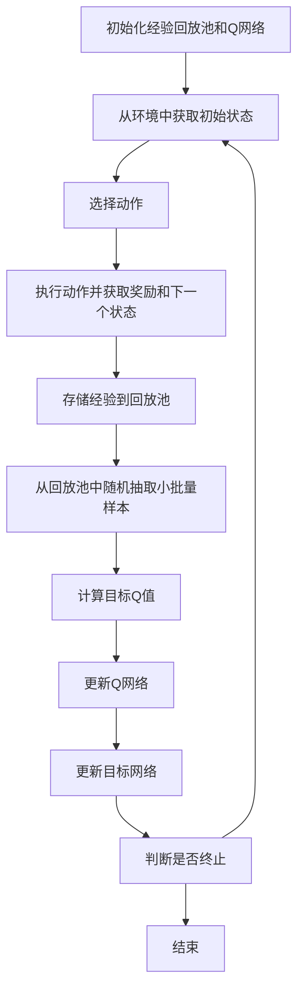

# 深度 Q-learning：在自动化制造中的应用

## 1.背景介绍

在现代工业4.0的浪潮中，自动化制造已经成为提升生产效率和产品质量的关键手段。随着人工智能技术的不断进步，深度学习和强化学习在自动化制造中的应用也越来越广泛。深度 Q-learning 作为一种结合深度学习和 Q-learning 的强化学习算法，展现出了巨大的潜力。本文将深入探讨深度 Q-learning 在自动化制造中的应用，帮助读者理解其核心概念、算法原理、数学模型、实际应用场景以及未来的发展趋势。

## 2.核心概念与联系

### 2.1 强化学习

强化学习是一种通过与环境交互来学习最优策略的机器学习方法。其核心思想是通过试错法来获得最大化累积奖励的策略。强化学习的基本组成包括：状态（State）、动作（Action）、奖励（Reward）和策略（Policy）。

### 2.2 Q-learning

Q-learning 是一种无模型的强化学习算法，通过学习状态-动作值函数（Q函数）来估计每个状态-动作对的期望回报。Q-learning 的更新公式为：

$$
Q(s, a) \leftarrow Q(s, a) + \alpha [r + \gamma \max_{a'} Q(s', a') - Q(s, a)]
$$

其中，$s$ 和 $a$ 分别表示当前状态和动作，$r$ 是即时奖励，$\alpha$ 是学习率，$\gamma$ 是折扣因子，$s'$ 和 $a'$ 分别表示下一状态和下一动作。

### 2.3 深度学习

深度学习是一种通过多层神经网络来学习数据表示的机器学习方法。深度学习在处理高维数据和复杂任务方面表现出色，常用于图像识别、自然语言处理等领域。

### 2.4 深度 Q-learning

深度 Q-learning 结合了深度学习和 Q-learning，通过深度神经网络来近似 Q函数，从而解决了传统 Q-learning 在高维状态空间中的局限性。深度 Q-learning 的核心思想是使用深度神经网络来估计 Q值，并通过经验回放和目标网络来稳定训练过程。

## 3.核心算法原理具体操作步骤

### 3.1 算法流程图



### 3.2 具体操作步骤

1. **初始化**：初始化经验回放池和 Q网络，Q网络用于估计 Q值。
2. **获取初始状态**：从环境中获取初始状态。
3. **选择动作**：根据 ε-贪婪策略选择动作，即以 ε 的概率随机选择动作，以 1-ε 的概率选择当前 Q值最大的动作。
4. **执行动作**：在环境中执行选择的动作，并获取即时奖励和下一个状态。
5. **存储经验**：将当前状态、动作、奖励和下一个状态存储到经验回放池中。
6. **抽取样本**：从经验回放池中随机抽取小批量样本。
7. **计算目标 Q值**：使用目标网络计算目标 Q值。
8. **更新 Q网络**：通过最小化损失函数来更新 Q网络的参数。
9. **更新目标网络**：定期将 Q网络的参数复制到目标网络中。
10. **判断是否终止**：判断当前回合是否终止，如果终止则结束，否则返回步骤3。

## 4.数学模型和公式详细讲解举例说明

### 4.1 Q函数

Q函数表示在状态 $s$ 下执行动作 $a$ 所能获得的期望回报。Q函数的更新公式为：

$$
Q(s, a) \leftarrow Q(s, a) + \alpha [r + \gamma \max_{a'} Q(s', a') - Q(s, a)]
$$

其中，$r$ 是即时奖励，$\gamma$ 是折扣因子，$\alpha$ 是学习率。

### 4.2 深度 Q网络

深度 Q网络使用深度神经网络来近似 Q函数。假设 Q网络的参数为 $\theta$，目标网络的参数为 $\theta^-$，则损失函数为：

$$
L(\theta) = \mathbb{E}_{(s, a, r, s') \sim D} \left[ \left( r + \gamma \max_{a'} Q(s', a'; \theta^-) - Q(s, a; \theta) \right)^2 \right]
$$

其中，$D$ 表示经验回放池。

### 4.3 经验回放

经验回放通过存储和重用过去的经验来打破数据相关性，从而提高训练的稳定性。经验回放池中的每个样本 $(s, a, r, s')$ 都有相同的概率被抽取用于训练。

### 4.4 目标网络

目标网络用于计算目标 Q值，其参数 $\theta^-$ 定期从 Q网络的参数 $\theta$ 复制而来，从而提高训练的稳定性。

## 5.项目实践：代码实例和详细解释说明

### 5.1 环境搭建

首先，我们需要安装必要的库：

```bash
pip install gym tensorflow numpy
```

### 5.2 代码实例

以下是一个使用深度 Q-learning 在 OpenAI Gym 的 CartPole 环境中的示例代码：

```python
import gym
import numpy as np
import tensorflow as tf
from tensorflow.keras import layers

# 创建环境
env = gym.make('CartPole-v1')

# 超参数
num_actions = env.action_space.n
num_states = env.observation_space.shape[0]
gamma = 0.99
epsilon = 1.0
epsilon_min = 0.1
epsilon_decay = 0.995
learning_rate = 0.001
batch_size = 64
memory_size = 10000

# 构建Q网络
def build_model():
    model = tf.keras.Sequential([
        layers.Dense(24, activation='relu', input_shape=(num_states,)),
        layers.Dense(24, activation='relu'),
        layers.Dense(num_actions, activation='linear')
    ])
    model.compile(optimizer=tf.keras.optimizers.Adam(learning_rate), loss='mse')
    return model

# 初始化Q网络和目标网络
q_network = build_model()
target_network = build_model()
target_network.set_weights(q_network.get_weights())

# 经验回放池
memory = []

# 选择动作
def choose_action(state, epsilon):
    if np.random.rand() <= epsilon:
        return np.random.choice(num_actions)
    q_values = q_network.predict(state)
    return np.argmax(q_values[0])

# 存储经验
def store_experience(state, action, reward, next_state, done):
    if len(memory) >= memory_size:
        memory.pop(0)
    memory.append((state, action, reward, next_state, done))

# 训练Q网络
def train_q_network():
    if len(memory) < batch_size:
        return
    batch = np.random.choice(len(memory), batch_size)
    for i in batch:
        state, action, reward, next_state, done = memory[i]
        target = q_network.predict(state)
        if done:
            target[0][action] = reward
        else:
            t = target_network.predict(next_state)
            target[0][action] = reward + gamma * np.amax(t)
        q_network.fit(state, target, epochs=1, verbose=0)

# 主循环
num_episodes = 1000
for episode in range(num_episodes):
    state = env.reset()
    state = np.reshape(state, [1, num_states])
    total_reward = 0
    done = False
    while not done:
        action = choose_action(state, epsilon)
        next_state, reward, done, _ = env.step(action)
        next_state = np.reshape(next_state, [1, num_states])
        store_experience(state, action, reward, next_state, done)
        state = next_state
        total_reward += reward
        train_q_network()
    if epsilon > epsilon_min:
        epsilon *= epsilon_decay
    target_network.set_weights(q_network.get_weights())
    print(f"Episode: {episode+1}, Total Reward: {total_reward}")

env.close()
```

### 5.3 代码解释

1. **环境创建**：使用 OpenAI Gym 创建 CartPole 环境。
2. **超参数设置**：设置 Q-learning 和深度 Q网络的超参数。
3. **Q网络构建**：使用 TensorFlow 构建 Q网络和目标网络。
4. **经验回放池**：初始化经验回放池，用于存储和重用过去的经验。
5. **动作选择**：根据 ε-贪婪策略选择动作。
6. **存储经验**：将当前状态、动作、奖励和下一个状态存储到经验回放池中。
7. **训练 Q网络**：从经验回放池中抽取小批量样本，计算目标 Q值，并更新 Q网络的参数。
8. **主循环**：在每个回合中，执行动作、存储经验、训练 Q网络，并更新目标网络。

## 6.实际应用场景

### 6.1 生产线优化

深度 Q-learning 可以用于优化生产线的调度和资源分配。例如，在汽车制造过程中，可以通过深度 Q-learning 来优化机器人手臂的动作序列，从而提高生产效率和产品质量。

### 6.2 设备维护

通过深度 Q-learning，可以实现设备的预测性维护。通过分析设备的运行数据，深度 Q-learning 可以预测设备的故障时间，并提前安排维护，从而减少停机时间和维护成本。

### 6.3 质量控制

深度 Q-learning 可以用于实时监控和调整生产过程中的参数，从而保证产品质量。例如，在半导体制造过程中，可以通过深度 Q-learning 来调整光刻机的参数，从而提高芯片的良率。

## 7.工具和资源推荐

### 7.1 开发工具

- **TensorFlow**：一个开源的深度学习框架，支持构建和训练深度神经网络。
- **OpenAI Gym**：一个用于开发和比较强化学习算法的工具包，提供了多种环境。

### 7.2 学习资源

- **《深度强化学习》**：一本详细介绍深度强化学习理论和实践的书籍。
- **Coursera 强化学习课程**：由知名教授讲授的强化学习在线课程，涵盖了基础理论和实际应用。

### 7.3 开源项目

- **DQN**：一个实现深度 Q-learning 的开源项目，提供了详细的代码和文档。
- **RLlib**：一个用于分布式强化学习的开源库，支持多种强化学习算法。

## 8.总结：未来发展趋势与挑战

### 8.1 未来发展趋势

随着深度学习和强化学习技术的不断进步，深度 Q-learning 在自动化制造中的应用前景广阔。未来，深度 Q-learning 有望在以下几个方面取得突破：

- **多智能体系统**：在复杂的制造环境中，多个智能体需要协同工作。深度 Q-learning 可以用于多智能体系统的优化和协调。
- **自适应学习**：通过自适应学习，深度 Q-learning 可以在动态变化的环境中保持高效的学习能力。
- **边缘计算**：随着边缘计算的发展，深度 Q-learning 可以在边缘设备上实现实时决策，从而提高响应速度和可靠性。

### 8.2 挑战

尽管深度 Q-learning 在自动化制造中展现出了巨大的潜力，但仍面临一些挑战：

- **计算资源**：深度 Q-learning 需要大量的计算资源，特别是在高维状态空间中。
- **数据需求**：深度 Q-learning 需要大量的训练数据，而在实际应用中，获取高质量的数据可能具有挑战性。
- **稳定性**：深度 Q-learning 的训练过程可能不稳定，需要采用多种技术来提高稳定性。

## 9.附录：常见问题与解答

### 9.1 深度 Q-learning 与传统 Q-learning 有何区别？

深度 Q-learning 结合了深度学习和 Q-learning，通过深度神经网络来近似 Q函数，从而解决了传统 Q-learning 在高维状态空间中的局限性。

### 9.2 如何选择深度 Q网络的超参数？

深度 Q网络的超参数包括学习率、折扣因子、经验回放池大小等。可以通过交叉验证和网格搜索等方法来选择合适的超参数。

### 9.3 如何提高深度 Q-learning 的训练稳定性？

可以通过经验回放、目标网络、双重 Q-learning 等技术来提高深度 Q-learning 的训练稳定性。

### 9.4 深度 Q-learning 在自动化制造中的应用有哪些？

深度 Q-learning 可以用于生产线优化、设备维护、质量控制等多个方面，从而提高生产效率和产品质量。

### 9.5 深度 Q-learning 的未来发展趋势是什么？

未来，深度 Q-learning 有望在多智能体系统、自适应学习、边缘计算等方面取得突破，从而在自动化制造中发挥更大的作用。

---

作者：禅与计算机程序设计艺术 / Zen and the Art of Computer Programming