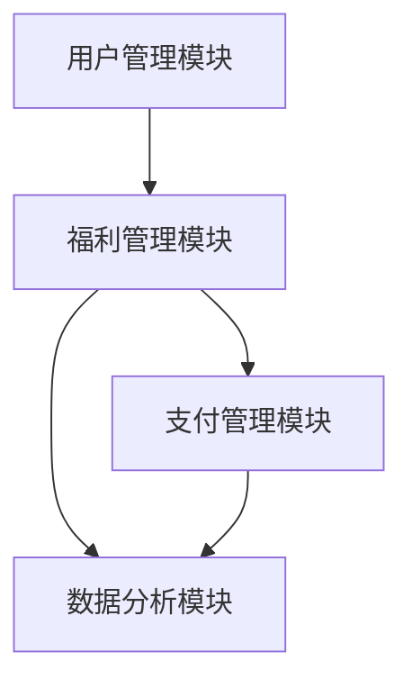

# 社会福利保障系统详细设计与具体代码实现

## 1.背景介绍

社会福利保障系统是现代社会的重要组成部分，旨在为公民提供基本的生活保障和社会福利。随着信息技术的发展，构建一个高效、可靠的社会福利保障系统变得尤为重要。本文将详细介绍社会福利保障系统的设计与实现，涵盖核心概念、算法原理、数学模型、代码实例、实际应用场景、工具和资源推荐等内容。

## 2.核心概念与联系

### 2.1 社会福利保障系统的定义

社会福利保障系统是指通过政府或其他机构提供的社会保障服务，包括医疗保险、养老保险、失业保险等。其目的是保障公民在失业、疾病、老年等情况下的基本生活需求。

### 2.2 系统架构概述

一个完整的社会福利保障系统通常包括以下几个模块：

- 用户管理模块：负责用户的注册、登录、信息管理等。
- 福利管理模块：负责福利项目的管理、申请、审批等。
- 支付管理模块：负责福利资金的发放、结算等。
- 数据分析模块：负责数据的收集、分析、报告生成等。

### 2.3 核心概念之间的联系

各个模块之间通过数据接口进行交互，共同完成社会福利保障的各项功能。用户管理模块是系统的入口，福利管理模块是核心，支付管理模块是保障，数据分析模块是优化。



## 3.核心算法原理具体操作步骤

### 3.1 用户身份验证算法

用户身份验证是系统安全的基础。常用的身份验证算法包括基于密码的验证、双因素验证等。

#### 3.1.1 基于密码的验证

1. 用户输入用户名和密码。
2. 系统将密码进行哈希处理。
3. 将哈希值与数据库中的存储值进行比对。
4. 如果匹配成功，则验证通过。

### 3.2 福利申请审批算法

福利申请审批是系统的核心功能之一。审批算法通常包括规则匹配、评分模型等。

#### 3.2.1 规则匹配算法

1. 用户提交福利申请。
2. 系统根据预设的规则进行初步筛选。
3. 如果符合规则，则进入人工审核环节。
4. 人工审核通过后，系统自动生成审批结果。

### 3.3 支付结算算法

支付结算算法用于确保福利资金的准确发放。常用的算法包括批量支付、实时支付等。

#### 3.3.1 批量支付算法

1. 系统定期生成支付清单。
2. 将支付清单发送至银行接口。
3. 银行接口返回支付结果。
4. 系统更新支付状态。

## 4.数学模型和公式详细讲解举例说明

### 4.1 用户评分模型

用户评分模型用于评估用户的福利申请资格。常用的评分模型包括线性回归模型、逻辑回归模型等。

#### 4.1.1 线性回归模型

线性回归模型的基本公式为：

$$
y = \beta_0 + \beta_1 x_1 + \beta_2 x_2 + \cdots + \beta_n x_n + \epsilon
$$

其中，$y$ 为用户评分，$x_1, x_2, \ldots, x_n$ 为用户特征，$\beta_0, \beta_1, \ldots, \beta_n$ 为模型参数，$\epsilon$ 为误差项。

### 4.2 支付结算模型

支付结算模型用于计算每个用户的福利金额。常用的模型包括固定金额模型、比例分配模型等。

#### 4.2.1 固定金额模型

固定金额模型的基本公式为：

$$
A = F
$$

其中，$A$ 为用户实际获得的福利金额，$F$ 为固定金额。

#### 4.2.2 比例分配模型

比例分配模型的基本公式为：

$$
A = P \times S
$$

其中，$A$ 为用户实际获得的福利金额，$P$ 为分配比例，$S$ 为总福利金额。

## 5.项目实践：代码实例和详细解释说明

### 5.1 用户身份验证代码实例

以下是一个基于Python的用户身份验证代码实例：

```python
import hashlib

def hash_password(password):
    return hashlib.sha256(password.encode()).hexdigest()

def verify_password(stored_password, provided_password):
    return stored_password == hash_password(provided_password)

# 示例
stored_password = hash_password("my_secure_password")
print(verify_password(stored_password, "my_secure_password"))  # 输出: True
print(verify_password(stored_password, "wrong_password"))  # 输出: False
```

### 5.2 福利申请审批代码实例

以下是一个基于规则匹配的福利申请审批代码实例：

```python
def approve_application(application):
    rules = [
        lambda app: app['age'] >= 18,
        lambda app: app['income'] < 50000,
        lambda app: app['employment_status'] == 'unemployed'
    ]
    
    for rule in rules:
        if not rule(application):
            return False
    return True

# 示例
application = {
    'age': 25,
    'income': 30000,
    'employment_status': 'unemployed'
}
print(approve_application(application))  # 输出: True
```

### 5.3 支付结算代码实例

以下是一个基于批量支付的支付结算代码实例：

```python
def batch_payment(users):
    payments = []
    for user in users:
        payment = {
            'user_id': user['id'],
            'amount': user['benefit_amount']
        }
        payments.append(payment)
    return payments

# 示例
users = [
    {'id': 1, 'benefit_amount': 1000},
    {'id': 2, 'benefit_amount': 1500}
]
print(batch_payment(users))  # 输出: [{'user_id': 1, 'amount': 1000}, {'user_id': 2, 'amount': 1500}]
```

## 6.实际应用场景

### 6.1 医疗保险

医疗保险是社会福利保障系统的重要组成部分。通过系统，用户可以在线申请医疗保险，系统自动进行审批和支付结算。

### 6.2 养老保险

养老保险为老年人提供基本生活保障。系统可以根据用户的年龄、收入等信息自动计算养老保险金额，并定期发放。

### 6.3 失业保险

失业保险为失业人员提供临时生活保障。系统可以根据用户的就业状态、收入等信息自动审批失业保险申请，并进行支付结算。

## 7.工具和资源推荐

### 7.1 开发工具

- **Python**：一种高效、易用的编程语言，适用于快速开发。
- **Django**：一个高效的Web框架，适用于构建复杂的Web应用。
- **PostgreSQL**：一个高性能的关系型数据库，适用于存储和管理大量数据。

### 7.2 资源推荐

- **《Python编程：从入门到实践》**：一本适合初学者的Python编程书籍。
- **《Django Web开发实战》**：一本详细介绍Django框架的书籍。
- **《PostgreSQL实战》**：一本深入讲解PostgreSQL数据库的书籍。

## 8.总结：未来发展趋势与挑战

### 8.1 未来发展趋势

随着技术的不断进步，社会福利保障系统将更加智能化和自动化。人工智能和大数据技术的应用将进一步提升系统的效率和准确性。

### 8.2 挑战

尽管技术进步带来了诸多便利，但社会福利保障系统仍面临诸多挑战，如数据隐私保护、系统安全性、用户体验等。如何在保障用户隐私的同时提升系统性能，是未来需要重点解决的问题。

## 9.附录：常见问题与解答

### 9.1 如何确保用户数据的安全性？

确保用户数据安全性的方法包括数据加密、访问控制、定期安全审计等。

### 9.2 如何提升系统的性能？

提升系统性能的方法包括优化算法、使用高效的数据库、进行系统性能测试等。

### 9.3 如何处理系统中的异常情况？

处理系统异常情况的方法包括设置异常处理机制、进行日志记录、定期系统维护等。

---

作者：禅与计算机程序设计艺术 / Zen and the Art of Computer Programming