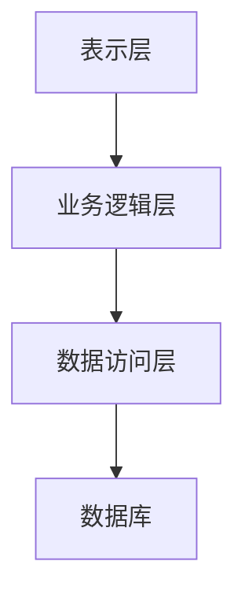
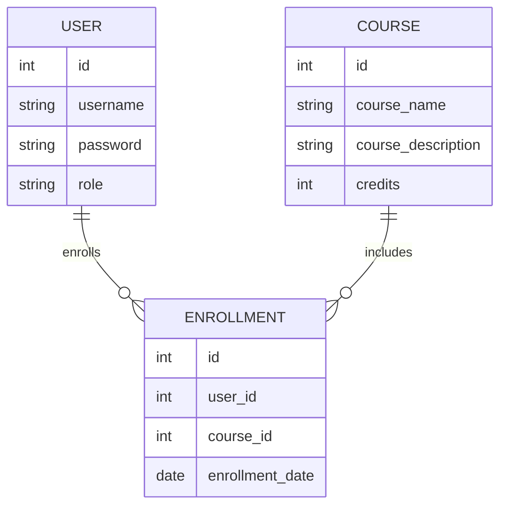

# 网上选课系统详细设计与具体代码实现

## 1.背景介绍

随着信息技术的飞速发展，教育行业也在不断地进行数字化转型。网上选课系统作为高校信息化建设的重要组成部分，极大地提高了选课效率和准确性，减少了人工操作的错误和繁琐。本文将详细介绍一个网上选课系统的设计与实现，旨在为读者提供一个完整的解决方案。

## 2.核心概念与联系

### 2.1 系统架构

网上选课系统通常采用分层架构，包括表示层、业务逻辑层和数据访问层。每一层都有其特定的职责，确保系统的高内聚和低耦合。



### 2.2 主要模块

1. **用户管理模块**：负责用户的注册、登录、权限管理等。
2. **课程管理模块**：负责课程的添加、修改、删除等操作。
3. **选课管理模块**：负责学生选课、退课、查看选课结果等功能。
4. **通知管理模块**：负责系统通知的发布和管理。

### 2.3 数据库设计

数据库是系统的核心，设计合理的数据库结构是系统成功的关键。主要的表包括用户表、课程表、选课表等。



## 3.核心算法原理具体操作步骤

### 3.1 用户认证算法

用户认证是系统安全的第一道防线。常用的认证算法包括基于哈希的密码存储和JWT（JSON Web Token）认证。

#### 3.1.1 哈希密码存储

```python
import hashlib

def hash_password(password):
    return hashlib.sha256(password.encode()).hexdigest()
```

#### 3.1.2 JWT认证

```python
import jwt
import datetime

def generate_token(user_id):
    payload = {
        'user_id': user_id,
        'exp': datetime.datetime.utcnow() + datetime.timedelta(days=1)
    }
    return jwt.encode(payload, 'secret', algorithm='HS256')
```

### 3.2 选课冲突检测算法

选课冲突检测是选课系统的核心功能之一。需要检测学生所选课程是否在时间上有冲突。

```python
def check_conflict(selected_courses, new_course):
    for course in selected_courses:
        if course['time'] == new_course['time']:
            return True
    return False
```

## 4.数学模型和公式详细讲解举例说明

### 4.1 选课优化模型

选课系统中，学生的选课需求和课程资源之间存在一定的矛盾。可以使用线性规划模型来优化选课方案。

#### 4.1.1 线性规划模型

目标函数：
$$
\text{Maximize} \sum_{i=1}^{n} \sum_{j=1}^{m} x_{ij} \cdot c_{ij}
$$

约束条件：
$$
\sum_{j=1}^{m} x_{ij} \leq 1 \quad \forall i \in \{1, 2, \ldots, n\}
$$
$$
\sum_{i=1}^{n} x_{ij} \leq C_j \quad \forall j \in \{1, 2, \ldots, m\}
$$

其中，$x_{ij}$ 表示学生 $i$ 是否选了课程 $j$，$c_{ij}$ 表示学生 $i$ 对课程 $j$ 的偏好，$C_j$ 表示课程 $j$ 的容量。

### 4.2 实例说明

假设有3个学生和2门课程，学生对课程的偏好如下表所示：

| 学生 | 课程1 | 课程2 |
|------|-------|-------|
| 学生1 | 8     | 6     |
| 学生2 | 7     | 9     |
| 学生3 | 5     | 7     |

课程1的容量为1，课程2的容量为2。通过线性规划求解，可以得到最优的选课方案。

## 5.项目实践：代码实例和详细解释说明

### 5.1 项目结构

项目采用MVC架构，主要目录结构如下：

```
online_course_selection/
├── app/
│   ├── controllers/
│   ├── models/
│   ├── views/
├── config/
├── db/
├── public/
├── tests/
└── main.py
```

### 5.2 数据库模型

使用SQLAlchemy定义数据库模型。

```python
from sqlalchemy import Column, Integer, String, ForeignKey, Date
from sqlalchemy.orm import relationship
from database import Base

class User(Base):
    __tablename__ = 'users'
    id = Column(Integer, primary_key=True)
    username = Column(String, unique=True, nullable=False)
    password = Column(String, nullable=False)
    role = Column(String, nullable=False)

class Course(Base):
    __tablename__ = 'courses'
    id = Column(Integer, primary_key=True)
    course_name = Column(String, nullable=False)
    course_description = Column(String)
    credits = Column(Integer, nullable=False)

class Enrollment(Base):
    __tablename__ = 'enrollments'
    id = Column(Integer, primary_key=True)
    user_id = Column(Integer, ForeignKey('users.id'), nullable=False)
    course_id = Column(Integer, ForeignKey('courses.id'), nullable=False)
    enrollment_date = Column(Date, nullable=False)
    user = relationship(User)
    course = relationship(Course)
```

### 5.3 控制器

控制器负责处理用户请求和业务逻辑。

```python
from flask import Flask, request, jsonify
from models import User, Course, Enrollment
from database import db_session

app = Flask(__name__)

@app.route('/register', methods=['POST'])
def register():
    data = request.get_json()
    new_user = User(username=data['username'], password=hash_password(data['password']), role='student')
    db_session.add(new_user)
    db_session.commit()
    return jsonify({'message': 'User registered successfully'}), 201

@app.route('/login', methods=['POST'])
def login():
    data = request.get_json()
    user = User.query.filter_by(username=data['username']).first()
    if user and user.password == hash_password(data['password']):
        token = generate_token(user.id)
        return jsonify({'token': token}), 200
    return jsonify({'message': 'Invalid credentials'}), 401
```

### 5.4 视图

视图负责呈现数据给用户。

```html
<!DOCTYPE html>
<html>
<head>
    <title>Online Course Selection</title>
</head>
<body>
    <h1>Welcome to the Online Course Selection System</h1>
    <form id="loginForm">
        <input type="text" id="username" placeholder="Username">
        <input type="password" id="password" placeholder="Password">
        <button type="submit">Login</button>
    </form>
    <script>
        document.getElementById('loginForm').addEventListener('submit', function(event) {
            event.preventDefault();
            const username = document.getElementById('username').value;
            const password = document.getElementById('password').value;
            fetch('/login', {
                method: 'POST',
                headers: {
                    'Content-Type': 'application/json'
                },
                body: JSON.stringify({ username, password })
            })
            .then(response => response.json())
            .then(data => {
                if (data.token) {
                    localStorage.setItem('token', data.token);
                    alert('Login successful');
                } else {
                    alert('Login failed');
                }
            });
        });
    </script>
</body>
</html>
```

## 6.实际应用场景

### 6.1 高校选课

高校选课系统是最常见的应用场景。通过网上选课系统，学生可以方便地选择自己感兴趣的课程，查看课程信息和选课结果。

### 6.2 在线教育平台

在线教育平台也可以使用选课系统来管理课程和学生。通过选课系统，平台可以更好地管理课程资源，提高教学质量。

### 6.3 企业培训

企业培训系统也可以借鉴选课系统的设计，帮助员工选择合适的培训课程，提高培训效果。

## 7.工具和资源推荐

### 7.1 开发工具

- **IDE**：推荐使用PyCharm或Visual Studio Code进行开发。
- **数据库**：推荐使用MySQL或PostgreSQL。
- **框架**：推荐使用Flask或Django进行Web开发。

### 7.2 资源推荐

- **书籍**：《Flask Web Development》, 《Django for Beginners》
- **在线课程**：Coursera上的《Web Application Development with Flask and Python》
- **社区**：Stack Overflow, GitHub

## 8.总结：未来发展趋势与挑战

### 8.1 未来发展趋势

随着人工智能和大数据技术的发展，未来的选课系统将更加智能化和个性化。通过分析学生的学习数据，系统可以推荐最适合学生的课程，提高学习效果。

### 8.2 挑战

1. **数据安全**：如何保护学生的隐私和数据安全是一个重要的挑战。
2. **系统性能**：随着用户数量的增加，如何保证系统的高性能和高可用性也是一个重要的挑战。
3. **用户体验**：如何设计一个用户友好的界面，提高用户体验也是一个需要关注的问题。

## 9.附录：常见问题与解答

### 9.1 如何处理选课冲突？

选课冲突可以通过检测课程时间是否重叠来解决。如果发现冲突，可以提示学生选择其他时间段的课程。

### 9.2 如何保证数据安全？

可以通过加密存储用户密码、使用HTTPS协议、定期备份数据等措施来保证数据安全。

### 9.3 如何提高系统性能？

可以通过使用缓存、优化数据库查询、使用负载均衡等技术来提高系统性能。

---

作者：禅与计算机程序设计艺术 / Zen and the Art of Computer Programming