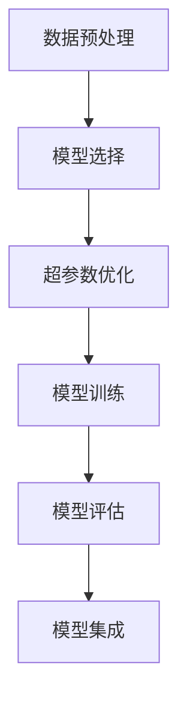

## 1.背景介绍

在当前数据驱动的时代，机器学习已成为解决复杂问题的重要工具。然而，传统的机器学习过程需要大量的人工参与，包括特征选择、模型选择和超参数调优等，这对于非专业的用户来说，无疑增加了使用机器学习的难度。因此，自动机器学习（AutoML）应运而生，它的目标是使得机器学习过程自动化，降低机器学习的门槛，使得更多的人能够使用机器学习来解决问题。

## 2.核心概念与联系

AutoML主要包含以下几个核心概念：

- 数据预处理：包括数据清洗、特征选择、特征编码等步骤，是机器学习的前期准备工作。
- 模型选择：根据问题的特点和数据的特性，选择最合适的机器学习模型。
- 超参数优化：通过优化算法自动寻找最佳的超参数，以提高模型的性能。
- 模型集成：通过集成多个模型，以提高模型的泛化能力。

这些核心概念之间的联系可以通过下面的Mermaid流程图来展示：



## 3.核心算法原理具体操作步骤

AutoML的核心算法原理可以分为以下几个步骤：

1. **数据预处理**：首先，AutoML会对输入的数据进行预处理，包括数据清洗、特征选择、特征编码等步骤，以便于后续的模型训练。

2. **模型选择**：然后，AutoML会根据问题的特点和数据的特性，选择最合适的机器学习模型。这一步通常会涉及到模型的比较和选择。

3. **超参数优化**：接着，AutoML会通过优化算法自动寻找最佳的超参数，以提高模型的性能。这一步通常会涉及到贝叶斯优化、网格搜索等优化方法。

4. **模型训练**：之后，AutoML会使用选择好的模型和超参数，对数据进行模型训练。

5. **模型评估**：训练完成后，AutoML会对模型的性能进行评估，包括准确率、召回率、F1分数等指标。

6. **模型集成**：最后，AutoML会通过模型集成的方式，将多个模型组合在一起，以提高模型的泛化能力。

## 4.数学模型和公式详细讲解举例说明

在AutoML的过程中，我们通常会使用贝叶斯优化来进行超参数的优化。贝叶斯优化是一种基于贝叶斯理论和高斯过程的优化方法，它可以有效地找到最优的超参数。

贝叶斯优化的基本思想是：在每一步优化中，我们都会根据已有的观测值，计算出一个后验分布，然后根据这个后验分布，选择下一步的观测点。

具体来说，我们可以使用以下公式来描述贝叶斯优化的过程：

1. **高斯过程**：首先，我们假设目标函数$f(x)$服从高斯过程，即

   $$
   f(x) \sim GP(m(x), k(x, x'))
   $$

   其中，$m(x)$是均值函数，$k(x, x')$是协方差函数。

2. **后验分布**：在观测到数据$D = \{(x_i, y_i)\}_{i=1}^n$后，我们可以计算出目标函数的后验分布，即

   $$
   p(f|D) = \frac{p(D|f)p(f)}{p(D)}
   $$

   其中，$p(D|f)$是似然函数，$p(f)$是先验分布，$p(D)$是证据。

3. **采样策略**：然后，我们可以根据后验分布，选择下一步的观测点$x_{n+1}$，即

   $$
   x_{n+1} = \arg\max_{x} \mathbb{E}[f(x)|D]
   $$

   其中，$\mathbb{E}[f(x)|D]$是目标函数的期望值。

通过这样的方式，贝叶斯优化可以有效地找到最优的超参数，从而提高模型的性能。

## 5.项目实践：代码实例和详细解释说明

在Python中，我们可以使用AutoSklearn库来实现AutoML。下面是一个简单的示例：

```python
from autosklearn.classification import AutoSklearnClassifier
from sklearn.datasets import load_digits
from sklearn.model_selection import train_test_split

# 加载数据
digits = load_digits()
X = digits.data
y = digits.target

# 划分训练集和测试集
X_train, X_test, y_train, y_test = train_test_split(X, y, test_size=0.2, random_state=42)

# 创建AutoSklearn分类器
clf = AutoSklearnClassifier(time_left_for_this_task=120, per_run_time_limit=30)

# 训练模型
clf.fit(X_train, y_train)

# 预测测试集
y_pred = clf.predict(X_test)

# 打印模型的性能
print("Accuracy: ", clf.score(X_test, y_test))
```

在这个示例中，我们首先加载了digits数据集，然后划分了训练集和测试集。接着，我们创建了一个AutoSklearn分类器，并设置了时间限制。然后，我们使用训练集训练了模型，并对测试集进行了预测。最后，我们打印了模型的准确率。

## 6.实际应用场景

AutoML在实际中有很多应用场景，包括：

- **数据分析**：在数据分析中，我们可以使用AutoML来自动选择最合适的模型和超参数，从而提高数据分析的效率和准确性。
- **推荐系统**：在推荐系统中，我们可以使用AutoML来自动优化推荐算法，从而提高推荐的准确性和用户满意度。
- **医疗诊断**：在医疗诊断中，我们可以使用AutoML来自动识别疾病的特征，从而提高诊断的准确性和效率。

## 7.工具和资源推荐

在实际使用AutoML时，我们可以使用以下工具和资源：

- **AutoSklearn**：这是一个基于Scikit-learn的AutoML库，它可以自动选择最合适的模型和超参数。
- **TPOT**：这是一个基于遗传算法的AutoML库，它可以自动发现最优的数据预处理和模型选择策略。
- **H2O AutoML**：这是一个基于H2O的AutoML库，它可以自动进行特征选择、模型选择和超参数优化。

## 8.总结：未来发展趋势与挑战

随着机器学习的发展，AutoML的应用越来越广泛，其未来的发展趋势可能会有以下几点：

- **更智能的模型选择**：未来的AutoML可能会更加智能地选择模型，不仅仅是根据问题的特点和数据的特性，还可能会考虑模型的复杂性、训练时间等因素。
- **更高效的超参数优化**：未来的AutoML可能会使用更高效的优化算法，如强化学习、神经网络等，来进行超参数的优化。
- **更广泛的应用领域**：随着AutoML的发展，其应用领域可能会更加广泛，包括自然语言处理、图像识别、语音识别等领域。

然而，AutoML也面临着一些挑战，如如何处理大规模数据、如何处理高维数据、如何处理非平衡数据等。这些都需要我们在未来的研究中去解决。

## 9.附录：常见问题与解答

1. **AutoML能否完全替代数据科学家？**

   虽然AutoML可以自动化一些机器学习的过程，但它并不能完全替代数据科学家。因为数据科学家不仅需要进行模型选择和超参数优化，还需要理解问题的背景，提出合理的假设，解释模型的结果等，这些都是AutoML无法做到的。

2. **AutoML适合所有的问题吗？**

   并不是。虽然AutoML可以处理很多类型的问题，但对于一些特殊的问题，如时间序列预测、文本分类等，可能需要专门的模型和方法。此外，对于一些大规模的问题，AutoML可能会因为计算资源的限制而无法处理。

3. **AutoML的效果如何？**

   AutoML的效果取决于很多因素，如问题的复杂性、数据的质量、计算资源的限制等。在一些问题上，AutoML的效果可以与专业的数据科学家相媲美，甚至更好。但在一些复杂的问题上，AutoML的效果可能会不尽人意。

作者：禅与计算机程序设计艺术 / Zen and the Art of Computer Programming
