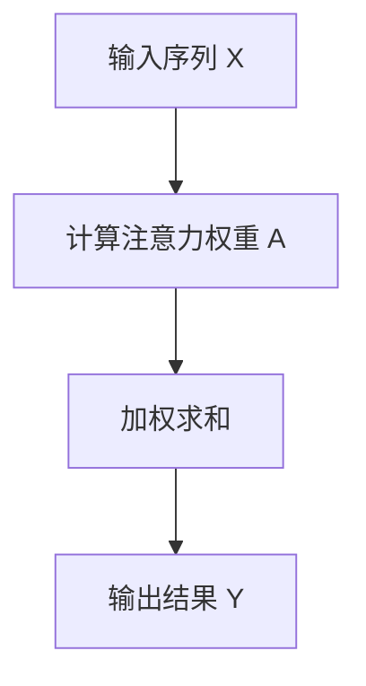
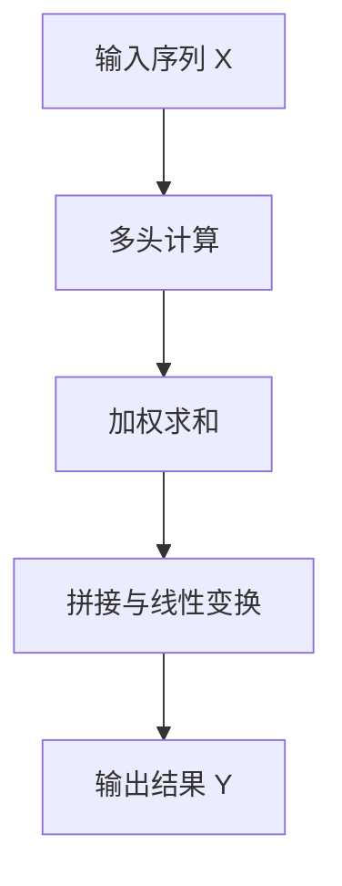
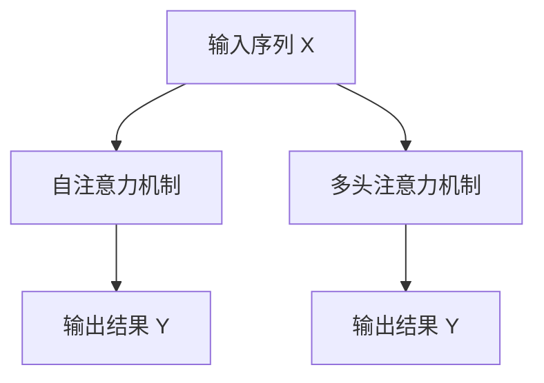

# 见微知著开慧眼：引入注意力机制

## 1.背景介绍

在过去的十年中，深度学习技术取得了显著的进展，尤其是在自然语言处理（NLP）和计算机视觉领域。然而，传统的神经网络模型在处理长序列数据时存在显著的局限性。为了解决这一问题，注意力机制（Attention Mechanism）应运而生，并迅速成为深度学习领域的一个重要研究方向。

注意力机制最早由Bahdanau等人在2014年提出，用于机器翻译任务。其核心思想是通过引入一个权重矩阵，使得模型能够在处理输入序列时，动态地关注不同部分，从而提高模型的性能。自此之后，注意力机制被广泛应用于各种任务，如图像识别、文本生成和语音识别等。

## 2.核心概念与联系

### 2.1 注意力机制的基本概念

注意力机制的核心思想是通过计算输入序列中每个元素的重要性权重，使得模型能够更有效地处理长序列数据。具体来说，注意力机制包括以下几个关键步骤：

1. **计算注意力权重**：通过某种方式计算输入序列中每个元素的重要性权重。
2. **加权求和**：根据计算得到的权重，对输入序列进行加权求和，得到一个新的表示。
3. **输出结果**：将加权求和的结果作为模型的输出。

### 2.2 注意力机制与传统神经网络的联系

传统的神经网络模型，如循环神经网络（RNN）和卷积神经网络（CNN），在处理长序列数据时存在信息丢失和计算复杂度高的问题。注意力机制通过引入权重矩阵，使得模型能够动态地关注输入序列中的不同部分，从而有效地解决了这些问题。

### 2.3 注意力机制的分类

注意力机制可以根据不同的计算方式和应用场景进行分类，主要包括以下几种：

1. **自注意力（Self-Attention）**：在处理输入序列时，计算序列中每个元素与其他元素之间的关系。
2. **多头注意力（Multi-Head Attention）**：通过引入多个注意力头，使得模型能够捕捉输入序列中的不同特征。
3. **跨注意力（Cross-Attention）**：在处理两个不同序列时，计算它们之间的关系。

## 3.核心算法原理具体操作步骤

### 3.1 自注意力机制

自注意力机制是注意力机制的一个重要变种，其核心思想是通过计算输入序列中每个元素与其他元素之间的关系，得到一个新的表示。具体操作步骤如下：

1. **输入表示**：将输入序列表示为一个矩阵 $X$，其中每一行表示一个元素的特征向量。
2. **计算注意力权重**：通过点积计算输入序列中每个元素与其他元素之间的关系，得到一个权重矩阵 $A$。
3. **加权求和**：根据权重矩阵 $A$，对输入序列进行加权求和，得到一个新的表示矩阵 $Y$。



### 3.2 多头注意力机制

多头注意力机制通过引入多个注意力头，使得模型能够捕捉输入序列中的不同特征。具体操作步骤如下：

1. **输入表示**：将输入序列表示为一个矩阵 $X$，其中每一行表示一个元素的特征向量。
2. **多头计算**：通过引入多个注意力头，分别计算输入序列中每个元素与其他元素之间的关系，得到多个权重矩阵 $A_1, A_2, \ldots, A_h$。
3. **加权求和**：根据多个权重矩阵，对输入序列进行加权求和，得到多个新的表示矩阵 $Y_1, Y_2, \ldots, Y_h$。
4. **拼接与线性变换**：将多个新的表示矩阵拼接起来，并通过线性变换得到最终的输出结果 $Y$。



## 4.数学模型和公式详细讲解举例说明

### 4.1 自注意力机制的数学模型

自注意力机制的数学模型可以通过以下公式表示：

$$
A = \text{softmax}\left(\frac{QK^T}{\sqrt{d_k}}\right)
$$

其中，$Q$、$K$ 和 $V$ 分别表示查询矩阵、键矩阵和值矩阵，$d_k$ 表示键矩阵的维度。通过点积计算得到的权重矩阵 $A$，再与值矩阵 $V$ 相乘，得到最终的输出结果：

$$
Y = AV
$$

### 4.2 多头注意力机制的数学模型

多头注意力机制的数学模型可以通过以下公式表示：

$$
\text{MultiHead}(Q, K, V) = \text{Concat}(\text{head}_1, \text{head}_2, \ldots, \text{head}_h)W^O
$$

其中，每个注意力头的计算方式如下：

$$
\text{head}_i = \text{Attention}(QW_i^Q, KW_i^K, VW_i^V)
$$

通过将多个注意力头的输出结果拼接起来，并通过线性变换得到最终的输出结果。

### 4.3 示例说明

假设输入序列 $X$ 为一个 $3 \times 4$ 的矩阵，其中每一行表示一个元素的特征向量。通过自注意力机制和多头注意力机制的计算，可以得到新的表示矩阵 $Y$。



## 5.项目实践：代码实例和详细解释说明

### 5.1 自注意力机制的代码实现

以下是一个简单的自注意力机制的代码实现示例：

```python
import torch
import torch.nn.functional as F

class SelfAttention(torch.nn.Module):
    def __init__(self, d_model):
        super(SelfAttention, self).__init__()
        self.query = torch.nn.Linear(d_model, d_model)
        self.key = torch.nn.Linear(d_model, d_model)
        self.value = torch.nn.Linear(d_model, d_model)
        self.scale = torch.sqrt(torch.FloatTensor([d_model]))

    def forward(self, x):
        Q = self.query(x)
        K = self.key(x)
        V = self.value(x)
        attention_weights = F.softmax(torch.matmul(Q, K.transpose(-2, -1)) / self.scale, dim=-1)
        output = torch.matmul(attention_weights, V)
        return output

# 示例输入
x = torch.rand(3, 4)
self_attention = SelfAttention(d_model=4)
output = self_attention(x)
print(output)
```

### 5.2 多头注意力机制的代码实现

以下是一个简单的多头注意力机制的代码实现示例：

```python
import torch
import torch.nn.functional as F

class MultiHeadAttention(torch.nn.Module):
    def __init__(self, d_model, num_heads):
        super(MultiHeadAttention, self).__init__()
        self.num_heads = num_heads
        self.d_model = d_model
        self.d_k = d_model // num_heads

        self.query = torch.nn.Linear(d_model, d_model)
        self.key = torch.nn.Linear(d_model, d_model)
        self.value = torch.nn.Linear(d_model, d_model)
        self.out = torch.nn.Linear(d_model, d_model)

    def forward(self, x):
        batch_size = x.size(0)
        Q = self.query(x).view(batch_size, -1, self.num_heads, self.d_k).transpose(1, 2)
        K = self.key(x).view(batch_size, -1, self.num_heads, self.d_k).transpose(1, 2)
        V = self.value(x).view(batch_size, -1, self.num_heads, self.d_k).transpose(1, 2)

        attention_weights = F.softmax(torch.matmul(Q, K.transpose(-2, -1)) / torch.sqrt(torch.FloatTensor([self.d_k])), dim=-1)
        output = torch.matmul(attention_weights, V).transpose(1, 2).contiguous().view(batch_size, -1, self.d_model)
        output = self.out(output)
        return output

# 示例输入
x = torch.rand(3, 4)
multi_head_attention = MultiHeadAttention(d_model=4, num_heads=2)
output = multi_head_attention(x)
print(output)
```

## 6.实际应用场景

### 6.1 自然语言处理

在自然语言处理领域，注意力机制被广泛应用于机器翻译、文本生成和情感分析等任务。例如，Transformer模型通过引入自注意力机制，显著提高了机器翻译的性能。

### 6.2 计算机视觉

在计算机视觉领域，注意力机制被应用于图像识别、目标检测和图像生成等任务。例如，视觉Transformer（ViT）通过引入自注意力机制，实现了在图像分类任务上的优异表现。

### 6.3 语音识别

在语音识别领域，注意力机制被应用于语音转文本、语音合成和语音情感分析等任务。例如，基于注意力机制的语音识别模型能够更准确地捕捉语音信号中的重要信息，从而提高识别准确率。

## 7.工具和资源推荐

### 7.1 深度学习框架

1. **TensorFlow**：一个开源的深度学习框架，支持多种神经网络模型的构建和训练。
2. **PyTorch**：一个灵活且易于使用的深度学习框架，广泛应用于研究和工业界。

### 7.2 开源项目

1. **Transformers**：由Hugging Face提供的一个开源库，包含多种基于注意力机制的预训练模型，如BERT、GPT和Transformer等。
2. **Attention**：一个包含多种注意力机制实现的开源项目，适用于不同的深度学习任务。

### 7.3 在线课程和书籍

1. **深度学习课程**：如Coursera上的“Deep Learning Specialization”课程，涵盖了深度学习的基础知识和前沿技术。
2. **深度学习书籍**：如《深度学习》（Deep Learning）一书，详细介绍了深度学习的理论和实践。

## 8.总结：未来发展趋势与挑战

### 8.1 未来发展趋势

注意力机制作为深度学习领域的重要研究方向，未来有望在以下几个方面取得进一步的发展：

1. **更高效的模型**：通过优化注意力机制的计算方式，进一步提高模型的计算效率和性能。
2. **跨模态应用**：将注意力机制应用于多模态数据的处理，如图像与文本的联合分析。
3. **自监督学习**：结合自监督学习方法，进一步提升模型的泛化能力和鲁棒性。

### 8.2 挑战

尽管注意力机制在多个领域取得了显著的进展，但仍然面临一些挑战：

1. **计算复杂度**：注意力机制的计算复杂度较高，尤其是在处理长序列数据时，容易导致计算资源的消耗。
2. **数据依赖性**：注意力机制在训练过程中对大规模数据的依赖较强，可能导致在小数据集上的表现不佳。
3. **模型解释性**：尽管注意力机制能够提高模型的性能，但其内部机制较为复杂，难以解释模型的决策过程。

## 9.附录：常见问题与解答

### 9.1 什么是注意力机制？

注意力机制是一种用于提高神经网络模型处理长序列数据能力的方法，通过引入权重矩阵，使得模型能够动态地关注输入序列中的不同部分。

### 9.2 注意力机制有哪些类型？

注意力机制主要包括自注意力、多头注意力和跨注意力等类型，分别适用于不同的应用场景。

### 9.3 如何实现自注意力机制？

自注意力机制的实现包括计算注意力权重、加权求和和输出结果等步骤，可以通过深度学习框架如PyTorch和TensorFlow进行实现。

### 9.4 注意力机制的应用场景有哪些？

注意力机制广泛应用于自然语言处理、计算机视觉和语音识别等领域，如机器翻译、图像识别和语音转文本等任务。

### 9.5 注意力机制的未来发展趋势是什么？

注意力机制未来有望在更高效的模型、跨模态应用和自监督学习等方面取得进一步的发展，但仍面临计算复杂度、数据依赖性和模型解释性等挑战。

---

作者：禅与计算机程序设计艺术 / Zen and the Art of Computer Programming