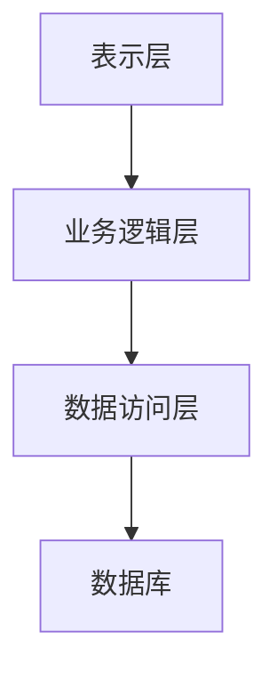

# 试卷管理系统详细设计与具体代码实现

## 1.背景介绍

在现代教育和培训领域，试卷管理系统（Exam Management System, EMS）已经成为不可或缺的工具。它不仅简化了试卷的创建、分发和评估过程，还提高了考试的公平性和效率。本文将详细介绍一个试卷管理系统的设计与实现，涵盖从核心概念到具体代码的各个方面。

## 2.核心概念与联系

### 2.1 试卷管理系统的基本功能

试卷管理系统主要包括以下几个核心功能：

- **试卷创建**：教师可以创建和编辑试卷，包括选择题、填空题、简答题等。
- **试卷分发**：系统可以将试卷分发给指定的学生或班级。
- **考试监控**：实时监控考试过程，防止作弊行为。
- **自动评分**：系统可以自动评分选择题和填空题，简答题则需要人工评分。
- **成绩分析**：对考试成绩进行统计分析，生成各种报表。

### 2.2 系统架构

试卷管理系统通常采用分层架构，包括表示层、业务逻辑层和数据访问层。各层之间通过接口进行通信，确保系统的可维护性和扩展性。



### 2.3 核心组件

- **用户管理**：包括教师、学生和管理员的注册、登录和权限管理。
- **试卷管理**：试卷的创建、编辑、删除和分发。
- **考试管理**：考试的安排、监控和评分。
- **成绩管理**：成绩的录入、统计和分析。

## 3.核心算法原理具体操作步骤

### 3.1 试卷生成算法

试卷生成是试卷管理系统的核心功能之一。一个高效的试卷生成算法需要考虑题目的难度、题型的多样性和知识点的覆盖率。

#### 3.1.1 题库设计

题库是试卷生成的基础。题库中的每道题目都需要有以下属性：

- 题目ID
- 题目内容
- 题型（选择题、填空题、简答题等）
- 难度等级
- 知识点

#### 3.1.2 试卷生成步骤

1. **确定试卷结构**：包括题型和每种题型的题目数量。
2. **筛选题目**：根据题型和难度从题库中筛选题目。
3. **随机排列**：将筛选出的题目随机排列，生成试卷。

### 3.2 自动评分算法

自动评分主要针对选择题和填空题。选择题的评分相对简单，只需将学生的答案与标准答案进行比对。填空题的评分则需要考虑答案的多样性。

#### 3.2.1 选择题评分

选择题的评分算法如下：

1. **读取标准答案**：从数据库中读取标准答案。
2. **比对答案**：将学生的答案与标准答案进行比对。
3. **计算得分**：每道题目得分累加，得到总分。

#### 3.2.2 填空题评分

填空题的评分算法如下：

1. **读取标准答案**：从数据库中读取标准答案。
2. **比对答案**：将学生的答案与标准答案进行比对，考虑答案的多样性。
3. **计算得分**：每个空格得分累加，得到总分。

## 4.数学模型和公式详细讲解举例说明

### 4.1 试卷生成的数学模型

试卷生成可以看作是一个组合优化问题。假设题库中有 $n$ 道题目，每道题目有一个难度值 $d_i$ 和一个知识点 $k_i$。试卷的目标是选择 $m$ 道题目，使得题目的难度和知识点分布满足预定要求。

#### 4.1.1 难度分布

设试卷的目标难度为 $D$，则选择的 $m$ 道题目的难度和应满足：

$$
\sum_{i=1}^{m} d_i \approx D
$$

#### 4.1.2 知识点覆盖

设试卷需要覆盖的知识点集合为 $K$，则选择的 $m$ 道题目的知识点应满足：

$$
\{k_1, k_2, \ldots, k_m\} \supseteq K
$$

### 4.2 自动评分的数学模型

自动评分可以看作是一个分类问题。假设选择题的标准答案为 $A = \{a_1, a_2, \ldots, a_n\}$，学生的答案为 $B = \{b_1, b_2, \ldots, b_n\}$，则选择题的得分 $S$ 为：

$$
S = \sum_{i=1}^{n} \delta(a_i, b_i)
$$

其中，$\delta(a_i, b_i)$ 为指示函数，当 $a_i = b_i$ 时，$\delta(a_i, b_i) = 1$，否则 $\delta(a_i, b_i) = 0$。

## 5.项目实践：代码实例和详细解释说明

### 5.1 技术栈选择

本项目采用以下技术栈：

- **前端**：React.js
- **后端**：Node.js + Express
- **数据库**：MongoDB

### 5.2 数据库设计

#### 5.2.1 用户表

```json
{
  "user_id": "string",
  "username": "string",
  "password": "string",
  "role": "string" // teacher, student, admin
}
```

#### 5.2.2 题库表

```json
{
  "question_id": "string",
  "content": "string",
  "type": "string", // choice, fill-in-the-blank, short-answer
  "difficulty": "number",
  "knowledge_point": "string"
}
```

#### 5.2.3 试卷表

```json
{
  "exam_id": "string",
  "title": "string",
  "questions": ["string"], // array of question_id
  "created_by": "string" // user_id of the teacher
}
```

### 5.3 后端代码实现

#### 5.3.1 用户注册与登录

```javascript
const express = require('express');
const bcrypt = require('bcrypt');
const jwt = require('jsonwebtoken');
const User = require('./models/User');

const app = express();
app.use(express.json());

app.post('/register', async (req, res) => {
  const { username, password, role } = req.body;
  const hashedPassword = await bcrypt.hash(password, 10);
  const user = new User({ username, password: hashedPassword, role });
  await user.save();
  res.status(201).send('User registered');
});

app.post('/login', async (req, res) => {
  const { username, password } = req.body;
  const user = await User.findOne({ username });
  if (!user || !await bcrypt.compare(password, user.password)) {
    return res.status(401).send('Invalid credentials');
  }
  const token = jwt.sign({ userId: user._id, role: user.role }, 'secret');
  res.json({ token });
});

app.listen(3000, () => {
  console.log('Server is running on port 3000');
});
```

#### 5.3.2 试卷生成

```javascript
const Question = require('./models/Question');
const Exam = require('./models/Exam');

app.post('/create-exam', async (req, res) => {
  const { title, questionIds, createdBy } = req.body;
  const exam = new Exam({ title, questions: questionIds, created_by: createdBy });
  await exam.save();
  res.status(201).send('Exam created');
});

app.get('/generate-exam', async (req, res) => {
  const { numQuestions, difficulty, knowledgePoints } = req.query;
  const questions = await Question.find({
    difficulty: { $lte: difficulty },
    knowledge_point: { $in: knowledgePoints }
  }).limit(numQuestions);
  res.json(questions);
});
```

### 5.4 前端代码实现

#### 5.4.1 用户注册与登录

```javascript
import React, { useState } from 'react';
import axios from 'axios';

const Register = () => {
  const [username, setUsername] = useState('');
  const [password, setPassword] = useState('');
  const [role, setRole] = useState('student');

  const handleRegister = async () => {
    await axios.post('/register', { username, password, role });
    alert('User registered');
  };

  return (
    <div>
      <h2>Register</h2>
      <input type="text" value={username} onChange={(e) => setUsername(e.target.value)} placeholder="Username" />
      <input type="password" value={password} onChange={(e) => setPassword(e.target.value)} placeholder="Password" />
      <select value={role} onChange={(e) => setRole(e.target.value)}>
        <option value="student">Student</option>
        <option value="teacher">Teacher</option>
        <option value="admin">Admin</option>
      </select>
      <button onClick={handleRegister}>Register</button>
    </div>
  );
};

export default Register;
```

#### 5.4.2 试卷生成

```javascript
import React, { useState, useEffect } from 'react';
import axios from 'axios';

const GenerateExam = () => {
  const [questions, setQuestions] = useState([]);
  const [numQuestions, setNumQuestions] = useState(10);
  const [difficulty, setDifficulty] = useState(3);
  const [knowledgePoints, setKnowledgePoints] = useState(['math', 'science']);

  useEffect(() => {
    const fetchQuestions = async () => {
      const response = await axios.get('/generate-exam', {
        params: { numQuestions, difficulty, knowledgePoints }
      });
      setQuestions(response.data);
    };
    fetchQuestions();
  }, [numQuestions, difficulty, knowledgePoints]);

  return (
    <div>
      <h2>Generate Exam</h2>
      <div>
        <label>Number of Questions:</label>
        <input type="number" value={numQuestions} onChange={(e) => setNumQuestions(e.target.value)} />
      </div>
      <div>
        <label>Difficulty:</label>
        <input type="number" value={difficulty} onChange={(e) => setDifficulty(e.target.value)} />
      </div>
      <div>
        <label>Knowledge Points:</label>
        <input type="text" value={knowledgePoints.join(',')} onChange={(e) => setKnowledgePoints(e.target.value.split(','))} />
      </div>
      <button onClick={() => setQuestions([])}>Generate</button>
      <ul>
        {questions.map((question) => (
          <li key={question.question_id}>{question.content}</li>
        ))}
      </ul>
    </div>
  );
};

export default GenerateExam;
```

## 6.实际应用场景

### 6.1 教育机构

教育机构可以使用试卷管理系统来简化考试的组织和管理过程。教师可以方便地创建和分发试卷，学生可以在线参加考试，系统自动评分并生成成绩报告。

### 6.2 企业培训

企业可以使用试卷管理系统来进行员工培训和评估。通过在线考试，企业可以快速了解员工的知识水平和技能掌握情况，从而制定更有效的培训计划。

### 6.3 在线教育平台

在线教育平台可以集成试卷管理系统，为学生提供在线测试和评估服务。通过自动评分和成绩分析，平台可以为学生提供个性化的学习建议。

## 7.工具和资源推荐

### 7.1 开发工具

- **Visual Studio Code**：一款流行的代码编辑器，支持多种编程语言和插件。
- **Postman**：用于API测试和调试的工具。
- **MongoDB Compass**：MongoDB的图形化管理工具。

### 7.2 在线资源

- **MDN Web Docs**：提供全面的Web开发文档和教程。
- **Stack Overflow**：一个程序员问答社区，可以在这里找到各种编程问题的解决方案。
- **GitHub**：代码托管平台，可以在这里找到开源项目和代码示例。

## 8.总结：未来发展趋势与挑战

### 8.1 未来发展趋势

随着人工智能和大数据技术的发展，试卷管理系统将变得更加智能化和个性化。未来的试卷管理系统可能会具备以下功能：

- **智能组卷**：基于学生的学习记录和知识点掌握情况，智能生成个性化试卷。
- **自动评估**：利用自然语言处理技术，实现简答题和作文的自动评分。
- **数据分析**：通过大数据分析，提供更全面的成绩分析和学习建议。

### 8.2 挑战

尽管试卷管理系统有很多优势，但在实际应用中仍然面临一些挑战：

- **数据安全**：考试数据和学生信息的安全性需要得到保障，防止数据泄露和篡改。
- **系统稳定性**：系统需要具备高可用性和稳定性，确保在高并发情况下仍能正常运行。
- **用户体验**：系统的用户界面和交互设计需要不断优化，提高用户的使用体验。

## 9.附录：常见问题与解答

### 9.1 如何确保试卷的公平性？

试卷的公平性可以通过以下几种方式来确保：

- **随机抽题**：从题库中随机抽取题目，避免题目重复和泄露。
- **多版本试卷**：生成多个版本的试卷，防止学生之间互相抄袭。
- **考试监控**：通过摄像头和屏幕监控，防止学生在考试过程中作弊。

### 9.2 如何处理系统的高并发请求？

处理高并发请求可以采用以下几种技术：

- **负载均衡**：通过负载均衡器将请求分发到多个服务器，减轻单个服务器的压力。
- **缓存技术**：使用缓存技术（如Redis）存储常用数据，减少数据库的访问压力。
- **异步处理**：将一些耗时的操作（如成绩统计）放到后台异步处理，提高系统的响应速度。

### 9.3 如何保护考试数据的安全性？

保护考试数据的安全性可以采用以下几种措施：

- **数据加密**：对考试数据和学生信息进行加密存储，防止数据泄露。
- **权限控制**：通过权限控制，确保只有授权用户才能访问和操作敏感数据。
- **日志审计**：记录系统的操作日志，便于追踪和审计。

---

作者：禅与计算机程序设计艺术 / Zen and the Art of Computer Programming