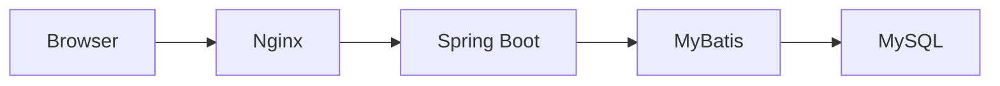
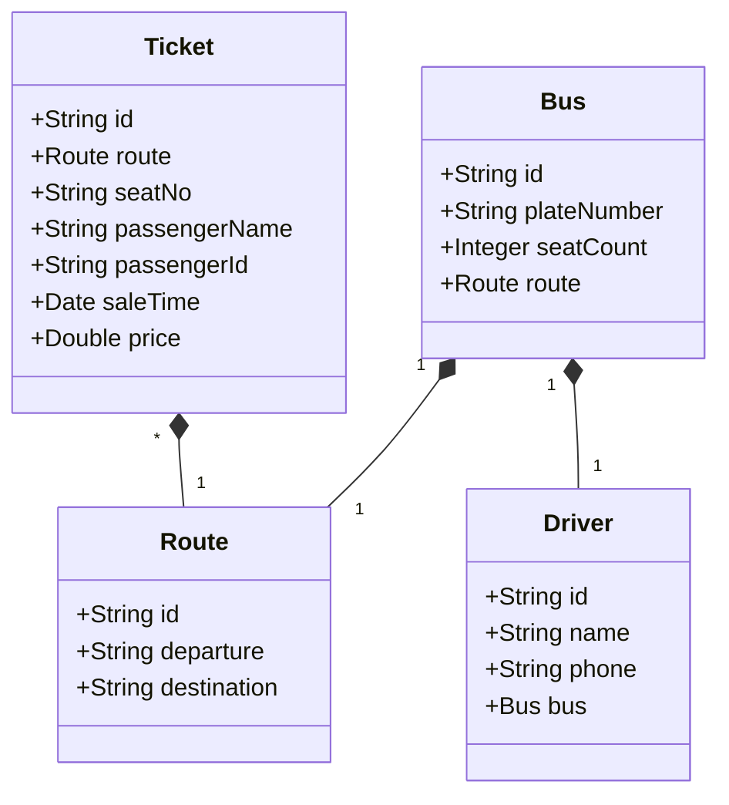

# 长途汽车信息管理系统详细设计与具体代码实现

## 1. 背景介绍

### 1.1 项目背景

随着社会经济的不断发展,长途客运行业也迎来了新的机遇和挑战。为了提高长途汽车运营效率,改善乘客出行体验,开发一套功能完善、易于使用的长途汽车信息管理系统变得尤为重要。本文将详细阐述该系统的设计思路和具体实现方案。

### 1.2 系统目标

长途汽车信息管理系统旨在实现以下目标:

1. 实现车辆、司机、线路等基础信息的数字化管理
2. 提供车票预订、售票、退票等在线服务功能
3. 为管理人员提供车辆调度、统计报表等辅助决策功能  
4. 优化乘客购票流程,提升用户体验

### 1.3 系统架构

本系统采用Browser/Server架构,前端使用Vue.js框架,后端采用Spring Boot + MyBatis,数据库选用MySQL。系统整体架构如下图所示:



## 2. 核心概念与联系

### 2.1 车辆管理

车辆是长途客运的核心资源,需要对车辆的基本信息、状态等进行管理。主要属性包括:
- 车辆编号
- 车牌号  
- 座位数
- 车型
- 所属线路
- 当前状态(空闲、运行中、维修中)

### 2.2 司机管理  

司机是车辆运行的直接执行者,对司机信息的管理可以提高调度效率。主要属性包括:
- 司机编号
- 姓名
- 电话
- 驾驶证信息
- 所属车辆

### 2.3 线路管理

线路是长途客运服务的基本单元,涉及起点站、终点站、途径站、里程、发车时刻等信息。主要属性包括: 
- 线路编号
- 起点站
- 终点站
- 途径站
- 全程里程
- 发车时刻表

### 2.4 车票管理

车票是乘客购买客运服务的凭证,需要对车票的生成、销售、退票等进行管理。主要属性包括:
- 车票编号
- 对应线路
- 对应车次
- 座位号
- 乘客姓名
- 乘客证件号
- 售票时间
- 票价
- 状态(已售、可退)

### 2.5 实体关系

以上几个核心概念之间的关系可用下图表示:



## 3. 核心算法原理具体操作步骤

### 3.1 Dijkstra最短路径算法

在线路管理中,需要计算两个站点之间的最短路径,可以使用Dijkstra算法。其基本步骤如下:

1. 初始化:将起点s的距离设为0,其他所有点的距离设为无穷大。创建两个集合:未访问的节点集合Q和已访问的节点集合S,初始时S为空,Q包含所有节点。 

2. 从Q中选择距离最小的节点u,访问u的所有邻居v,更新v的距离值:
   $$
   dist[v] = min(dist[v], dist[u]+length(u,v))
   $$

3. 将u从Q中移除,加入S中。

4. 重复步骤2和3,直到Q为空。此时S中节点的距离值即为从起点s到该节点的最短距离。

### 3.2 车辆调度算法

车辆调度是根据客流需求,合理安排车辆,提高运力利用率。基本步骤如下:

1. 估算各线路的客流量,可使用历史数据、季节性因素等建立客流预测模型。

2. 根据客流预测和车辆数量,确定每条线路需要配备的车辆数。可用如下公式:
   $$
   N_i = \left \lceil \frac{V_i}{C} \right \rceil
   $$
   其中,$N_i$为线路i需要的车辆数,$V_i$为线路i的预测客流量,C为每辆车的额定载客量。

3. 考虑车辆的实际状态(是否在维修、当前位置等),优先分配空闲车辆。

4. 对于客流高峰期,可临时调配其他线路的空闲车辆支援。  

5. 生成车辆调度计划,下发给相关人员执行。

## 4. 数学模型和公式详细讲解举例说明

### 4.1 客流预测模型

客流预测可使用时间序列模型,如ARIMA模型。ARIMA(p,d,q)模型可表示为:

$$
\phi(B)(1-B)^d X_t = \theta(B) \varepsilon_t
$$

其中,
- $\phi(B)$是p阶自回归系数多项式
- $\theta(B)$是q阶滑动平均系数多项式
- $(1-B)^d$是d阶差分算子
- $\varepsilon_t$是白噪声序列

例如,假设某线路过去7天的客流量数据为:100,120,150,180,200,250,300。可使用ARIMA(1,1,1)模型进行预测:

1. 对原始数据进行1阶差分,得到:20,30,30,20,50,50。

2. 估计模型参数,得到$\phi_1=0.5, \theta_1=0.2$。

3. 代入模型,预测第8天的客流量为:
   $$
   X_8 = (1+0.5)(X_7-X_6) + 0.2\varepsilon_7 + X_7
   $$
   假设$\varepsilon_7=10$,则$X_8=350$。

### 4.2 票价优化模型

为了在保证利润的同时提高客座率,可以建立票价优化模型。假设某条线路的固定成本为F,每增加一名乘客的边际成本为c,票价为p,需求量为D(p),则总利润为:

$$
\pi(p) = pD(p) - cD(p) - F
$$

为求最优票价$p^*$,令利润最大化:

$$
\frac{d\pi}{dp} = D(p) + (p-c)\frac{dD}{dp} = 0
$$

假设需求函数为线性函数:$D(p)=a-bp$,则最优票价为:

$$
p^* = \frac{a}{2b} + \frac{c}{2}
$$

例如,某线路固定成本为1000元,边际成本为50元,需求函数为$D(p)=1000-10p$,则最优票价为:

$$
p^* = \frac{1000}{20} + \frac{50}{2} = 75(元)
$$

此时的最大利润为:

$$
\pi(p^*) = 75 \times (1000-10 \times 75) - 50 \times (1000-10 \times 75) - 1000 = 8125(元)  
$$

## 5. 项目实践: 代码实例和详细解释说明

下面给出部分核心功能的代码实现。

### 5.1 车辆管理

```java
@Data
public class Bus {
    private String id;
    private String plateNumber;
    private Integer seatCount;
    private Route route;
    private BusStatus status; 
}

public enum BusStatus {
    AVAILABLE, RUNNING, MAINTENANCE
}

@RestController
@RequestMapping("/bus")
public class BusController {

    @Autowired
    private BusService busService;

    @PostMapping
    public Result add(@RequestBody Bus bus) {
        busService.save(bus);
        return Result.success();
    }

    @DeleteMapping("/{id}")
    public Result delete(@PathVariable String id) {
        busService.deleteById(id);
        return Result.success();
    }

    @PutMapping
    public Result update(@RequestBody Bus bus) {
        busService.updateById(bus);
        return Result.success();
    }

    @GetMapping("/{id}")
    public Result<Bus> detail(@PathVariable String id) {
        Bus bus = busService.getById(id);
        return Result.success(bus);
    }

    @GetMapping
    public Result<List<Bus>> list() {
        List<Bus> list = busService.list();
        return Result.success(list);
    }
}
```

其中,`Bus`为车辆实体类,包含基本属性和状态枚举。`BusController`提供了车辆的增删改查接口,调用`BusService`完成业务逻辑。

### 5.2 线路管理

```java
@Data
public class Route {
    private String id;
    private String departure;
    private String destination;
    private List<String> stops;
    private BigDecimal distance;
    private List<Schedule> schedules;
}

@Data
public class Schedule {
    private String id;
    private LocalDateTime departureTime;
    private BigDecimal price;
}

@RestController
@RequestMapping("/route")
public class RouteController {

    @Autowired
    private RouteService routeService;

    @PostMapping
    public Result add(@RequestBody Route route) {
        routeService.save(route);
        return Result.success();
    }

    @DeleteMapping("/{id}")
    public Result delete(@PathVariable String id) {
        routeService.deleteById(id);
        return Result.success();
    }

    @PutMapping
    public Result update(@RequestBody Route route) {
        routeService.updateById(route);
        return Result.success();
    }

    @GetMapping("/{id}")
    public Result<Route> detail(@PathVariable String id) {
        Route route = routeService.getById(id);
        return Result.success(route);
    }

    @GetMapping
    public Result<List<Route>> list() {
        List<Route> list = routeService.list();
        return Result.success(list);
    }

    @GetMapping("/{departure}/{destination}")
    public Result<Route> getRoute(@PathVariable String departure, @PathVariable String destination) {
        Route route = routeService.getRoute(departure, destination);
        return Result.success(route);
    }
}
```

`Route`表示线路,包含起点、终点、途径站、里程等属性。`Schedule`表示发车时刻和票价。`RouteController`提供了线路的增删改查接口,以及根据起点终点查询线路的接口。

### 5.3 车票管理

```java
@Data
public class Ticket {
    private String id;
    private Route route;
    private String seatNo;
    private String passengerName;
    private String passengerId;
    private LocalDateTime saleTime;
    private BigDecimal price;
    private TicketStatus status;
}

public enum TicketStatus {
    SOLD, REFUNDABLE
}

@RestController
@RequestMapping("/ticket")
public class TicketController {

    @Autowired
    private TicketService ticketService;

    @PostMapping
    public Result add(@RequestBody Ticket ticket) {
        ticketService.save(ticket);
        return Result.success();
    }

    @DeleteMapping("/{id}")
    public Result delete(@PathVariable String id) {
        ticketService.deleteById(id);
        return Result.success();
    }

    @PutMapping
    public Result update(@RequestBody Ticket ticket) {
        ticketService.updateById(ticket);
        return Result.success();
    }

    @GetMapping("/{id}")
    public Result<Ticket> detail(@PathVariable String id) {
        Ticket ticket = ticketService.getById(id);
        return Result.success(ticket);
    }

    @GetMapping
    public Result<List<Ticket>> list() {
        List<Ticket> list = ticketService.list();
        return Result.success(list);
    }

    @PostMapping("/refund/{id}")
    public Result refund(@PathVariable String id) {
        ticketService.refund(id);
        return Result.success();
    }
}
```

`Ticket`表示车票,包含所属线路、座位号、乘客信息、购票时间、票价、状态等。`TicketController`提供了车票的增删改查接口,以及车票退票的接口。

## 6. 实际应用场景

长途汽车信息管理系统可应用于以下场景:

1. 传统的长途客运公司,通过信息化手段提高管理效率和服务质量。

2. 客运站,为旅客提供线上购票、站点导航等服务。

3. 旅游公司,管理旅游专线车的运营和调度。

4. 政府交通管理部门,实现对客运市场的监管和引导。

5. 新兴的网约车平台,拓展长途出行业务。

## 7. 工具和资源推荐

1. 开发工具:
   - IntelliJ IDEA: Java IDE
   - Visual Studio Code: 前端开发工具
   - Navicat: 数据库管理工具

2. 技术框架:  
   - Spring Boot: Java Web开发框架
   - MyBatis: 数据库访问框架
   - Vue.js