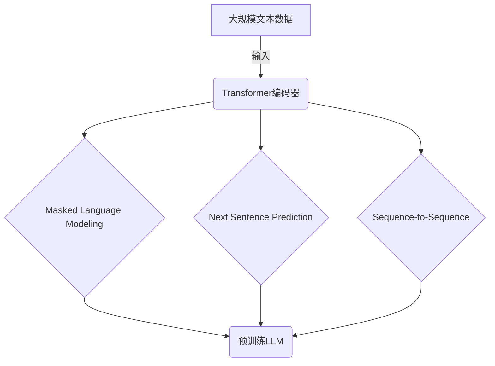
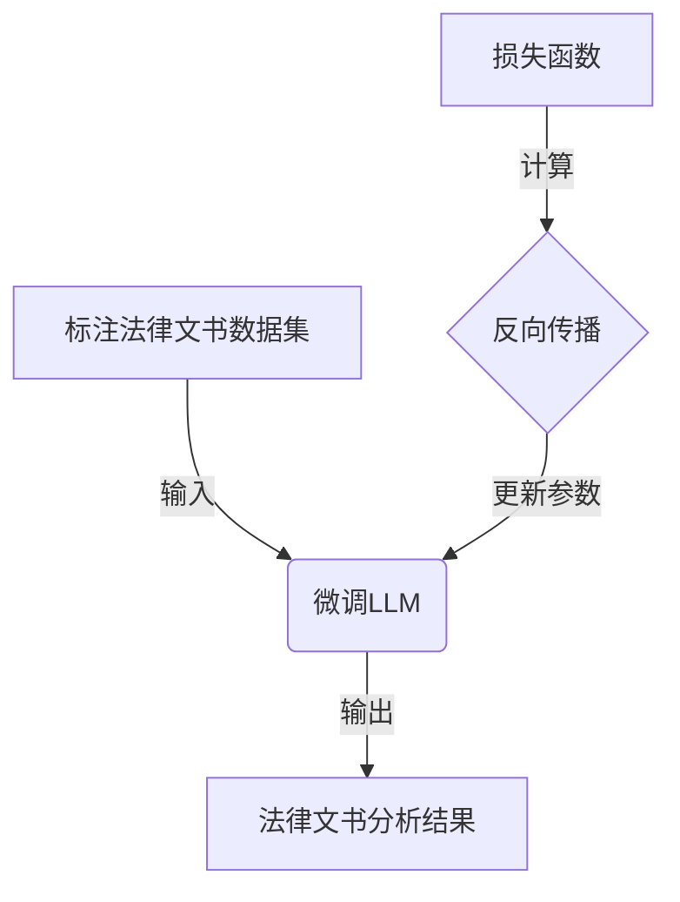

# AI LLM在法律文书分析中的应用

## 1.背景介绍

### 1.1 法律文书分析的重要性

在当今社会中,法律文书是维护社会秩序、保护公民权益的重要依据。准确理解和分析法律文书对于司法公正至关重要。然而,传统的人工方式分析法律文书存在效率低下、主观性强等问题。随着人工智能技术的不断发展,基于大型语言模型(Large Language Model,LLM)的法律文书分析方法应运而生,为提高分析效率、降低主观性带来了新的契机。

### 1.2 大型语言模型(LLM)概述

大型语言模型是一种基于深度学习的自然语言处理模型,能够从大规模文本数据中学习语言知识和模式。LLM通过预训练获得了丰富的语言理解和生成能力,可以应用于多种自然语言处理任务,如文本分类、机器翻译、问答系统等。目前,GPT-3、BERT等模型是LLM的典型代表。

## 2.核心概念与联系

### 2.1 法律文书分析任务

法律文书分析是指对法律文书进行理解、提取关键信息、发现潜在模式等过程。主要任务包括:

1. 文书分类:将法律文书归类到相应的法律领域或案件类型。
2. 事实抽取:从文书中抽取关键事实,如当事人、时间、地点等。
3. 法律依据挖掘:识别文书中引用的法律条文和判例。
4. 观点分析:分析法官、律师在文书中的观点和论证。
5. 相似案例匹配:在历史案例库中查找与目标案件高度相似的案例。

### 2.2 LLM在法律文书分析中的应用

LLM凭借其强大的语言理解和生成能力,可以高效地处理法律文书分析任务:

1. 文本表示:LLM能够学习丰富的上下文语义信息,为文书提供高质量的文本表示,为后续分析任务奠定基础。
2. 序列标注:LLM可以对文书进行序列标注,实现事实抽取、法律依据挖掘等任务。
3. 文本分类:LLM能够捕捉文书的语义特征,实现精准的文书分类。
4. 文本生成:LLM可以生成类似于目标文书的文本,用于案例匹配、观点生成等任务。
5. 多任务学习:LLM具备一次性学习多种任务的能力,可以同时完成多个法律文书分析子任务。

## 3.核心算法原理具体操作步骤

### 3.1 LLM预训练

LLM的预训练过程是其应用于法律文书分析的基础。预训练通常采用自监督学习方式,在大规模文本数据(如网页、书籍等)上学习通用的语言知识。常见的预训练目标包括:

1. 掩码语言模型(Masked Language Modeling):随机掩盖部分词,模型需要预测被掩盖的词。
2. 下一句预测(Next Sentence Prediction):判断两个句子是否为连续句子。
3. 序列到序列(Sequence-to-Sequence):根据输入序列生成相应的输出序列。

预训练过程使用自注意力机制来捕捉长距离依赖关系,transformer编码器用于编码输入,transformer解码器用于生成输出。通过预训练,LLM获得了丰富的语言理解和生成能力。



### 3.2 LLM微调

为了将通用的LLM应用于特定的法律文书分析任务,需要进行微调(Fine-tuning)。微调过程在标注的法律文书数据集上进行监督学习,使LLM适应目标任务的语料和标注方式。

1. 构建标注数据集:从法律文书中标注出目标任务所需的标签,如事实、法律依据等。
2. 设计损失函数:根据任务类型设计合适的损失函数,如交叉熵损失(分类任务)、spans损失(序列标注任务)等。
3. 微调训练:在标注数据集上对LLM进行监督训练,使其学习目标任务的模式。

通过微调,LLM可以获得特定任务的语义理解和生成能力,从而提高法律文书分析的性能。



## 4.数学模型和公式详细讲解举例说明

### 4.1 自注意力机制

自注意力机制是transformer模型的核心,能够有效捕捉输入序列中的长距离依赖关系。给定输入序列$X = (x_1, x_2, \dots, x_n)$,自注意力计算过程如下:

$$\begin{aligned}
Q &= XW^Q\\
K &= XW^K\\
V &= XW^V\\
\text{Attention}(Q, K, V) &= \text{softmax}(\frac{QK^T}{\sqrt{d_k}})V
\end{aligned}$$

其中,$W^Q, W^K, W^V$分别为查询(Query)、键(Key)和值(Value)的线性变换矩阵,$d_k$为缩放因子。自注意力通过计算查询和键的相似性,对值进行加权求和,从而捕捉序列中的重要信息。

例如,在法律文书中提取"原告"一词时,自注意力能够关注与"原告"相关的上下文信息,如"诉称"、"请求"等,从而提高抽取准确性。

### 4.2 交叉熵损失

交叉熵损失常用于LLM的分类任务中,如法律文书分类。给定真实标签$y$和模型预测概率$\hat{y}$,交叉熵损失定义为:

$$\mathcal{L}(y, \hat{y}) = -\sum_{i=1}^{C}y_i\log\hat{y}_i$$

其中,$C$为类别数量。交叉熵损失能够度量模型预测与真实标签之间的差异,值越小表示模型预测越准确。

在法律文书分类任务中,交叉熵损失可以衡量LLM对文书类别的预测精度。通过最小化损失函数,LLM可以学习到更准确的文书分类模式。

## 5.项目实践:代码实例和详细解释说明

以下是一个使用Hugging Face的Transformers库对法律文书进行事实抽取的Python代码示例:

```python
from transformers import AutoTokenizer, AutoModelForTokenClassification
import torch

# 加载预训练模型和分词器
tokenizer = AutoTokenizer.from_pretrained("dslim/bert-base-NER")
model = AutoModelForTokenClassification.from_pretrained("dslim/bert-base-NER")

# 定义标签映射
label_map = {0: 'O', 1: 'B-PER', 2: 'I-PER', 3: 'B-ORG', 4: 'I-ORG', 5: 'B-LOC', 6: 'I-LOC'}

# 示例法律文书
text = "原告张三于2022年5月1日在北京市海淀区某公司工作时,因操作失误造成了严重安全事故。"

# 对文本进行编码
encoding = tokenizer(text, return_tensors='pt')

# 模型预测
outputs = model(**encoding)
logits = outputs.logits

# 解码预测结果
predictions = torch.argmax(logits, dim=2)
tokens = tokenizer.convert_ids_to_tokens(encoding.input_ids.squeeze())
labels = [label_map[i] for i in predictions.squeeze().tolist()]

# 输出结果
print("原文:", text)
print("tokens:", tokens)
print("预测标签:", labels)
```

代码解释:

1. 加载预训练的BERT模型和分词器,该模型已在法律文书数据集上进行了微调。
2. 定义标签映射字典,将模型输出的数字标签映射为实际的标签名称。
3. 对示例法律文书进行编码,将文本转换为模型可以处理的张量形式。
4. 使用微调后的模型对编码后的文本进行预测,输出每个词的标签概率logits。
5. 对logits进行解码,获取每个词的预测标签。
6. 输出原文、分词结果和预测标签序列。

在上述示例中,模型能够正确识别出"张三"为人名实体(PER),"北京市海淀区"为地名实体(LOC)。通过这种方式,LLM可以高效地从法律文书中抽取关键事实信息。

## 6.实际应用场景

### 6.1 智能法律助手

智能法律助手系统可以利用LLM对法律文书进行全面分析,为律师、法官等法律从业者提供辅助决策支持。例如:

- 自动识别文书中的关键事实、法律依据,减轻人工审阅负担。
- 根据新案件自动匹配相似历史案例,为裁决提供参考。
- 分析法官、律师在文书中的论证观点,发现潜在的逻辑缺陷。
- 自动生成标准化的法律文书初稿,提高工作效率。

### 6.2 法律知识库构建

LLM可以从大量法律文书中自动抽取结构化知识,构建覆盖法律领域的知识库。知识库可应用于:

- 法律问答系统:根据知识库快速回答法律相关问题。
- 法律推理:结合知识库进行复杂的法律推理和决策。
- 法律文书自动生成:基于知识库自动生成法律文书。

### 6.3 法律监管与合规

LLM可以自动审查法律文书,识别潜在的违规行为,为政府监管部门提供技术支持。例如:

- 审查合同文本,发现存在的不公平、违法条款。
- 分析公司年报,监测是否存在财务造假、信息披露不当等违规行为。
- 审查法院判决书,监督裁判是否存在程序违规、适用法律错误等问题。

## 7.工具和资源推荐

### 7.1 预训练语言模型

- **BERT**:由谷歌开发的基于Transformer的双向预训练语言模型,在多项自然语言处理任务中表现出色。
- **GPT-3**:由OpenAI开发的大型生成式预训练语言模型,具有强大的文本生成能力。
- **法律BERT**:在大量法律文献上预训练的BERT模型,对法律领域的语言有更好的理解能力。

### 7.2 法律文书数据集

- **法律数据集搜索引擎(CDRI)**:由中国法学会法律数据研究中心维护的法律文书数据集搜索引擎。
- **法律文书公开网(CVPD)**:由中国裁判文书网提供的法院判决书公开数据集。
- **法律文书开放资源(LORE)**:由马萨诸塞大学阿姆斯特分校发布的英文法律文书开放数据集。

### 7.3 开源工具库

- **Hugging Face Transformers**:提供了多种预训练语言模型和相关工具,支持自然语言处理任务的微调和部署。
- **法律NLP工具包(LexNLP)**:由微软开发的专门用于法律文本处理的Python工具包。
- **法律文本分析工具(SCALE)**:由斯坦福大学开发的法律文本分析工具,支持多种任务如事实抽取、观点分析等。

## 8.总结:未来发展趋势与挑战

### 8.1 发展趋势

1. **模型规模持续增长**:更大规模的LLM能够捕捉更丰富的语言知识,提高法律文书分析的性能。
2. **多模态融合**:除了文本,LLM还可以融合图像、语音等多模态信息,全面理解法律文书的内容和语境。
3. **可解释性增强**:提高LLM在法律领域的可解释性,使其决策过程更加透明和可信。
4. **法律知识注入**:直接将结构化的法律知识注入LLM,提升其对法律概念和逻辑的理解能力。
5. **人机协作**:LLM将与人类法律专家形成协作,发挥