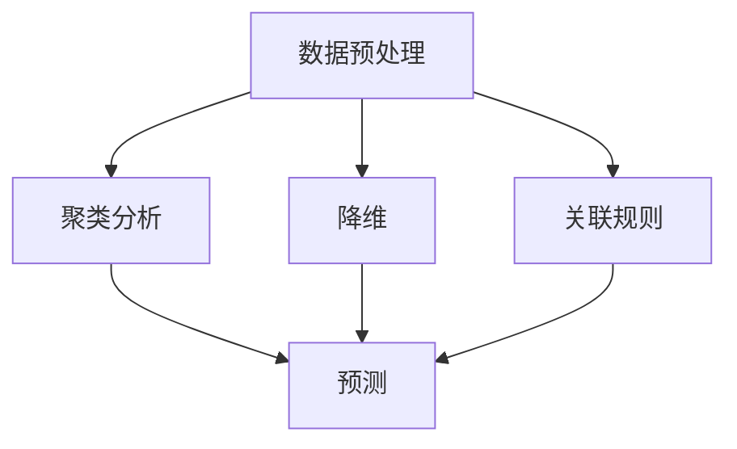

# AI人工智能 Agent：使用无监督学习进行预测

## 1.背景介绍

在人工智能（AI）领域，机器学习（ML）是一个至关重要的分支。机器学习可以分为监督学习、无监督学习和强化学习三大类。监督学习依赖于标注数据进行训练，而无监督学习则不需要标注数据，主要用于发现数据中的隐藏模式和结构。无监督学习在数据预处理、特征提取、聚类分析等方面有着广泛的应用。

无监督学习的一个重要应用是预测。通过分析数据的内在结构，无监督学习可以帮助我们预测未来的趋势和行为。本文将深入探讨如何使用无监督学习来构建AI Agent进行预测。

## 2.核心概念与联系

### 2.1 无监督学习

无监督学习是一种机器学习方法，它不依赖于标注数据，而是通过分析数据的内在结构来发现模式和关系。常见的无监督学习算法包括聚类（如K-means）、降维（如PCA）和关联规则（如Apriori）。

### 2.2 AI Agent

AI Agent是一个能够自主感知环境、做出决策并执行动作的智能系统。AI Agent可以应用于各种领域，如自动驾驶、智能推荐系统和金融预测等。

### 2.3 预测

预测是指通过分析历史数据，推测未来的趋势和行为。在无监督学习中，预测通常通过发现数据中的模式和结构来实现。

### 2.4 核心联系

无监督学习和AI Agent的结合可以实现高效的预测。无监督学习算法可以帮助AI Agent理解数据的内在结构，从而做出更准确的预测。

## 3.核心算法原理具体操作步骤

### 3.1 数据预处理

数据预处理是无监督学习的第一步。它包括数据清洗、数据标准化和特征提取等步骤。

### 3.2 聚类分析

聚类分析是无监督学习的核心算法之一。它通过将数据分成不同的组，从而发现数据中的模式和结构。常见的聚类算法包括K-means、层次聚类和DBSCAN。

### 3.3 降维

降维是指将高维数据转换为低维数据，从而减少计算复杂度和提高模型的可解释性。常见的降维算法包括主成分分析（PCA）和t-SNE。

### 3.4 关联规则

关联规则是指发现数据中不同特征之间的关系。常见的关联规则算法包括Apriori和FP-Growth。

### 3.5 预测

通过聚类分析、降维和关联规则等无监督学习算法，AI Agent可以发现数据中的模式和结构，从而进行预测。



## 4.数学模型和公式详细讲解举例说明

### 4.1 K-means聚类

K-means聚类是一种常见的无监督学习算法。其目标是将数据分成K个簇，使得每个簇内的数据点尽可能相似。

$$
J = \sum_{i=1}^{K} \sum_{x \in C_i} \| x - \mu_i \|^2
$$

其中，$J$ 是目标函数，$K$ 是簇的数量，$C_i$ 是第 $i$ 个簇，$x$ 是数据点，$\mu_i$ 是第 $i$ 个簇的中心。

### 4.2 主成分分析（PCA）

PCA是一种常见的降维算法。其目标是通过线性变换将高维数据转换为低维数据，同时尽可能保留数据的方差。

$$
\mathbf{Y} = \mathbf{XW}
$$

其中，$\mathbf{Y}$ 是降维后的数据，$\mathbf{X}$ 是原始数据，$\mathbf{W}$ 是变换矩阵。

### 4.3 Apriori算法

Apriori算法是一种常见的关联规则算法。其目标是发现数据中频繁出现的项集。

$$
\text{Support}(A) = \frac{\text{Count}(A)}{N}
$$

$$
\text{Confidence}(A \rightarrow B) = \frac{\text{Support}(A \cup B)}{\text{Support}(A)}
$$

其中，$\text{Support}(A)$ 是项集 $A$ 的支持度，$\text{Confidence}(A \rightarrow B)$ 是规则 $A \rightarrow B$ 的置信度，$N$ 是数据集的总数。

## 5.项目实践：代码实例和详细解释说明

### 5.1 数据预处理

```python
import pandas as pd
from sklearn.preprocessing import StandardScaler

# 读取数据
data = pd.read_csv('data.csv')

# 数据清洗
data = data.dropna()

# 数据标准化
scaler = StandardScaler()
data_scaled = scaler.fit_transform(data)
```

### 5.2 K-means聚类

```python
from sklearn.cluster import KMeans

# K-means聚类
kmeans = KMeans(n_clusters=3)
kmeans.fit(data_scaled)

# 聚类结果
labels = kmeans.labels_
```

### 5.3 主成分分析（PCA）

```python
from sklearn.decomposition import PCA

# PCA降维
pca = PCA(n_components=2)
data_pca = pca.fit_transform(data_scaled)
```

### 5.4 Apriori算法

```python
from mlxtend.frequent_patterns import apriori, association_rules

# 频繁项集
frequent_itemsets = apriori(data, min_support=0.1, use_colnames=True)

# 关联规则
rules = association_rules(frequent_itemsets, metric="confidence", min_threshold=0.5)
```

### 5.5 预测

```python
# 预测新数据
new_data = scaler.transform([[value1, value2, value3]])
cluster = kmeans.predict(new_data)
```

## 6.实际应用场景

### 6.1 市场营销

无监督学习可以帮助企业进行市场细分，从而制定更有针对性的营销策略。例如，通过K-means聚类，企业可以将客户分成不同的群体，从而为每个群体制定个性化的营销方案。

### 6.2 金融预测

在金融领域，无监督学习可以用于风险评估和欺诈检测。例如，通过PCA降维，金融机构可以发现数据中的异常点，从而进行风险预警。

### 6.3 医疗诊断

无监督学习可以帮助医生进行疾病诊断和治疗方案的制定。例如，通过关联规则算法，医生可以发现不同症状之间的关系，从而制定更有效的治疗方案。

## 7.工具和资源推荐

### 7.1 工具

- **Scikit-learn**：一个Python机器学习库，提供了丰富的无监督学习算法。
- **Pandas**：一个Python数据分析库，方便进行数据预处理。
- **Matplotlib**：一个Python绘图库，方便进行数据可视化。

### 7.2 资源

- **《机器学习实战》**：一本经典的机器学习入门书籍，涵盖了无监督学习的基本概念和算法。
- **Coursera上的机器学习课程**：由斯坦福大学Andrew Ng教授讲授，涵盖了无监督学习的基本概念和算法。

## 8.总结：未来发展趋势与挑战

无监督学习在AI领域有着广泛的应用前景。随着数据量的不断增加和计算能力的不断提升，无监督学习将会在更多领域发挥重要作用。然而，无监督学习也面临着一些挑战，如算法的可解释性和计算复杂度等问题。未来，研究人员需要不断探索新的算法和技术，以提高无监督学习的性能和可解释性。

## 9.附录：常见问题与解答

### 9.1 无监督学习和监督学习的区别是什么？

无监督学习不依赖于标注数据，而是通过分析数据的内在结构来发现模式和关系。监督学习则依赖于标注数据，通过学习输入和输出之间的关系来进行预测。

### 9.2 无监督学习的应用场景有哪些？

无监督学习可以应用于数据预处理、特征提取、聚类分析、降维和关联规则等领域。具体应用场景包括市场营销、金融预测和医疗诊断等。

### 9.3 如何选择合适的无监督学习算法？

选择无监督学习算法时，需要考虑数据的特点和具体的应用场景。例如，对于数据量较大的情况，可以选择K-means聚类；对于高维数据，可以选择PCA降维。

### 9.4 无监督学习的主要挑战是什么？

无监督学习的主要挑战包括算法的可解释性和计算复杂度等问题。研究人员需要不断探索新的算法和技术，以提高无监督学习的性能和可解释性。

---

作者：禅与计算机程序设计艺术 / Zen and the Art of Computer Programming