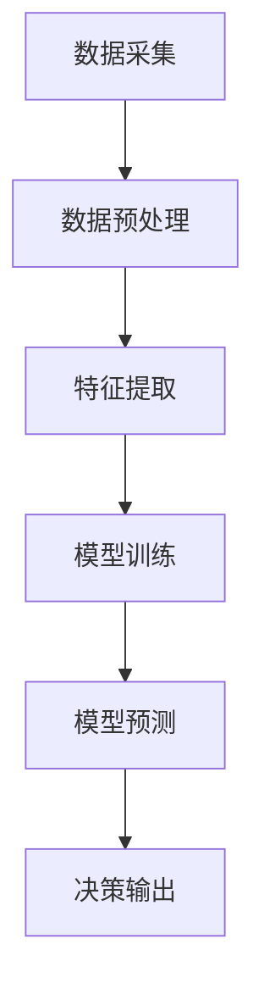

# AI人工智能代理工作流 AI Agent WorkFlow：在自然资源管理中的应用

## 1.背景介绍

在全球范围内，自然资源管理一直是一个复杂且具有挑战性的领域。随着人口增长和工业化进程的加快，资源的可持续利用和环境保护变得愈发重要。传统的资源管理方法往往依赖于人工经验和手工操作，效率低下且容易出错。近年来，人工智能（AI）技术的迅猛发展为自然资源管理带来了新的契机。通过引入AI代理工作流（AI Agent WorkFlow），我们可以实现资源管理的自动化、智能化和高效化。

## 2.核心概念与联系

### 2.1 人工智能代理

人工智能代理（AI Agent）是指能够自主感知环境、做出决策并执行任务的智能系统。它们通常由感知模块、决策模块和执行模块组成。感知模块负责收集环境信息，决策模块根据预设的算法和规则进行分析和判断，执行模块则负责具体的操作。

### 2.2 工作流

工作流（WorkFlow）是指一系列有序的任务和活动，用于完成特定的业务目标。在自然资源管理中，工作流可以包括数据采集、分析、决策和执行等多个环节。

### 2.3 AI代理工作流

AI代理工作流是将AI代理嵌入到工作流中，通过智能化的感知、决策和执行，实现资源管理的自动化和优化。其核心在于利用AI技术提升工作流的效率和准确性。

### 2.4 核心联系

AI代理工作流的核心在于将AI代理的智能决策能力与工作流的有序性结合起来，实现资源管理的自动化和智能化。通过这种方式，我们可以大幅提升资源管理的效率和效果。

## 3.核心算法原理具体操作步骤

### 3.1 数据采集与预处理

数据是AI代理工作的基础。在自然资源管理中，数据来源广泛，包括传感器数据、卫星影像、气象数据等。数据采集的第一步是确保数据的准确性和完整性。接下来，需要对数据进行预处理，包括数据清洗、归一化和特征提取等步骤。

### 3.2 感知模块

感知模块负责从环境中获取信息，并将其转化为可供决策模块使用的数据。常用的技术包括传感器网络、遥感技术和物联网（IoT）等。

### 3.3 决策模块

决策模块是AI代理的核心，负责根据感知模块提供的数据进行分析和判断。常用的算法包括机器学习、深度学习和强化学习等。以下是一个简单的决策流程图：



### 3.4 执行模块

执行模块负责将决策模块的输出转化为具体的操作。在自然资源管理中，执行模块可能包括自动化设备、无人机和机器人等。

### 3.5 反馈机制

为了不断优化AI代理工作流，反馈机制是必不可少的。通过对执行结果的反馈，AI代理可以不断调整和优化其决策模型。

## 4.数学模型和公式详细讲解举例说明

### 4.1 线性回归模型

线性回归是最简单的机器学习模型之一，常用于预测和分析。其数学表达式为：

$$
y = \beta_0 + \beta_1 x_1 + \beta_2 x_2 + \cdots + \beta_n x_n + \epsilon
$$

其中，$y$ 是预测值，$x_i$ 是特征变量，$\beta_i$ 是回归系数，$\epsilon$ 是误差项。

### 4.2 决策树模型

决策树是一种常用的分类和回归模型。其核心思想是通过一系列的二叉分裂，将数据集划分为不同的子集。决策树的构建过程可以用以下公式表示：

$$
Gini(D) = 1 - \sum_{i=1}^{n} p_i^2
$$

其中，$Gini(D)$ 是数据集 $D$ 的基尼指数，$p_i$ 是第 $i$ 类的概率。

### 4.3 强化学习模型

强化学习是一种通过试错法进行学习的模型，常用于复杂的决策问题。其核心公式是贝尔曼方程：

$$
Q(s, a) = r + \gamma \max_{a'} Q(s', a')
$$

其中，$Q(s, a)$ 是状态 $s$ 下采取动作 $a$ 的价值，$r$ 是即时奖励，$\gamma$ 是折扣因子，$s'$ 是下一个状态，$a'$ 是下一个动作。

## 5.项目实践：代码实例和详细解释说明

### 5.1 数据采集与预处理

```python
import pandas as pd
from sklearn.preprocessing import StandardScaler

# 数据采集
data = pd.read_csv('resource_data.csv')

# 数据清洗
data = data.dropna()

# 数据归一化
scaler = StandardScaler()
data_scaled = scaler.fit_transform(data)
```

### 5.2 决策树模型训练

```python
from sklearn.model_selection import train_test_split
from sklearn.tree import DecisionTreeClassifier

# 数据分割
X = data_scaled[:, :-1]
y = data_scaled[:, -1]
X_train, X_test, y_train, y_test = train_test_split(X, y, test_size=0.2, random_state=42)

# 模型训练
clf = DecisionTreeClassifier()
clf.fit(X_train, y_train)

# 模型预测
y_pred = clf.predict(X_test)
```

### 5.3 强化学习模型训练

```python
import gym
import numpy as np

# 创建环境
env = gym.make('CartPole-v1')

# 初始化Q表
Q = np.zeros((env.observation_space.n, env.action_space.n))

# 参数设置
alpha = 0.1
gamma = 0.99
epsilon = 0.1

# 训练过程
for episode in range(1000):
    state = env.reset()
    done = False
    while not done:
        if np.random.rand() < epsilon:
            action = env.action_space.sample()
        else:
            action = np.argmax(Q[state])
        next_state, reward, done, _ = env.step(action)
        Q[state, action] = Q[state, action] + alpha * (reward + gamma * np.max(Q[next_state]) - Q[state, action])
        state = next_state
```

## 6.实际应用场景

### 6.1 森林资源管理

通过AI代理工作流，可以实现对森林资源的实时监控和管理。例如，利用无人机和传感器网络，可以实时采集森林的生长情况和病虫害信息，通过AI模型进行分析和预测，及时采取相应的管理措施。

### 6.2 水资源管理

在水资源管理中，AI代理工作流可以用于水质监测、用水量预测和水资源调度等方面。通过传感器网络和遥感技术，实时采集水质和水量数据，利用AI模型进行分析和预测，优化水资源的利用和调度。

### 6.3 矿产资源管理

在矿产资源管理中，AI代理工作流可以用于矿产勘探、开采和环境保护等方面。通过遥感技术和地质传感器，实时采集矿区的地质和环境数据，利用AI模型进行分析和预测，优化矿产资源的开采和利用。

## 7.工具和资源推荐

### 7.1 开源工具

- **TensorFlow**：一个开源的机器学习框架，适用于各种AI模型的开发和训练。
- **PyTorch**：另一个流行的开源机器学习框架，具有灵活性和易用性。
- **Scikit-learn**：一个简单易用的机器学习库，适用于各种数据分析和建模任务。

### 7.2 数据资源

- **NASA Earthdata**：提供丰富的地球观测数据，包括气象、地质和环境数据。
- **USGS Earth Explorer**：提供全球范围内的遥感数据和地质数据。
- **OpenStreetMap**：一个开源的地理信息系统，提供全球范围内的地理数据。

## 8.总结：未来发展趋势与挑战

### 8.1 未来发展趋势

随着AI技术的不断进步，AI代理工作流在自然资源管理中的应用前景广阔。未来，随着传感器技术、遥感技术和物联网技术的进一步发展，数据采集的精度和实时性将不断提升，AI模型的预测和决策能力也将不断增强。

### 8.2 挑战

尽管AI代理工作流在自然资源管理中具有广阔的应用前景，但也面临一些挑战。首先，数据的准确性和完整性是AI模型有效性的基础，如何确保数据的质量是一个重要问题。其次，AI模型的复杂性和计算资源的需求也是一个挑战，如何优化模型和提高计算效率是需要解决的问题。

## 9.附录：常见问题与解答

### 9.1 如何选择合适的AI模型？

选择合适的AI模型需要根据具体的应用场景和数据特点进行综合考虑。一般来说，简单的线性模型适用于线性关系明显的数据，而复杂的深度学习模型适用于非线性关系复杂的数据。

### 9.2 如何提高模型的准确性？

提高模型的准确性可以从多个方面入手，包括数据的质量、特征的选择和模型的优化等。数据的质量是基础，特征的选择和模型的优化是关键。

### 9.3 如何处理数据缺失和异常值？

数据缺失和异常值是数据预处理中常见的问题。常用的处理方法包括删除缺失值、填补缺失值和异常值检测等。具体的方法需要根据数据的特点和应用场景进行选择。

### 9.4 如何评估模型的性能？

评估模型的性能可以使用多种指标，包括准确率、精确率、召回率和F1值等。具体的评估指标需要根据应用场景和任务目标进行选择。

### 9.5 如何部署AI代理工作流？

部署AI代理工作流需要考虑多个方面，包括数据的采集和传输、模型的训练和预测、决策的执行和反馈等。常用的部署工具包括Docker、Kubernetes和云计算平台等。

---

作者：禅与计算机程序设计艺术 / Zen and the Art of Computer Programming