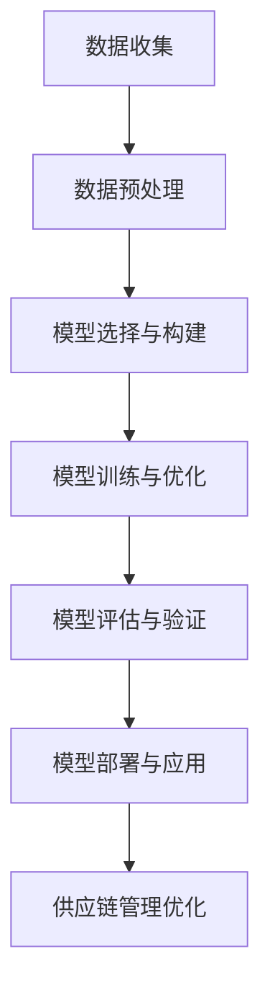

# AI人工智能深度学习算法：智能深度学习代理在供应链管理领域的创新运用

## 1.背景介绍

在全球化和数字化的推动下，供应链管理变得越来越复杂和动态。传统的供应链管理方法已经无法满足现代企业对效率、灵活性和响应速度的高要求。人工智能（AI）和深度学习（DL）技术的迅猛发展，为供应链管理带来了新的机遇和挑战。通过智能深度学习代理，企业可以实现供应链的自动化、优化和智能化，从而提升整体运营效率和竞争力。

## 2.核心概念与联系

### 2.1 人工智能与深度学习

人工智能是指通过计算机模拟人类智能的技术，涵盖了机器学习、自然语言处理、计算机视觉等多个领域。深度学习是机器学习的一个子领域，通过多层神经网络来模拟人脑的学习过程，能够处理复杂的非线性关系和大规模数据。

### 2.2 供应链管理

供应链管理涉及从原材料采购、生产制造到产品配送的整个过程。其目标是通过协调和优化各个环节，提高效率、降低成本、提升客户满意度。

### 2.3 智能深度学习代理

智能深度学习代理是指利用深度学习算法构建的智能系统，能够自主学习和决策，应用于供应链管理中，可以实现需求预测、库存优化、物流调度等功能。

### 2.4 核心联系

人工智能和深度学习技术为供应链管理提供了强大的数据处理和分析能力。通过智能深度学习代理，企业可以实现供应链的自动化和智能化，从而提升整体运营效率和竞争力。

## 3.核心算法原理具体操作步骤

### 3.1 数据预处理

数据预处理是深度学习的基础，包括数据清洗、数据归一化、特征提取等步骤。通过对原始数据进行处理，可以提高模型的训练效果和预测精度。

### 3.2 模型选择与构建

根据具体的应用场景，选择合适的深度学习模型，如卷积神经网络（CNN）、循环神经网络（RNN）、长短期记忆网络（LSTM）等。构建模型时，需要确定网络结构、激活函数、损失函数等参数。

### 3.3 模型训练与优化

通过反向传播算法，对模型进行训练和优化。训练过程中，需要调整学习率、批量大小等超参数，以提高模型的收敛速度和预测精度。

### 3.4 模型评估与验证

通过交叉验证、混淆矩阵、ROC曲线等方法，对模型进行评估和验证。根据评估结果，调整模型参数和结构，进一步提高模型的性能。

### 3.5 模型部署与应用

将训练好的模型部署到实际应用中，通过API接口、嵌入式系统等方式，实现对供应链管理的智能化支持。

以下是一个智能深度学习代理在供应链管理中的工作流程图：



## 4.数学模型和公式详细讲解举例说明

### 4.1 需求预测模型

需求预测是供应链管理中的关键环节。常用的需求预测模型包括时间序列模型、回归模型等。以下是一个简单的线性回归模型：

$$
y = \beta_0 + \beta_1 x_1 + \beta_2 x_2 + \cdots + \beta_n x_n + \epsilon
$$

其中，$y$ 是预测的需求量，$x_1, x_2, \cdots, x_n$ 是影响需求的特征变量，$\beta_0, \beta_1, \cdots, \beta_n$ 是模型参数，$\epsilon$ 是误差项。

### 4.2 库存优化模型

库存优化是通过合理的库存管理，降低库存成本，提高服务水平。常用的库存优化模型包括经济订货量（EOQ）模型、新闻商模型等。以下是EOQ模型的公式：

$$
EOQ = \sqrt{\frac{2DS}{H}}
$$

其中，$D$ 是年需求量，$S$ 是每次订货成本，$H$ 是单位库存持有成本。

### 4.3 物流调度模型

物流调度是通过合理的运输和配送计划，提高物流效率，降低物流成本。常用的物流调度模型包括车辆路径问题（VRP）模型、运输问题（TP）模型等。以下是VRP模型的目标函数：

$$
\min \sum_{i=1}^{n} \sum_{j=1}^{n} c_{ij} x_{ij}
$$

其中，$c_{ij}$ 是从节点 $i$ 到节点 $j$ 的运输成本，$x_{ij}$ 是决策变量，表示是否从节点 $i$ 到节点 $j$ 运输。

## 5.项目实践：代码实例和详细解释说明

### 5.1 数据预处理

以下是一个简单的数据预处理代码示例：

```python
import pandas as pd
from sklearn.preprocessing import StandardScaler

# 读取数据
data = pd.read_csv('supply_chain_data.csv')

# 数据清洗
data = data.dropna()

# 特征提取
features = data[['feature1', 'feature2', 'feature3']]
target = data['target']

# 数据归一化
scaler = StandardScaler()
features_scaled = scaler.fit_transform(features)
```

### 5.2 模型选择与构建

以下是一个简单的LSTM模型构建代码示例：

```python
import tensorflow as tf
from tensorflow.keras.models import Sequential
from tensorflow.keras.layers import LSTM, Dense

# 构建LSTM模型
model = Sequential()
model.add(LSTM(50, return_sequences=True, input_shape=(features_scaled.shape[1], 1)))
model.add(LSTM(50))
model.add(Dense(1))

# 编译模型
model.compile(optimizer='adam', loss='mean_squared_error')
```

### 5.3 模型训练与优化

以下是模型训练的代码示例：

```python
# 训练模型
model.fit(features_scaled, target, epochs=100, batch_size=32, validation_split=0.2)
```

### 5.4 模型评估与验证

以下是模型评估的代码示例：

```python
from sklearn.metrics import mean_squared_error

# 预测
predictions = model.predict(features_scaled)

# 评估
mse = mean_squared_error(target, predictions)
print(f'Mean Squared Error: {mse}')
```

### 5.5 模型部署与应用

以下是模型部署的代码示例：

```python
import joblib

# 保存模型
joblib.dump(model, 'supply_chain_model.pkl')

# 加载模型
loaded_model = joblib.load('supply_chain_model.pkl')

# 应用模型
new_data = scaler.transform([[new_feature1, new_feature2, new_feature3]])
prediction = loaded_model.predict(new_data)
print(f'Predicted Demand: {prediction}')
```

## 6.实际应用场景

### 6.1 需求预测

通过智能深度学习代理，企业可以实现对市场需求的精准预测，从而制定合理的生产计划和库存策略，避免库存积压和缺货现象。

### 6.2 库存优化

智能深度学习代理可以实时监控库存水平，根据需求预测和库存成本，自动调整订货策略，降低库存成本，提高服务水平。

### 6.3 物流调度

智能深度学习代理可以根据订单信息、运输成本和配送时间，优化物流调度方案，提高运输效率，降低物流成本。

### 6.4 供应链风险管理

智能深度学习代理可以通过对供应链数据的分析，识别潜在的风险因素，提前预警并制定应对策略，降低供应链风险。

## 7.工具和资源推荐

### 7.1 开源工具

- TensorFlow：一个开源的深度学习框架，支持多种神经网络模型的构建和训练。
- Keras：一个高层神经网络API，能够快速构建和训练深度学习模型。
- Scikit-learn：一个开源的机器学习库，提供了丰富的机器学习算法和工具。

### 7.2 数据集

- Kaggle：一个数据科学竞赛平台，提供了丰富的公开数据集和竞赛题目。
- UCI Machine Learning Repository：一个机器学习数据集的在线存储库，提供了多种领域的数据集。

### 7.3 学习资源

- Coursera：一个在线学习平台，提供了丰富的人工智能和深度学习课程。
- edX：一个在线学习平台，提供了多种计算机科学和数据科学课程。
- GitHub：一个代码托管平台，提供了丰富的开源项目和代码示例。

## 8.总结：未来发展趋势与挑战

### 8.1 未来发展趋势

随着人工智能和深度学习技术的不断发展，智能深度学习代理在供应链管理中的应用将越来越广泛和深入。未来，智能深度学习代理将更加智能化、自动化和个性化，能够更好地满足企业的需求，提高供应链的整体效率和竞争力。

### 8.2 挑战

尽管智能深度学习代理在供应链管理中具有广阔的应用前景，但也面临一些挑战。首先，数据质量和数据量是影响模型性能的关键因素，企业需要投入大量资源进行数据收集和处理。其次，模型的复杂性和计算成本也是一个重要问题，需要不断优化算法和硬件设备。最后，供应链管理涉及多个环节和部门，需要协调和整合各方面的资源和信息，才能实现智能化和自动化。

## 9.附录：常见问题与解答

### 9.1 什么是智能深度学习代理？

智能深度学习代理是指利用深度学习算法构建的智能系统，能够自主学习和决策，应用于供应链管理中，可以实现需求预测、库存优化、物流调度等功能。

### 9.2 智能深度学习代理在供应链管理中的优势是什么？

智能深度学习代理可以通过对供应链数据的分析和处理，实现供应链的自动化和智能化，提高整体运营效率和竞争力。

### 9.3 如何选择合适的深度学习模型？

根据具体的应用场景和数据特点，选择合适的深度学习模型，如卷积神经网络（CNN）、循环神经网络（RNN）、长短期记忆网络（LSTM）等。

### 9.4 如何评估和验证深度学习模型？

通过交叉验证、混淆矩阵、ROC曲线等方法，对模型进行评估和验证，根据评估结果，调整模型参数和结构，进一步提高模型的性能。

### 9.5 智能深度学习代理在供应链管理中的应用前景如何？

随着人工智能和深度学习技术的不断发展，智能深度学习代理在供应链管理中的应用将越来越广泛和深入，能够更好地满足企业的需求，提高供应链的整体效率和竞争力。

---

作者：禅与计算机程序设计艺术 / Zen and the Art of Computer Programming