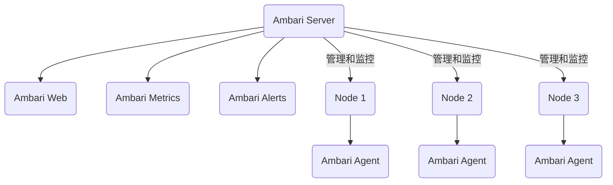

# Ambari原理与代码实例讲解

## 1. 背景介绍

Apache Ambari 是一个开源的大数据集群管理工具,用于简化 Apache Hadoop 生态系统中的软件安装、配置、集群管理和监控等操作。在大数据时代,随着数据量的快速增长和分析需求的不断扩大,单机系统已经无法满足企业的需求。因此,构建分布式集群环境成为必然选择。然而,手动部署和管理大规模的分布式集群是一项艰巨的任务,需要耗费大量的时间和精力。Ambari 应运而生,旨在简化这一过程,提高集群管理的效率和可靠性。

## 2. 核心概念与联系

### 2.1 Ambari 架构

Ambari 采用了主从架构,主要由以下几个组件组成:

- **Ambari Server**: 负责管理和监控整个 Hadoop 集群,提供 Web UI 界面供用户操作。
- **Ambari Agent**: 运行在每个集群节点上,负责在该节点上执行任务,如安装软件、配置服务等。
- **Ambari Web**: Web 界面,提供直观的集群管理和监控功能。
- **Ambari Metrics**: 收集和存储集群指标数据,用于监控和报警。
- **Ambari Alerts**: 基于收集的指标数据,提供预定义的警报规则和通知机制。

### 2.2 Ambari 核心功能

Ambari 的核心功能包括:

- **集群安装**: 通过 Ambari Web UI 或 API,可以轻松地安装 Hadoop 集群及相关服务。
- **配置管理**: 提供集中式配置管理,可以在 Web UI 上修改配置,自动同步到各个节点。
- **服务管理**: 支持启动、停止、重启各种 Hadoop 服务,并监控服务状态。
- **主机管理**: 可以添加、删除集群节点,并自动部署 Ambari Agent。
- **安全管理**: 支持 Kerberos 安全认证,保护集群的安全性。
- **监控警报**: 持续收集和监控集群指标,并基于预定义规则发送警报通知。
- **日志管理**: 集中式查看和管理各个服务的日志。

### 2.3 Mermaid 架构流程图



## 3. 核心算法原理具体操作步骤

Ambari 的核心算法原理主要体现在以下几个方面:

### 3.1 Blueprint 蓝图

Blueprint 蓝图是 Ambari 中的一个重要概念,它定义了集群的拓扑结构和配置。Blueprint 采用 JSON 格式,描述了集群中需要安装的服务及其配置。在安装集群时,Ambari 会根据 Blueprint 中的定义自动完成安装和配置。

Blueprint 的主要步骤如下:

1. 定义集群拓扑结构,包括主机组、主机等。
2. 为每个主机组指定要安装的服务及其配置。
3. 上传 Blueprint 到 Ambari Server。
4. 通过 Ambari Web UI 或 API 触发集群安装。
5. Ambari Server 根据 Blueprint 自动完成集群安装和配置。

### 3.2 Rolling Upgrade 滚动升级

Rolling Upgrade 是 Ambari 提供的一种无停机升级机制,可以在不中断集群服务的情况下升级 Hadoop 组件。该算法的核心思想是将集群分为多个独立的升级组,每次只升级一个组,从而最小化服务中断时间。

Rolling Upgrade 的具体步骤如下:

1. 定义升级组,每个组包含一部分节点。
2. 停止第一个升级组中的服务。
3. 在第一个组中升级软件。
4. 启动第一个组中的服务。
5. 重复步骤 2-4,逐个升级其他组。
6. 所有组升级完成后,整个集群升级完成。

### 3.3 Kerberos 安全集成

Ambari 提供了与 Kerberos 的无缝集成,可以轻松地在集群上启用 Kerberos 认证。Kerberos 是一种网络认证协议,可以保护集群免受未经授权的访问。

Ambari 中启用 Kerberos 的步骤如下:

1. 在 Ambari Web UI 中选择启用 Kerberos。
2. 配置 Kerberos 相关参数,如 KDC 主机、领域等。
3. Ambari 自动为集群中的服务配置 Kerberos 认证。
4. 重启集群服务以应用 Kerberos 配置。

启用 Kerberos 后,所有对集群的访问都需要通过 Kerberos 认证,从而提高了集群的安全性。

## 4. 数学模型和公式详细讲解举例说明

在 Ambari 中,并没有涉及太多复杂的数学模型和公式。不过,在监控和警报模块中,会使用一些简单的统计公式来计算集群指标。

### 4.1 指标计算

Ambari Metrics 收集了各种集群指标,如 CPU 利用率、内存使用量等。对于某些指标,可能需要进行一些简单的计算,如求平均值、最大值等。

例如,计算 CPU 利用率的平均值:

$$\text{CPU利用率平均值} = \frac{\sum_{i=1}^{n} \text{CPU利用率}_i}{n}$$

其中 $n$ 是采样点的个数,CPU利用率$_i$ 是第 $i$ 个采样点的 CPU 利用率。

### 4.2 警报规则

Ambari Alerts 可以根据预定义的规则发送警报通知。这些规则通常涉及一些简单的阈值判断。

例如,设置 CPU 利用率过高的警报规则:

$$\text{if }\overline{\text{CPU利用率}} > 90\% \text{ then 发送警报}$$

其中 $\overline{\text{CPU利用率}}$ 表示 CPU 利用率的平均值。

## 5. 项目实践: 代码实例和详细解释说明

在这一部分,我们将通过一个实际的代码示例,演示如何使用 Ambari Python 客户端 API 来管理 Hadoop 集群。

### 5.1 安装 Ambari Python 客户端

首先,我们需要安装 Ambari Python 客户端库:

```bash
pip install ambari-python-client
```

### 5.2 代码示例

以下是一个简单的 Python 脚本,用于获取集群的基本信息:

```python
from ambari_client.ambari_client import AmbariClient

# 初始化 Ambari 客户端
client = AmbariClient("http://ambari.server.com:8080", "admin", "admin")

# 获取集群列表
clusters = client.get_clusters()
print("集群列表:", clusters)

# 获取指定集群的详细信息
cluster = client.get_cluster(clusters[0].cluster_name)
print("集群名称:", cluster.cluster_name)
print("集群版本:", cluster.version)

# 获取集群中的主机列表
hosts = client.get_hosts(cluster.cluster_name)
print("主机列表:")
for host in hosts:
    print("- 主机名:", host.host_name)
    print("  IP 地址:", host.ip)
    print("  状态:", host.host_status)
```

这个脚本首先初始化 Ambari 客户端,然后获取集群列表。接下来,它获取第一个集群的详细信息,包括集群名称和版本。最后,它列出该集群中的所有主机及其 IP 地址和状态。

### 5.3 代码解释

1. 导入 `AmbariClient` 类:

```python
from ambari_client.ambari_client import AmbariClient
```

这个类提供了与 Ambari Server 交互的方法。

2. 初始化 Ambari 客户端:

```python
client = AmbariClient("http://ambari.server.com:8080", "admin", "admin")
```

这里我们传入了 Ambari Server 的 URL 和管理员用户名/密码。

3. 获取集群列表:

```python
clusters = client.get_clusters()
```

`get_clusters()` 方法返回一个 `ClusterModel` 对象列表,每个对象代表一个集群。

4. 获取集群详细信息:

```python
cluster = client.get_cluster(clusters[0].cluster_name)
print("集群名称:", cluster.cluster_name)
print("集群版本:", cluster.version)
```

`get_cluster()` 方法接受集群名称作为参数,返回一个 `ClusterModel` 对象,包含集群的详细信息。

5. 获取主机列表:

```python
hosts = client.get_hosts(cluster.cluster_name)
print("主机列表:")
for host in hosts:
    print("- 主机名:", host.host_name)
    print("  IP 地址:", host.ip)
    print("  状态:", host.host_status)
```

`get_hosts()` 方法返回一个 `HostModel` 对象列表,每个对象代表一个主机。我们遍历这个列表,打印每个主机的名称、IP 地址和状态。

通过这个示例,您可以看到使用 Ambari Python 客户端 API 管理 Hadoop 集群是多么简单和方便。您可以进一步探索该库提供的其他方法,如启动/停止服务、添加/删除主机等。

## 6. 实际应用场景

Ambari 作为一款强大的大数据集群管理工具,在实际应用中发挥着重要作用。以下是一些典型的应用场景:

### 6.1 大数据分析平台

在大数据分析领域,Ambari 可以用于构建和管理 Hadoop 生态系统,包括 HDFS、YARN、Hive、Spark 等组件。通过 Ambari,数据工程师可以轻松地部署和配置这些组件,并监控集群的运行状态。这为大数据分析提供了可靠的基础设施支持。

### 6.2 物联网数据处理

随着物联网设备的快速增长,大量的传感器数据需要被收集和处理。Ambari 可以帮助构建一个可扩展的 Hadoop 集群,用于存储和处理这些海量数据。通过 Ambari 提供的监控和警报功能,可以及时发现并解决集群中的问题,确保数据处理的高效和可靠。

### 6.3 金融风险分析

在金融领域,风险分析是一项关键任务。通过 Ambari 构建的 Hadoop 集群,可以存储和处理大量的金融交易数据。利用 Hadoop 生态系统中的机器学习和数据挖掘工具,可以对这些数据进行深入分析,发现潜在的风险模式,从而帮助金融机构做出更明智的决策。

### 6.4 电信网络优化

电信运营商需要处理大量的网络流量数据,以优化网络性能和用户体验。Ambari 可以帮助构建一个可扩展的 Hadoop 集群,用于存储和分析这些海量数据。通过分析网络流量模式,运营商可以发现网络瓶颈,并采取相应的优化措施,提高网络质量。

## 7. 工具和资源推荐

在使用 Ambari 管理 Hadoop 集群的过程中,有一些工具和资源可以为您提供帮助:

### 7.1 Ambari 官方文档

Ambari 官方文档 (https://ambari.apache.org/documentation.html) 是一个非常宝贵的资源。它包含了详细的安装指南、配置说明、API 参考等内容,对于初学者和高级用户都非常有用。

### 7.2 Ambari 社区

Ambari 拥有一个活跃的社区,您可以在邮件列表 (https://ambari.apache.org/mail-lists.html) 或 StackOverflow 上提问并获得帮助。社区成员包括 Ambari 开发者和经验丰富的用户,他们乐于分享经验和解决问题。

### 7.3 Ambari 视频教程

网上有许多 Ambari 视频教程,可以帮助您快速入门。例如,Hortonworks 官方提供了一系列 Ambari 视频教程 (https://zh.hortonworks.com/tutorials/?tab=ambari)。这些视频通过实际操作,详细演示了如何安装、配置和管理 Ambari 集群。

### 