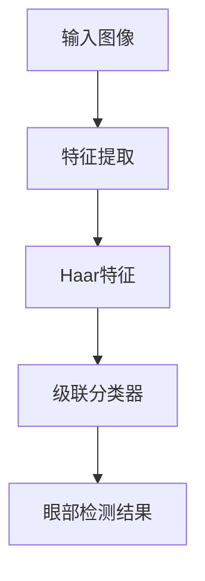
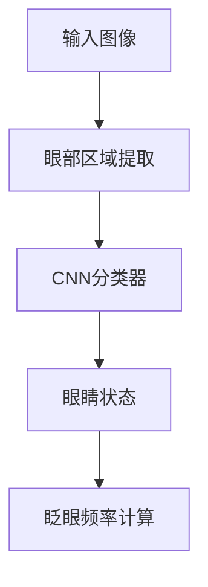
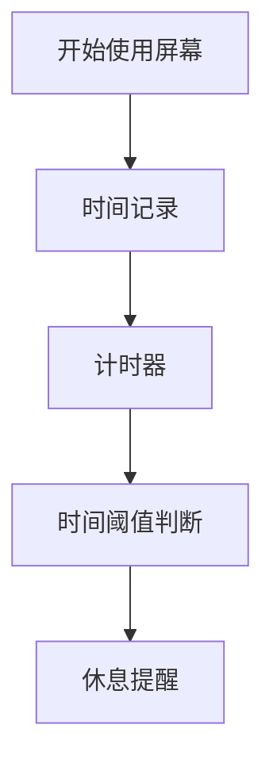

# Computer Vision Syndrome 原理与代码实战案例讲解

## 1.背景介绍

在现代社会，计算机和移动设备的普及使得人们长时间面对屏幕，导致了计算机视觉综合症（Computer Vision Syndrome, CVS）的广泛出现。CVS是一种由于长时间使用电子屏幕而引起的眼部和视觉问题的综合症状。本文将深入探讨CVS的原理，并通过代码实战案例讲解如何利用计算机视觉技术来缓解和预防CVS。

## 2.核心概念与联系

### 2.1 计算机视觉综合症（CVS）

CVS的主要症状包括眼睛疲劳、干涩、视力模糊、头痛和颈肩疼痛等。这些症状通常是由于长时间注视屏幕、眨眼频率降低、屏幕亮度不适等原因引起的。

### 2.2 计算机视觉技术

计算机视觉技术是人工智能的一个重要分支，旨在让计算机能够“看懂”图像和视频。通过图像处理、模式识别和机器学习等技术，计算机可以从视觉数据中提取有用的信息。

### 2.3 计算机视觉技术与CVS的联系

利用计算机视觉技术，我们可以开发出智能系统来监测用户的眼部状态、屏幕使用时间和环境光线，从而提供实时的提醒和建议，帮助用户缓解和预防CVS。

## 3.核心算法原理具体操作步骤

### 3.1 眼部检测与跟踪

眼部检测与跟踪是缓解CVS的关键技术之一。通过检测用户的眼睛位置和眨眼频率，可以判断用户的眼部疲劳程度。

#### 3.1.1 Haar级联分类器

Haar级联分类器是一种常用的对象检测算法，适用于实时眼部检测。其基本原理是通过一系列简单的特征（如边缘、线条等）来快速检测目标对象。



### 3.2 眨眼频率检测

眨眼频率是评估眼部疲劳的重要指标。通过计算用户在一定时间内的眨眼次数，可以判断其眼部疲劳程度。

#### 3.2.1 眼睛状态分类

利用卷积神经网络（CNN）可以对眼睛的状态进行分类（睁开或闭合），从而计算眨眼频率。



### 3.3 屏幕使用时间监测

长时间使用屏幕是引发CVS的主要原因之一。通过监测用户的屏幕使用时间，可以提供适时的休息提醒。

#### 3.3.1 时间记录与提醒

利用简单的时间记录和计时器机制，可以实现屏幕使用时间的监测和提醒功能。



## 4.数学模型和公式详细讲解举例说明

### 4.1 眼部检测的数学模型

Haar级联分类器的核心在于特征提取和分类器训练。特征提取使用Haar特征，这些特征可以表示为图像区域的加权和。

$$
Haar(x, y) = \sum_{i=1}^{n} w_i \cdot I(x_i, y_i)
$$

其中，$I(x_i, y_i)$ 表示图像在位置 $(x_i, y_i)$ 的像素值，$w_i$ 表示特征权重。

### 4.2 眨眼频率的计算公式

眨眼频率可以通过以下公式计算：

$$
F = \frac{N}{T}
$$

其中，$F$ 表示眨眼频率，$N$ 表示眨眼次数，$T$ 表示时间间隔。

### 4.3 屏幕使用时间的监测公式

屏幕使用时间可以通过简单的时间差计算：

$$
T_{use} = T_{end} - T_{start}
$$

其中，$T_{use}$ 表示屏幕使用时间，$T_{start}$ 和 $T_{end}$ 分别表示开始和结束使用屏幕的时间。

## 5.项目实践：代码实例和详细解释说明

### 5.1 眼部检测与跟踪代码实例

以下是使用OpenCV和Haar级联分类器进行眼部检测的代码示例：

```python
import cv2

# 加载Haar级联分类器
eye_cascade = cv2.CascadeClassifier(cv2.data.haarcascades + 'haarcascade_eye.xml')

# 打开摄像头
cap = cv2.VideoCapture(0)

while True:
    ret, frame = cap.read()
    gray = cv2.cvtColor(frame, cv2.COLOR_BGR2GRAY)
    eyes = eye_cascade.detectMultiScale(gray, 1.3, 5)
    
    for (x, y, w, h) in eyes:
        cv2.rectangle(frame, (x, y), (x+w, y+h), (255, 0, 0), 2)
    
    cv2.imshow('Eye Detection', frame)
    
    if cv2.waitKey(1) & 0xFF == ord('q'):
        break

cap.release()
cv2.destroyAllWindows()
```

### 5.2 眨眼频率检测代码实例

以下是使用卷积神经网络进行眼睛状态分类的代码示例：

```python
import cv2
import numpy as np
from keras.models import load_model

# 加载预训练的CNN模型
model = load_model('eye_state_model.h5')

# 打开摄像头
cap = cv2.VideoCapture(0)

while True:
    ret, frame = cap.read()
    gray = cv2.cvtColor(frame, cv2.COLOR_BGR2GRAY)
    eyes = eye_cascade.detectMultiScale(gray, 1.3, 5)
    
    for (x, y, w, h) in eyes:
        eye = gray[y:y+h, x:x+w]
        eye = cv2.resize(eye, (24, 24))
        eye = eye / 255.0
        eye = eye.reshape(1, 24, 24, 1)
        prediction = model.predict(eye)
        
        if prediction[0][0] > 0.5:
            state = 'Open'
        else:
            state = 'Closed'
        
        cv2.putText(frame, state, (x, y-10), cv2.FONT_HERSHEY_SIMPLEX, 0.9, (255, 0, 0), 2)
        cv2.rectangle(frame, (x, y), (x+w, y+h), (255, 0, 0), 2)
    
    cv2.imshow('Blink Detection', frame)
    
    if cv2.waitKey(1) & 0xFF == ord('q'):
        break

cap.release()
cv2.destroyAllWindows()
```

### 5.3 屏幕使用时间监测代码实例

以下是一个简单的屏幕使用时间监测和提醒的代码示例：

```python
import time
import tkinter as tk
from tkinter import messagebox

# 记录开始时间
start_time = time.time()

def check_time():
    current_time = time.time()
    elapsed_time = current_time - start_time
    
    if elapsed_time > 3600:  # 1小时
        messagebox.showinfo("提醒", "您已经使用屏幕1小时，请休息一下！")
        global start_time
        start_time = time.time()  # 重置开始时间
    
    root.after(60000, check_time)  # 每分钟检查一次

# 创建Tkinter窗口
root = tk.Tk()
root.withdraw()  # 隐藏主窗口

check_time()
root.mainloop()
```

## 6.实际应用场景

### 6.1 办公环境

在办公环境中，长时间使用计算机是不可避免的。通过上述技术，可以开发出智能办公助手，实时监测员工的眼部状态和屏幕使用时间，提供适时的休息提醒，帮助员工缓解眼部疲劳，提高工作效率。

### 6.2 教育领域

在教育领域，学生长时间使用电子设备进行学习和娱乐。通过智能监测系统，可以帮助学生养成良好的用眼习惯，预防近视和其他眼部问题。

### 6.3 医疗保健

在医疗保健领域，眼科医生可以利用这些技术对患者的眼部健康进行远程监测和评估，提供个性化的治疗建议。

## 7.工具和资源推荐

### 7.1 开发工具

- **OpenCV**：一个开源的计算机视觉库，提供了丰富的图像处理和对象检测功能。
- **Keras**：一个高层神经网络API，支持快速构建和训练深度学习模型。
- **Tkinter**：Python的标准GUI库，适用于开发简单的桌面应用程序。

### 7.2 数据集

- **Eye Dataset**：用于训练眼睛状态分类模型的数据集，可以从Kaggle等平台获取。
- **COCO Dataset**：一个大型图像数据集，包含丰富的对象类别和标注信息，适用于训练各种计算机视觉模型。

### 7.3 参考文献

- **《Deep Learning》** by Ian Goodfellow, Yoshua Bengio, and Aaron Courville
- **《Computer Vision: Algorithms and Applications》** by Richard Szeliski

## 8.总结：未来发展趋势与挑战

### 8.1 未来发展趋势

随着计算机视觉技术的不断进步，未来可以预见的是，智能监测系统将更加精准和高效。通过结合更多的传感器数据（如环境光线、用户姿态等），可以提供更加全面的健康管理方案。

### 8.2 挑战

尽管计算机视觉技术在缓解CVS方面具有巨大的潜力，但仍然面临一些挑战。例如，实时性和准确性之间的平衡、隐私保护问题、不同用户的个性化需求等。这些问题需要在未来的研究和应用中不断探索和解决。

## 9.附录：常见问题与解答

### 9.1 什么是计算机视觉综合症（CVS）？

计算机视觉综合症（CVS）是一种由于长时间使用电子屏幕而引起的眼部和视觉问题的综合症状，主要表现为眼睛疲劳、干涩、视力模糊、头痛和颈肩疼痛等。

### 9.2 如何利用计算机视觉技术缓解CVS？

通过眼部检测与跟踪、眨眼频率检测和屏幕使用时间监测等技术，可以实时监测用户的眼部状态和屏幕使用时间，提供适时的休息提醒，帮助用户缓解和预防CVS。

### 9.3 需要哪些工具和资源来开发智能监测系统？

开发智能监测系统需要使用OpenCV、Keras、Tkinter等开发工具，以及Eye Dataset、COCO Dataset等数据集。此外，还可以参考相关的技术书籍和文献，获取更多的理论和实践指导。

---

作者：禅与计算机程序设计艺术 / Zen and the Art of Computer Programming