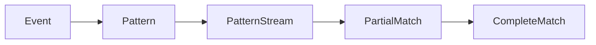
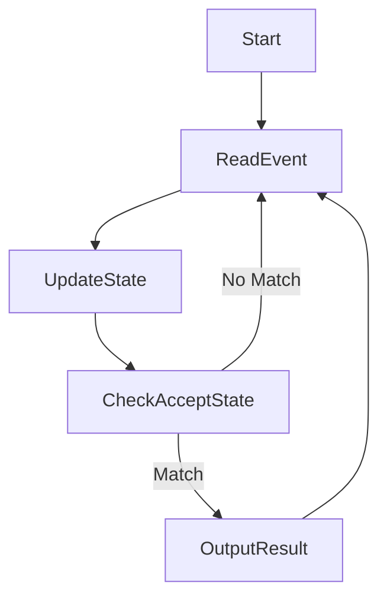
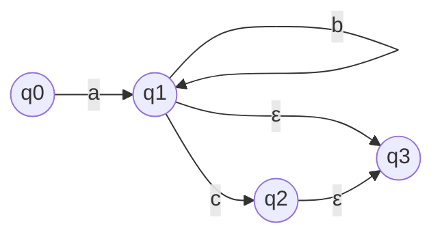

# FlinkCEP故障排除：快速定位与解决问题

## 1.背景介绍

Apache Flink 是一个开源的分布式流处理框架,可用于对无界和有界数据流进行有状态计算。Flink 提供了复杂事件处理(CEP)库,用于从事件流中发现特定的事件模式。CEP 在许多场景中都有应用,如金融交易监控、网络安全、物联网等。

然而,在生产环境中使用 Flink CEP 时,可能会遇到各种问题和故障,如性能低下、结果不准确等。快速定位和解决这些问题对于确保系统的可靠性和高效性至关重要。

## 2.核心概念与联系

### 2.1 Flink CEP 核心概念

Flink CEP 的核心概念包括:

- 事件(Event): 事件是数据流中的一个实例,可以是任何类型的记录。
- 模式(Pattern): 模式描述了要在数据流中查找的事件序列。
- 模式流(Pattern Stream): 模式流是一个由模式序列组成的流,每个模式序列都是一个可能的匹配。
- 部分匹配(Partial Match): 部分匹配是指已经匹配了模式的一部分,但还没有完全匹配整个模式。

这些概念之间的关系如下所示:



### 2.2 Flink CEP 与其他 Flink 组件的关系

Flink CEP 库与 Flink 的其他组件密切相关,如 DataStream API、状态管理和时间处理。

- DataStream API: CEP 库构建在 DataStream API 之上,可以将事件流作为 DataStream 进行处理。
- 状态管理: CEP 库依赖于 Flink 的状态管理机制来维护部分匹配的状态。
- 时间处理: CEP 库利用 Flink 的时间处理机制来处理有序事件和满足时间约束的模式匹配。

## 3.核心算法原理具体操作步骤

Flink CEP 库的核心算法是 Non-deterministic Finite Automaton (NFA),用于检测事件流中的模式匹配。NFA 算法的具体操作步骤如下:

1. 将模式转换为 NFA 状态机
2. 从事件流中读取事件
3. 根据当前事件和 NFA 状态机的转移规则,更新 NFA 状态机的状态
4. 如果 NFA 状态机进入接受状态,则输出匹配的模式序列

这个过程可以用下面的 Mermaid 图来表示:



其中,UpdateState 步骤是 NFA 算法的核心,它根据当前事件和 NFA 状态机的转移规则来更新 NFA 状态机的状态。这个步骤的具体实现取决于模式的复杂性和 NFA 状态机的结构。

## 4.数学模型和公式详细讲解举例说明

NFA 算法可以用数学模型来表示。一个 NFA 可以定义为一个五元组 $(Q, \Sigma, \delta, q_0, F)$,其中:

- $Q$ 是有限状态集合
- $\Sigma$ 是输入事件的字母表
- $\delta: Q \times \Sigma \rightarrow 2^Q$ 是转移函数
- $q_0 \in Q$ 是初始状态
- $F \subseteq Q$ 是接受状态集合

转移函数 $\delta$ 定义了在给定当前状态和输入事件的情况下,NFA 可以转移到哪些下一个状态。

例如,考虑一个模式 `a b+ c?`,其中 `b+` 表示一个或多个 `b` 事件,`c?` 表示零个或一个 `c` 事件。该模式的 NFA 可以用下图表示:



在这个 NFA 中:

- $Q = \{q_0, q_1, q_2, q_3\}$
- $\Sigma = \{a, b, c\}$
- $\delta(q_0, a) = \{q_1\}$
- $\delta(q_1, b) = \{q_1\}$
- $\delta(q_1, c) = \{q_2\}$
- $\delta(q_1, \epsilon) = \{q_3\}$ (ε 表示空字符)
- $\delta(q_2, \epsilon) = \{q_3\}$
- $q_0$ 是初始状态
- $F = \{q_3\}$ 是接受状态集合

根据这个 NFA,如果输入事件序列是 `a b b c`,则 NFA 会经历以下状态转移:

$$
q_0 \xrightarrow{a} q_1 \xrightarrow{b} q_1 \xrightarrow{b} q_1 \xrightarrow{c} q_2 \xrightarrow{\epsilon} q_3
$$

因为最终状态 $q_3$ 是接受状态,所以这个事件序列匹配模式 `a b+ c?`。

## 5.项目实践：代码实例和详细解释说明

下面是一个使用 Flink CEP 库的简单示例,用于检测连续的低价格事件序列。

首先,定义一个 `TradeEvent` 类来表示交易事件:

```java
public class TradeEvent {
    public String symbol;
    public double price;
    public long timestamp;

    public TradeEvent(String symbol, double price, long timestamp) {
        this.symbol = symbol;
        this.price = price;
        this.timestamp = timestamp;
    }
}
```

然后,创建一个 Flink 流处理作业,并定义模式序列:

```java
StreamExecutionEnvironment env = StreamExecutionEnvironment.getExecutionEnvironment();

// 从socket获取交易事件流
DataStream<TradeEvent> tradeStream = env.socketTextStream("localhost", 9999)
        .map(value -> {
            String[] fields = value.split(",");
            return new TradeEvent(fields[0], Double.parseDouble(fields[1]), Long.parseLong(fields[2]));
        });

// 定义模式序列: 连续3个低于100的价格事件
Pattern<TradeEvent, ?> lowPricePattern = Pattern.<TradeEvent>begin("start")
        .where(event -> event.price < 100)
        .next("middle")
        .where(event -> event.price < 100)
        .next("end")
        .where(event -> event.price < 100);
```

接下来,应用模式序列并处理匹配的结果:

```java
PatternStream<TradeEvent> patternStream = CEP.pattern(tradeStream, lowPricePattern);

DataStream<Alert> alerts = patternStream.process(
        new PatternProcessFunction<TradeEvent, Alert>() {
            @Override
            public void processMatch(Map<String, List<TradeEvent>> pattern, Context ctx, Collector<Alert> out) throws Exception {
                List<TradeEvent> events = pattern.get("end");
                TradeEvent lastEvent = events.get(events.size() - 1);
                out.collect(new Alert(lastEvent.symbol, "Low price detected"));
            }
        }
);
```

在这个示例中:

1. 首先从 socket 获取交易事件流,并将其转换为 `TradeEvent` 对象。
2. 定义模式序列 `lowPricePattern`,表示连续 3 个价格低于 100 的事件。
3. 使用 `CEP.pattern` 方法将模式应用于事件流,生成一个 `PatternStream`。
4. 在 `PatternStream` 上调用 `process` 方法,并提供一个 `PatternProcessFunction` 来处理匹配的结果。在这个示例中,如果检测到连续 3 个低价格事件,就会输出一个 `Alert` 对象。

## 6.实际应用场景

Flink CEP 库可以应用于各种场景,例如:

1. **金融交易监控**: 检测可疑的交易模式,如洗钱活动、内幕交易等。
2. **网络安全**: 检测入侵尝试、分布式拒绝服务攻击等网络攻击模式。
3. **物联网**: 检测传感器数据中的异常模式,如设备故障、环境变化等。
4. **业务流程监控**: 监控业务流程中的异常情况,如订单处理延迟、支付失败等。
5. **用户行为分析**: 分析用户在网站或应用程序中的行为模式,用于个性化推荐、欺诈检测等。

## 7.工具和资源推荐

在使用 Flink CEP 库时,以下工具和资源可能会有所帮助:

1. **Flink Web UI**: Flink 提供了一个基于 Web 的用户界面,可以监控作业的执行情况、查看作业图、检查计数器等。
2. **Flink CEP 文档**: Flink 官方文档中有一个专门的 CEP 库章节,详细介绍了 CEP 的概念、API 和用法。
3. **Flink CEP 示例项目**: Flink 源码中包含了一些 CEP 示例项目,可以作为学习和参考。
4. **Flink 用户邮件列表**: 可以在 Flink 用户邮件列表上提问并获取社区支持。
5. **Flink 培训课程**: 一些公司和组织提供 Flink 培训课程,可以帮助快速入门和掌握高级用法。
6. **Flink CEP 相关书籍和在线资源**: 网上有一些关于 Flink CEP 的书籍、博客和视频教程,可以作为补充学习资料。

## 8.总结:未来发展趋势与挑战

Flink CEP 库为处理复杂事件模式提供了强大的功能,但仍然面临一些挑战和发展方向:

1. **性能优化**: 随着事件流量的增加和模式复杂度的提高,CEP 库的性能可能会成为瓶颈。需要进一步优化算法和执行策略,提高吞吐量和低延迟处理能力。
2. **可扩展性**: 当前 CEP 库主要针对单个作业,未来需要支持跨作业和跨集群的模式匹配,以处理更大规模的事件流。
3. **模式语言扩展**: 虽然 Flink CEP 库提供了一种基于 Java 的模式 API,但是一种更加声明式和易于使用的模式语言可能会更受欢迎。
4. **机器学习集成**: 将机器学习技术集成到 CEP 库中,可以自动发现和学习事件模式,而不是手动定义模式。
5. **可解释性**: 对于一些关键应用场景,如金融交易监控,提高 CEP 结果的可解释性非常重要,以便人工审查和理解。

总的来说,Flink CEP 库为处理复杂事件提供了强大的功能,但仍有许多值得探索和改进的领域,以满足未来不断增长的需求。

## 9.附录:常见问题与解答

1. **如何处理乱序事件?**

   Flink CEP 库支持使用事件时间语义来处理乱序事件。可以通过设置适当的时间窗口和允许的最大乱序程度来容忍一定程度的乱序。此外,也可以使用 Flink 的迟到事件处理机制来处理迟到的事件。

2. **如何处理模式中的负边界条件?**

   负边界条件指的是某些事件的不发生也是模式的一部分。Flink CEP 库提供了 `notNext` 和 `notFollowedBy` 等模式操作符来定义负边界条件。

3. **如何调试和监控 CEP 作业?**

   可以使用 Flink Web UI 来监控 CEP 作业的执行情况,包括吞吐量、延迟、重新启动次数等指标。此外,也可以在代码中添加日志语句或使用 Flink 的指标系统来收集和分析作业的运行数据。

4. **CEP 库是否支持会话窗口?**

   是的,Flink CEP 库支持会话窗口。可以使用 `CEP.pattern(...).within(...)` 方法来定义会话窗口的时间范围。

5. **如何处理模式的部分匹配结果?**

   Flink CEP 库提供了 `PatternProcessFunction` 接口,允许用户访问和处理模式的部分匹配结果。可以在 `processMatch` 方法中检查部分匹配的状态,并根据需要进行相应的处理。

作者: