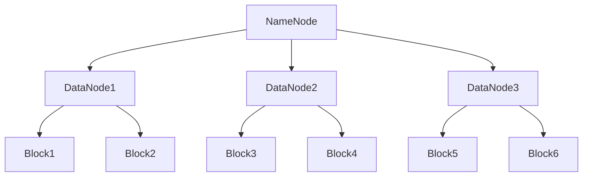

# HDFS与云计算：部署HDFSonAWS、Azure和GCP

## 1.背景介绍

在大数据时代，海量数据的存储和处理成为了企业和研究机构面临的主要挑战。Hadoop分布式文件系统（HDFS）作为一种高效、可靠的分布式存储系统，已经被广泛应用于大数据处理。然而，随着云计算的普及，越来越多的企业选择将HDFS部署在云平台上，以利用云计算的弹性和高可用性。本文将详细介绍如何在三大主流云平台——AWS、Azure和GCP上部署HDFS，并探讨其核心概念、算法原理、实际应用场景和未来发展趋势。

## 2.核心概念与联系

### 2.1 HDFS简介

HDFS是Hadoop生态系统中的核心组件，专为大规模数据存储和处理设计。其主要特点包括高容错性、可扩展性和高吞吐量。HDFS将数据分块存储在多个节点上，并通过复制机制保证数据的可靠性。

### 2.2 云计算简介

云计算是一种通过互联网提供计算资源（如服务器、存储、数据库、网络等）的服务模式。云计算的主要优势包括弹性扩展、高可用性和按需付费。AWS、Azure和GCP是目前最主流的三大云计算平台。

### 2.3 HDFS与云计算的结合

将HDFS部署在云平台上，可以充分利用云计算的弹性和高可用性，解决传统数据中心在扩展性和维护成本上的问题。通过云平台的自动化工具和服务，HDFS的部署和管理变得更加简便和高效。

## 3.核心算法原理具体操作步骤

### 3.1 HDFS架构

HDFS采用主从架构，由一个NameNode和多个DataNode组成。NameNode负责管理文件系统的元数据，而DataNode负责存储实际的数据块。以下是HDFS架构的Mermaid流程图：



### 3.2 数据存储与复制

HDFS将文件分成多个数据块（默认大小为128MB），并将每个数据块复制到多个DataNode上（默认复制因子为3）。这种机制保证了数据的高可用性和容错性。

### 3.3 数据读取与写入

当客户端向HDFS写入数据时，数据首先被分块并复制到多个DataNode上。NameNode记录每个数据块的位置。当客户端读取数据时，NameNode提供数据块的位置，客户端直接从DataNode读取数据。

## 4.数学模型和公式详细讲解举例说明

### 4.1 数据块分配模型

假设一个文件大小为 $F$，数据块大小为 $B$，则文件被分成的块数 $N$ 为：

$$
N = \lceil \frac{F}{B} \rceil
$$

### 4.2 复制因子模型

假设复制因子为 $R$，则每个数据块会被复制到 $R$ 个不同的DataNode上。总的数据块数 $T$ 为：

$$
T = N \times R
$$

### 4.3 容错性分析

HDFS的容错性主要依赖于数据块的复制机制。假设集群中有 $D$ 个DataNode，数据块的复制因子为 $R$，则系统可以容忍的最大节点故障数 $F$ 为：

$$
F = R - 1
$$

## 5.项目实践：代码实例和详细解释说明

### 5.1 在AWS上部署HDFS

#### 5.1.1 创建EC2实例

首先，在AWS管理控制台中创建若干EC2实例，作为HDFS的NameNode和DataNode。

#### 5.1.2 安装Hadoop

在每个EC2实例上安装Hadoop。以下是安装Hadoop的基本步骤：

```bash
# 更新软件包
sudo apt-get update

# 安装Java
sudo apt-get install -y openjdk-8-jdk

# 下载Hadoop
wget https://downloads.apache.org/hadoop/common/hadoop-3.3.1/hadoop-3.3.1.tar.gz

# 解压Hadoop
tar -xzvf hadoop-3.3.1.tar.gz

# 配置环境变量
echo "export HADOOP_HOME=/path/to/hadoop" >> ~/.bashrc
echo "export PATH=$PATH:$HADOOP_HOME/bin" >> ~/.bashrc
source ~/.bashrc
```

#### 5.1.3 配置HDFS

编辑Hadoop配置文件，设置NameNode和DataNode的地址。以下是核心配置文件的示例：

```xml
<!-- core-site.xml -->
<configuration>
    <property>
        <name>fs.defaultFS</name>
        <value>hdfs://namenode:9000</value>
    </property>
</configuration>

<!-- hdfs-site.xml -->
<configuration>
    <property>
        <name>dfs.replication</name>
        <value>3</value>
    </property>
    <property>
        <name>dfs.namenode.name.dir</name>
        <value>file:///path/to/namenode</value>
    </property>
    <property>
        <name>dfs.datanode.data.dir</name>
        <value>file:///path/to/datanode</value>
    </property>
</configuration>
```

#### 5.1.4 启动HDFS

在NameNode和DataNode上分别启动HDFS服务：

```bash
# 在NameNode上
hdfs namenode -format
start-dfs.sh

# 在DataNode上
hdfs datanode
```

### 5.2 在Azure上部署HDFS

#### 5.2.1 创建虚拟机

在Azure门户中创建若干虚拟机，作为HDFS的NameNode和DataNode。

#### 5.2.2 安装和配置Hadoop

参考AWS的安装步骤，在每个虚拟机上安装和配置Hadoop。

#### 5.2.3 启动HDFS

在NameNode和DataNode上分别启动HDFS服务。

### 5.3 在GCP上部署HDFS

#### 5.3.1 创建Compute Engine实例

在GCP控制台中创建若干Compute Engine实例，作为HDFS的NameNode和DataNode。

#### 5.3.2 安装和配置Hadoop

参考AWS的安装步骤，在每个实例上安装和配置Hadoop。

#### 5.3.3 启动HDFS

在NameNode和DataNode上分别启动HDFS服务。

## 6.实际应用场景

### 6.1 数据湖

HDFS可以作为数据湖的存储层，存储结构化和非结构化数据。通过与云平台的结合，数据湖可以实现弹性扩展和高可用性。

### 6.2 大数据分析

HDFS与Hadoop生态系统中的其他组件（如MapReduce、Hive、Spark等）结合，可以实现大规模数据的存储和分析。云平台提供的计算资源可以按需扩展，满足大数据分析的需求。

### 6.3 机器学习

HDFS可以存储大量的训练数据，结合云平台的计算资源，可以加速机器学习模型的训练和部署。

## 7.工具和资源推荐

### 7.1 Hadoop官方文档

Hadoop官方文档提供了详细的安装、配置和使用指南，是学习和使用HDFS的最佳资源。

### 7.2 云平台文档

AWS、Azure和GCP的官方文档提供了详细的云服务使用指南，包括如何创建和管理虚拟机、存储和网络资源。

### 7.3 开源工具

- **Ambari**：一个开源的Hadoop管理工具，可以简化HDFS的部署和管理。
- **HUE**：一个开源的Hadoop用户界面，提供了HDFS的可视化管理和操作功能。

## 8.总结：未来发展趋势与挑战

### 8.1 未来发展趋势

随着大数据和云计算技术的不断发展，HDFS在云平台上的应用将越来越广泛。未来，HDFS可能会进一步优化与云平台的集成，提供更高效、更可靠的数据存储和处理解决方案。

### 8.2 挑战

尽管HDFS在云平台上有诸多优势，但也面临一些挑战。例如，数据安全和隐私保护是一个重要问题。此外，如何高效地管理和优化云资源，以降低成本，也是一个需要解决的问题。

## 9.附录：常见问题与解答

### 9.1 HDFS在云平台上的性能如何？

HDFS在云平台上的性能主要取决于云平台的网络和存储性能。通过合理配置和优化，可以实现与本地部署相当的性能。

### 9.2 如何保证HDFS在云平台上的数据安全？

可以通过加密、访问控制和审计等措施，保证HDFS在云平台上的数据安全。此外，云平台本身也提供了多种安全服务，如AWS的IAM、Azure的AD和GCP的IAM。

### 9.3 HDFS在云平台上的成本如何？

HDFS在云平台上的成本主要包括计算、存储和网络费用。通过合理配置和优化，可以有效降低成本。例如，可以使用云平台的按需实例和预留实例，结合使用对象存储和块存储，以降低存储成本。

---

作者：禅与计算机程序设计艺术 / Zen and the Art of Computer Programming